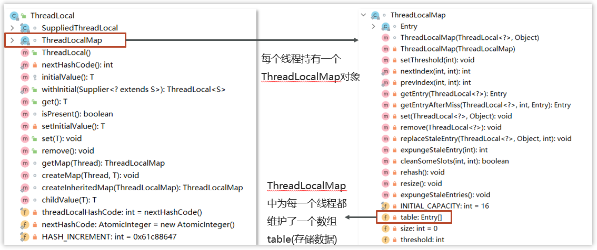

- [1. 如果控制某一个方法允许并发访问线程的数量？(Semaphore)](#1-如果控制某一个方法允许并发访问线程的数量semaphore)
- [2. CountDownLatch](#2-countdownlatch)
- [3. 谈谈你对ThreadLocal的理解](#3-谈谈你对threadlocal的理解)
- [4. ThreadLocal的实现原理\&源码解析](#4-threadlocal的实现原理源码解析)
- [5. ThreadLocal-内存泄露问题](#5-threadlocal-内存泄露问题)

---

## 1. 如果控制某一个方法允许并发访问线程的数量？(Semaphore)

Semaphore类（信号量），我们可以通过其限制执行的线程数量，达到限流的效果。

- 当一个线程执行时先通过其方法进行获取许可操作acquire()，获取到许可的线程继续执行业务逻辑，信号量个数-1。当信号量个数变为负数时，再次请求的时候就会阻塞，直到其他线程释放了信号量。
- 当线程执行完成后进行释放许可操作release()，信号量个数+1

[Semaphore](../../codes/juc/src/main/java/other/SemaphoreTest.java)

## 2. CountDownLatch

CountDownLatch（闭锁/倒计时锁）用来进行线程同步协作，等待所有线程完成倒计时（一个或者多个线程，等待其他多个线程完成某件事情之后才能执行）

- `new CountDownLatch(3)` 初始化计数值
- `countDown()` 用来让计数减一（非阻塞）
- `await()` 用来等待计数归零（阻塞）

## 3. 谈谈你对ThreadLocal的理解

ThreadLocal本质来说就是一个线程内部存储类，主要功能有两个：
- 第一个是可以实现资源对象的线程隔离，让每个线程各用各的资源对象，避免争用引发的线程安全问题
- 第二个是实现了线程内的资源共享

案例：使用JDBC操作数据库时，会将每一个线程的Connection放入各自的ThreadLocal中，从而保证每个线程都在各自的 Connection 上进行数据库的操作，避免A线程关闭了B线程的连接。

三个主要方法：

- set(value) 设置值

- get() 获取值

- remove() 清除值

```java
public class ThreadLocalTest {
    static ThreadLocal<String> threadLocal = new ThreadLocal<>();

    public static void main(String[] args) {
        new Thread(() -> {
            String name = Thread.currentThread().getName();
            threadLocal.set("itcast");
            print(name);
            System.out.println(name + "-after remove : " + threadLocal.get());
        }, "t1").start();
        new Thread(() -> {
            String name = Thread.currentThread().getName();
            threadLocal.set("itheima");
            print(name);
            System.out.println(name + "-after remove : " + threadLocal.get());
        }, "t2").start();
    }

    static void print(String str) {
        //打印当前线程中本地内存中本地变量的值
        System.out.println(str + " :" + threadLocal.get());
        //清除本地内存中的本地变量
        threadLocal.remove();
    }

}
```

## 4. ThreadLocal的实现原理&源码解析

在ThreadLocal内部维护了一个 ThreadLocalMap 类型的成员变量，用来存储资源对象。ThreadLocalMap中有一个属性table数组，这个是真正存储数据的位置。

- 当我们调用 set 方法，就是以 ThreadLocal 自己作为 key，资源对象作为 value，放入当前线程的 ThreadLocalMap 集合中

- 当调用 get 方法，就是以 ThreadLocal 自己作为 key，到当前线程中查找关联的资源值

- 当调用 remove 方法，就是以 ThreadLocal 自己作为 key，移除当前线程关联的资源值





**set方法**


**get方法/remove方法**


## 5. ThreadLocal-内存泄露问题

在ThreadLocalMap中的Entry对象继承了WeakReference**弱引用**。其中key为使用弱引用的ThreadLocal实例，

每一个Thread维护一个ThreadLocalMap，ThreadLocalMap 中的 key 被设计为弱引用，它是被动的被GC调用释放key，不过关键的是只有key可以得到内存释放，而value是一个强引用。value为线程变量的副本

在使用ThreadLocal 时都把它作为静态变量（即强引用），因此无法被动依靠 GC 回收，建议主动的remove 释放 key，这样就能避免内存溢出。


