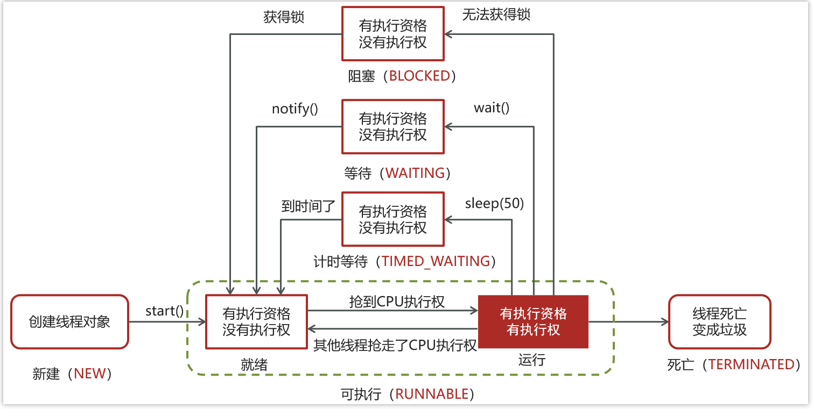

- [线程和进程的理解](#线程和进程的理解)
- [🚀线程和进程的区别](#线程和进程的区别)
- [并行和并发](#并行和并发)
- [多线程技术和最大线程数](#多线程技术和最大线程数)
- [守护线程](#守护线程)
- [🚀Java创建线程的四种方式](#java创建线程的四种方式)
- [🚀runnable 和 callable 有什么区别](#runnable-和-callable-有什么区别)
- [线程的 run()和 start()有什么区别？](#线程的-run和-start有什么区别)
- [🚀线程包括哪些状态，状态之间是如何变化的](#线程包括哪些状态状态之间是如何变化的)
- [notify()和 notifyAll()有什么区别？](#notify和-notifyall有什么区别)
- [如果阻塞在同一个对象有多个线程，我想要唤醒指定线程，怎么做](#如果阻塞在同一个对象有多个线程我想要唤醒指定线程怎么做)
- [java 中 wait 和 sleep 方法的不同？](#java-中-wait-和-sleep-方法的不同)
- [新建 T1、T2、T3 三个线程，如何保证它们按顺序执行？](#新建-t1t2t3-三个线程如何保证它们按顺序执行)
- [如何停止一个正在运行的线程？](#如何停止一个正在运行的线程)


---

## 线程和进程的理解

**程序由指令和数据组成**。指令加载至 CPU，数据加载至内存。

进程就是用来加载指令、管理内存，以及在指令运行过程中还需要用到磁盘、网络等设备。

**当一个程序被运行，从磁盘加载这个程序的代码至内存，这时就开启了一个进程。**

一个进程内的指令可以被分为一个或多个指令流。即一个指令流就是一个线程，一个进程内包含一个或多个线程。

**线程**作为最小调度单位（一个线程对应一个指令流，一个指令流对应一个CPU），**进程**作为资源分配的最小单位（统一管理数据和指令用到的设备资源）。

## 🚀线程和进程的区别

**进程是正在运行程序的实例**，进程中包含了线程。


**进程**作为**资源分配的最小单位**，不同的进程使用**不同的内存空间**

​	在当前进程下的所有**线程**可以**共享内存空间**。数据共享的场景适合用线程。

​	容错性强，一个**进程崩溃**了也不影响另一个进程。比如，chrome的网页、nginx一个守护进程一个worker进程。


**线程**作为**CPU最小调度单位**。


**线程更轻量**，线程上下文切换成本一般上要比进程上下文切换低。

​	频繁创建销毁的场景用线程（进程开销大）。

​	大量计算的场景用线程（CPU需频繁切换）。

## 并行和并发

- 并行：在同一时刻，有多个指令在**多个**CPU上**同时**执行。
- 并发：在同一时刻，有多个指令在**单个**CPU上**交替**执行。

一般会将这种线程轮流使用CPU的做法称为并发（concurrent）

每个核（core）都可以调度运行一个线程，这时候线程可以是并行的。

## 多线程技术和最大线程数

具有多线程能力的计算机，从软件或者硬件上，实现多个线程**并发**执行的技术。

四核八线程：四个核心则有4个线程，又通过超线程技术而有8个线程。最大线程数即8.
## 守护线程

守护线程服务于其他线程：
- 当主进程已经结束后，如果剩下的线程只有守护线程时，守护进程直接退出。
- 当主进程没有结束，守护进程也不会退出。

## 🚀Java创建线程的四种方式

共有四种方式可以创建线程，分别是：
- 继承Thread类：重写run方法
- 实现Runnable接口：重写run方法
- 实现Callable接口：重写call方法
- 线程池创建线程：传入实现Runnable接口或实现Callable接口

[ExtendsThread](../../codes/juc/src/main/java/create_thread/ExtendsThread.java)

[ImplementsRunnable](../../codes/juc/src/main/java/create_thread/ImplementsRunnable.java)

[ImplementsCallabe](../../codes/juc/src/main/java/create_thread/ImplementsCallabe.java)

[CreateThreadPool](../../codes/juc/src/main/java/create_thread/CreateThreadPool.java)


## 🚀runnable 和 callable 有什么区别


<details>
<summary>run和call + FutureTask + call可抛异常</summary>

- Runnable：Runable实现类对象交给Thread构造参数的对象
- Callable: Callable实现类对象交给FutureTask构造的对象，FutureTask对象再交给Thread构造参数的对象。

1. Runnable重写run方法，Callable重写call方法。
   
    run和call都是无参传入，区别是返回值。run是无返回值，call是有返回值。所以Callable接口带返回值泛型。
2. Callalbe接口和FutureTask配合可以用来获取异步执行的结果，需要调用FutureTask.get()得到，此方法会阻塞主进程的继续往下执行，如果不调用不会阻塞。
3. Callable接口的call()方法允许抛出异常；而Runnable接口的run()方法的异常只能在内部消化，不能继续上抛

</details>


## 线程的 run()和 start()有什么区别？

- start(): 用来启动线程，通过该线程调用run方法执行run方法中所定义的逻辑代码。start方法只能被调用一次。

- run(): 直接调用就相当于是普通的成员函数，可以被调用多次。


[start方法只能被调用一次](../../codes/juc/src/main/java/thread_basic/thread_state/DoubleStart.java)

## 🚀线程包括哪些状态，状态之间是如何变化的
OS5种：新建、就绪、运行、阻塞、死亡。

JAVA 有6种。
```java
public enum State {
    // BLOCKED,  WAITING, TIMED_WAITING 都是阻塞状态
    // 就绪、运行 合并为 RUNNABLE
    NEW, RUNNABLE, BLOCKED,  WAITING, TIMED_WAITING, TERMINATED;
}
```

状态之间是如何变化的




- `new Thread()`创建线程，进入初始状态`NEW`
- `thread.start()` 线程进入就绪状态 `RUNNABLE`
- 线程只要抢占了cpu时间片，可以不用获取全部的锁就可以运行，但是当运行到需要的锁没有获得时，会进入 `BLOCKED`。
  * 进入 Monitor 的**阻塞队列**阻塞，此时不占用 cpu 时间
  * 当持锁线程释放锁时，**阻塞队列**中的**阻塞**线程就进入 `RUNNABLE`


> Thread.sleep(超时)

`RUNNABLE`→`TIMED_WAITING`→`RUNNABLE`

会从**可运行**状态进入**有时限等待**状态，但与 Monitor 无关。

不需要主动唤醒，超时时间到自然恢复为**可运行**状态。

> Object.wait()

`RUNNABLE`→`WAITING`→notify

让当前获取锁的线程，去释放锁，并由`RUNNABLE`陷入`WAITING`，进入 Monitor **等待集合**等待，同样不占用 cpu 时间。

> Object.wait(超时)

`RUNNABLE`→`TIMED_WAITING`→notify/`Runnable`

让当前获取锁的线程，去释放锁，并由`RUNNABLE`陷入`TIMED_WAITING`，进入 Monitor **等待集合**进行有时限等待，同样不占用 cpu 时间。

要么走notify，要么等待超时。

> notify() 或 notifyAll()

`WAITING, TIMED_WAITING`→`BLOCKED`→`RUNNABLE`


Monitor **等待集合**中的阻塞线程，由处于**不竞争锁**的`WAITING, TIMED_WAITING`，变为处于**竞争锁**的`BLOCKED`，一旦竞争到锁，才变为 `RUNNABLE`。

[ThreadState](../../codes/juc/src/main/java/thread_basic/thread_state/ThreadState.java)

## notify()和 notifyAll()有什么区别？

notifyAll：唤醒所有wait的线程

notify：只随机唤醒一个 wait 线程

## 如果阻塞在同一个对象有多个线程，我想要唤醒指定线程，怎么做

object的wait方法就不行了，需要用condition。

## java 中 wait 和 sleep 方法的不同？

共同点

* wait() ，wait(long) 和 sleep(long) 的效果都是让当前线程暂时放弃 CPU 的使用权。
* 都可以被打断。

不同点

* 方法归属不同
  * sleep(long) 是 Thread 的静态方法
  * 而 wait()，wait(long) 都是 Object 的成员方法

* 醒来时机不同
  * 执行 sleep(long) 和 wait(long) 是超时等待，超时会后被唤醒。
  * wait(long) 和 wait() 还可以被 notify 唤醒。
  * wait() 如果不唤醒就一直等下去

* 锁特性不同（重点）
  * wait 要获取 wait 对象的锁（因为是锁对象Object.wait），而 sleep 则无此限制（因为是Thread.sleep）
  * wait 方法执行后会释放对象锁。而 sleep 如果在 synchronized 代码块中执行，并不会释放对象锁。

[WaitBelongsToSynchronized](../../codes/juc/src/main/java/thread_basic/WaitBelongsToSynchronized.java)

## 新建 T1、T2、T3 三个线程，如何保证它们按顺序执行？

用线程类的**join**()方法在一个线程中启动另一个线程，另外一个线程完成该线程继续执行。

T3内join T2，T2内join T1，这样T1就会先完成而T3最后完成。

[单次顺序执行](../../codes/juc/src/main/java/task/单次顺序执行.java)


## 如何停止一个正在运行的线程？

有三种方式可以停止线程
- 使用退出标志，使线程正常退出，也就是当run方法完成后线程终止
  - 可以自己设置静态变量或者实例变量，+ volatile 修饰
  - 也可以用线程自身的中断状态作为退出标志。
- 使用stop方法强行终止（不推荐，方法已作废）
- 使用interrupt方法中断线程

[StopByStopFlag](../../codes/juc/src/main/java/thread_basic/stopThread/StopByStopFlag.java)

[StopByStop](../../codes/juc/src/main/java/thread_basic/stopThread/StopByStop.java)

[StopByInterrupt](../../codes/juc/src/main/java/thread_basic/stopThread/StopByInterrupt.java)

interrupt是打断处于三种阻塞状态的线程吗？不能打断处于运行状态的线程？
