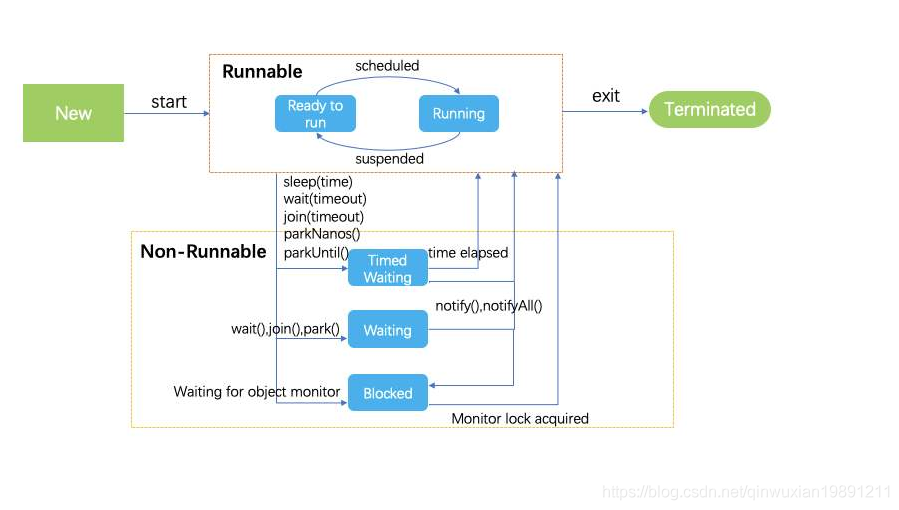
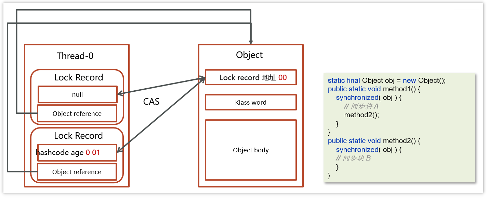
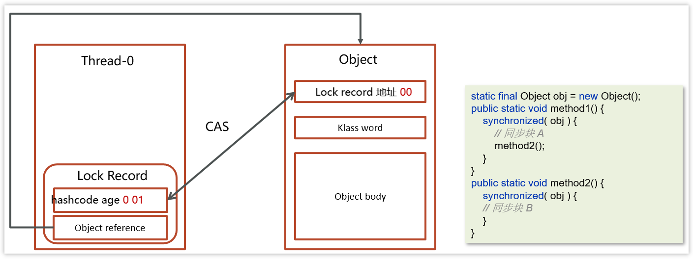
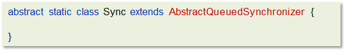

- [1. Java创建线程的四种方式](#1-java创建线程的四种方式)
- [2. runnable 和 callable 有什么区别](#2-runnable-和-callable-有什么区别)
- [3. 线程的 run()和 start()有什么区别？](#3-线程的-run和-start有什么区别)
- [4. 线程包括哪些状态，状态之间是如何变化的](#4-线程包括哪些状态状态之间是如何变化的)
- [5. notify()和 notifyAll()有什么区别？](#5-notify和-notifyall有什么区别)
- [6. java 中 wait 和 sleep 方法的不同？](#6-java-中-wait-和-sleep-方法的不同)
- [7. 新建 T1、T2、T3 三个线程，如何保证它们按顺序执行？](#7-新建-t1t2t3-三个线程如何保证它们按顺序执行)
- [8. 如何停止一个正在运行的线程？](#8-如何停止一个正在运行的线程)
- [9. 线程中并发锁](#9-线程中并发锁)
- [10. synchronized锁总结](#10-synchronized锁总结)
- [11. synchronized关键字的底层原理？](#11-synchronized关键字的底层原理)
- [12. monitor监视器](#12-monitor监视器)
- [13. 你了解过synchronized锁升级吗？](#13-你了解过synchronized锁升级吗)
- [14. 轻量级锁](#14-轻量级锁)
- [15. 偏向锁](#15-偏向锁)
- [16. CAS 你知道吗？](#16-cas-你知道吗)
- [17. CAS 底层实现](#17-cas-底层实现)
- [18. 乐观锁和悲观锁](#18-乐观锁和悲观锁)
- [19. 请谈谈你对 volatile 的理解](#19-请谈谈你对-volatile-的理解)
- [20. 什么是AQS？](#20-什么是aqs)
- [21. AQS工作机制](#21-aqs工作机制)
- [22. ReentrantLock](#22-reentrantlock)
- [23. ReentrantLock的实现原理](#23-reentrantlock的实现原理)
- [24. synchronized和Lock有什么区别 ?](#24-synchronized和lock有什么区别-)
- [25. 如何进行死锁诊断？](#25-如何进行死锁诊断)
- [26. 如果控制某一个方法允许并发访问线程的数量？](#26-如果控制某一个方法允许并发访问线程的数量)
- [27. 如何控制某个方法允许并发访问线程的数量？](#27-如何控制某个方法允许并发访问线程的数量)
- [28. CountDownLatch](#28-countdownlatch)
    - [28.0.1. 4.1.2 案例一（es数据批量导入）](#2801-412-案例一es数据批量导入)
    - [28.0.2. 4.1.3 案例二（数据汇总）](#2802-413-案例二数据汇总)
    - [28.0.3. 4.1.4 案例二（异步调用）](#2803-414-案例二异步调用)


---

## 1. Java创建线程的四种方式

共有四种方式可以创建线程，分别是：
- 继承Thread类：重写run方法
- 实现Runnable接口：重写run方法
- 实现Callable接口：重写call方法
- 线程池创建线程：传入实现Runnable接口或实现Callable接口

[ExtendsThread](../../codes/juc/src/main/java/create_thread/ExtendsThread.java)

[ImplementsRunnable](../../codes/juc/src/main/java/create_thread/ImplementsRunnable.java)

[ImplementsCallabe](../../codes/juc/src/main/java/create_thread/ImplementsCallabe.java)

[CreateThreadPool](../../codes/juc/src/main/java/create_thread/CreateThreadPool.java)


## 2. runnable 和 callable 有什么区别
- Runnable：Runable实现类对象交给Thread构造参数的对象
- Callable: Callable实现类对象交给FutureTask构造的对象，FutureTask对象再交给Thread构造参数的对象。

1. run和call都是无参传入，区别是返回值。run是无返回值，call是有返回值。所以Callable接口带返回值泛型。
2. Callalbe接口和FutureTask配合可以用来获取异步执行的结果，需要调用FutureTask.get()得到，此方法会阻塞主进程的继续往下执行，如果不调用不会阻塞。
3. Callable接口的call()方法允许抛出异常；而Runnable接口的run()方法的异常只能在内部消化，不能继续上抛

## 3. 线程的 run()和 start()有什么区别？

- start(): 用来启动线程，通过该线程调用run方法执行run方法中所定义的逻辑代码。start方法只能被调用一次。

- run(): 直接调用就相当于是普通的成员函数，可以被调用多次。


[start方法只能被调用一次](../../codes/juc/src/main/java/thread_basic/thread_state/DoubleStart.java)

## 4. 线程包括哪些状态，状态之间是如何变化的
OS5种：新建、就绪、运行、阻塞、死亡。

JAVA 有6种。
```java
public enum State {
    // BLOCKED,  WAITING, TIMED_WAITING 都是阻塞状态
    // 就绪、运行 合并为 RUNNABLE
    NEW, RUNNABLE, BLOCKED,  WAITING, TIMED_WAITING, TERMINATED;
}
```

状态之间是如何变化的




- `new Thread()`创建线程，进入初始状态`NEW`
- `thread.start()` 线程进入就绪状态 `RUNNABLE`
- 线程只要抢占了cpu时间片，可以不用获取全部的锁就可以运行，但是当运行到需要的锁没有获得时，会进入 `BLOCKED`。
  * 进入 Monitor 的**阻塞队列**阻塞，此时不占用 cpu 时间
  * 当持锁线程释放锁时，**阻塞队列**中的**阻塞**线程就进入 `RUNNABLE`


> Thread.sleep(超时)

`RUNNABLE`→`TIMED_WAITING`→`RUNNABLE`

会从**可运行**状态进入**有时限等待**状态，但与 Monitor 无关。

不需要主动唤醒，超时时间到自然恢复为**可运行**状态。

> Object.wait()

`RUNNABLE`→`WAITING`→notify

获取锁成功后，但由于条件不满足，此时从**可运行**状态释放锁，进入 Monitor **等待集合**等待，同样不占用 cpu 时间。
    

> Object.wait(超时)

`RUNNABLE`→`TIMED_WAITING`→notify/`Runnable`

此时从**可运行**状态释放锁进入 Monitor **等待集合**进行有时限等待，同样不占用 cpu 时间。

要么走notify，要么等待超时。

> notify() 或 notifyAll()

`WAITING, TIMED_WAITING`→`BLOCKED`→`RUNNABLE`


Monitor **等待集合**中的阻塞线程，由处于**不竞争锁**的`WAITING, TIMED_WAITING`，变为处于**竞争锁**的`BLOCKED`，一旦竞争到锁，才变为 `RUNNABLE`。

[ThreadState](../../codes/juc/src/main/java/thread_basic/thread_state/ThreadState.java)

## 5. notify()和 notifyAll()有什么区别？

notifyAll：唤醒所有wait的线程

notify：只随机唤醒一个 wait 线程

## 6. java 中 wait 和 sleep 方法的不同？

共同点

* wait() ，wait(long) 和 sleep(long) 的效果都是让当前线程暂时放弃 CPU 的使用权。

不同点

* 方法归属不同
  * sleep(long) 是 Thread 的静态方法
  * 而 wait()，wait(long) 都是 Object 的成员方法，每个对象都有

* 醒来时机不同
  * 执行 sleep(long) 和 wait(long) 的线程都会在等待相应毫秒后醒来
  * wait(long) 和 wait() 还可以被 notify 唤醒，wait() 如果不唤醒就一直等下去
  * 它们都可以被打断唤醒

* 锁特性不同（重点）
  * wait 方法的调用必须先获取 wait 对象的锁（因为是锁对象Object.wait），而 sleep 则无此限制（因为是Thread.sleep）
  * wait 方法执行后会释放对象锁。而 sleep 如果在 synchronized 代码块中执行，并不会释放对象锁。

[WaitBelongsToSynchronized](../../codes/juc/src/main/java/thread_basic/WaitBelongsToSynchronized.java)

## 7. 新建 T1、T2、T3 三个线程，如何保证它们按顺序执行？

用线程类的**join**()方法在一个线程中启动另一个线程，另外一个线程完成该线程继续执行。

为了确保三个线程的顺序你应该先启动最后一个(T3调用T2，T2调用T1)，这样T1就会先完成而T3最后完成

[单次顺序执行](../../codes/juc/src/main/java/task/单次顺序执行.java)


## 8. 如何停止一个正在运行的线程？

有三种方式可以停止线程
- 使用退出标志，使线程正常退出，也就是当run方法完成后线程终止
  - 可以自己设置静态变量或者实例变量，+ volatile 修饰
  - 也可以用线程自身的中断状态作为退出标志。
- 使用stop方法强行终止（不推荐，方法已作废）
- 使用interrupt方法中断线程

[StopByStopFlag](../../codes/juc/src/main/java/thread_basic/stopThread/StopByStopFlag.java)

[StopByStop](../../codes/juc/src/main/java/thread_basic/stopThread/StopByStop.java)

[StopByInterrupt](../../codes/juc/src/main/java/thread_basic/stopThread/StopByInterrupt.java)

## 9. 线程中并发锁

- synchronized锁
- ReentrantedLock锁

## 10. synchronized锁总结
synchronized锁：
- c++ 语言实现
- JDK 1.6后，引入锁升级：偏向、轻量、重量级
- 是悲观锁
- 是可重入锁。
- 是非公平锁。

PS：
- synchronized锁不是重量锁，偏向、轻量、重量级。monitor才是重量锁。

## 11. synchronized关键字的底层原理？

Synchronized对象锁采用**互斥**的方式，让同一时刻至多只有一个线程能持有对象锁，其它线程再想获取这个对象锁时就会**阻塞**住。

使用synchornized代码块时需要**指定一个对象**，所以synchornized也被称为对象锁。

synchornized的底层由monitor监视器实现的，monitor是jvm级别的对象，线程获得锁需要在该对象头的Mark Word中设置指向 Monitor 对象的指针

## 12. monitor监视器

- Monitor监视器是由jvm提供，c++语言实现。
- 在monitor内部有三个属性，分别是**owner、entrylist阻塞队列、waitset等待集合**。owner是关联的获得锁的线程，并且只能关联一个线程；entrylist关联的是处于阻塞状态的线程；waitset关联的是处于Waiting状态的线程
- Monitor实现的锁属于**重量级锁**。Monitor监视器是由jvm提供，jvm属于内核进程，性能比较低。里面涉及到了用户态和内核态的切换、进程的上下文切换。
- 对应字节码的指令是`monitorenter`和`monitorexit`


可以借助javap命令查看clsss的字节码查看moniter指令：
- `monitorenter` 上锁开始的地方
- `monitorexit` 解锁的地方
- 其中被monitorenter和monitorexit包围住的指令就是上锁的代码
- 有两个monitorexit的原因，第二个monitorexit是为了防止锁住的代码抛异常后不能及时释放锁


具体的流程：

- 代码进入synchorized代码块，先让lock对象的markword关联上monitor，然后判断Owner是否有线程持有。
  - 如果没有线程持有，则让当前线程持有，表示该线程获取锁成功
  - 如果有线程持有，则让当前线程进入阻塞队列进行阻塞。
- 如果Owner持有的线程已经释放了锁，在阻塞队列中的线程去竞争锁的持有权（非公平）
- 如果代码块中调用了wait()方法，则会进去等待集合中进行等待

## 13. 你了解过synchronized锁升级吗？

Java中的synchronized有偏向锁、轻量级锁、重量级锁三种形式。在JDK 1.6引入偏向锁和轻量级锁
- 偏向锁：在第一次获得锁时，会有一个CAS操作，之后该线程再获取锁，只需要判断mark  word中是否是自己的线程id即可，而不是开销相对较大的CAS命令 
- 轻量级锁：轻量级修改了markword的锁标志，相对重量级锁性能提升很多。每次修改都是CAS操作，保证原子性
- 重量级锁：底层使用的Monitor实现，里面涉及到了用户态和内核态的切换、进程的上下文切换，成本较高，性能比较低。

场景：
- 只有一个线程：偏向锁。
- 同步块中的代码都是不存在竞争的（不同的线程交替的执行同步块中的代码）：用轻量级锁就行。
- 多线程竞争锁：重量级锁。

**一旦锁发生了竞争，都会升级为重量级锁**

## 14. 轻量级锁

MarkWord


哈希码、GC 分代年龄、锁状态标志、
- 哈希码
- GC 分代年龄
- 偏向锁标识+ 锁状态标志：后三位是001表示无锁，后三位是101表示偏向锁，后两位是00表示轻量级锁，后两位是10表示重量级锁
- 持有偏向锁的线程ID
- epoch偏向时间戳
- ptr_to_lock_record：轻量级锁状态下，指向栈中锁记录的指针，占30位
- ptr_to_heavyweight_monitor：重量级锁状态下，指向对象监视器Monitor的指针，占30位

```java
static final Object obj = new Object();

public static void method1() {
    synchronized (obj) {
        // 同步块 A
        method2();
    }
}

public static void method2() {
    synchronized (obj) {
        // 同步块 B
    }
}
```

**加锁的流程**

1.在**线程栈**中创建一个**Lock Record**，将其obj字段指向锁对象。

2.通过CAS指令将Lock Record的地址存储在对象头的mark word中（数据进行交换），如果对象处于无锁状态则修改成功，代表该线程获得了轻量级锁。

3.如果是当前线程已经持有该锁了，代表这是一次锁重入。设置Lock Record第一部分为null，起到了一个重入计数器的作用。

4.如果CAS修改失败，说明发生了竞争，需要膨胀为重量级锁。




**解锁过程**

1.遍历线程栈,找到所有obj字段等于当前锁对象的Lock Record。

2.如果Lock Record的Mark Word为null，代表这是一次重入，将obj设置为null后continue。

3.如果Lock Record的 Mark Word不为null，则利用CAS指令将对象头的mark word恢复成为无锁状态。如果失败则膨胀为重量级锁。




## 15. 偏向锁

轻量级锁在没有竞争时（就自己这个线程），每次重入仍然需要执行 CAS 操作。

Java 6 中引入了偏向锁来做进一步优化：只有第一次使用 CAS 将线程 ID 设置到对象的 Mark Word 头，之后发现这个线程 ID 是自己的就表示没有竞争，不用重新 CAS。以后只要不发生竞争，这个对象就归该线程所有

```java
static final Object obj = new Object();

public static void m1() {
    synchronized (obj) {
        // 同步块 A
        m2();
    }
}

public static void m2() {
    synchronized (obj) {
        // 同步块 B
        m3();
    }
}

public static void m3() {
    synchronized (obj) {

    }
}
```

**加锁的流程**

1.在线程栈中创建一个Lock Record，将其obj字段指向锁对象。

2.通过CAS指令将Lock Record的**线程id**存储在对象头的mark word中，同时也设置偏向锁的标识为101，如果对象处于无锁状态则修改成功，代表该线程获得了偏向锁。

3.如果是当前线程已经持有该锁了，代表这是一次锁重入。设置Lock Record第一部分为null，起到了一个重入计数器的作用。与轻量级锁不同的时，这里不会再次进行cas操作，只是判断对象头中的线程id是否是自己，因为缺少了cas操作，性能相对轻量级锁更好一些


解锁流程参考轻量级锁

## 16. CAS 你知道吗？


Compare And Swap(比较再交换)，它体现的一种**乐观锁**的思想，在无锁情况下保证线程操作共享数据的原子性。
- CAS使用到的地方很多：AQS框架、AtomicXXX类
- 在操作共享变量的时候使用的自旋锁。因为没有加锁，所以线程不会陷入阻塞，**效率较高**。但如果竞争激烈，重试频繁发生，**效率会受影响**

当且仅当旧的预期值A和内存值V相同时，将内存值修改为B并返回true，否则什么都不做，并返回false。

如果CAS操作失败，通过自旋的方式等待并再次尝试————不断尝试获取共享内存V中最新的值，然后再在新的值的基础上进行更新操作，如果失败就继续尝试获取新的值，直到更新成功


## 17. CAS 底层实现

CAS 底层依赖于一个 Unsafe 类的本地方法，来直接调用操作系统底层的 CAS 指令


在java中比较常见使用有很多，比如ReentrantLock和Atomic开头的线程安全类，都调用了Unsafe中的方法

## 18. 乐观锁和悲观锁

- CAS 是基于乐观锁的思想：最乐观的估计，不怕别的线程来修改共享变量，就算改了也没关系，我吃亏点再重试呗。

- synchronized 是基于悲观锁的思想：最悲观的估计，得防着其它线程来修改共享变量，我上了锁你们都别想改，我改完了解开锁，你们才有机会。

## 19. 请谈谈你对 volatile 的理解


一旦一个共享变量（类的成员变量、类的静态成员变量）被volatile修饰之后，那么就具备了两层语义：
- 保证线程间的可见性

    原本一个线程修改了某个变量的值，其他线程是立即可见的，但因为JIT优化而不可见。volatile关键字会阻止JIT（即时编辑器）对代码的优化，**强制将修改的值立即写入主存**。

- 禁止进行指令重排序

    用 volatile 修饰共享变量会在读、写共享变量时加入不同的屏障，阻止其他读写操作越过屏障，从而达到阻止重排序的效果

[JIT优化](../../codes/juc/src/main/java/thread_basic/volatile_test/JIT.java)

PS：[尚硅谷说是可见性也是由内存屏障实现的](../juc/JMM.md#15-内存屏障)

## 20. 什么是AQS？

AbstractQueuedSynchronizer，是阻塞式锁和相关的同步器工具的框架，它是构建锁或者其他同步组件的基础框架

AQS常见的实现类

- ReentrantLock 阻塞式锁

- Semaphore 信号量

- CountDownLatch 倒计时锁

## 21. AQS工作机制

- 在AQS中维护了一个使用了**volatile修饰的state属性**来表示资源的状态，0表示无锁，1表示有锁
- 提供了基于 **FIFO 的双向的等待队列**
- **条件变量来实现等待、唤醒机制**，支持多个条件变量


- 线程0来了以后，去尝试修改state属性，如果发现state属性是0，就修改state状态为1，表示线程0锁成功
- 线程1和线程2也会先尝试修改state属性，发现state的值已经是1了，有其他线程持有锁，它们都会到IFO队列中进行等待，

**如果多个线程共同去抢这个资源是如何保证原子性的呢？**


在去修改state状态的时候，使用的cas自旋锁来保证原子性，确保只能有一个线程修改成功，修改失败的线程将会进入FIFO队列中等待

**AQS是公平锁吗，还是非公平锁？**

看新来的：
- 新的线程与队列中的线程共同来抢资源，是非公平锁。比如ReentrantLock默认就是非公平锁

- 新的线程到队列中等待，只让队列中的head线程获取锁，是公平锁


## 22. ReentrantLock

ReentrantLock可重入锁，属于悲观锁：
- 与synchronized一样，都支持重入
- 可中断：`lock.lockInterruptibly();`
- 可以设置超时时间: `lock.tryLock()` / `lock.tryLock(200, TimeUnit.MILLISECONDS)`
- 支持多个条件变量: `Condition c = lock.newCondition();`, `c.await()`, `c.signal()/signalAll();`
- 支持公平锁和非公平锁: `new ReentrantLock(true)`公平。

[可重入、可中断、可以设置超时时间、支持多个条件变量、支持公平锁和非公平锁](../../codes/juc/src/main/java/ReentrantedLockLearn/Support.java)
## 23. ReentrantLock的实现原理

**AQS队列 + CAS**来实现。

查看ReentrantLock源码中的构造方法：


提供了两个构造方法
- 默认无参为非公平锁
- 如果使用带参数的构造函数，并且传的值为true，则是公平锁，false是非公平锁。


其中NonfairSync和FairSync这两个类父类都是Sync，而Sync的父类是AQS




**工作流程**


- 线程来抢锁后使用cas的方式修改state状态，修改状态成功为1，则让exclusiveOwnerThread属性指向当前线程，获取锁成功

- 假如修改状态失败，则会进入双向队列中等待，head指向双向队列头部，tail指向双向队列尾部

- 当exclusiveOwnerThread为null的时候，则会唤醒在双向队列中等待的线程

- 公平锁则体现在按照先后顺序获取锁，非公平体现在不在排队的线程也可以抢锁

## 24. synchronized和Lock有什么区别 ? 

* 语法
  * synchronized 是关键字，源码在 jvm 中，用 c++ 语言实现
  * Lock 是接口，源码由 jdk 提供，用 java 语言实现
  * 使用 synchronized 时，系统会监控锁的释放与否，退出同步代码块锁会自动释放，而使用 Lock 时，需要手动调用 unlock 方法释放锁
* 功能
  * synchronized更简洁，可以用在方法/代码块。lock只能写在代码里，但功能多，更灵活。
  * 二者均属于悲观锁、都具备基本的互斥、同步、锁重入功能
  * Lock 提供了许多 synchronized 不具备的功能，例如获取等待状态、公平锁、可打断、可超时、多条件变量
  * Lock 有适合不同场景的实现，如 ReentrantLock， ReentrantReadWriteLock
* 性能
  * 在没有竞争或竞争不激烈时，synchronized 做了很多优化，如偏向锁、轻量级锁，性能更好。
  * 在竞争激烈时（高并发），Lock 性能更好。

## 25. 如何进行死锁诊断？

我们可以先通过`jps`来查看当前java程序运行的进程id

然后通过`jstack`来查看这个进程id，就能展示出来死锁的问题，并且，可以定位代码的具体行号范围，我们再去找到对应的代码进行排查就行了。


运行命令：`jstack -l 46032`


**其他解决工具，可视化工具**

- jconsole

用于对jvm的内存，线程，类 的监控，是一个基于 jmx 的 GUI 性能监控工具

打开方式：java 安装目录 bin目录下 直接启动 jconsole.exe 就行

- VisualVM：故障处理工具

能够监控线程，内存情况，查看方法的CPU时间和内存中的对 象，已被GC的对象，反向查看分配的堆栈

打开方式：java 安装目录 bin目录下 直接启动 jvisualvm.exe就行

## 26. 如果控制某一个方法允许并发访问线程的数量？

Semaphore类（信号量），我们可以通过其限制执行的线程数量，达到限流的效果。

- 当一个线程执行时先通过其方法进行获取许可操作acquire()，获取到许可的线程继续执行业务逻辑，信号量个数-1。当信号量个数变为负数时，再次请求的时候就会阻塞，直到其他线程释放了信号量。
- 当线程执行完成后进行释放许可操作release()，信号量个数+1

```java
public class SemaphoreCase {
    public static void main(String[] args) {
        // 1. 创建 semaphore 对象
        Semaphore semaphore = new Semaphore(3);
        // 2. 10个线程同时运行
        for (int i = 0; i < 10; i++) {
            new Thread(() -> {

                try {
                    // 3. 获取许可
                    semaphore.acquire();
                } catch (InterruptedException e) {
                    e.printStackTrace();
                }
                try {
                    System.out.println("running...");
                    try {
                        Thread.sleep(1000);
                    } catch (InterruptedException e) {
                        e.printStackTrace();
                    }
                    System.out.println("end...");
                } finally {
                    // 4. 释放许可
                    semaphore.release();
                }
            }).start();
        }
    }

}
```

## 28. CountDownLatch

CountDownLatch（闭锁/倒计时锁）用来进行线程同步协作，等待所有线程完成倒计时（一个或者多个线程，等待其他多个线程完成某件事情之后才能执行）

- 其中构造参数用来初始化等待计数值

- await() 用来等待计数归零

- countDown() 用来让计数减一


案例代码：

```java
public class CountDownLatchDemo {

    public static void main(String[] args) throws InterruptedException {
        //初始化了一个倒计时锁 参数为 3
        CountDownLatch latch = new CountDownLatch(3);

        new Thread(() -> {
            System.out.println(Thread.currentThread().getName()+"-begin...");
            try {
                Thread.sleep(1000);
            } catch (InterruptedException e) {
                throw new RuntimeException(e);
            }
            //count--
            latch.countDown();
            System.out.println(Thread.currentThread().getName()+"-end..." +latch.getCount());
        }).start();
        new Thread(() -> {
            System.out.println(Thread.currentThread().getName()+"-begin...");
            try {
                Thread.sleep(2000);
            } catch (InterruptedException e) {
                throw new RuntimeException(e);
            }
            //count--
            latch.countDown();
            System.out.println(Thread.currentThread().getName()+"-end..." +latch.getCount());
        }).start();
        new Thread(() -> {
            System.out.println(Thread.currentThread().getName()+"-begin...");
            try {
                Thread.sleep(1500);
            } catch (InterruptedException e) {
                throw new RuntimeException(e);
            }
            //count--
            latch.countDown();
            System.out.println(Thread.currentThread().getName()+"-end..." +latch.getCount());
        }).start();
        String name = Thread.currentThread().getName();
        System.out.println(name + "-waiting...");
        //等待其他线程完成
        latch.await();
        System.out.println(name + "-wait end...");
    }
    
}
```

#### 28.0.1. 4.1.2 案例一（es数据批量导入）

在我们项目上线之前，我们需要把数据库中的数据一次性的同步到es索引库中，但是当时的数据好像是1000万左右，一次性读取数据肯定不行（oom异常），当时我就想到可以使用线程池的方式导入，利用CountDownLatch来控制，就能避免一次性加载过多，防止内存溢出

整体流程就是通过CountDownLatch+线程池配合去执行


详细实现流程：


>详细实现代码，请查看当天代码

#### 28.0.2. 4.1.3 案例二（数据汇总）

在一个电商网站中，用户下单之后，需要查询数据，数据包含了三部分：订单信息、包含的商品、物流信息；这三块信息都在不同的微服务中进行实现的，我们如何完成这个业务呢？


>详细实现代码，请查看当天代码

- 在实际开发的过程中，难免需要调用多个接口来汇总数据，如果所有接口（或部分接口）的没有依赖关系，就可以使用线程池+future来提升性能

- 报表汇总

  


#### 28.0.3. 4.1.4 案例二（异步调用）


在进行搜索的时候，需要保存用户的搜索记录，而搜索记录不能影响用户的正常搜索，我们通常会开启一个线程去执行历史记录的保存，在新开启的线程在执行的过程中，可以利用线程提交任务