- [1. Java创建线程的四种方式](#1-java创建线程的四种方式)
- [2. runnable 和 callable 有什么区别](#2-runnable-和-callable-有什么区别)
- [3. 线程的 run()和 start()有什么区别？](#3-线程的-run和-start有什么区别)
- [4. 线程包括哪些状态，状态之间是如何变化的](#4-线程包括哪些状态状态之间是如何变化的)
- [5. notify()和 notifyAll()有什么区别？](#5-notify和-notifyall有什么区别)
- [6. java 中 wait 和 sleep 方法的不同？](#6-java-中-wait-和-sleep-方法的不同)
- [7. 新建 T1、T2、T3 三个线程，如何保证它们按顺序执行？](#7-新建-t1t2t3-三个线程如何保证它们按顺序执行)
- [8. 如何停止一个正在运行的线程？](#8-如何停止一个正在运行的线程)
- [9. 线程中并发锁](#9-线程中并发锁)
- [10. synchronized锁总结](#10-synchronized锁总结)
- [11. synchronized关键字的底层原理？](#11-synchronized关键字的底层原理)
- [12. monitor监视器](#12-monitor监视器)
- [13. 你了解过synchronized锁升级吗？](#13-你了解过synchronized锁升级吗)
- [14. 轻量级锁](#14-轻量级锁)
- [15. 偏向锁](#15-偏向锁)
- [17. CAS 你知道吗？](#17-cas-你知道吗)
- [18. CAS 底层实现](#18-cas-底层实现)
- [19. 乐观锁和悲观锁](#19-乐观锁和悲观锁)
- [20. 请谈谈你对 volatile 的理解](#20-请谈谈你对-volatile-的理解)
- [21. 什么是AQS？](#21-什么是aqs)
- [22. AQS工作机制](#22-aqs工作机制)
- [23. ReentrantLock](#23-reentrantlock)
- [24. ReentrantLock的实现原理](#24-reentrantlock的实现原理)
- [25. synchronized和Lock有什么区别 ?](#25-synchronized和lock有什么区别-)
- [26. 死锁产生的条件是什么？](#26-死锁产生的条件是什么)
- [27. 如何进行死锁诊断？](#27-如何进行死锁诊断)
- [29. 线程池](#29-线程池)
  - [29.1. 说一下线程池的核心参数（线程池的执行原理知道嘛）](#291-说一下线程池的核心参数线程池的执行原理知道嘛)
  - [29.2. 线程池中有哪些常见的阻塞队列](#292-线程池中有哪些常见的阻塞队列)
  - [29.3. 3.3 如何确定核心线程数](#293-33-如何确定核心线程数)
  - [29.4. 线程池的种类有哪些](#294-线程池的种类有哪些)
  - [29.5. 为什么不建议用Executors创建线程池](#295-为什么不建议用executors创建线程池)
- [30.1. 线程池使用场景（你们项目哪里用到了多线程）](#301-线程池使用场景你们项目哪里用到了多线程)
- [CountDownLatch](#countdownlatch)
    - [30.1.2. 4.1.2 案例一（es数据批量导入）](#3012-412-案例一es数据批量导入)
    - [30.1.3. 4.1.3 案例二（数据汇总）](#3013-413-案例二数据汇总)
    - [30.1.4. 4.1.4 案例二（异步调用）](#3014-414-案例二异步调用)
  - [30.2. 4.1 如何控制某个方法允许并发访问线程的数量？](#302-41-如何控制某个方法允许并发访问线程的数量)
- [31. 5.其他](#31-5其他)
  - [31.1. 5.1 谈谈你对ThreadLocal的理解](#311-51-谈谈你对threadlocal的理解)
    - [31.1.1. 5.1.1 概述](#3111-511-概述)
    - [31.1.2. 5.1.2 ThreadLocal基本使用](#3112-512-threadlocal基本使用)
    - [31.1.3. 5.1.3 ThreadLocal的实现原理\&源码解析](#3113-513-threadlocal的实现原理源码解析)
    - [31.1.4. 5.1.4 ThreadLocal-内存泄露问题](#3114-514-threadlocal-内存泄露问题)
- [32. 6 真实面试还原](#32-6-真实面试还原)
  - [32.2. 6.2 线程中并发锁](#322-62-线程中并发锁)
  - [32.3. 6.3 线程池](#323-63-线程池)
  - [32.4. 6.4 线程使用场景问题](#324-64-线程使用场景问题)
  - [32.5. 6.5 其他](#325-65-其他)


---

## 1. Java创建线程的四种方式

共有四种方式可以创建线程，分别是：
- 继承Thread类：重写run方法
- 实现Runnable接口：重写run方法
- 实现Callable接口：重写call方法
- 线程池创建线程：传入实现Runnable接口或实现Callable接口

[ExtendsThread](../../codes/juc/src/main/java/create_thread/ExtendsThread.java)

[ImplementsRunnable](../../codes/juc/src/main/java/create_thread/ImplementsRunnable.java)

[ImplementsCallabe](../../codes/juc/src/main/java/create_thread/ImplementsCallabe.java)

[CreateThreadPool](../../codes/juc/src/main/java/create_thread/CreateThreadPool.java)


## 2. runnable 和 callable 有什么区别
- Runnable：Runable实现类对象交给Thread构造参数的对象
- Callable: Callable实现类对象交给FutureTask构造的对象，FutureTask对象再交给Thread构造参数的对象。

1. run和call都是无参传入，区别是返回值。run是无返回值，call是有返回值。所以Callable接口带返回值泛型。
2. Callalbe接口和FutureTask配合可以用来获取异步执行的结果，需要调用FutureTask.get()得到，此方法会阻塞主进程的继续往下执行，如果不调用不会阻塞。
3. Callable接口的call()方法允许抛出异常；而Runnable接口的run()方法的异常只能在内部消化，不能继续上抛

## 3. 线程的 run()和 start()有什么区别？

- start(): 用来启动线程，通过该线程调用run方法执行run方法中所定义的逻辑代码。start方法只能被调用一次。

- run(): 直接调用就相当于是普通的成员函数，可以被调用多次。


[start方法只能被调用一次](../../codes/juc/src/main/java/thread_basic/thread_state/DoubleStart.java)

## 4. 线程包括哪些状态，状态之间是如何变化的
OS5种：新建、就绪、运行、阻塞、死亡。

JAVA 有6种。
```java
public enum State {
    // BLOCKED,  WAITING, TIMED_WAITING 都是阻塞状态
    // 就绪、运行 合并为 RUNNABLE
    NEW, RUNNABLE, BLOCKED,  WAITING, TIMED_WAITING, TERMINATED;
}
```

状态之间是如何变化的


- `new Thread()`创建线程，进入初始状态`NEW`
- `thread.start()` 线程进入就绪状态 `RUNNABLE`
- 线程只要抢占了cpu时间片，可以不用获取全部的锁就可以运行，但是当运行到需要的锁没有获得时，会进入 `BLOCKED`。
  * 进入 Monitor 的**阻塞队列**阻塞，此时不占用 cpu 时间
  * 当持锁线程释放锁时，**阻塞队列**中的**阻塞**线程就进入 `RUNNABLE`


> Thread.sleep(超时)

`RUNNABLE`→`TIMED_WAITING`→`RUNNABLE`

会从**可运行**状态进入**有时限等待**状态，但与 Monitor 无关。

不需要主动唤醒，超时时间到自然恢复为**可运行**状态。

> Object.wait()

`RUNNABLE`→`WAITING`→notify

获取锁成功后，但由于条件不满足，此时从**可运行**状态释放锁，进入 Monitor **等待集合**等待，同样不占用 cpu 时间。
    

> Object.wait(超时)

`RUNNABLE`→`TIMED_WAITING`→notify/`Runnable`

此时从**可运行**状态释放锁进入 Monitor **等待集合**进行有时限等待，同样不占用 cpu 时间。

要么走notify，要么等待超时。

> notify() 或 notifyAll()

`WAITING, TIMED_WAITING`→`BLOCKED`→`RUNNABLE`


Monitor **等待集合**中的阻塞线程，由处于**不竞争锁**的`WAITING, TIMED_WAITING`，变为处于**竞争锁**的`BLOCKED`，一旦竞争到锁，才变为 `RUNNABLE`。

[ThreadState](../../codes/juc/src/main/java/thread_basic/thread_state/ThreadState.java)

## 5. notify()和 notifyAll()有什么区别？

notifyAll：唤醒所有wait的线程

notify：只随机唤醒一个 wait 线程

## 6. java 中 wait 和 sleep 方法的不同？

共同点

* wait() ，wait(long) 和 sleep(long) 的效果都是让当前线程暂时放弃 CPU 的使用权。

不同点

* 方法归属不同
  * sleep(long) 是 Thread 的静态方法
  * 而 wait()，wait(long) 都是 Object 的成员方法，每个对象都有

* 醒来时机不同
  * 执行 sleep(long) 和 wait(long) 的线程都会在等待相应毫秒后醒来
  * wait(long) 和 wait() 还可以被 notify 唤醒，wait() 如果不唤醒就一直等下去
  * 它们都可以被打断唤醒

* 锁特性不同（重点）
  * wait 方法的调用必须先获取 wait 对象的锁（因为是锁对象Object.wait），而 sleep 则无此限制（因为是Thread.sleep）
  * wait 方法执行后会释放对象锁。而 sleep 如果在 synchronized 代码块中执行，并不会释放对象锁。

[WaitBelongsToSynchronized](../../codes/juc/src/main/java/thread_basic/WaitBelongsToSynchronized.java)

## 7. 新建 T1、T2、T3 三个线程，如何保证它们按顺序执行？

用线程类的**join**()方法在一个线程中启动另一个线程，另外一个线程完成该线程继续执行。

为了确保三个线程的顺序你应该先启动最后一个(T3调用T2，T2调用T1)，这样T1就会先完成而T3最后完成

[单次顺序执行](../../codes/juc/src/main/java/task/单次顺序执行.java)


## 8. 如何停止一个正在运行的线程？

有三种方式可以停止线程
- 使用退出标志，使线程正常退出，也就是当run方法完成后线程终止
  - 可以自己设置静态变量或者实例变量，+ volatile 修饰
  - 也可以用线程自身的中断状态作为退出标志。
- 使用stop方法强行终止（不推荐，方法已作废）
- 使用interrupt方法中断线程

[StopByStopFlag](../../codes/juc/src/main/java/thread_basic/stopThread/StopByStopFlag.java)

[StopByStop](../../codes/juc/src/main/java/thread_basic/stopThread/StopByStop.java)

[StopByInterrupt](../../codes/juc/src/main/java/thread_basic/stopThread/StopByInterrupt.java)

## 9. 线程中并发锁

- synchronized锁
- ReentrantedLock锁

## 10. synchronized锁总结
synchronized锁：
- c++ 语言实现
- JDK 1.6后，引入锁升级：偏向、轻量、重量级
- 是悲观锁
- 是可重入锁。
- 是非公平锁。

PS：
- synchronized锁不是重量锁，偏向、轻量、重量级。monitor才是重量锁。

## 11. synchronized关键字的底层原理？

Synchronized对象锁采用**互斥**的方式，让同一时刻至多只有一个线程能持有对象锁，其它线程再想获取这个对象锁时就会**阻塞**住。

使用synchornized代码块时需要**指定一个对象**，所以synchornized也被称为对象锁。

synchornized的底层由monitor监视器实现的，monitor是jvm级别的对象，线程获得锁需要在该对象头的Mark Word中设置指向 Monitor 对象的指针

## 12. monitor监视器

- Monitor监视器是由jvm提供，c++语言实现。
- 在monitor内部有三个属性，分别是**owner、entrylist阻塞队列、waitset等待集合**。owner是关联的获得锁的线程，并且只能关联一个线程；entrylist关联的是处于阻塞状态的线程；waitset关联的是处于Waiting状态的线程
- Monitor实现的锁属于**重量级锁**。Monitor监视器是由jvm提供，jvm属于内核进程。里面涉及到了用户态和内核态的切换、进程的上下文切换，成本较高，性能比较低。


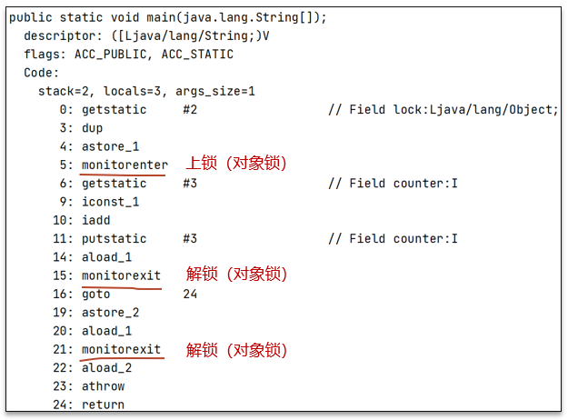

可以借助javap命令查看clsss的字节码查看moniter指令：
- `monitorenter` 上锁开始的地方
- `monitorexit` 解锁的地方
- 其中被monitorenter和monitorexit包围住的指令就是上锁的代码
- 有两个monitorexit的原因，第二个monitorexit是为了防止锁住的代码抛异常后不能及时释放锁


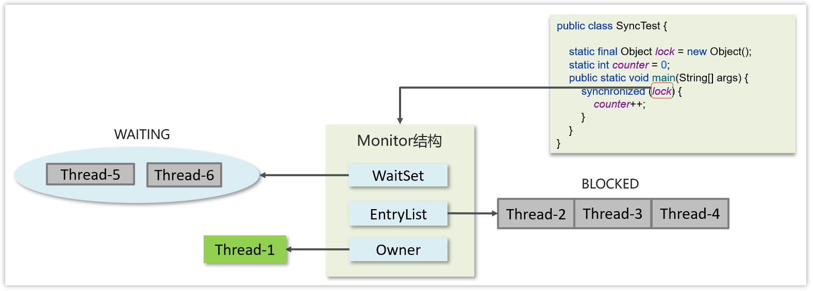


具体的流程：

- 代码进入synchorized代码块，先让lock关联上monitor，然后判断Owner是否有线程持有。
  - 如果没有线程持有，则让当前线程持有，表示该线程获取锁成功
  - 如果有线程持有，则让当前线程进入阻塞队列进行阻塞。
- 如果Owner持有的线程已经释放了锁，在阻塞队列中的线程去竞争锁的持有权（非公平）
- 如果代码块中调用了wait()方法，则会进去等待集合中进行等待

## 13. 你了解过synchronized锁升级吗？


- Java中的synchronized有偏向锁、轻量级锁、重量级锁三种形式
- Monitor实现的锁属于重量级锁。在JDK 1.6引入偏向锁和轻量级锁

    - 偏向锁：在第一次获得锁时，会有一个CAS操作，之后该线程再获取锁，只需要判断mark  word中是否是自己的线程id即可，而不是开销相对较大的CAS命令 
    - 轻量级锁：轻量级修改了对象头的锁标志，相对重量级锁性能提升很多。每次修改都是CAS操作，保证原子性
    - 重量级锁：底层使用的Monitor实现，里面涉及到了用户态和内核态的切换、进程的上下文切换，成本较高，性能比较低。

场景：
- 只有一个线程：偏向锁。
- 同步块中的代码都是不存在竞争的（不同的线程交替的执行同步块中的代码）：用轻量级锁就行。
- 多线程竞争锁：重量级锁。

**一旦锁发生了竞争，都会升级为重量级锁**


## 14. 轻量级锁

MarkWord


哈希码、GC 分代年龄、锁状态标志、
- 哈希码
- GC 分代年龄
- 偏向锁标识+ 锁状态标志：后三位是001表示无锁，后三位是101表示偏向锁，后两位是00表示轻量级锁，后两位是10表示重量级锁
- 持有偏向锁的线程ID
- epoch偏向时间戳
- ptr_to_lock_record：轻量级锁状态下，指向栈中锁记录的指针，占30位
- ptr_to_heavyweight_monitor：重量级锁状态下，指向对象监视器Monitor的指针，占30位

```java
static final Object obj = new Object();

public static void method1() {
    synchronized (obj) {
        // 同步块 A
        method2();
    }
}

public static void method2() {
    synchronized (obj) {
        // 同步块 B
    }
}
```

**加锁的流程**

1.在**线程栈**中创建一个**Lock Record**，将其obj字段指向锁对象。

2.通过CAS指令将Lock Record的地址存储在对象头的mark word中（数据进行交换），如果对象处于无锁状态则修改成功，代表该线程获得了轻量级锁。

3.如果是当前线程已经持有该锁了，代表这是一次锁重入。设置Lock Record第一部分为null，起到了一个重入计数器的作用。

4.如果CAS修改失败，说明发生了竞争，需要膨胀为重量级锁。


**解锁过程**

1.遍历线程栈,找到所有obj字段等于当前锁对象的Lock Record。

2.如果Lock Record的Mark Word为null，代表这是一次重入，将obj设置为null后continue。

3.如果Lock Record的 Mark Word不为null，则利用CAS指令将对象头的mark word恢复成为无锁状态。如果失败则膨胀为重量级锁。


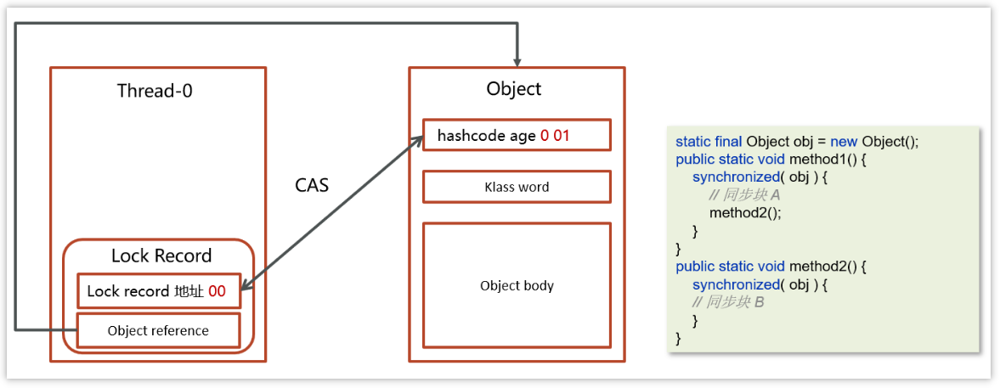

## 15. 偏向锁

轻量级锁在没有竞争时（就自己这个线程），每次重入仍然需要执行 CAS 操作。

Java 6 中引入了偏向锁来做进一步优化：只有第一次使用 CAS 将线程 ID 设置到对象的 Mark Word 头，之后发现这个线程 ID 是自己的就表示没有竞争，不用重新 CAS。以后只要不发生竞争，这个对象就归该线程所有

```java
static final Object obj = new Object();

public static void m1() {
    synchronized (obj) {
        // 同步块 A
        m2();
    }
}

public static void m2() {
    synchronized (obj) {
        // 同步块 B
        m3();
    }
}

public static void m3() {
    synchronized (obj) {

    }
}
```

**加锁的流程**

1.在线程栈中创建一个Lock Record，将其obj字段指向锁对象。

2.通过CAS指令将Lock Record的**线程id**存储在对象头的mark word中，同时也设置偏向锁的标识为101，如果对象处于无锁状态则修改成功，代表该线程获得了偏向锁。

3.如果是当前线程已经持有该锁了，代表这是一次锁重入。设置Lock Record第一部分为null，起到了一个重入计数器的作用。与轻量级锁不同的时，这里不会再次进行cas操作，只是判断对象头中的线程id是否是自己，因为缺少了cas操作，性能相对轻量级锁更好一些


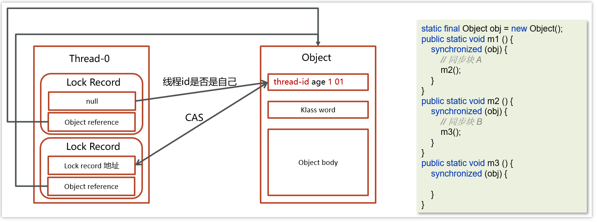

解锁流程参考轻量级锁

## 17. CAS 你知道吗？

Compare And Swap(比较再交换)，它体现的一种**乐观锁**的思想，在无锁情况下保证线程操作共享数据的原子性。

当且仅当旧的预期值A和内存值V相同时，将内存值修改为B并返回true，否则什么都不做，并返回false。

如果CAS操作失败，通过自旋的方式等待并再次尝试————不断尝试获取共享内存V中最新的值，然后再在新的值的基础上进行更新操作，如果失败就继续尝试获取新的值，直到更新成功
  - 因为没有加锁，所以线程不会陷入阻塞，效率较高
  - 如果竞争激烈，重试频繁发生，效率会受影响


在JUC（ java.util.concurrent ）包下实现的很多类都用到了CAS操作

- AbstractQueuedSynchronizer（AQS框架）

- AtomicXXX类


## 18. CAS 底层实现

CAS 底层依赖于一个 Unsafe 类的本地方法，来直接调用操作系统底层的 CAS 指令


在java中比较常见使用有很多，比如ReentrantLock和Atomic开头的线程安全类，都调用了Unsafe中的方法

## 19. 乐观锁和悲观锁

- CAS 是基于乐观锁的思想：最乐观的估计，不怕别的线程来修改共享变量，就算改了也没关系，我吃亏点再重试呗。

- synchronized 是基于悲观锁的思想：最悲观的估计，得防着其它线程来修改共享变量，我上了锁你们都别想改，我改完了解开锁，你们才有机会。

## 20. 请谈谈你对 volatile 的理解


一旦一个共享变量（类的成员变量、类的静态成员变量）被volatile修饰之后，那么就具备了两层语义：
- 保证线程间的可见性

    原本一个线程修改了某个变量的值，其他线程是立即可见的，但因为JIT优化而不可见。volatile关键字会阻止JIT（即时编辑器）对代码的优化，**强制将修改的值立即写入主存**。

- 禁止进行指令重排序

    用 volatile 修饰共享变量会在读、写共享变量时加入不同的屏障，阻止其他读写操作越过屏障，从而达到阻止重排序的效果

[JIT优化](../../codes/juc/src/main/java/thread_basic/volatile_test/JIT.java)

PS：[尚硅谷说是可见性也是由内存屏障实现的](../juc/JMM.md#15-内存屏障)

## 21. 什么是AQS？

AbstractQueuedSynchronizer，是阻塞式锁和相关的同步器工具的框架，它是构建锁或者其他同步组件的基础框架

AQS常见的实现类

- ReentrantLock 阻塞式锁

- Semaphore 信号量

- CountDownLatch 倒计时锁

## 22. AQS工作机制

- 在AQS中维护了一个使用了**volatile修饰的state属性**来表示资源的状态，0表示无锁，1表示有锁
- 提供了基于 **FIFO 的双向的等待队列**
- **条件变量来实现等待、唤醒机制**，支持多个条件变量


- 线程0来了以后，去尝试修改state属性，如果发现state属性是0，就修改state状态为1，表示线程0锁成功
- 线程1和线程2也会先尝试修改state属性，发现state的值已经是1了，有其他线程持有锁，它们都会到IFO队列中进行等待，

**如果多个线程共同去抢这个资源是如何保证原子性的呢？**


在去修改state状态的时候，使用的cas自旋锁来保证原子性，确保只能有一个线程修改成功，修改失败的线程将会进入FIFO队列中等待

**AQS是公平锁吗，还是非公平锁？**

看新来的：
- 新的线程与队列中的线程共同来抢资源，是非公平锁。比如ReentrantLock默认就是非公平锁

- 新的线程到队列中等待，只让队列中的head线程获取锁，是公平锁


## 23. ReentrantLock

ReentrantLock可重入锁，相对于synchronized它具备以下特点：

- 可中断

- 可以设置超时时间

- 支持公平锁和非公平锁

- 支持多个条件变量

- 与synchronized一样，都支持重入


## 24. ReentrantLock的实现原理

**AQS队列 + CAS**来实现。

查看ReentrantLock源码中的构造方法：

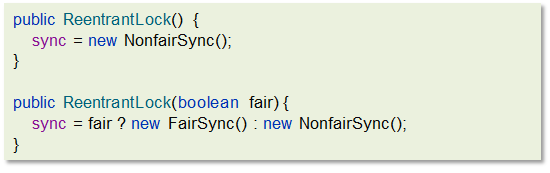

提供了两个构造方法
- 默认无参为非公平锁
- 如果使用带参数的构造函数，并且传的值为true，则是公平锁，false是非公平锁。


其中NonfairSync和FairSync这两个类父类都是Sync，而Sync的父类是AQS

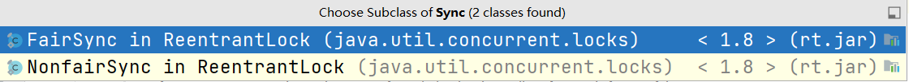


**工作流程**


- 线程来抢锁后使用cas的方式修改state状态，修改状态成功为1，则让exclusiveOwnerThread属性指向当前线程，获取锁成功

- 假如修改状态失败，则会进入双向队列中等待，head指向双向队列头部，tail指向双向队列尾部

- 当exclusiveOwnerThread为null的时候，则会唤醒在双向队列中等待的线程

- 公平锁则体现在按照先后顺序获取锁，非公平体现在不在排队的线程也可以抢锁

## 25. synchronized和Lock有什么区别 ? 

* 语法
  * synchronized 是关键字，源码在 jvm 中，用 c++ 语言实现
  * Lock 是接口，源码由 jdk 提供，用 java 语言实现
  * 使用 synchronized 时，系统会监控锁的释放与否，退出同步代码块锁会自动释放，而使用 Lock 时，需要手动调用 unlock 方法释放锁
* 功能
  * synchronized更简洁，可以用在方法/代码块。lock只能写在代码里，但功能多，更灵活。
  * 二者均属于悲观锁、都具备基本的互斥、同步、锁重入功能
  * Lock 提供了许多 synchronized 不具备的功能，例如获取等待状态、公平锁、可打断、可超时、多条件变量
  * Lock 有适合不同场景的实现，如 ReentrantLock， ReentrantReadWriteLock
* 性能
  * 在没有竞争或竞争不激烈时，synchronized 做了很多优化，如偏向锁、轻量级锁，性能更好。
  * 在竞争激烈时，Lock 性能更好。

## 26. 死锁产生的条件是什么？

**死锁**：一个线程需要同时获取多把锁，这时就容易发生死锁


```java
package com.itheima.basic;

import static java.lang.Thread.sleep;

public class Deadlock {

    public static void main(String[] args) {
        Object A = new Object();
        Object B = new Object();
        Thread t1 = new Thread(() -> {
            synchronized (A) {
                System.out.println("lock A");
                try {
                    sleep(1000);
                } catch (InterruptedException e) {
                    throw new RuntimeException(e);
                }
                synchronized (B) {
                    System.out.println("lock B");
                    System.out.println("操作...");
                }
            }
        }, "t1");

        Thread t2 = new Thread(() -> {
            synchronized (B) {
                System.out.println("lock B");
                try {
                    sleep(500);
                } catch (InterruptedException e) {
                    throw new RuntimeException(e);
                }
                synchronized (A) {
                    System.out.println("lock A");
                    System.out.println("操作...");
                }
            }
        }, "t2");
        t1.start();
        t2.start();
    }
}
```

控制台输出结果


此时程序并没有结束，这种现象就是死锁现象...线程t1持有A的锁等待获取B锁，线程t2持有B的锁等待获取A的锁。

## 27. 如何进行死锁诊断？


当程序出现了死锁现象，我们可以使用jdk自带的工具：jps和 jstack

步骤如下：

第一：查看运行的线程

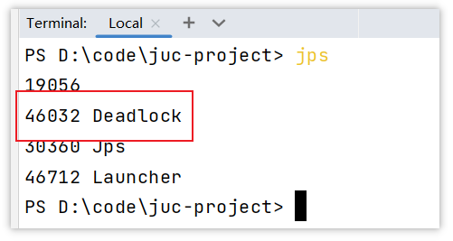

第二：使用jstack查看线程运行的情况，下图是截图的关键信息

运行命令：`jstack -l 46032`

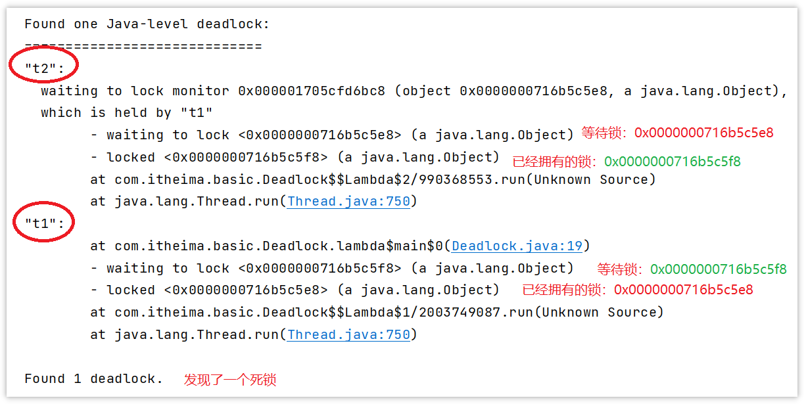

**其他解决工具，可视化工具**

- jconsole

用于对jvm的内存，线程，类 的监控，是一个基于 jmx 的 GUI 性能监控工具

打开方式：java 安装目录 bin目录下 直接启动 jconsole.exe 就行

- VisualVM：故障处理工具

能够监控线程，内存情况，查看方法的CPU时间和内存中的对 象，已被GC的对象，反向查看分配的堆栈

打开方式：java 安装目录 bin目录下 直接启动 jvisualvm.exe就行


## 29. 线程池

### 29.1. 说一下线程池的核心参数（线程池的执行原理知道嘛）

ThreadPoolExecutor构造函数的7个参数


- corePoolSize 核心线程数目

- maximumPoolSize 最大线程数目 = (核心线程+救急线程的最大数目)

- keepAliveTime 生存时间 - 救急线程的生存时间，生存时间内没有新任务，此线程资源会释放

- unit 时间单位 - 救急线程的生存时间单位，如秒、毫秒等

- workQueue - 当没有空闲核心线程时，新来任务会加入到此队列排队，队列满会创建救急线程执行任务

- threadFactory 线程工厂 - 可以定制线程对象的创建，例如设置线程名字、是否是守护线程等

- handler 拒绝策略 - 当所有线程都在繁忙，workQueue 也放满时，会触发拒绝策略

**工作流程**


>1，任务在提交的时候，首先判断核心线程数是否已满，如果没有满则直接添加到工作线程执行
>
>2，如果核心线程数满了，则判断阻塞队列是否已满，如果没有满，当前任务存入阻塞队列
>
>3，如果阻塞队列也满了，则判断线程数是否小于最大线程数，如果满足条件，则使用临时线程执行任务
>
>如果核心或临时线程执行完成任务后会检查阻塞队列中是否有需要执行的线程，如果有，则使用非核心线程执行任务
>
>4，如果所有线程都在忙着（核心线程+临时线程），则走拒绝策略

拒绝策略：

1.AbortPolicy：直接抛出异常，默认策略；

2.CallerRunsPolicy：用调用者所在的线程来执行任务；

3.DiscardOldestPolicy：丢弃阻塞队列中靠最前的任务，并执行当前任务；

4.DiscardPolicy：直接丢弃任务；

参考代码：

```java
public class TestThreadPoolExecutor {

    static class MyTask implements Runnable {
        private final String name;
        private final long duration;

        public MyTask(String name) {
            this(name, 0);
        }

        public MyTask(String name, long duration) {
            this.name = name;
            this.duration = duration;
        }

        @Override
        public void run() {
            try {
                LoggerUtils.get("myThread").debug("running..." + this);
                Thread.sleep(duration);
            } catch (InterruptedException e) {
                e.printStackTrace();
            }
        }

        @Override
        public String toString() {
            return "MyTask(" + name + ")";
        }
    }

    public static void main(String[] args) throws InterruptedException {
        AtomicInteger c = new AtomicInteger(1);
        ArrayBlockingQueue<Runnable> queue = new ArrayBlockingQueue<>(2);
        ThreadPoolExecutor threadPool = new ThreadPoolExecutor(
                2,
                3,
                0,
                TimeUnit.MILLISECONDS,
                queue,
                r -> new Thread(r, "myThread" + c.getAndIncrement()),
                new ThreadPoolExecutor.AbortPolicy());
        showState(queue, threadPool);
        threadPool.submit(new MyTask("1", 3600000));
        showState(queue, threadPool);
        threadPool.submit(new MyTask("2", 3600000));
        showState(queue, threadPool);
        threadPool.submit(new MyTask("3"));
        showState(queue, threadPool);
        threadPool.submit(new MyTask("4"));
        showState(queue, threadPool);
        threadPool.submit(new MyTask("5",3600000));
        showState(queue, threadPool);
        threadPool.submit(new MyTask("6"));
        showState(queue, threadPool);
    }

    private static void showState(ArrayBlockingQueue<Runnable> queue, ThreadPoolExecutor threadPool) {
        try {
            Thread.sleep(300);
        } catch (InterruptedException e) {
            e.printStackTrace();
        }
        List<Object> tasks = new ArrayList<>();
        for (Runnable runnable : queue) {
            try {
                Field callable = FutureTask.class.getDeclaredField("callable");
                callable.setAccessible(true);
                Object adapter = callable.get(runnable);
                Class<?> clazz = Class.forName("java.util.concurrent.Executors$RunnableAdapter");
                Field task = clazz.getDeclaredField("task");
                task.setAccessible(true);
                Object o = task.get(adapter);
                tasks.add(o);
            } catch (Exception e) {
                e.printStackTrace();
            }
        }
        LoggerUtils.main.debug("pool size: {}, queue: {}", threadPool.getPoolSize(), tasks);
    }

}
```

### 29.2. 线程池中有哪些常见的阻塞队列


workQueue - 当没有空闲核心线程时，新来任务会加入到此队列排队，队列满会创建救急线程执行任务

比较常见的有4个，用的最多是ArrayBlockingQueue和LinkedBlockingQueue

1. ArrayBlockingQueue：基于数组结构的有界阻塞队列，FIFO。

2. LinkedBlockingQueue：基于链表结构的有界阻塞队列，FIFO。

3. DelayedWorkQueue ：是一个优先级队列，它可以保证每次出队的任务都是当前队列中执行时间最靠前的

4. SynchronousQueue：不存储元素的阻塞队列，每个插入操作都必须等待一个移出操作。

**ArrayBlockingQueue的LinkedBlockingQueue区别**

| **LinkedBlockingQueue**          | **ArrayBlockingQueue** |
| -------------------------------- | ---------------------- |
| 默认无界，支持有界               | 强制有界               |
| 底层是链表                       | 底层是数组             |
| 是懒惰的，创建节点的时候添加数据 | 提前初始化 Node  数组  |
| 入队会生成新 Node                | Node需要是提前创建好的 |
| 两把锁（头尾）                   | 一把锁                 |

左边是LinkedBlockingQueue加锁的方式，右边是ArrayBlockingQueue加锁的方式

- LinkedBlockingQueue读和写各有一把锁，性能相对较好
- ArrayBlockingQueue只有一把锁，读和写公用，性能相对于LinkedBlockingQueue差一些

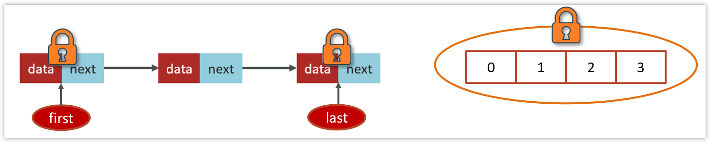

### 29.3. 3.3 如何确定核心线程数

在设置核心线程数之前，需要先熟悉一些执行线程池执行任务的类型

- IO密集型任务

一般来说：文件读写、DB读写、网络请求等

推荐：核心线程数大小设置为2N+1    （N为计算机的CPU核数）


- CPU密集型任务

一般来说：计算型代码、Bitmap转换、Gson转换等

推荐：核心线程数大小设置为N+1    （N为计算机的CPU核数）


java代码查看CPU核数

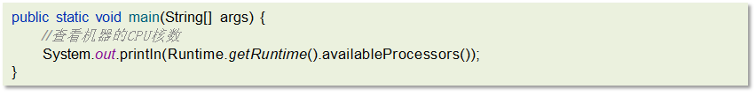

**参考回答：**

① 高并发、任务执行时间短 -->（ CPU核数+1 ），减少线程上下文的切换

② 并发不高、任务执行时间长

- IO密集型的任务 --> (CPU核数 * 2 + 1)

- 计算密集型任务 --> （ CPU核数+1 ）

③ 并发高、业务执行时间长，解决这种类型任务的关键不在于线程池而在于整体架构的设计，看看这些业务里面某些数据是否能做缓存是第一步，增加服务器是第二步，至于线程池的设置，设置参考（2）


### 29.4. 线程池的种类有哪些

在java.util.concurrent.Executors类中提供了大量创建连接池的静态方法，常见就有四种

1. 创建使用固定线程数的线程池

   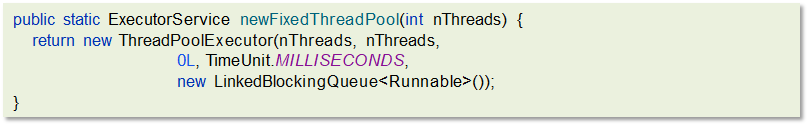

   - 核心线程数与最大线程数一样，没有救急线程

   - 阻塞队列是LinkedBlockingQueue，最大容量为Integer.MAX_VALUE

   - 适用场景：适用于任务量已知，相对耗时的任务

   - 案例：

     ```java
     public class FixedThreadPoolCase {
     
         static class FixedThreadDemo implements Runnable{
             @Override
             public void run() {
                 String name = Thread.currentThread().getName();
                 for (int i = 0; i < 2; i++) {
                     System.out.println(name + ":" + i);
                 }
             }
         }
     
         public static void main(String[] args) throws InterruptedException {
             //创建一个固定大小的线程池，核心线程数和最大线程数都是3
             ExecutorService executorService = Executors.newFixedThreadPool(3);
     
             for (int i = 0; i < 5; i++) {
                 executorService.submit(new FixedThreadDemo());
                 Thread.sleep(10);
             }
     
             executorService.shutdown();
         }
     
     }
     ```

     

2. 单线程化的线程池，它只会用唯一的工作线程来执行任 务，保证所有任务按照指定顺序(FIFO)执行

   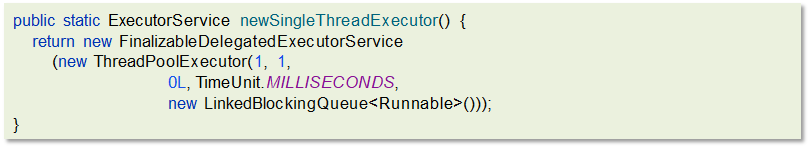

   - 核心线程数和最大线程数都是1

   - 阻塞队列是LinkedBlockingQueue，最大容量为Integer.MAX_VALUE

   - 适用场景：适用于按照顺序执行的任务

   - 案例：

     ```java
     public class NewSingleThreadCase {
     
         static int count = 0;
     
         static class Demo implements Runnable {
             @Override
             public void run() {
                 count++;
                 System.out.println(Thread.currentThread().getName() + ":" + count);
             }
         }
     
         public static void main(String[] args) throws InterruptedException {
             //单个线程池，核心线程数和最大线程数都是1
             ExecutorService exec = Executors.newSingleThreadExecutor();
     
             for (int i = 0; i < 10; i++) {
                 exec.execute(new Demo());
                 Thread.sleep(5);
             }
             exec.shutdown();
         }
     
     }
     ```

     

3. 可缓存线程池

   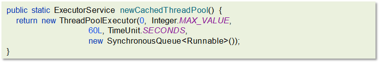

   - 核心线程数为0

   - 最大线程数是Integer.MAX_VALUE

   - 阻塞队列为SynchronousQueue:不存储元素的阻塞队列，每个插入操作都必须等待一个移出操作。

   - 适用场景：适合任务数比较密集，但每个任务执行时间较短的情况

   - 案例：

     ```java
     public class CachedThreadPoolCase {
     
         static class Demo implements Runnable {
             @Override
             public void run() {
                 String name = Thread.currentThread().getName();
                 try {
                     //修改睡眠时间，模拟线程执行需要花费的时间
                     Thread.sleep(100);
     
                     System.out.println(name + "执行完了");
                 } catch (InterruptedException e) {
                     e.printStackTrace();
                 }
             }
         }
     
         public static void main(String[] args) throws InterruptedException {
             //创建一个缓存的线程，没有核心线程数，最大线程数为Integer.MAX_VALUE
             ExecutorService exec = Executors.newCachedThreadPool();
             for (int i = 0; i < 10; i++) {
                 exec.execute(new Demo());
                 Thread.sleep(1);
             }
             exec.shutdown();
         }
     
     }
     ```

     

4. 提供了“延迟”和“周期执行”功能的ThreadPoolExecutor。

   

   - 适用场景：有定时和延迟执行的任务

   - 案例：

     ```java
     public class ScheduledThreadPoolCase {
     
         static class Task implements Runnable {
             @Override
             public void run() {
                 try {
                     String name = Thread.currentThread().getName();
     
                     System.out.println(name + ", 开始：" + new Date());
                     Thread.sleep(1000);
                     System.out.println(name + ", 结束：" + new Date());
     
                 } catch (InterruptedException e) {
                     e.printStackTrace();
                 }
             }
         }
     
         public static void main(String[] args) throws InterruptedException {
             //按照周期执行的线程池，核心线程数为2，最大线程数为Integer.MAX_VALUE
             ScheduledExecutorService scheduledThreadPool = Executors.newScheduledThreadPool(2);
             System.out.println("程序开始：" + new Date());
     
             /**
              * schedule 提交任务到线程池中
              * 第一个参数：提交的任务
              * 第二个参数：任务执行的延迟时间
              * 第三个参数：时间单位
              */
             scheduledThreadPool.schedule(new Task(), 0, TimeUnit.SECONDS);
             scheduledThreadPool.schedule(new Task(), 1, TimeUnit.SECONDS);
             scheduledThreadPool.schedule(new Task(), 5, TimeUnit.SECONDS);
     
             Thread.sleep(5000);
     
             // 关闭线程池
             scheduledThreadPool.shutdown();
     
         }
     
     }
     ```

### 29.5. 为什么不建议用Executors创建线程池

《Java开发手册-嵩山版》


## 30.1. 线程池使用场景（你们项目哪里用到了多线程）
CountDownLatch、Future

## CountDownLatch

CountDownLatch（闭锁/倒计时锁）用来进行线程同步协作，等待所有线程完成倒计时（一个或者多个线程，等待其他多个线程完成某件事情之后才能执行）

- 其中构造参数用来初始化等待计数值

- await() 用来等待计数归零

- countDown() 用来让计数减一


案例代码：

```java
public class CountDownLatchDemo {

    public static void main(String[] args) throws InterruptedException {
        //初始化了一个倒计时锁 参数为 3
        CountDownLatch latch = new CountDownLatch(3);

        new Thread(() -> {
            System.out.println(Thread.currentThread().getName()+"-begin...");
            try {
                Thread.sleep(1000);
            } catch (InterruptedException e) {
                throw new RuntimeException(e);
            }
            //count--
            latch.countDown();
            System.out.println(Thread.currentThread().getName()+"-end..." +latch.getCount());
        }).start();
        new Thread(() -> {
            System.out.println(Thread.currentThread().getName()+"-begin...");
            try {
                Thread.sleep(2000);
            } catch (InterruptedException e) {
                throw new RuntimeException(e);
            }
            //count--
            latch.countDown();
            System.out.println(Thread.currentThread().getName()+"-end..." +latch.getCount());
        }).start();
        new Thread(() -> {
            System.out.println(Thread.currentThread().getName()+"-begin...");
            try {
                Thread.sleep(1500);
            } catch (InterruptedException e) {
                throw new RuntimeException(e);
            }
            //count--
            latch.countDown();
            System.out.println(Thread.currentThread().getName()+"-end..." +latch.getCount());
        }).start();
        String name = Thread.currentThread().getName();
        System.out.println(name + "-waiting...");
        //等待其他线程完成
        latch.await();
        System.out.println(name + "-wait end...");
    }
    
}
```

#### 30.1.2. 4.1.2 案例一（es数据批量导入）

在我们项目上线之前，我们需要把数据库中的数据一次性的同步到es索引库中，但是当时的数据好像是1000万左右，一次性读取数据肯定不行（oom异常），当时我就想到可以使用线程池的方式导入，利用CountDownLatch来控制，就能避免一次性加载过多，防止内存溢出

整体流程就是通过CountDownLatch+线程池配合去执行


详细实现流程：

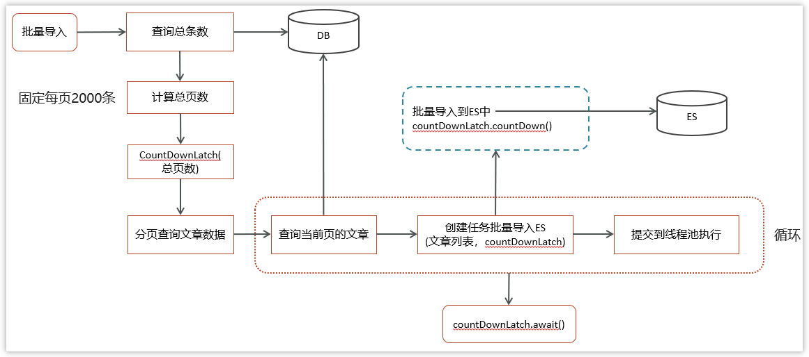

>详细实现代码，请查看当天代码

#### 30.1.3. 4.1.3 案例二（数据汇总）

在一个电商网站中，用户下单之后，需要查询数据，数据包含了三部分：订单信息、包含的商品、物流信息；这三块信息都在不同的微服务中进行实现的，我们如何完成这个业务呢？


>详细实现代码，请查看当天代码

- 在实际开发的过程中，难免需要调用多个接口来汇总数据，如果所有接口（或部分接口）的没有依赖关系，就可以使用线程池+future来提升性能

- 报表汇总

  


#### 30.1.4. 4.1.4 案例二（异步调用）


在进行搜索的时候，需要保存用户的搜索记录，而搜索记录不能影响用户的正常搜索，我们通常会开启一个线程去执行历史记录的保存，在新开启的线程在执行的过程中，可以利用线程提交任务

### 30.2. 4.1 如何控制某个方法允许并发访问线程的数量？


Semaphore [ˈsɛməˌfɔr] 信号量，是JUC包下的一个工具类，我们可以通过其限制执行的线程数量，达到限流的效果

当一个线程执行时先通过其方法进行获取许可操作，获取到许可的线程继续执行业务逻辑，当线程执行完成后进行释放许可操作，未获取达到许可的线程进行等待或者直接结束。

Semaphore两个重要的方法

lsemaphore.acquire()： 请求一个信号量，这时候的信号量个数-1（一旦没有可使用的信号量，也即信号量个数变为负数时，再次请求的时候就会阻塞，直到其他线程释放了信号量）

lsemaphore.release()：释放一个信号量，此时信号量个数+1

线程任务类：

```java
public class SemaphoreCase {
    public static void main(String[] args) {
        // 1. 创建 semaphore 对象
        Semaphore semaphore = new Semaphore(3);
        // 2. 10个线程同时运行
        for (int i = 0; i < 10; i++) {
            new Thread(() -> {

                try {
                    // 3. 获取许可
                    semaphore.acquire();
                } catch (InterruptedException e) {
                    e.printStackTrace();
                }
                try {
                    System.out.println("running...");
                    try {
                        Thread.sleep(1000);
                    } catch (InterruptedException e) {
                        e.printStackTrace();
                    }
                    System.out.println("end...");
                } finally {
                    // 4. 释放许可
                    semaphore.release();
                }
            }).start();
        }
    }

}
```


## 31. 5.其他

### 31.1. 5.1 谈谈你对ThreadLocal的理解

#### 31.1.1. 5.1.1 概述

ThreadLocal是多线程中对于解决线程安全的一个操作类，它会为每个线程都分配一个独立的线程副本从而解决了变量并发访问冲突的问题。ThreadLocal 同时实现了线程内的资源共享

案例：使用JDBC操作数据库时，会将每一个线程的Connection放入各自的ThreadLocal中，从而保证每个线程都在各自的 Connection 上进行数据库的操作，避免A线程关闭了B线程的连接。

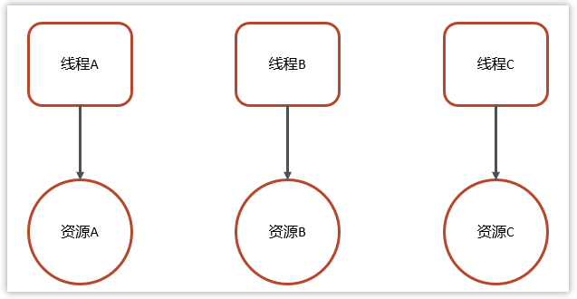

#### 31.1.2. 5.1.2 ThreadLocal基本使用

三个主要方法：

- set(value) 设置值

- get() 获取值

- remove() 清除值

```java
public class ThreadLocalTest {
    static ThreadLocal<String> threadLocal = new ThreadLocal<>();

    public static void main(String[] args) {
        new Thread(() -> {
            String name = Thread.currentThread().getName();
            threadLocal.set("itcast");
            print(name);
            System.out.println(name + "-after remove : " + threadLocal.get());
        }, "t1").start();
        new Thread(() -> {
            String name = Thread.currentThread().getName();
            threadLocal.set("itheima");
            print(name);
            System.out.println(name + "-after remove : " + threadLocal.get());
        }, "t2").start();
    }

    static void print(String str) {
        //打印当前线程中本地内存中本地变量的值
        System.out.println(str + " :" + threadLocal.get());
        //清除本地内存中的本地变量
        threadLocal.remove();
    }

}
```

#### 31.1.3. 5.1.3 ThreadLocal的实现原理&源码解析

ThreadLocal本质来说就是一个线程内部存储类，从而让多个线程只操作自己内部的值，从而实现线程数据隔离


在ThreadLocal中有一个内部类叫做ThreadLocalMap，类似于HashMap

ThreadLocalMap中有一个属性table数组，这个是真正存储数据的位置

**set方法**


**get方法/remove方法**


#### 31.1.4. 5.1.4 ThreadLocal-内存泄露问题

Java对象中的四种引用类型：强引用、软引用、弱引用、虚引用

- 强引用：最为普通的引用方式，表示一个对象处于有用且必须的状态，如果一个对象具有强引用，则GC并不会回收它。即便堆中内存不足了，宁可出现OOM，也不会对其进行回收


- 弱引用：表示一个对象处于可能有用且非必须的状态。在GC线程扫描内存区域时，一旦发现弱引用，就会回收到弱引用相关联的对象。对于弱引用的回收，无关内存区域是否足够，一旦发现则会被回收

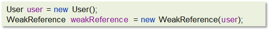

每一个Thread维护一个ThreadLocalMap，在ThreadLocalMap中的Entry对象继承了WeakReference。其中key为使用弱引用的ThreadLocal实例，value为线程变量的副本

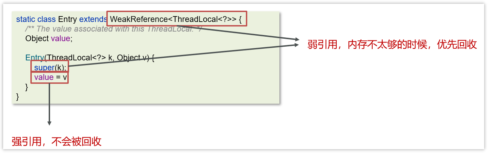

在使用ThreadLocal的时候，强烈建议：**务必手动remove**

## 32. 6 真实面试还原


### 32.2. 6.2 线程中并发锁

>**面试官**：讲一下synchronized关键字的底层原理？
>
>**候选人**：
>
>嗯~~好的，
>
>synchronized 底层使用的JVM级别中的Monitor 来决定当前线程是否获得了锁，如果某一个线程获得了锁，在没有释放锁之前，其他线程是不能或得到锁的。synchronized 属于悲观锁。
>
>synchronized 因为需要依赖于JVM级别的Monitor ，相对性能也比较低。
>
>**面试官**：好的，你能具体说下Monitor 吗？
>
>**候选人**：
>
>monitor对象存在于每个Java对象的对象头中，synchronized 锁便是通过这种方式获取锁的，也是为什么Java中任意对象可以作为锁的原因
>
>monitor内部维护了三个变量
>
>- WaitSet：保存处于Waiting状态的线程
>
>- EntryList：保存处于Blocked状态的线程
>
>- Owner：持有锁的线程
>
>只有一个线程获取到的标志就是在monitor中设置成功了Owner，一个monitor中只能有一个Owner
>
>在上锁的过程中，如果有其他线程也来抢锁，则进入EntryList 进行阻塞，当获得锁的线程执行完了，释放了锁，就会唤醒EntryList 中等待的线程竞争锁，竞争的时候是非公平的。
>
>**面试官**：好的，那关于synchronized 的锁升级的情况了解吗？
>
>**候选人**：
>
>嗯，知道一些（要谦虚）
>
>Java中的synchronized有偏向锁、轻量级锁、重量级锁三种形式，分别对应了锁只被一个线程持有、不同线程交替持有锁、多线程竞争锁三种情况。
>
>重量级锁：底层使用的Monitor实现，里面涉及到了用户态和内核态的切换、进程的上下文切换，成本较高，性能比较低。
>
>轻量级锁：线程加锁的时间是错开的（也就是没有竞争），可以使用轻量级锁来优化。轻量级修改了对象头的锁标志，相对重量级锁性能提升很多。每次修改都是CAS操作，保证原子性
>
>偏向锁：一段很长的时间内都只被一个线程使用锁，可以使用了偏向锁，在第一次获得锁时，会有一个CAS操作，之后该线程再获取锁，只需要判断mark word中是否是自己的线程id即可，而不是开销相对较大的CAS命令
>
>一旦锁发生了竞争，都会升级为重量级锁
>
>**面试官**：好的，刚才你说了synchronized它在高并发量的情况下，性能不高，在项目该如何控制使用锁呢？
>
>**候选人**：
>
>嗯，其实，在高并发下，我们可以采用ReentrantLock来加锁。
>
>**面试官**：嗯，那你说下ReentrantLock的使用方式和底层原理？
>
>**候选人**：
>
>好的，
>
>ReentrantLock是一个可重入锁:，调用 lock 方 法获取了锁之后，再次调用 lock，是不会再阻塞，内部直接增加重入次数 就行了，标识这个线程已经重复获取一把锁而不需要等待锁的释放。
>
>ReentrantLock是属于juc报下的类，属于api层面的锁，跟synchronized一样，都是悲观锁。通过lock()用来获取锁，unlock()释放锁。
>
>它的底层实现原理主要利用**CAS+AQS队列**来实现。它支持公平锁和非公平锁，两者的实现类似
>
>构造方法接受一个可选的公平参数（**默认非公平锁**），当设置为true时，表示公平锁，否则为非公平锁。公平锁的效率往往没有非公平锁的效率高。
>
>**面试官**：好的，刚才你说了CAS和AQS，你能介绍一下吗？
>
>**候选人**：
>
>好的。
>
>CAS的全称是： Compare And Swap(比较再交换);它体现的一种乐观锁的思想，在无锁状态下保证线程操作数据的原子性。
>
>- CAS使用到的地方很多：AQS框架、AtomicXXX类
>
>- 在操作共享变量的时候使用的自旋锁，效率上更高一些
>
>- CAS的底层是调用的Unsafe类中的方法，都是操作系统提供的，其他语言实现
>
>
>
>AQS的话，其实就一个jdk提供的类AbstractQueuedSynchronizer，是阻塞式锁和相关的同步器工具的框架。
>
>内部有一个属性 state 属性来表示资源的状态，默认state等于0，表示没有获取锁，state等于1的时候才标明获取到了锁。通过cas 机制设置 state 状态
>
>在它的内部还提供了基于 FIFO 的等待队列，是一个双向列表，其中
>
>- tail 指向队列最后一个元素
>
>- head  指向队列中最久的一个元素
>
>其中我们刚刚聊的ReentrantLock底层的实现就是一个AQS。
>
>**面试官**：synchronized和Lock有什么区别 ? 	
>
>**候选人**：
>
>嗯~~，好的，主要有三个方面不太一样
>
>第一，语法层面
>
>* synchronized 是关键字，源码在 jvm 中，用 c++ 语言实现，退出同步代码块锁会自动释放
>* Lock 是接口，源码由 jdk 提供，用 java 语言实现，需要手动调用 unlock 方法释放锁
>
>第二，功能层面
>
>* 二者均属于悲观锁、都具备基本的互斥、同步、锁重入功能
>* Lock 提供了许多 synchronized 不具备的功能，例如获取等待状态、公平锁、可打断、可超时、多条件变量，同时Lock 可以实现不同的场景，如 ReentrantLock， ReentrantReadWriteLock
>
>第三，性能层面
>
>* 在没有竞争时，synchronized 做了很多优化，如偏向锁、轻量级锁，性能不赖
>* 在竞争激烈时，Lock 的实现通常会提供更好的性能
>
>统合来看，需要根据不同的场景来选择不同的锁的使用。
>
>-----
>
>**面试官**：死锁产生的条件是什么？
>
>**候选人**：
>
>嗯，是这样的，一个线程需要同时获取多把锁，这时就容易发生死锁，举个例子来说：
>
>t1 线程获得A对象锁，接下来想获取B对象的锁
>
>t2 线程获得B对象锁，接下来想获取A对象的锁 
>
>这个时候t1线程和t2线程都在互相等待对方的锁，就产生了死锁
>
>**面试官**：那如果产出了这样的，如何进行死锁诊断？
>
>**候选人**：
>
>这个也很容易，我们只需要通过jdk自动的工具就能搞定
>
>我们可以先通过jps来查看当前java程序运行的进程id
>
>然后通过jstack来查看这个进程id，就能展示出来死锁的问题，并且，可以定位代码的具体行号范围，我们再去找到对应的代码进行排查就行了。
>
>-------
>
>**面试官**：请谈谈你对 volatile 的理解
>
>**候选人**：
>
>嗯~~
>
>volatile 是一个关键字，可以修饰类的成员变量、类的静态成员变量，主要有两个功能
>
>第一：保证了不同线程对这个变量进行操作时的可见性，即一个线程修改了某个变量的值，这新值对其他线程来说是立即可见的,volatile关键字会强制将修改的值立即写入主存。
>
>第二： 禁止进行指令重排序，可以保证代码执行有序性。底层实现原理是，添加了一个**内存屏障**，通过插入内存屏障禁止在内存屏障**前后**的指令执行重排序优化
>
>--------
>
>**本文作者**：接《集合相关面试题》
>
>**面试官**：那你能聊一下ConcurrentHashMap的原理吗？
>
>**候选人**：
>
>嗯好的，
>
>ConcurrentHashMap 是一种线程安全的高效Map集合，jdk1.7和1.8也做了很多调整。
>
>- JDK1.7的底层采用是**分段的数组**+**链表** 实现
>- JDK1.8 采用的数据结构跟HashMap1.8的结构一样，数组+链表/红黑二叉树。
>
>在jdk1.7中 ConcurrentHashMap 里包含一个 Segment 数组。Segment 的结构和HashMap类似，是一 种数组和链表结构，一个 Segment 包含一个 HashEntry 数组，每个 HashEntry 是一个链表结构 的元素，每个 Segment 守护着一个HashEntry数组里的元素，当对 HashEntry 数组的数据进行修 改时，必须首先获得对应的 Segment的锁。
>
>Segment 是一种可重入的锁 ReentrantLock，每个 Segment 守护一个HashEntry 数组里得元 素，当对 HashEntry 数组的数据进行修改时，必须首先获得对应的 Segment 锁
>
>在jdk1.8中的ConcurrentHashMap 做了较大的优化，性能提升了不少。首先是它的数据结构与jdk1.8的hashMap数据结构完全一致。其次是放弃了Segment臃肿的设计，取而代之的是采用Node + CAS + Synchronized来保 证并发安全进行实现，synchronized只锁定当前链表或红黑二叉树的首节点，这样只要hash不冲 突，就不会产生并发 , 效率得到提升

### 32.3. 6.3 线程池

>**面试官**：线程池的种类有哪些？
>
>**候选人**：
>
>嗯！是这样
>
>在jdk中默认提供了4中方式创建线程池
>
>第一个是：newCachedThreadPool创建一个可缓存线程池，如果线程池长度超过处理需要，可灵活回 收空闲线程，若无可回收，则新建线程。 
>
>第二个是：newFixedThreadPool 创建一个定长线程池，可控制线程最大并发数，超出的线程会在队列 中等待。 
>
>第三个是：newScheduledThreadPool 创建一个定长线程池，支持定时及周期性任务执行。 
>
>第四个是：newSingleThreadExecutor 创建一个单线程化的线程池，它只会用唯一的工作线程来执行任 务，保证所有任务按照指定顺序(FIFO, LIFO, 优先级)执行。
>
>**面试官**：线程池的核心参数有哪些？
>
>**候选人**：
>
>在线程池中一共有7个核心参数：
>
>1. corePoolSize 核心线程数目 - 池中会保留的最多线程数
>
>2. maximumPoolSize 最大线程数目 - 核心线程+救急线程的最大数目
>
>3. keepAliveTime 生存时间 - 救急线程的生存时间，生存时间内没有新任务，此线程资源会释放
>
>4. unit 时间单位 - 救急线程的生存时间单位，如秒、毫秒等
>
>5. workQueue - 当没有空闲核心线程时，新来任务会加入到此队列排队，队列满会创建救急线程执行任务
>
>6. threadFactory 线程工厂 - 可以定制线程对象的创建，例如设置线程名字、是否是守护线程等
>
>7. handler 拒绝策略 - 当所有线程都在繁忙，workQueue 也放满时，会触发拒绝策略
>
>   在拒绝策略中又有4中拒绝策略
>
>   当线程数过多以后，第一种是抛异常、第二种是由调用者执行任务、第三是丢弃当前的任务，第四是丢弃最早排队任务。默认是直接抛异常。
>
>**面试官**：如何确定核心线程池呢？
>
>**候选人**：
>
>是这样的，我们公司当时有一些规范，为了减少线程上下文的切换，要根据当时部署的服务器的CPU核数来决定，我们规则是：CPU核数+1就是最终的核心线程数。
>
>**面试官**：线程池的执行原理知道吗？
>
>**候选人**：
>
>嗯~，它是这样的
>
>首先判断线程池里的核心线程是否都在执行任务，如果不是则创建一个新的工作线程来执行任务。如果核心线程都在执行任务，则线程池判断工作队列是否已满，如果工作队列没有满，则将新提交的任务存储在这个工作队 列里。如果工作队列满了，则判断线程池里的线程是否都处于工作状态，如果没有，则创建一个新的工作线程来执行任 务。如果已经满了，则交给拒绝策略来处理这个任务。
>
>**面试官**：为什么不建议使用Executors创建线程池呢？
>
>**候选人**：
>
>好的，其实这个事情在阿里提供的最新开发手册《Java开发手册-嵩山版》中也提到了
>
>主要原因是如果使用Executors创建线程池的话，它允许的请求队列默认长度是Integer.MAX_VALUE，这样的话，有可能导致堆积大量的请求，从而导致OOM（内存溢出）。
>
>所以，我们一般推荐使用ThreadPoolExecutor来创建线程池，这样可以明确规定线程池的参数，避免资源的耗尽。

### 32.4. 6.4 线程使用场景问题

>**面试官**：如果控制某一个方法允许并发访问线程的数量？
>
>**候选人**：
>
>嗯~~，我想一下
>
>在jdk中提供了一个Semaphore[seməfɔːr]类（信号量）
>
>它提供了两个方法，semaphore.acquire() 请求信号量，可以限制线程的个数，是一个正数，如果信号量是-1,就代表已经用完了信号量，其他线程需要阻塞了
>
>第二个方法是semaphore.release()，代表是释放一个信号量，此时信号量的个数+1
>
>
>
>**面试官**：好的，那该如何保证Java程序在多线程的情况下执行安全呢？
>
>**候选人**：
>
>嗯，刚才讲过了导致线程安全的原因，如果解决的话，jdk中也提供了很多的类帮助我们解决多线程安全的问题，比如：
>
>- JDK Atomic开头的原子类、synchronized、LOCK，可以解决原子性问题
>- synchronized、volatile、LOCK，可以解决可见性问题
>- Happens-Before 规则可以解决有序性问题
>
>---
>
>**面试官**：你在项目中哪里用了多线程？
>
>**候选人**：
>
>嗯~~，我想一下当时的场景[根据自己简历上的模块设计多线程场景]
>
>参考场景一：
>
>es数据批量导入
>
>在我们项目上线之前，我们需要把数据量的数据一次性的同步到es索引库中，但是当时的数据好像是1000万左右，一次性读取数据肯定不行（oom异常），如果分批执行的话，耗时也太久了。所以，当时我就想到可以使用线程池的方式导入，利用CountDownLatch+Future来控制，就能大大提升导入的时间。
>
>参考场景二：
>
>在我做那个xx电商网站的时候，里面有一个数据汇总的功能，在用户下单之后需要查询订单信息，也需要获得订单中的商品详细信息（可能是多个），还需要查看物流发货信息。因为它们三个对应的分别三个微服务，如果一个一个的操作的话，互相等待的时间比较长。所以，我当时就想到可以使用线程池，让多个线程同时处理，最终再汇总结果就可以了，当然里面需要用到Future来获取每个线程执行之后的结果才行
>
>参考场景三：
>
>《黑马头条》项目中使用的
>
>我当时做了一个文章搜索的功能，用户输入关键字要搜索文章，同时需要保存用户的搜索记录（搜索历史），这块我设计的时候，为了不影响用户的正常搜索，我们采用的异步的方式进行保存的，为了提升性能，我们加入了线程池，也就说在调用异步方法的时候，直接从线程池中获取线程使用

### 32.5. 6.5 其他

>**面试官**：谈谈你对ThreadLocal的理解
>
>**候选人**：
>
>嗯，是这样的~~
>
>ThreadLocal 主要功能有两个，第一个是可以实现资源对象的线程隔离，让每个线程各用各的资源对象，避免争用引发的线程安全问题，第二个是实现了线程内的资源共享
>
>**面试官**：好的，那你知道ThreadLocal的底层原理实现吗？
>
>**候选人**：
>
>嗯，知道一些~
>
>在ThreadLocal内部维护了一个一个 ThreadLocalMap 类型的成员变量，用来存储资源对象
>
>当我们调用 set 方法，就是以 ThreadLocal 自己作为 key，资源对象作为 value，放入当前线程的 ThreadLocalMap 集合中
>
>当调用 get 方法，就是以 ThreadLocal 自己作为 key，到当前线程中查找关联的资源值
>
>当调用 remove 方法，就是以 ThreadLocal 自己作为 key，移除当前线程关联的资源值
>
>**面试官**：好的，那关于ThreadLocal会导致内存溢出这个事情，了解吗？
>
>**候选人**：
>
>嗯，我之前看过源码，我想一下~~
>
>是应为ThreadLocalMap 中的 key 被设计为弱引用，它是被动的被GC调用释放key，不过关键的是只有key可以得到内存释放，而value不会，因为value是一个强引用。
>
>在使用ThreadLocal 时都把它作为静态变量（即强引用），因此无法被动依靠 GC 回收，建议主动的remove 释放 key，这样就能避免内存溢出。


