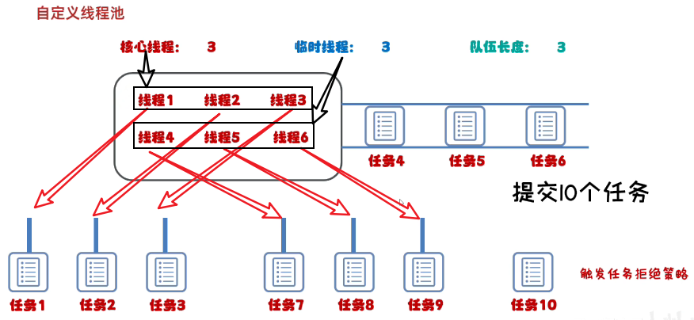

- [1. Executors静态方法获取线程池](#1-executors静态方法获取线程池)
- [2. 手动 ThreadPoolExecutor](#2-手动-threadpoolexecutor)
  - [2.1. 7个参数](#21-7个参数)
  - [2.2. 任务拒绝策略](#22-任务拒绝策略)

---
## 1. Executors静态方法获取线程池

[CreateThreadPool](../../codes/juc/create_threads/src/main/java/CreateThreadPool.java)

## 2. 手动 ThreadPoolExecutor
### 2.1. 7个参数
```java
import java.util.concurrent.ArrayBlockingQueue;
import java.util.concurrent.Executors;
import java.util.concurrent.ThreadPoolExecutor;
import java.util.concurrent.TimeUnit;

public class MyThreadPoolDemo {
    public static void main(String[] args) {
        ThreadPoolExecutor pool = new ThreadPoolExecutor(
                2,  // 核心线程数
                5,  // 最大线程数
                2,  // 空闲线程存活时间
                TimeUnit.SECONDS,   // 时间单位
                new ArrayBlockingQueue<>(10),   // 阻塞队列
                Executors.defaultThreadFactory(),   // 线程工厂
                new ThreadPoolExecutor.AbortPolicy());  // 拒绝策略
        pool.submit(new MyRunnable());
        pool.submit(new MyRunnable());
        pool.shutdown();
    }
}

class MyRunnable implements Runnable {
    @Override
    public void run() {
        for (int i = 1; i <= 100; i++) {
            System.out.println(Thread.currentThread().getName() + "---" + i);
        }
    }
}
```

```java
public ThreadPoolExecutor(
    int corePoolSize,
    int maximumPoolSize,
    long keepAliveTime,
    TimeUnit unit,
    BlockingQueue<Runnable> workQueue,
    ThreadFactory threadFactory,
    RejectedExecutionHandler handler
)
    
corePoolSize：   核心线程的最大值，不能小于0
maximumPoolSize：最大线程数，不能小于等于0，maximumPoolSize >= corePoolSize
keepAliveTime：  空闲线程最大存活时间,不能小于0
unit：           时间单位
workQueue：      任务队列，不能为null
threadFactory：  创建线程工厂,不能为null      
handler：        任务的拒绝策略,不能为null  
```

> 流程

- 任务队列满了，才开启临时线程。
- 线程池对多可执行的任务数 = 最大线程数 + 任务队列的容量。超出了就会被拒绝。



1. 任务1、2、3提交了，被分配给核心线程。
2. 任务4、5、6提交了，被排入任务队列。
3. 任务7、8、9提交了，会被分配给临时线程。
4. 任务10，被拒绝。


### 2.2. 任务拒绝策略


`RejectedExecutionHandler`是jdk提供的一个任务拒绝策略接口，它下面存在4个子类。

```java
ThreadPoolExecutor.AbortPolicy: 		    
丢弃任务并抛出RejectedExecutionException异常。是默认的策略。

ThreadPoolExecutor.DiscardPolicy： 		   
丢弃任务，但是不抛出异常 这是不推荐的做法。

ThreadPoolExecutor.DiscardOldestPolicy：    
抛弃队列中等待最久的任务 然后把当前任务加入队列中。

ThreadPoolExecutor.CallerRunsPolicy:        
调用任务的run()方法绕过线程池直接执行。
```


**案例演示1**：演示ThreadPoolExecutor.AbortPolicy任务处理策略

```java
public class ThreadPoolExecutorDemo01 {

    public static void main(String[] args) {
        ThreadPoolExecutor threadPoolExecutor = new ThreadPoolExecutor(1 , 3 , 20 , TimeUnit.SECONDS ,
                new ArrayBlockingQueue<>(1) , Executors.defaultThreadFactory() , new ThreadPoolExecutor.AbortPolicy()) ;

        // 提交5个任务，而该线程池最多可以处理4个任务，当我们使用AbortPolicy这个任务处理策略的时候，就会抛出异常
        for(int x = 0 ; x < 5 ; x++) {
            threadPoolExecutor.submit(() -> {
                System.out.println(Thread.currentThread().getName() + "---->> 执行了任务");
            });
        }
    }
}

// 控制台报错，仅仅执行了4个任务，有一个任务被丢弃了

// pool-1-thread-1---->> 执行了任务
// pool-1-thread-3---->> 执行了任务
// pool-1-thread-2---->> 执行了任务
// pool-1-thread-3---->> 执行了任务
```

**案例演示2**：演示ThreadPoolExecutor.DiscardPolicy任务处理策略

```java
public class ThreadPoolExecutorDemo02 {
    public static void main(String[] args) {
        ThreadPoolExecutor threadPoolExecutor = new ThreadPoolExecutor(1 , 3 , 20 , TimeUnit.SECONDS ,
                new ArrayBlockingQueue<>(1) , Executors.defaultThreadFactory() , new ThreadPoolExecutor.DiscardPolicy()) ;

        for(int x = 0 ; x < 5 ; x++) {
            threadPoolExecutor.submit(() -> {
                System.out.println(Thread.currentThread().getName() + "---->> 执行了任务");
            });
        }
    }
}

// 控制台没有报错，仅仅执行了4个任务，有一个任务被丢弃了

// pool-1-thread-1---->> 执行了任务
// pool-1-thread-1---->> 执行了任务
// pool-1-thread-3---->> 执行了任务
// pool-1-thread-2---->> 执行了任务
```


**案例演示3**：演示ThreadPoolExecutor.DiscardOldestPolicy任务处理策略

```java
public class ThreadPoolExecutorDemo02 {
    public static void main(String[] args) {
        ThreadPoolExecutor threadPoolExecutor;
        threadPoolExecutor = new ThreadPoolExecutor(1 , 3 , 20 , TimeUnit.SECONDS ,
                new ArrayBlockingQueue<>(1) , Executors.defaultThreadFactory() , new ThreadPoolExecutor.DiscardOldestPolicy());
        for(int x = 0 ; x < 5 ; x++) {
            // 定义一个变量，来指定指定当前执行的任务;这个变量需要被final修饰
            final int y = x ;
            threadPoolExecutor.submit(() -> {
                System.out.println(Thread.currentThread().getName() + "---->> 执行了任务" + y);
            });     
        }
    }
}

// 由于任务1在线程池中等待时间最长，因此任务1被丢弃。

// pool-1-thread-2---->> 执行了任务2
// pool-1-thread-1---->> 执行了任务0
// pool-1-thread-3---->> 执行了任务3
// pool-1-thread-1---->> 执行了任务4
```


**案例演示4**：演示ThreadPoolExecutor.CallerRunsPolicy任务处理策略

```java
public class ThreadPoolExecutorDemo04 {
    public static void main(String[] args) {

        /**
         * 核心线程数量为1 ， 最大线程池数量为3, 任务容器的容量为1 ,空闲线程的最大存在时间为20s
         */
        ThreadPoolExecutor threadPoolExecutor;
        threadPoolExecutor = new ThreadPoolExecutor(1 , 3 , 20 , TimeUnit.SECONDS ,
                new ArrayBlockingQueue<>(1) , Executors.defaultThreadFactory() , new ThreadPoolExecutor.CallerRunsPolicy());

        // 提交5个任务
        for(int x = 0 ; x < 5 ; x++) {
            threadPoolExecutor.submit(() -> {
                System.out.println(Thread.currentThread().getName() + "---->> 执行了任务");
            });
        }
    }
}
// 通过控制台的输出，我们可以看到次策略没有通过线程池中的线程执行任务，而是直接调用任务的run()方法绕过线程池直接执行。

// pool-1-thread-1---->> 执行了任务
// pool-1-thread-3---->> 执行了任务
// pool-1-thread-2---->> 执行了任务
// pool-1-thread-1---->> 执行了任务
// main---->> 执行了任务
```
