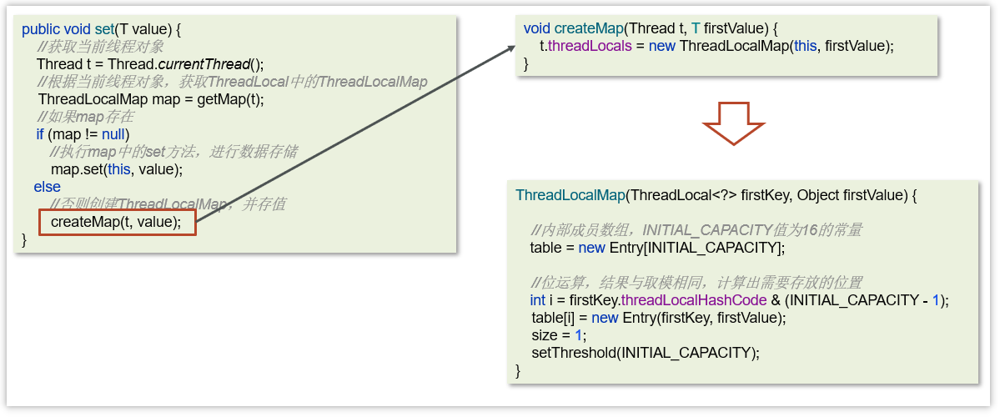
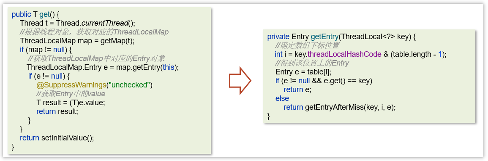

- [1. 如何创建线程池](#1-如何创建线程池)
- [2. (Executors创建)线程池的种类有哪些](#2-executors创建线程池的种类有哪些)
- [3. 为什么不建议用Executors创建线程池](#3-为什么不建议用executors创建线程池)
- [4. 说一下线程池的核心参数（线程池的执行原理知道嘛）](#4-说一下线程池的核心参数线程池的执行原理知道嘛)
- [5. ThreadPoolExecutor的4个构造函数](#5-threadpoolexecutor的4个构造函数)
- [6. ThreadPoolExecutor 添加任务（工作流程）](#6-threadpoolexecutor-添加任务工作流程)
- [7. 线程池的拒绝策略](#7-线程池的拒绝策略)
- [8. 线程池中有哪些常见的阻塞队列](#8-线程池中有哪些常见的阻塞队列)
- [9. ArrayBlockingQueue的LinkedBlockingQueue区别](#9-arrayblockingqueue的linkedblockingqueue区别)
- [10. 如何确定核心线程数](#10-如何确定核心线程数)
- [11. 线程池使用场景（你们项目哪里用到了多线程）](#11-线程池使用场景你们项目哪里用到了多线程)
- [14. 谈谈你对ThreadLocal的理解](#14-谈谈你对threadlocal的理解)
- [15. ThreadLocal的实现原理\&源码解析](#15-threadlocal的实现原理源码解析)
- [16. ThreadLocal-内存泄露问题](#16-threadlocal-内存泄露问题)

---

## 1. 如何创建线程池
- Executors静态方法获取线程池
- 手动创建 ThreadPoolExecutor

## 2. (Executors创建)线程池的种类有哪些

1. newFixedThreadPool 创建一个定长线程池，可控制线程最大并发数，超出的线程会在阻塞队列中等待。 
2. newCachedThreadPool创建一个可缓存线程池，如果线程池长度超过处理需要，可灵活回收空闲线程，若无可回收，则新建线程。 
3. newSingleThreadExecutor 创建一个单线程化的线程池，它只会用唯一的工作线程来执行任务，保证所有任务按照指定顺序(FIFO, LIFO, 优先级)执行。
4. newScheduledThreadPool 创建一个定长线程池，支持定时及周期性任务执行。 


```java
// 创建有上限的线程池
ExecutorService pool1 = Executors.newFixedThreadPool(3);
// 创建一个没有上限的线程池
ExecutorService pool2 = Executors.newCachedThreadPool();
// 单例模式
ExecutorService pool3 = Executors.newSingleThreadExecutor();            // Executor结尾
// 定时线程池
ScheduledExecutorService pool4 = Executors.newScheduledThreadPool(2);   // ScheduledExecutorService类型
pool4.schedule(thread, 2, TimeUnit.SECONDS);
```

[CreateThreadPool](../../codes/juc/src/main/java/create_thread/CreateThreadPool.java)


1. 创建使用固定线程数的线程池

   

   - 核心线程数与最大线程数一样，没有空闲线程

   - 阻塞队列是LinkedBlockingQueue，最大容量为Integer.MAX_VALUE

   - 适用场景：适用于任务量已知，相对耗时的任务

2. 可缓存线程池

   

   - 核心线程数为0，最大数量Integer.MAX_VALUE的空闲线程，60秒过期。

   - 阻塞队列为SynchronousQueue: 不存储元素的阻塞队列，每个插入操作都必须等待一个移出操作。

   - 适用场景：适合任务数比较密集，但每个任务执行时间较短的情况

3. 单线程化的线程池，它只会用唯一的工作线程来执行任 务，保证所有任务按照指定顺序(FIFO)执行

   

   - 只有1个核心线程数，没有空闲线程

   - 阻塞队列是LinkedBlockingQueue，最大容量为Integer.MAX_VALUE

   - 适用场景：适用于按照顺序执行的任务

4. 提供了“延迟”和“周期执行”功能的ThreadPoolExecutor。

   

   - 适用场景：有定时和延迟执行的任务

## 3. 为什么不建议用Executors创建线程池

主要原因是如果使用Executors创建线程池的话，

它允许的请求队列默认长度是nteger.MAX_VALUE，这样的话，有可能导致堆积大量的请求，从而导致OOM（内存溢出）。

所以，我们一般推荐使用ThreadPoolExecutor来创建线程池，这样可以明确规定线程池的参数，避免资源的耗尽。

## 4. 说一下线程池的核心参数（线程池的执行原理知道嘛）

ThreadPoolExecutor构造函数的7个参数

```java
public ThreadPoolExecutor(
    int corePoolSize,
    int maximumPoolSize,
    long keepAliveTime,
    TimeUnit unit,
    BlockingQueue<Runnable> workQueue,
    ThreadFactory threadFactory,
    RejectedExecutionHandler handler
)
    
corePoolSize：   核心线程的最大值。必须大于等于0.
maximumPoolSize：最大线程数 = (核心线程 + 空闲线程的最大数目)
                 必须大于0，maximumPoolSize >= corePoolSize
keepAliveTime：  空闲线程最大存活时间, 生存时间内没有新任务，此线程资源会释放
                 必须大于等于0
unit：           空闲线程的生存时间单位
workQueue：      阻塞队列。新来任务会加入到此队列排队，队列满会创建空闲线程执行任务
threadFactory：  创建线程工厂   
handler：        任务的拒绝策略 
```

- `corePoolSize` 核心线程数

- `maximumPoolSize` 最大线程数 = (核心线程 + 空闲线程的最大数目)

- `keepAliveTime` 空闲线程的生存时间。生存时间内没有新任务，此线程资源会释放

- `unit` 空闲线程的生存时间单位

- `workQueue` 当没有空闲的核心线程时，新来任务会加入到此队列排队，队列满会创建空闲线程执行任务

- `threadFactory` 线程工厂。用来可以定制线程对象的创建，例如设置线程名字、是否是守护线程等

- `handler` 拒绝策略。当超过线程最大数目且任务队列也满时，会触发拒绝策略

## 5. ThreadPoolExecutor的4个构造函数
- 全部7个参数
- 5个参数：默认线程工厂 `Executors.defaultThreadFactory()` 、默认拒绝策略 `new ThreadPoolExecutor.DiscardPolicy()`
- 6个参数：默认线程工厂
- 6个参数：默认拒绝策略

## 6. ThreadPoolExecutor 添加任务（工作流程）

1. 核心线程来执行
2. 存入工作队列
3. 如果线程数是否小于最大线程数，创建临时线程执行任务
4. 期间，如果核心或临时线程执行完成任务后，会去执行工作队列积存的任务。
5. 当超过 最大线程数 + 任务队列的容量 时，则走拒绝策略


1. 任务1、2、3提交了，被分配给核心线程。
2. 任务4、5、6提交了，被排入任务队列。
3. 任务7、8、9提交了，会被分配给临时线程。
4. 任务10，被拒绝。

## 7. 线程池的拒绝策略
`RejectedExecutionHandler`是jdk提供的一个任务拒绝策略接口，它下面存在4个子类。

1. **AbortPolicy**：直接丢弃任务 + 抛出异常，默认策略；

2. DiscardPolicy：直接丢弃任务；

3. DiscardOldestPolicy：丢弃阻塞队列中靠最前的任务，并执行当前任务；

4. CallerRunsPolicy：用调用者所在的线程来执行任务，即绕过线程池执行。

[线程池的四个拒绝策略](../../codes/juc/src/main/java/threadPool/Policy.java)
## 8. 线程池中有哪些常见的阻塞队列

比较常见的有4个，用的最多是ArrayBlockingQueue和LinkedBlockingQueue

1. `ArrayBlockingQueue`：基于数组结构的有界阻塞队列，FIFO。

2. `LinkedBlockingQueue`：基于链表结构的有界阻塞队列，FIFO。

3. `DelayedWorkQueue` ：是一个优先级队列，它可以保证每次出队的任务都是当前队列中执行时间最靠前的

4. `SynchronousQueue`：不存储元素的阻塞队列，每个插入操作都必须等待一个移出操作。

## 9. ArrayBlockingQueue的LinkedBlockingQueue区别

| **LinkedBlockingQueue**          | **ArrayBlockingQueue** |
| -------------------------------- | ---------------------- |
| 默认无界，支持有界               | 强制有界               |
| 底层是链表                       | 底层是数组             |
| 是懒惰的，创建节点的时候添加数据 | 提前初始化 Node  数组  |
| 入队会生成新 Node                | Node需要是提前创建好的 |
| 两把锁（头尾）                   | 一把锁                 |

左边是LinkedBlockingQueue加锁的方式，右边是ArrayBlockingQueue加锁的方式

- LinkedBlockingQueue读和写各有一把锁，性能相对较好
- ArrayBlockingQueue只有一把锁，读和写公用，性能相对于LinkedBlockingQueue差一些


## 10. 如何确定核心线程数
1. 高并发、任务执行时间短 -->（ CPU核数+1 ），减少线程上下文的切换

2. 并发不高、任务执行时间长

   - IO密集型的任务 --> (CPU核数 * 2 + 1)

   - 计算密集型任务 --> （ CPU核数+1 ）

3. 并发高、业务执行时间长，解决这种类型任务的关键不在于线程池而在于整体架构的设计，看看这些业务里面某些数据是否能做缓存是第一步，增加服务器是第二步，再设置线程池


根据任务的类型来区分：IO密集型任务（2N+1 ）和CPU密集型任务（N+1）
- IO密集型任务：一般来说：文件读写、DB读写、网络请求等
- CPU密集型任务：一般来说：计算型代码、Bitmap转换、Gson转换等


java代码查看CPU核数


## 11. 线程池使用场景（你们项目哪里用到了多线程）
CountDownLatch、Future

参考场景一：

es数据批量导入

在我们项目上线之前，我们需要把数据量的数据一次性的同步到es索引库中，但是当时的数据好像是1000万左右，一次性读取数据肯定不行（oom异常），如果分批执行的话，耗时也太久了。所以，当时我就想到可以使用线程池的方式导入，利用CountDownLatch+Future来控制，就能大大提升导入的时间。

参考场景二：

在我做那个xx电商网站的时候，里面有一个数据汇总的功能，在用户下单之后需要查询订单信息，也需要获得订单中的商品详细信息（可能是多个），还需要查看物流发货信息。因为它们三个对应的分别三个微服务，如果一个一个的操作的话，互相等待的时间比较长。所以，我当时就想到可以使用线程池，让多个线程同时处理，最终再汇总结果就可以了，当然里面需要用到Future来获取每个线程执行之后的结果才行

参考场景三：

《黑马头条》项目中使用的

我当时做了一个文章搜索的功能，用户输入关键字要搜索文章，同时需要保存用户的搜索记录（搜索历史），这块我设计的时候，为了不影响用户的正常搜索，我们采用的异步的方式进行保存的，为了提升性能，我们加入了线程池，也就说在调用异步方法的时候，直接从线程池中获取线程使用


## 14. 谈谈你对ThreadLocal的理解

ThreadLocal本质来说就是一个线程内部存储类，主要功能有两个：
- 第一个是可以实现资源对象的线程隔离，让每个线程各用各的资源对象，避免争用引发的线程安全问题
- 第二个是实现了线程内的资源共享

案例：使用JDBC操作数据库时，会将每一个线程的Connection放入各自的ThreadLocal中，从而保证每个线程都在各自的 Connection 上进行数据库的操作，避免A线程关闭了B线程的连接。


三个主要方法：

- set(value) 设置值

- get() 获取值

- remove() 清除值

```java
public class ThreadLocalTest {
    static ThreadLocal<String> threadLocal = new ThreadLocal<>();

    public static void main(String[] args) {
        new Thread(() -> {
            String name = Thread.currentThread().getName();
            threadLocal.set("itcast");
            print(name);
            System.out.println(name + "-after remove : " + threadLocal.get());
        }, "t1").start();
        new Thread(() -> {
            String name = Thread.currentThread().getName();
            threadLocal.set("itheima");
            print(name);
            System.out.println(name + "-after remove : " + threadLocal.get());
        }, "t2").start();
    }

    static void print(String str) {
        //打印当前线程中本地内存中本地变量的值
        System.out.println(str + " :" + threadLocal.get());
        //清除本地内存中的本地变量
        threadLocal.remove();
    }

}
```

## 15. ThreadLocal的实现原理&源码解析

在ThreadLocal内部维护了一个 ThreadLocalMap 类型的成员变量，用来存储资源对象。ThreadLocalMap中有一个属性table数组，这个是真正存储数据的位置。

- 当我们调用 set 方法，就是以 ThreadLocal 自己作为 key，资源对象作为 value，放入当前线程的 ThreadLocalMap 集合中

- 当调用 get 方法，就是以 ThreadLocal 自己作为 key，到当前线程中查找关联的资源值

- 当调用 remove 方法，就是以 ThreadLocal 自己作为 key，移除当前线程关联的资源值


**set方法**



**get方法/remove方法**



## 16. ThreadLocal-内存泄露问题

在ThreadLocalMap中的Entry对象继承了WeakReference**弱引用**。其中key为使用弱引用的ThreadLocal实例，

每一个Thread维护一个ThreadLocalMap，ThreadLocalMap 中的 key 被设计为弱引用，它是被动的被GC调用释放key，不过关键的是只有key可以得到内存释放，而value是一个强引用。value为线程变量的副本

在使用ThreadLocal 时都把它作为静态变量（即强引用），因此无法被动依靠 GC 回收，建议主动的remove 释放 key，这样就能避免内存溢出。


