- [1. 线程中并发锁](#1-线程中并发锁)
- [2. synchronized锁总结](#2-synchronized锁总结)
- [3. synchronized关键字的底层原理？](#3-synchronized关键字的底层原理)
- [4. monitor监视器](#4-monitor监视器)
- [5. 你了解过synchronized锁升级吗？](#5-你了解过synchronized锁升级吗)
- [6. 轻量级锁](#6-轻量级锁)
- [7. 偏向锁](#7-偏向锁)
- [8. CAS 你知道吗？](#8-cas-你知道吗)
- [9. CAS 底层实现](#9-cas-底层实现)
- [10. 乐观锁和悲观锁](#10-乐观锁和悲观锁)
- [11. 请谈谈你对 volatile 的理解](#11-请谈谈你对-volatile-的理解)
- [12. 什么是AQS？](#12-什么是aqs)
- [13. AQS工作机制](#13-aqs工作机制)
- [14. ReentrantLock](#14-reentrantlock)
- [15. ReentrantLock的实现原理](#15-reentrantlock的实现原理)
- [16. synchronized和Lock有什么区别 ?](#16-synchronized和lock有什么区别-)
- [17. 如何进行死锁诊断？](#17-如何进行死锁诊断)


---


## 1. 线程中并发锁

- synchronized锁
- ReentrantedLock锁

## 2. synchronized锁总结
synchronized锁：
- c++ 语言实现
- JDK 1.6后，引入锁升级：偏向、轻量、重量级
- 是悲观锁
- 是可重入锁。
- 是非公平锁。

PS：
- synchronized锁不是重量锁，偏向、轻量、重量级。monitor才是重量锁。

## 3. synchronized关键字的底层原理？

Synchronized对象锁采用**互斥**的方式，让同一时刻至多只有一个线程能持有对象锁，其它线程再想获取这个对象锁时就会**阻塞**住。

使用synchornized代码块时需要**指定一个对象**，所以synchornized也被称为对象锁。

synchornized的底层由monitor监视器实现的，monitor是jvm级别的对象，线程获得锁需要在该对象头的Mark Word中设置指向 Monitor 对象的指针

## 4. monitor监视器

- Monitor监视器是由jvm提供，c++语言实现。
- 在monitor内部有三个属性，分别是**owner、entrylist阻塞队列、waitset等待集合**。owner是关联的获得锁的线程，并且只能关联一个线程；entrylist关联的是处于阻塞状态的线程；waitset关联的是处于Waiting状态的线程
- Monitor实现的锁属于**重量级锁**。Monitor监视器是由jvm提供，jvm属于内核进程，性能比较低。里面涉及到了用户态和内核态的切换、进程的上下文切换。
- 对应字节码的指令是`monitorenter`和`monitorexit`


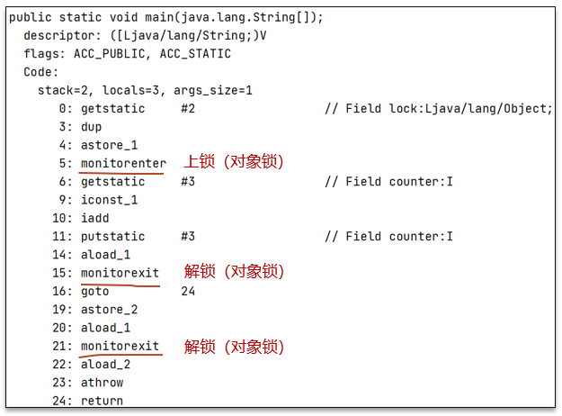

可以借助javap命令查看clsss的字节码查看moniter指令：
- `monitorenter` 上锁开始的地方
- `monitorexit` 解锁的地方
- 其中被monitorenter和monitorexit包围住的指令就是上锁的代码
- 有两个monitorexit的原因，第二个monitorexit是为了防止锁住的代码抛异常后不能及时释放锁


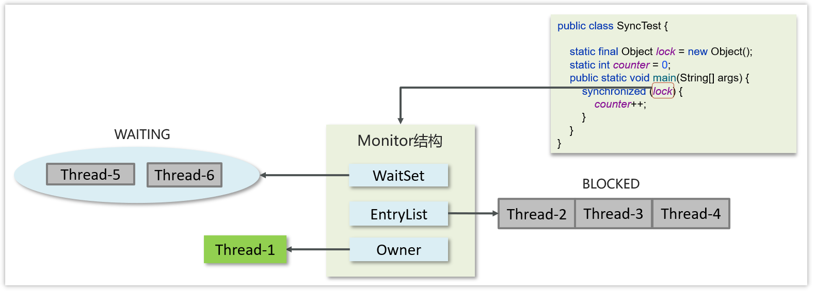


具体的流程：

- 代码进入synchorized代码块，先让lock对象的markword关联上monitor，然后判断Owner是否有线程持有。
  - 如果没有线程持有，则让当前线程持有，表示该线程获取锁成功
  - 如果有线程持有，则让当前线程进入阻塞队列进行阻塞。
- 如果Owner持有的线程已经释放了锁，在阻塞队列中的线程去竞争锁的持有权（非公平）
- 如果代码块中调用了wait()方法，则会进去等待集合中进行等待

## 5. 你了解过synchronized锁升级吗？

Java中的synchronized有偏向锁、轻量级锁、重量级锁三种形式。在JDK 1.6引入偏向锁和轻量级锁
- 偏向锁：在第一次获得锁时，会有一个CAS操作，之后该线程再获取锁，只需要判断mark  word中是否是自己的线程id即可，而不是开销相对较大的CAS命令 
- 轻量级锁：轻量级修改了markword的锁标志，相对重量级锁性能提升很多。每次修改都是CAS操作，保证原子性
- 重量级锁：底层使用的Monitor实现，里面涉及到了用户态和内核态的切换、进程的上下文切换，成本较高，性能比较低。

场景：
- 只有一个线程：偏向锁。
- 同步块中的代码都是不存在竞争的（不同的线程交替的执行同步块中的代码）：用轻量级锁就行。
- 多线程竞争锁：重量级锁。

**一旦锁发生了竞争，都会升级为重量级锁**

## 6. 轻量级锁

MarkWord

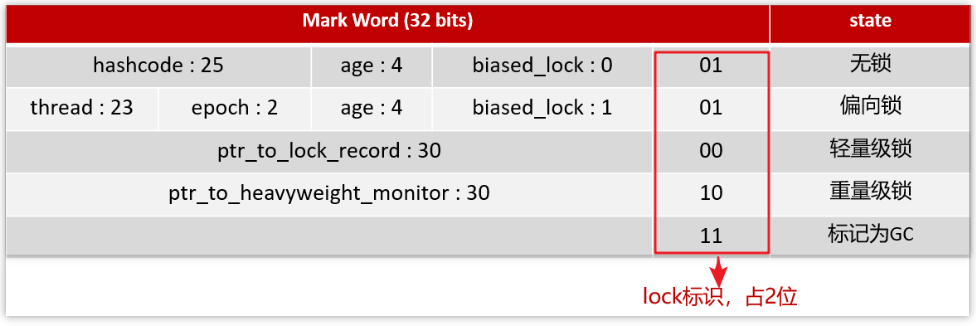


哈希码、GC 分代年龄、锁状态标志、
- 哈希码
- GC 分代年龄
- 偏向锁标识+ 锁状态标志：后三位是001表示无锁，后三位是101表示偏向锁，后两位是00表示轻量级锁，后两位是10表示重量级锁
- 持有偏向锁的线程ID
- epoch偏向时间戳
- ptr_to_lock_record：轻量级锁状态下，指向栈中锁记录的指针，占30位
- ptr_to_heavyweight_monitor：重量级锁状态下，指向对象监视器Monitor的指针，占30位

```java
static final Object obj = new Object();

public static void method1() {
    synchronized (obj) {
        // 同步块 A
        method2();
    }
}

public static void method2() {
    synchronized (obj) {
        // 同步块 B
    }
}
```

**加锁的流程**

1.在**线程栈**中创建一个**Lock Record**，将其obj字段指向锁对象。

2.通过CAS指令将Lock Record的地址存储在对象头的mark word中（数据进行交换），如果对象处于无锁状态则修改成功，代表该线程获得了轻量级锁。

3.如果是当前线程已经持有该锁了，代表这是一次锁重入。设置Lock Record第一部分为null，起到了一个重入计数器的作用。

4.如果CAS修改失败，说明发生了竞争，需要膨胀为重量级锁。

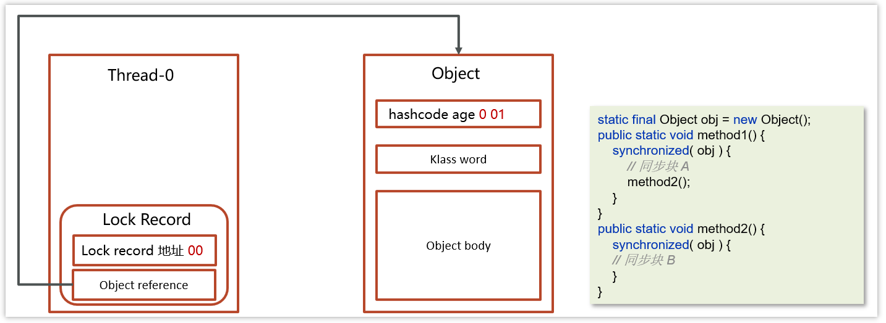

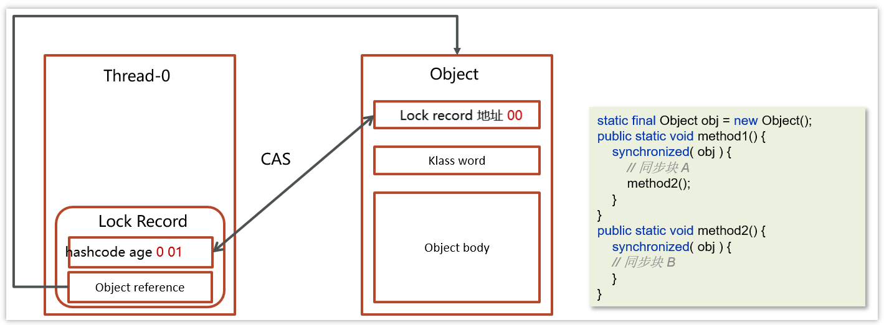


**解锁过程**

1.遍历线程栈,找到所有obj字段等于当前锁对象的Lock Record。

2.如果Lock Record的Mark Word为null，代表这是一次重入，将obj设置为null后continue。

3.如果Lock Record的 Mark Word不为null，则利用CAS指令将对象头的mark word恢复成为无锁状态。如果失败则膨胀为重量级锁。

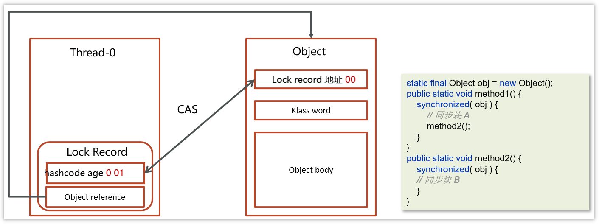

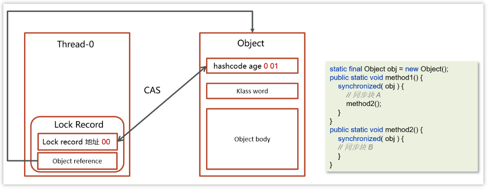

## 7. 偏向锁

轻量级锁在没有竞争时（就自己这个线程），每次重入仍然需要执行 CAS 操作。

Java 6 中引入了偏向锁来做进一步优化：只有第一次使用 CAS 将线程 ID 设置到对象的 Mark Word 头，之后发现这个线程 ID 是自己的就表示没有竞争，不用重新 CAS。以后只要不发生竞争，这个对象就归该线程所有

```java
static final Object obj = new Object();

public static void m1() {
    synchronized (obj) {
        // 同步块 A
        m2();
    }
}

public static void m2() {
    synchronized (obj) {
        // 同步块 B
        m3();
    }
}

public static void m3() {
    synchronized (obj) {

    }
}
```

**加锁的流程**

1.在线程栈中创建一个Lock Record，将其obj字段指向锁对象。

2.通过CAS指令将Lock Record的**线程id**存储在对象头的mark word中，同时也设置偏向锁的标识为101，如果对象处于无锁状态则修改成功，代表该线程获得了偏向锁。

3.如果是当前线程已经持有该锁了，代表这是一次锁重入。设置Lock Record第一部分为null，起到了一个重入计数器的作用。与轻量级锁不同的时，这里不会再次进行cas操作，只是判断对象头中的线程id是否是自己，因为缺少了cas操作，性能相对轻量级锁更好一些

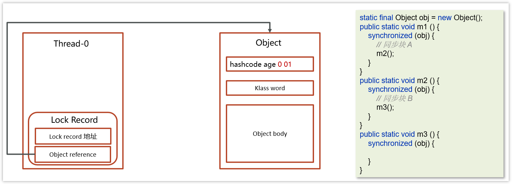


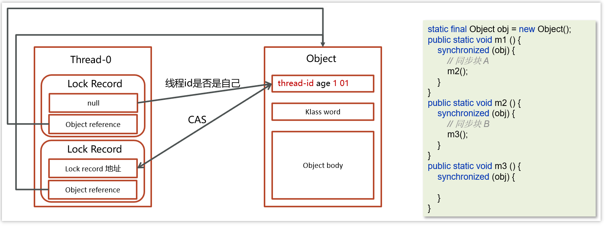

解锁流程参考轻量级锁

## 8. CAS 你知道吗？


Compare And Swap(比较再交换)，它体现的一种**乐观锁**的思想，在无锁情况下保证线程操作共享数据的原子性。
- CAS使用到的地方很多：AQS框架、AtomicXXX类
- 在操作共享变量的时候使用的自旋锁。因为没有加锁，所以线程不会陷入阻塞，**效率较高**。但如果竞争激烈，重试频繁发生，**效率会受影响**

当且仅当旧的预期值A和内存值V相同时，将内存值修改为B并返回true，否则什么都不做，并返回false。

如果CAS操作失败，通过自旋的方式等待并再次尝试————不断尝试获取共享内存V中最新的值，然后再在新的值的基础上进行更新操作，如果失败就继续尝试获取新的值，直到更新成功

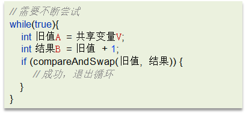

## 9. CAS 底层实现

CAS 底层依赖于一个 Unsafe 类的本地方法，来直接调用操作系统底层的 CAS 指令

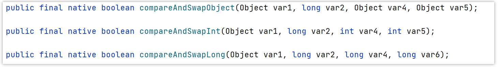

在java中比较常见使用有很多，比如ReentrantLock和Atomic开头的线程安全类，都调用了Unsafe中的方法

## 10. 乐观锁和悲观锁

- CAS 是基于乐观锁的思想：最乐观的估计，不怕别的线程来修改共享变量，就算改了也没关系，我吃亏点再重试呗。

- synchronized 是基于悲观锁的思想：最悲观的估计，得防着其它线程来修改共享变量，我上了锁你们都别想改，我改完了解开锁，你们才有机会。

## 11. 请谈谈你对 volatile 的理解


一旦一个共享变量（类的成员变量、类的静态成员变量）被volatile修饰之后，那么就具备了两层语义：
- 保证线程间的可见性

    原本一个线程修改了某个变量的值，其他线程是立即可见的，但因为JIT优化而不可见。volatile关键字会阻止JIT（即时编辑器）对代码的优化，**强制将修改的值立即写入主存**。

- 禁止进行指令重排序

    用 volatile 修饰共享变量会在读、写共享变量时加入不同的屏障，阻止其他读写操作越过屏障，从而达到阻止重排序的效果

[JIT优化](../../codes/juc/src/main/java/thread_basic/volatile_test/JIT.java)

PS：[尚硅谷说是可见性也是由内存屏障实现的](../juc/JMM.md#15-内存屏障)

## 12. 什么是AQS？

AbstractQueuedSynchronizer，是阻塞式锁和相关的同步器工具的框架，它是构建锁或者其他同步组件的基础框架

AQS常见的实现类

- ReentrantLock 阻塞式锁

- Semaphore 信号量

- CountDownLatch 倒计时锁

## 13. AQS工作机制

- 在AQS中维护了一个使用了**volatile修饰的state属性**来表示资源的状态，0表示无锁，1表示有锁
- 提供了基于 **FIFO 的双向的等待队列**
- **条件变量来实现等待、唤醒机制**，支持多个条件变量

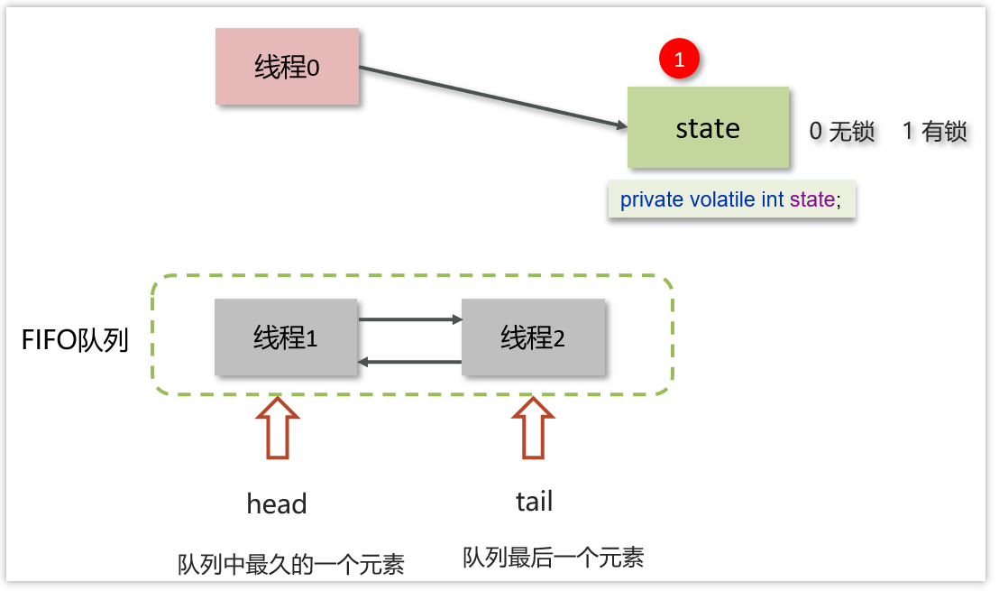

- 线程0来了以后，去尝试修改state属性，如果发现state属性是0，就修改state状态为1，表示线程0锁成功
- 线程1和线程2也会先尝试修改state属性，发现state的值已经是1了，有其他线程持有锁，它们都会到IFO队列中进行等待，

**如果多个线程共同去抢这个资源是如何保证原子性的呢？**

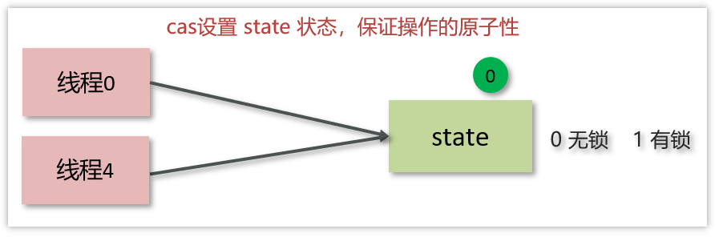

在去修改state状态的时候，使用的cas自旋锁来保证原子性，确保只能有一个线程修改成功，修改失败的线程将会进入FIFO队列中等待

**AQS是公平锁吗，还是非公平锁？**

看新来的：
- 新的线程与队列中的线程共同来抢资源，是非公平锁。比如ReentrantLock默认就是非公平锁

- 新的线程到队列中等待，只让队列中的head线程获取锁，是公平锁


## 14. ReentrantLock

ReentrantLock可重入锁，属于悲观锁：
- 与synchronized一样，都支持重入
- 可中断：`lock.lockInterruptibly();`
- 可以设置超时时间: `lock.tryLock()` / `lock.tryLock(200, TimeUnit.MILLISECONDS)`
- 支持多个条件变量: `Condition c = lock.newCondition();`, `c.await()`, `c.signal()/signalAll();`
- 支持公平锁和非公平锁: `new ReentrantLock(true)`公平。

[可重入、可中断、可以设置超时时间、支持多个条件变量、支持公平锁和非公平锁](../../codes/juc/src/main/java/ReentrantedLockLearn/Support.java)
## 15. ReentrantLock的实现原理

**AQS队列 + CAS**来实现。

查看ReentrantLock源码中的构造方法：

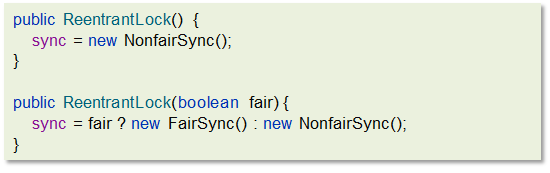

提供了两个构造方法
- 默认无参为非公平锁
- 如果使用带参数的构造函数，并且传的值为true，则是公平锁，false是非公平锁。


其中NonfairSync和FairSync这两个类父类都是Sync，而Sync的父类是AQS

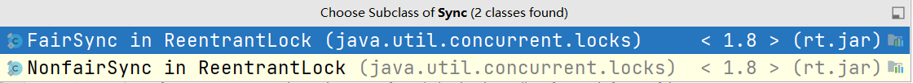

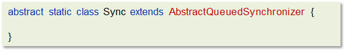

**工作流程**

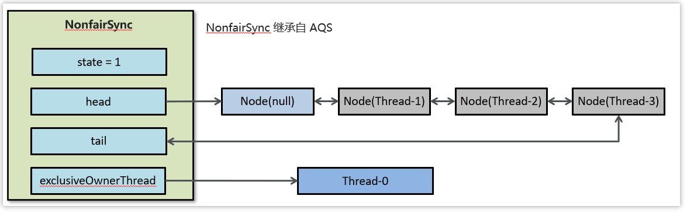

- 线程来抢锁后使用cas的方式修改state状态，修改状态成功为1，则让exclusiveOwnerThread属性指向当前线程，获取锁成功

- 假如修改状态失败，则会进入双向队列中等待，head指向双向队列头部，tail指向双向队列尾部

- 当exclusiveOwnerThread为null的时候，则会唤醒在双向队列中等待的线程

- 公平锁则体现在按照先后顺序获取锁，非公平体现在不在排队的线程也可以抢锁

## 16. synchronized和Lock有什么区别 ? 

* 语法
  * synchronized 是关键字，源码在 jvm 中，用 c++ 语言实现
  * Lock 是接口，源码由 jdk 提供，用 java 语言实现
  * 使用 synchronized 时，系统会监控锁的释放与否，退出同步代码块锁会自动释放，而使用 Lock 时，需要手动调用 unlock 方法释放锁
* 功能
  * synchronized更简洁，可以用在方法/代码块。lock只能写在代码里，但功能多，更灵活。
  * 二者均属于悲观锁、都具备基本的互斥、同步、锁重入功能
  * Lock 提供了许多 synchronized 不具备的功能，例如获取等待状态、公平锁、可打断、可超时、多条件变量
  * Lock 有适合不同场景的实现，如 ReentrantLock， ReentrantReadWriteLock
* 性能
  * 在没有竞争或竞争不激烈时，synchronized 做了很多优化，如偏向锁、轻量级锁，性能更好。
  * 在竞争激烈时（高并发），Lock 性能更好。

## 17. 如何进行死锁诊断？

我们可以先通过`jps`来查看当前java程序运行的进程id

然后通过`jstack`来查看这个进程id，就能展示出来死锁的问题，并且，可以定位代码的具体行号范围，我们再去找到对应的代码进行排查就行了。


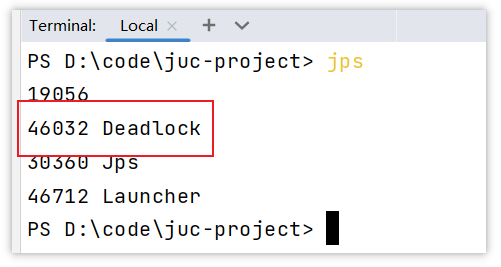

运行命令：`jstack -l 46032`

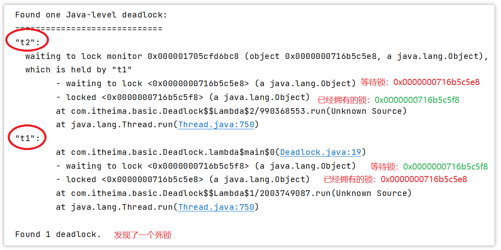

**其他解决工具，可视化工具**

- jconsole

用于对jvm的内存，线程，类 的监控，是一个基于 jmx 的 GUI 性能监控工具

打开方式：java 安装目录 bin目录下 直接启动 jconsole.exe 就行

- VisualVM：故障处理工具

能够监控线程，内存情况，查看方法的CPU时间和内存中的对 象，已被GC的对象，反向查看分配的堆栈

打开方式：java 安装目录 bin目录下 直接启动 jvisualvm.exe就行

---

[BiasedLockAndHashcode](/src/main/java/lock/BiasedLockAndHashcode.java)

[CreatedObjectIsBiasedLock](/src/main/java/lock/CreatedObjectIsBiasedLock.java)

[ForgetSynchronized](/src/main/java/lock/ForgetSynchronized.java)

[ObjectWithHashcodeUtilCall](/src/main/java/lock/ObjectWithHashcodeUtilCall.java)

[MainThreadIsSameAsNewThreadWhenSynchronized](/src/main/java/lock/MainThreadIsSameAsNewThreadWhenSynchronized.java)