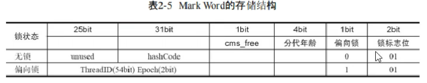

- [线程中并发锁](#线程中并发锁)
- [synchronized锁总结](#synchronized锁总结)
- [🚀synchronized关键字的底层原理？](#synchronized关键字的底层原理)
- [monitor监视器](#monitor监视器)
- [你了解过synchronized锁升级吗？](#你了解过synchronized锁升级吗)
- [轻量级锁](#轻量级锁)
- [偏向锁](#偏向锁)
- [CAS 你知道吗？](#cas-你知道吗)
- [CAS 底层实现](#cas-底层实现)
- [乐观锁和悲观锁](#乐观锁和悲观锁)
- [请谈谈你对 volatile 的理解](#请谈谈你对-volatile-的理解)
- [什么是AQS？](#什么是aqs)
- [AQS工作机制](#aqs工作机制)
- [ReentrantLock](#reentrantlock)
- [ReentrantLock的实现原理](#reentrantlock的实现原理)
- [🚀synchronized和Lock有什么区别 ?](#synchronized和lock有什么区别-)
- [如果控制某一个方法允许并发访问线程的数量？(Semaphore)](#如果控制某一个方法允许并发访问线程的数量semaphore)
- [CountDownLatch](#countdownlatch)
- [谈谈你对ThreadLocal的理解](#谈谈你对threadlocal的理解)
- [ThreadLocal的实现原理\&源码解析](#threadlocal的实现原理源码解析)
- [ThreadLocal-内存泄露问题](#threadlocal-内存泄露问题)
- [ThreadLocal细节](#threadlocal细节)
- [死锁例子](#死锁例子)
- [如何进行死锁诊断？](#如何进行死锁诊断)
- [🚀介绍下公平锁和非公平锁](#介绍下公平锁和非公平锁)
- [为什么会非公平锁高效？（有公平锁/非公平锁的设计？默认非公平锁）](#为什么会非公平锁高效有公平锁非公平锁的设计默认非公平锁)
- [什么时候用公平？什么时候用非公平？](#什么时候用公平什么时候用非公平)
- [🚀可重入锁是什么](#可重入锁是什么)
- [有哪些可重入锁](#有哪些可重入锁)
- [可重入锁的重入原理](#可重入锁的重入原理)
- [🚀死锁](#死锁)
- [🚀乐观锁和悲观锁](#乐观锁和悲观锁-1)
- [乐观锁和悲观锁的区别](#乐观锁和悲观锁的区别)
- [乐观锁和悲观锁的适用场景](#乐观锁和悲观锁的适用场景)
- [原子类AtomicReference](#原子类atomicreference)
- [对象实例 new Object()](#对象实例-new-object)
- [对象的大小](#对象的大小)


---


## 线程中并发锁

- synchronized锁
- ReentrantedLock锁

## synchronized锁总结
synchronized锁：
- c++ 语言实现
- JDK 6后，引入锁升级：偏向、轻量、重量级
- 是悲观锁
- 是可重入锁。
- 是非公平锁。

PS：
- 准确来说，synchronized锁不是重量锁，它分偏向、轻量、重量级，其中monitor才是重量锁。

## 🚀synchronized关键字的底层原理？

使用synchornized代码块时需要**指定一个对象**，所以synchornized也被称为对象锁。

Synchronized对象锁采用**互斥**的方式，让同一时刻至多只有一个线程能持有对象锁，其它线程再想获取这个对象锁时就会**阻塞**住。

synchornized的底层由monitor监视器实现的，monitor是jvm级别的对象，线程获得锁需要在该对象头的Mark Word中设置指向 Monitor 对象的指针

## monitor监视器

- Monitor监视器是由jvm提供，c++语言实现。
- 在monitor内部有三个属性，分别是**owner、entrylist阻塞队列、waitset等待集合**。owner是关联的获得锁的线程，并且只能关联一个线程；entrylist关联的是处于blocked状态的线程；waitset关联的是处于Waiting状态的线程
- Monitor实现的锁属于**重量级锁**。Monitor监视器是由jvm提供，jvm属于内核进程，性能比较低。里面涉及到了用户态和内核态的切换、进程的上下文切换。
- 对应字节码的指令是`monitorenter`和`monitorexit`


可以借助javap命令查看clsss的字节码查看moniter指令：
- `monitorenter` 上锁开始的地方
- `monitorexit` 解锁的地方
- 其中被monitorenter和monitorexit包围住的指令就是上锁的代码
- 有两个monitorexit的原因，第二个monitorexit是为了防止锁住的代码抛异常后不能及时释放锁


具体的流程：

- 代码进入synchorized代码块，先让lock对象的markword关联上monitor，然后判断Owner是否有线程持有。
  - 如果没有线程持有，则让当前线程持有，表示该线程获取锁成功
  - 如果有线程持有，则让当前线程进入阻塞队列进行阻塞。
- 如果Owner持有的线程已经释放了锁，在阻塞队列中的线程去竞争锁的持有权（非公平）
- 如果代码块中调用了wait()方法，则会进去等待集合中进行等待

## 你了解过synchronized锁升级吗？

Java中的synchronized有偏向锁、轻量级锁、重量级锁三种形式。在JDK 6引入偏向锁和轻量级锁
- 偏向锁：在第一次获得锁时，会有一个CAS操作，设置markword中thread字段为自己的线程id，之后该线程再获取锁，只需要判断markword中是否是自己的线程id即可，而不是开销相对较大的CAS命令 
- 轻量级锁：轻量级修改了markword的锁标志，每次修改都是CAS操作，保证原子性
- 重量级锁：底层使用的Monitor实现，里面涉及到了用户态和内核态的切换、进程的上下文切换，成本较高，性能比较低。

场景：
- 只有一个线程：偏向锁。
- 同步块中的代码都是不存在竞争的（不同的线程交替的执行同步块中的代码）：用轻量级锁就行。
- 多线程竞争锁：重量级锁。

**一旦锁发生了竞争，都会升级为重量级锁**

## 轻量级锁

MarkWord


锁状态标志：后三位是001表示无锁，后三位是101表示偏向锁，后两位是00表示轻量级锁，后两位是10表示重量级锁
- 无锁：哈希码、GC 分代年龄、锁状态标志
- 偏向锁：持有偏向锁的线程ID、epoch偏向时间戳、GC 分代年龄、锁状态标志
- 轻量级锁：指向栈中锁记录的指针、锁状态标志
- 重量级锁：指向对象监视器Monitor的指针、锁状态标志

```java
static final Object obj = new Object();

public static void method1() {
    synchronized (obj) {
        // 同步块 A
        method2();
    }
}

public static void method2() {
    synchronized (obj) {
        // 同步块 B
    }
}
```

**加锁的流程**

1.在**线程栈**中创建一个**Lock Record**，将其obj字段指向锁对象。

2.通过CAS指令将Lock Record的地址存储在对象头的mark word中（数据进行交换），如果对象处于无锁状态则修改成功，代表该线程获得了轻量级锁。

3.如果是当前线程已经持有该锁了，代表这是一次锁重入。设置Lock Record第一部分为null，起到了一个重入计数器的作用。

4.如果CAS修改失败，说明发生了竞争，需要膨胀为重量级锁。


**解锁过程**

1.遍历线程栈,找到所有obj字段等于当前锁对象的Lock Record。

2.如果Lock Record的Mark Word为null，代表这是一次重入，将obj设置为null后continue。

3.如果Lock Record的 Mark Word不为null，则利用CAS指令将对象头的mark word恢复成为无锁状态。如果失败则膨胀为重量级锁。


## 偏向锁

轻量级锁在没有竞争时（就自己这个线程），每次重入仍然需要执行 CAS 操作。

Java 6 中引入了偏向锁来做进一步优化：只有第一次使用 CAS 将线程 ID 设置到对象的 Mark Word 头，之后发现这个线程 ID 是自己的就表示没有竞争，不用重新 CAS。以后只要不发生竞争，这个对象就归该线程所有

```java
static final Object obj = new Object();

public static void m1() {
    synchronized (obj) {
        // 同步块 A
        m2();
    }
}

public static void m2() {
    synchronized (obj) {
        // 同步块 B
        m3();
    }
}

public static void m3() {
    synchronized (obj) {

    }
}
```

**加锁的流程**

1.在线程栈中创建一个Lock Record，将其obj字段指向锁对象。

2.通过CAS指令将Lock Record的**线程id**存储在对象头的mark word中，同时也设置偏向锁的标识为101，如果对象处于无锁状态则修改成功，代表该线程获得了偏向锁。

3.如果是当前线程已经持有该锁了，代表这是一次锁重入。设置Lock Record第一部分为null，起到了一个重入计数器的作用。与轻量级锁不同的时，这里不会再次进行cas操作，只是判断对象头中的线程id是否是自己，因为缺少了cas操作，性能相对轻量级锁更好一些


解锁流程参考轻量级锁

## CAS 你知道吗？

Compare And Swap(比较再交换)，它体现的一种**乐观锁**的思想，在无锁情况下保证线程操作共享数据的原子性。
- CAS使用到的地方很多：AQS框架、AtomicXXX类
- 在操作共享变量的时候使用的自旋锁。因为没有加锁，所以线程不会陷入阻塞，**效率较高**。但如果竞争激烈，重试频繁发生，**效率会受影响**

当且仅当旧的预期值A和内存值V相同时，将内存值修改为B并返回true，否则什么都不做，并返回false。

如果CAS操作失败，通过自旋的方式等待并再次尝试————不断尝试获取共享内存V中最新的值，然后再在新的值的基础上进行更新操作，如果失败就继续尝试获取新的值，直到更新成功


## CAS 底层实现

CAS 底层依赖于一个 Unsafe 类的本地方法，来直接调用操作系统底层的 CAS 指令


在java中比较常见使用有很多，比如ReentrantLock和Atomic开头的线程安全类，都调用了Unsafe中的方法

## 乐观锁和悲观锁

- CAS 是基于乐观锁的思想：最乐观的估计，不怕别的线程来修改共享变量，就算改了也没关系，我吃亏点再重试呗。

- synchronized 是基于悲观锁的思想：最悲观的估计，得防着其它线程来修改共享变量，我上了锁你们都别想改，我改完了解开锁，你们才有机会。

## 请谈谈你对 volatile 的理解


一旦一个共享变量（类的成员变量、类的静态成员变量）被volatile修饰之后，那么就具备了两层语义：
- 保证线程间的可见性

    原本一个线程修改了某个变量的值，其他线程是立即可见的，但因为JIT优化而不可见。volatile关键字会阻止JIT（即时编辑器）对代码的优化，**强制将修改的值立即写入主存**。

- 禁止进行指令重排序

    用 volatile 修饰共享变量会在读、写共享变量时加入不同的屏障，阻止其他读写操作越过屏障，从而达到阻止重排序的效果

[JIT优化](../../codes/juc/src/main/java/thread_basic/volatile_test/JIT.java)

PS：[尚硅谷说是可见性也是由内存屏障实现的](../juc/JMM.md#15-内存屏障)

## 什么是AQS？

AbstractQueuedSynchronizer，它是构建锁或者其他同步组件的基础框架

AQS常见的实现类

- ReentrantLock 可重入锁

- ReentrantReadWriteLock 可重入读写锁

- Semaphore 信号量

- CountDownLatch 倒计时锁

## AQS工作机制

- 在AQS中维护了一个使用了**volatile修饰的state属性**来表示资源的状态，0表示无锁，1表示有锁
- 提供了基于 **FIFO 的双向的等待队列**
- **条件变量来实现等待、唤醒机制**，支持多个条件变量


- 线程0来了以后，去尝试修改state属性，如果发现state属性是0，就修改state状态为1，表示线程0锁成功
- 线程1和线程2也会先尝试修改state属性，发现state的值已经是1了，有其他线程持有锁，它们都会到IFO队列中进行等待，

**如果多个线程共同去抢这个资源是如何保证原子性的呢？**


在去修改state状态的时候，使用的cas自旋锁来保证原子性，确保只能有一个线程修改成功，修改失败的线程将会进入FIFO队列中等待

**AQS是公平锁吗，还是非公平锁？**

看新来的：
- 新的线程与队列中的线程共同来抢资源，是非公平锁。比如ReentrantLock默认就是非公平锁

- 新的线程到队列中等待，只让队列中的head线程获取锁，是公平锁


## ReentrantLock

ReentrantLock可重入锁，属于悲观锁：
- 与synchronized一样，都支持重入
- 可中断：`lock.lockInterruptibly();`
- 可以设置超时时间: `lock.tryLock()` / `lock.tryLock(200, TimeUnit.MILLISECONDS)`
- 支持多个条件变量: `Condition c = lock.newCondition();`, `c.await()`, `c.signal()/signalAll();`
- 支持公平锁和非公平锁: `new ReentrantLock(true)`公平。

[可重入、可中断、可以设置超时时间、支持多个条件变量、支持公平锁和非公平锁](../../codes/juc/src/main/java/ReentrantedLockLearn/Support.java)
## ReentrantLock的实现原理

**AQS队列 + CAS**来实现。

查看ReentrantLock源码中的构造方法：


提供了两个构造方法
- 默认无参为非公平锁
- 如果使用带参数的构造函数，并且传的值为true，则是公平锁，false是非公平锁。


其中NonfairSync和FairSync这两个类父类都是Sync，而Sync的父类是AQS


**工作流程**


- 线程来抢锁后使用cas的方式修改state状态，修改状态成功为1，则让exclusiveOwnerThread属性指向当前线程，获取锁成功

- 假如修改状态失败，则会进入双向队列中等待，head指向双向队列头部，tail指向双向队列尾部

- 当exclusiveOwnerThread为null的时候，则会唤醒在双向队列中等待的线程

- 公平锁则体现在按照先后顺序获取锁，非公平体现在不在排队的线程也可以抢锁

## 🚀synchronized和Lock有什么区别 ? 

* 语法
  * synchronized 是关键字，源码在 jvm 中，用 c++ 语言实现
  * Lock 是接口，源码由 jdk 提供，用 java 语言实现
* 使用：
  * synchronized 使用简单时，退出同步代码块锁会自动释放，而使用 Lock 时，需要手动释放锁
* 功能
  * 二者均属于悲观锁、都具备基本的互斥、同步、锁重入功能。
  * synchronized属于非公平锁，lock可以选择公平或非公平。
  * lock还支持可打断、可超时、多条件变量
* 性能
  * 在没有竞争或竞争不激烈时，使用synchronized。因为它有个锁升级的优化。
  * 在竞争激烈时（高并发），Lock 性能更好。
  

## 如果控制某一个方法允许并发访问线程的数量？(Semaphore)

Semaphore类（信号量），我们可以通过其限制执行的线程数量，达到限流的效果。

- 当一个线程执行时先通过其方法进行获取许可操作acquire()，获取到许可的线程继续执行业务逻辑，信号量个数-1。当信号量个数变为负数时，再次请求的时候就会阻塞，直到其他线程释放了信号量。
- 当线程执行完成后进行释放许可操作release()，信号量个数+1

[Semaphore](../../codes/juc/src/main/java/other/SemaphoreTest.java)

## CountDownLatch

CountDownLatch（闭锁/倒计时锁）用来进行线程同步协作，等待所有线程完成倒计时（一个或者多个线程，等待其他多个线程完成某件事情之后才能执行）

- `new CountDownLatch(3)` 初始化计数值
- `countDown()` 用来让计数减一（非阻塞）
- `await()` 用来等待计数归零（阻塞）

## 谈谈你对ThreadLocal的理解

ThreadLocal本质来说就是一个线程内部存储类，主要功能有两个：
- 第一个是可以实现资源对象的线程隔离，让每个线程各用各的资源对象，避免争用引发的线程安全问题
- 第二个是实现了线程内的资源共享

案例：使用JDBC操作数据库时，会将每一个线程的Connection放入各自的ThreadLocal中，从而保证每个线程都在各自的 Connection 上进行数据库的操作，避免A线程关闭了B线程的连接。

三个主要方法：

- set(value) 设置值

- get() 获取值

- remove() 清除值

```java
public class ThreadLocalTest {
    static ThreadLocal<String> threadLocal = new ThreadLocal<>();

    public static void main(String[] args) {
        new Thread(() -> {
            String name = Thread.currentThread().getName();
            threadLocal.set("itcast");
            print(name);
            System.out.println(name + "-after remove : " + threadLocal.get());
        }, "t1").start();
        new Thread(() -> {
            String name = Thread.currentThread().getName();
            threadLocal.set("itheima");
            print(name);
            System.out.println(name + "-after remove : " + threadLocal.get());
        }, "t2").start();
    }

    static void print(String str) {
        //打印当前线程中本地内存中本地变量的值
        System.out.println(str + " :" + threadLocal.get());
        //清除本地内存中的本地变量
        threadLocal.remove();
    }

}
```

## ThreadLocal的实现原理&源码解析

ThreadLocal内定义了ThreadLocalMap 类型，这里真正存储数据。

ThreadLocalMap是一种hash map，通过Entry数组实现的，Entry用来存放数据，key是ThreadLocal对象自己，value是存储内容。

每个Thread线程对象有一个threadLocals成员变量，是ThreadLocalMap类型 `ThreadLocal.ThreadLocalMap threadLocals = null;`。

也就是说，我们并不用ThreadLocal对象的ThreadLocalMap存储数据，而是用每个Thread线程的ThreadLocalMap类型的threadLocals变量存储数据。
- 当线程没有存储线程局部变量时，它是null。
- 当调用 set 方法，就new一个ThreadLocalMap，赋值到当前线程的threadLocals变量上。获取到线程的ThreadLocalMap后，以 ThreadLocal对象 自己作为 key，添加或修改对应Entry对象的 value 变量为存储内容。
- 当调用 get 方法，就是以 ThreadLocal 自己作为 key，到当前线程中查找关联的资源值
- 当调用 remove 方法，就是以 ThreadLocal 自己作为 key，移除当前线程关联的资源值

PS：
- 线程存储的ThreadLocalMap对象的每个Entry就表示一个线程存储的不同的线程局部变量对象。
- Thread -> ThreadLocal.ThreadLocalMap -> Entry[] -> Entry -> key（threadLocal对象）和value


**set方法**


**get方法/remove方法**


## ThreadLocal-内存泄露问题

引用类型：
- 在ThreadLocalMap中的Entry对象继承了WeakReference**弱引用**。
- key为使用**弱引用**的ThreadLocal实例
- value是**强引用**

内存泄露问题：
- ThreadLocal + 线程池会出现内存泄漏：

    比如tomcat的工作线程是复用的线程池。不remove可能会出现内存泄漏

- 实际使用ThreadLocal 时都把它作为静态变量（即强引用），因此无法被动依靠 GC 回收，建议主动的remove 释放 key，这样就能避免内存溢出。

> key为什么被设计为弱引用？

每一个Thread维护一个ThreadLocalMap。线程局部变量的数据，需要通过ThreadLocal变量作为key，才能去ThreadLocalMap查。

当ThreadLocal变量失效时，那么ThreadLocalMap中的Entry就无法再被访问，需要被回收。


## ThreadLocal细节

- value是强引用，但当key为null时，内部会清除value。这就是清除泄漏的Entry（key为null）。
- ThreadLocalMap是使用线性探测解决hash冲突的（内部只维护Entey数组，没有链表）。所以，源码中在清除泄漏的Entry时，会进行rehash，防止数组的当前位置为null后，有hash冲突的Entry访问不到的问题。
- 只有set/remove/rehash这几个方法会清除泄漏的Entry，而get方法不会自己删除key为null的数据，

## 死锁例子

[synchronized和Lock](../../codes/juc/src/main/java/task/DeadLock.java)

## 如何进行死锁诊断？

我们可以先通过`jps`来查看当前java程序运行的进程id

然后通过`jstack`来查看这个进程id，就能展示出来死锁的问题，并且，可以定位代码的具体行号范围，我们再去找到对应的代码进行排查就行了。


运行命令：`jstack -l 46032`


**其他解决工具，可视化工具**

- jconsole

用于对jvm的内存，线程，类 的监控，是一个基于 jmx 的 GUI 性能监控工具

打开方式：java 安装目录 bin目录下 直接启动 jconsole.exe 就行

- VisualVM：故障处理工具

能够监控线程，内存情况，查看方法的CPU时间和内存中的对 象，已被GC的对象，反向查看分配的堆栈

打开方式：java 安装目录 bin目录下 直接启动 jvisualvm.exe就行

## 🚀介绍下公平锁和非公平锁

就是**按不按照多个线程的申请锁的顺序来获取锁**。按顺序，就是公平锁；不按照，就是非公平锁，有可能后申请的线程比先申请的线程优先获取锁。

非公平锁的优缺点。**高效**。但有可能造成**优先级反转**、**饥饿**的状态。

非公平锁，比如，synchronized锁，没有控制顺序，就是非公平顺序。再比如，ReentrantLock的公平锁与非公平锁，其公平锁是让排队的线程先抢锁，新来的线程去排队，非公平锁是，新来的线程和排队的线程一起枪锁。

## 为什么会非公平锁高效？（有公平锁/非公平锁的设计？默认非公平锁）

采用非公平锁，很可能是同一个线程释放锁再获取锁。

- 线程切换有开销。
    
采用公平锁在多个不同的线程之间切换而代价高，而非公平锁高效减少了线程切换的开销。

- 充分地利用CPU的时间片

恢复挂起的线程到真正锁的获取存在时间差，非公平锁能更充分地利用CPU的时间片，尽量减少CPU空间状态时间。

## 什么时候用公平？什么时候用非公平？

- 为了更高的吞吐量，选择非公平锁。因为节省了很多线程切换的时间，吞吐量自然就上去了
- 为了防止优先级反转、饥饿，选择公平锁。

## 🚀可重入锁是什么

同一线程在外层获取到锁后，在内层仍然可以获取锁，并不会因为外层获取而不释放锁而陷入死锁。可重复、可递归调用

同一线程中的多个流程可以获取同一把锁，持有这把同步锁可以再次进入，自己可以获取自己的内部锁。

## 有哪些可重入锁

- 隐式锁：synchronized修饰的方法或者代码块
- 显式锁（即Lock）：ReentrantLock

## 可重入锁的重入原理

每个锁对象`ObjectMonitor`拥有一个指向该锁的线程的指针`_owner`、一个锁计数器`_count`、一个锁重入次数`_recursions`。

当执行monitorenter加锁指令时，根据**锁计数器**判断锁对象是否被线程占用。
- 如果锁计数器为0，则直接占用，JVM会将锁对象的持有线程设为当前线程，执行加锁操作（计数器+1，锁重入次数+1）.
- 如果锁计数器不为0，那么就要判断持有线程是不是当前线程。如果是，执行加锁操作；如果不是，那么将当前线程放入阻塞队列，等待至锁被释放。
  
当执行monitorexit解锁指令时，执行解锁操作（锁计数器-1、锁重入次数-1），并根据锁重入次数判断当前线程是否被释放：
- 如果锁重入次数为0，则说明从多层重入中全部退出，置空`_onwer`，释放锁。
- 如果锁重入次数不为0，则说明还处于多层重入中，继续持有锁对象。


synchronized锁会自动获取释放锁，而ReentrantLock锁则需要注意释放`lock.unlock()`，否则其他线程无法获取到该锁。


PS：为什么需要一个锁计数器`_count`、一个锁重入次数`_recursions`？ReentrantLock锁则需要注意释放`lock.unlock()`，否则锁重入次数不为0，还是锁的计数器不为0？

## 🚀死锁

死锁是指两个或两个以上的线程在执行过程中，因抢夺资源而造成的一种**互相等待**的现象，若无外力干涉，则它们无法再继续推进下去。

产生原因：
- 系统资源不足
- 进程运行推进顺序不合适 
- 系统资源分配不当

怎么排查：
- jstack: `jps -l`获进程号，`jstack 进程号`
- jconsole

## 🚀乐观锁和悲观锁

- 悲观锁（认为线程安全问题一定发生）：添加同步锁，让线程串行执行
    
    例如，synchronized、lock
- 乐观锁（认为线程安全没问题，直接去操作）：不加锁，只在更新时判断是否有其他线程在修改。无修改，则更新；有修改，则重试或异常。
  - 版本号法、cas法（融合版本号，判断是否是原值）
  - 解决成功率低：where stock > 0

## 乐观锁和悲观锁的区别

## 乐观锁和悲观锁的适用场景

乐观锁读多，悲观锁写多

## 原子类AtomicReference

AtomicReference: do-while消耗CPU（尤其不适合高并发）、ABA问题。

解决ABA问题：AtomicStampedReference（+int版本号）、AtomicMarkableReference（+boolean标记位）


## 对象实例 new Object()

三部分：对象头、实例数据、对齐填充。

对象头 header 具体分为，对象标记 markword 和类元信息（类型指针）。如果是数组，还有数组长度length。

- 对象标记中记载了对象的哈希码、GC标记、分代年龄、偏向锁、同步锁标志位。
- 类元信息存储的是指向方法区中该对象的类元数据Klass的首地址。

## 对象的大小

对象头中，对象标记 markword 8字节，类元信息 8 字节（默认开启`-XX:+UseCompressedClassPointers`而4字节）。

对齐填充到 8 字节的整数倍。

`new Object()`的大小就是16字节。




---

[BiasedLockAndHashcode](/src/main/java/lock/BiasedLockAndHashcode.java)

[CreatedObjectIsBiasedLock](/src/main/java/lock/CreatedObjectIsBiasedLock.java)

[ForgetSynchronized](/src/main/java/lock/ForgetSynchronized.java)

[ObjectWithHashcodeUtilCall](/src/main/java/lock/ObjectWithHashcodeUtilCall.java)

[MainThreadIsSameAsNewThreadWhenSynchronized](/src/main/java/lock/MainThreadIsSameAsNewThreadWhenSynchronized.java)