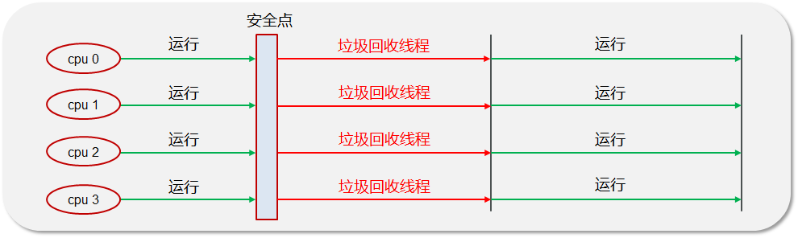
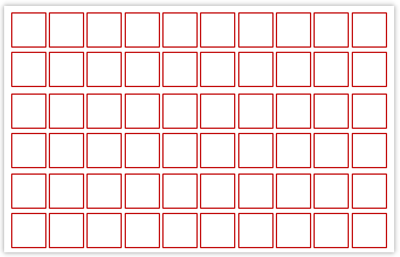
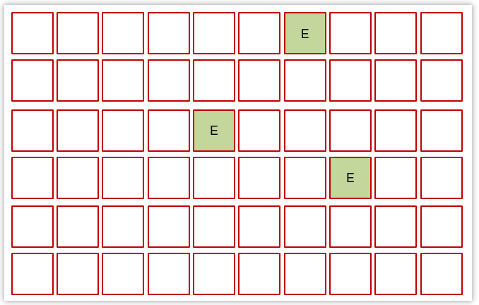
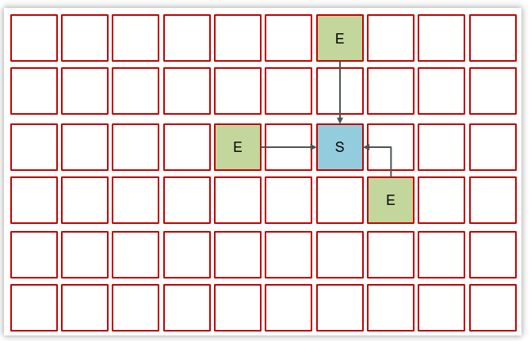
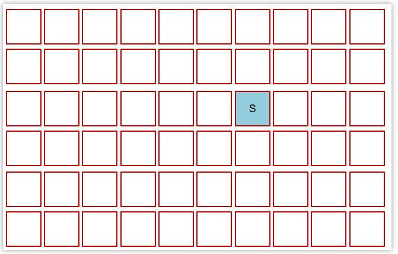
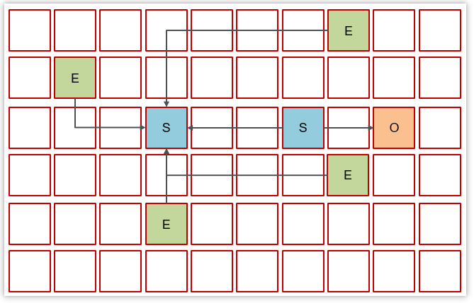
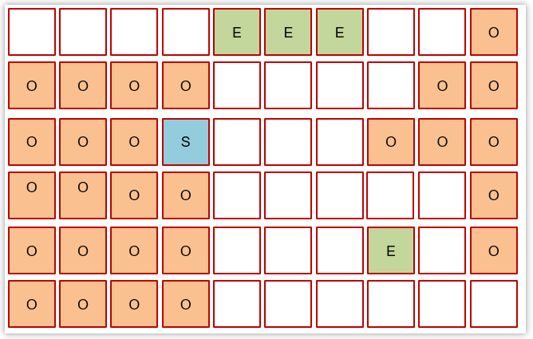
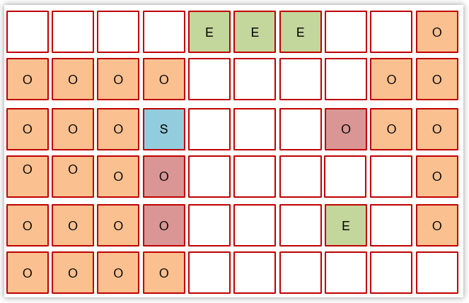
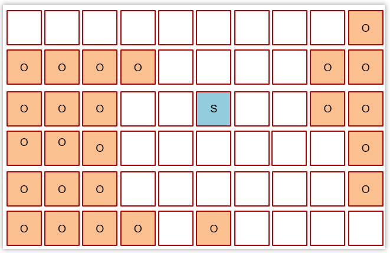
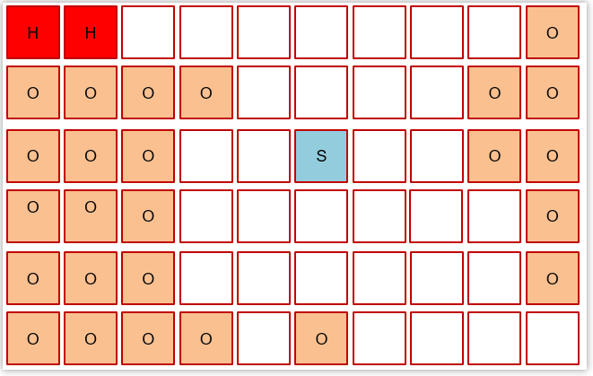

- [1. Java 中有哪几块内存需要进行垃圾回收](#1-java-中有哪几块内存需要进行垃圾回收)
- [2. 对象什么时候可以被垃圾器回收？如何定位哪些对象是垃圾](#2-对象什么时候可以被垃圾器回收如何定位哪些对象是垃圾)
- [3. 哪些对象当做根对象](#3-哪些对象当做根对象)
- [4. 有哪几种常见的引用类型？](#4-有哪几种常见的引用类型)
- [5. 有哪几种常见的垃圾回收算法？](#5-有哪几种常见的垃圾回收算法)
- [6. 分代回收](#6-分代回收)
- [7. Minor GC、Mixed GC、Full GC（Major GC）是什么](#7-minor-gcmixed-gcfull-gcmajor-gc是什么)
- [8. 常见的垃圾回收器有哪些？](#8-常见的垃圾回收器有哪些)
- [9. 串行垃圾回收器 Serial和Serial Old](#9-串行垃圾回收器-serial和serial-old)
- [10. 并行垃圾回收器 ParNew和Parallel Old](#10-并行垃圾回收器-parnew和parallel-old)
- [11. CMS（Concurrent Mark Sweep）](#11-cmsconcurrent-mark-sweep)
- [12. G1 垃圾回收器了解吗?](#12-g1-垃圾回收器了解吗)
    - [3.6.2. 3.6.2 Young Collection(年轻代垃圾回收)](#362-362-young-collection年轻代垃圾回收)
    - [3.6.3. 3.6.3 Young Collection + Concurrent Mark (年轻代垃圾回收+并发标记)](#363-363-young-collection--concurrent-mark-年轻代垃圾回收并发标记)
    - [3.6.4. 3.6.4 Mixed Collection (混合垃圾回收)](#364-364-mixed-collection-混合垃圾回收)
- [13. 什么时候会触发 GC?](#13-什么时候会触发-gc)
- [14. System.gc是minor gc还是full gc](#14-systemgc是minor-gc还是full-gc)
- [15. 调用System.gc后，Java内存会不会马上进行回收](#15-调用systemgc后java内存会不会马上进行回收)


---
## 1. Java 中有哪几块内存需要进行垃圾回收

线程不共享的程序计数器、虚拟机栈、本地方法栈，跟随线程的生命周期随着线程回收而回收，不需要进行垃圾回收。

线程共享的堆和方法区有垃圾回收：
- 堆：垃圾回收器会自动回收不再被引用的对象，释放内存空间。
- 方法区：【一般不需要回收，JSP 等技术才会通过回收类加载器去回收方法区中的类】【主要针对无用的类和常量进行回收】

## 2. 对象什么时候可以被垃圾器回收？如何定位哪些对象是垃圾

如果对象没有任何的引用指向它了，那么这个对象现在就是垃圾，如果定位了垃圾，则有可能会被垃圾回收器回收。

- 引用计数法
    
    一个对象被引用了一次，在当前的对象头上递增一次引用次数，如果这个对象的引用次数为0，代表这个对象可回收。
    
    循环引用问题
- 可达性分析：不能沿着GCRoot到达的对象就是垃圾。

    垃圾对象只是可回收对象，不会立马回收。当对象的finalize自救方法执行后（只能执行一次），对象还不可达，才能回收。

## 3. 哪些对象当做根对象

- 虚拟机栈（栈帧中的本地变量表）中引用的对象
- 方法区中类静态属性引用的对象
- 方法区中常量引用的对象
- 本地方法栈中 JNI（即一般说的 Native 方法）引用的对象
```java
/**
 * demo是栈帧中的本地变量，当 demo = null 时，由于此时 demo 充当了 GC Root 的作用，demo与原来指向的实例 new Demo() 断开了连接，对象被回收。
 */
public class Demo {
    public static  void main(String[] args) {
    	Demo demo = new Demo();
    	demo = null;
    }
}
```
```java
/**
 * 当栈帧中的本地变量 b = null 时，由于 b 原来指向的对象与 GC Root (变量 b) 断开了连接，所以 b 原来指向的对象会被回收，而由于我们给 a 赋值了变量的引用，a在此时是类静态属性引用，充当了 GC Root 的作用，它指向的对象依然存活!
 */
public class Demo {
    public static Demo a;
    public static  void main(String[] args) {
        Demo b = new Demo();
        b.a = new Demo();
        b = null;
    }
}
```
```java
/**
 * 常量 a 指向的对象并不会因为 demo 指向的对象被回收而回收
 */
public class Demo {
    
    public static final Demo a = new Demo();
    
    public static  void main(String[] args) {
        Demo demo = new Demo();
        demo = null;
    }
}
```

## 4. 有哪几种常见的引用类型？

五种
- 强引用：最常见的引用方式，如果一个对象具有强引用，即使**OOM也不会回收**
- 软引用：**内存不足时会回收**。场景，高速缓存、读取大量图片。
- 弱引用：**不管内存够不够，都会直接回收**
- 虚引用：和引用队列Reference Queue联合使用，通过虚引用知道对象被回收了。场景，直接内存
- 终结器引用：对象回收时可以自救，不建议使用

## 5. 有哪几种常见的垃圾回收算法？

-   **标记-清除算法（Mark and Sweep）**：
    -   标记阶段：从根对象出发，根据可达性分析算法标记可达对象.
    -   清除阶段：清除未被标记的不可达对象。
    -   缺点：效率低，标记和清除都需要遍历所有对象；产生内存碎片；分配速度慢，遍历空闲链表才能找到合适的空闲内存空间。
-   **标记-整理算法（Mark and Compact）**：
    -   标记阶段：与标记-清除算法相同，标记垃圾。
    -   整理阶段：将所有存活的对象向一端移动，然后清理掉不可达对象，从而消除内存碎片。与复制算法对比：复制算法标记完就复制，但标记整理算法得等把所有存活对象都标记完毕，再进行整理
    -   优点：不会产生内存碎片。
    -   缺点：效率最低
-   **复制算法（Copying）**：
    -   将原有的内存空间一分为二，每次只用其中的一块。将存活的对象从From**复制**到空的To，然后清空From。之后就交换两者角色。
    -   优点：不会产生内存碎片，对于频繁回收对象时效率高。
    -   缺点：每次只能一半的内存。
-   **分代回收算法（Generational Collection）**
-   **G1算法（Garbage-First）**

## 6. 分代回收

Java8时，新生代和老年代比例是1:2，年轻代使用复制算法，老年代使用标记清除或标记整理算法。

对于新生代，内部又被分为了三个区域。Eden区，S0区，S1区默认空间占用比例是8:1:1。

1. 新创的对象会被分配在Eden区，GC年龄0.
2. 当Eden区要满了时候，触发YoungGC。在Eden区存活的对象被移动到S0区，并且**当前对象的年龄会加1**，清空Eden区。
3. 当再一次触发YoungGC的时候，会把Eden和S0中的对象，移动到S1区中，这些对象的年龄会加1，清空Eden区和S0区。
4. 当再一次触发YoungGC的时候，会把Eden区中存活下来的对象和S1中的对象，移动到S0区中，这些对象的年龄会加1，清空Eden区和S1区。
5. 当幸存区对象GC年龄15岁时，那么这个对象就会进入到老年代中（大对象、内存不足后提前晋升）。
6. 当老年代满了之后，先尝试Minor GC回收新生代（可能是因为新生代内存不足而导致未满年龄提前晋升），不行再Full GC回收整个堆，再不行就OOM。

## 7. Minor GC、Mixed GC、Full GC（Major GC）是什么
- Minor GC : **新生代**的垃圾回收，暂停时间短
- Major GC : G1特有
    新生代+老年代（老年代空间不足时，会先尝试触发Minor GC。Minor GC之后空间还不足，则会触发Full GC）
    
    Major GC速度比较慢，暂停时间长
-  Full GC : 整个堆（**新生代 + 老年代**）垃圾回收，暂停时间长，**应尽力避免**

## 8. 常见的垃圾回收器有哪些？
- 串行垃圾回收器：Serial（新生代、复制）和Serial Old（老年代、标记整理）
    
    单线程回收，主要适用于单核CPU场景
- 并行垃圾回收器（JDK8默认）：ParNew（新生代、复制）和Parallel Old（老年代、标记整理）
    
    暂停时间较短，适用于大型互联网应用中与用户交互的部分
- 并发垃圾回收器：CMS（老年代、标记清除）
    
    吞吐量高，适用于后台进行大量数据操作
- G1垃圾回收器（JDK9默认）：适用于较大的堆，具有可控的暂停时间

## 9. 串行垃圾回收器 Serial和Serial Old


垃圾回收时，只有**一个垃圾回收线程**在工作，其他线程STW等待。

单线程回收，主要适用于单核CPU场景


## 10. 并行垃圾回收器 ParNew和Parallel Old

垃圾回收时，**多个垃圾回收线程**在工作，其他线程STW等待。



## 11. CMS（Concurrent Mark Sweep）
    
针对短STW。其最大特点是在进行垃圾回收时，应用仍然能正常运行。

三次标记：初始标记、并发标记、重新标记，才并发清理。


> 哪些阶段是STW

初始阶段和重新标记阶段。

## 12. G1 垃圾回收器了解吗?
G1（Garbage-First）（JDK9默认）。

G1垃圾回收器具有以下特点：

1.  **区域化内存管理**：划分成多个区域，每个区域都可以充当 eden，survivor，old， humongous（大对象可以用多个连续的区来存储）
    
2.  **分代回收**：年轻代（复制）和老年代（标记清除）
    
3.  **并发标记清除**：G1使用了并发标记（Concurrent Marking）来减少垃圾回收暂停时间。在标记阶段，G1通过并发标记线程来标记活动对象，而在应用程序运行的同时，也会继续标记操作。这样可以减少标记阶段对应用程序的影响。
    
4.  **整理内存**：G1使用了复制算法来清理内存，不再使用传统的压缩算法。在垃圾回收过程中，G1会选择一些区域进行垃圾回收，并将存活对象复制到其他区域中，从而实现内存的整理和碎片整理。
    
5.  **垃圾优先回收**：G1根据垃圾回收需求来选择优先回收的区域，以此来提高垃圾回收效率。它会优先选择包含垃圾最多的区域进行回收，从而最大程度地减少垃圾对象。
    

G1垃圾回收器在**大内存堆**上表现更加稳定和高效，尤其适用于需要低停顿时间和更加可控的垃圾回收的应用场景。

分成三个阶段：新生代回收、并发标记、混合回收

- 如果并发失败（即回收速度赶不上创建新对象速度），会触发 Full GC


#### 3.6.2. 3.6.2 Young Collection(年轻代垃圾回收)

- 初始时，所有区域都处于空闲状态

  

- 创建了一些对象，挑出一些空闲区域作为伊甸园区存储这些对象

  

- 当伊甸园需要垃圾回收时，挑出一个空闲区域作为幸存区，用复制算法复制存活对象，需要暂停用户线程

  

  

- 随着时间流逝，伊甸园的内存又有不足

- 将伊甸园以及之前幸存区中的存活对象，采用复制算法，复制到新的幸存区，其中较老对象晋升至老年代

  

  

  

  

#### 3.6.3. 3.6.3 Young Collection + Concurrent Mark (年轻代垃圾回收+并发标记) 

当老年代占用内存超过阈值(默认是45%)后，触发并发标记，这时无需暂停用户线程



- 并发标记之后，会有重新标记阶段解决漏标问题，此时需要暂停用户线程。

- 这些都完成后就知道了老年代有哪些存活对象，随后进入混合回收阶段。此时不会对所有老年代区域进行回收，而是根据暂停时间目标优先回收价值高（存活对象少）的区域（这也是 Gabage First 名称的由来）。

  

  

#### 3.6.4. 3.6.4 Mixed Collection (混合垃圾回收) 

复制完成，内存得到释放。进入下一轮的新生代回收、并发标记、混合回收



其中H叫做巨型对象，如果对象非常大，会开辟一块连续的空间存储巨型对象




## 13. 什么时候会触发 GC?

在Java虚拟机中，垃圾回收（GC）会在以下几种情况下触发：

1.  **系统内存不足**：JVM通过监视堆内存的使用情况来检测的。
    
2.  **调用System.gc()方法**：**不会立即触发**垃圾回收，只是向JVM建议。
    
3.  **长时间停顿**：当应用程序执行时间较长，而且没有进行垃圾回收时，Java虚拟机可能会为了避免堆内存耗尽而触发垃圾回收。这种情况下，垃圾回收通常会引起一段较长的停顿时间，称为Full GC。
    
4.  **Young Generation满**：在分代垃圾回收器中，当Young Generation区域满时，会触发一次Minor GC。这会导致Eden区和Survivor区的垃圾回收。
    
5.  **Old Generation满**：如果Old Generation区域满了，会触发一次Major GC（也称为Full GC）。这种情况下，**整个堆内存**都会进行垃圾回收。
    
6.  **永久代/元空间满**：对于HotSpot虚拟机，如果永久代（Java 7之前）或者元空间（Java 8及之后）满了，会触发一次垃圾回收。这种情况下，垃圾回收主要针对类的元数据和常量池。
    
## 14. System.gc是minor gc还是full gc

full gc


## 15. 调用System.gc后，Java内存会不会马上进行回收

不会，只有在justRanFinalization=true的时候才会执行
