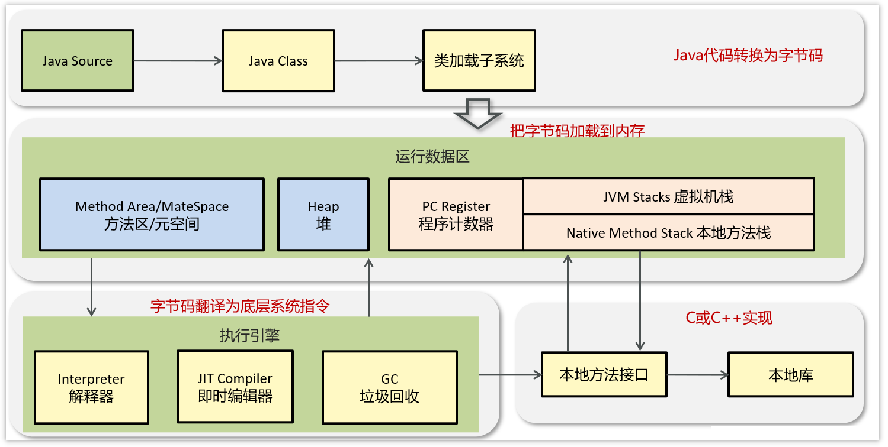

- [1. JVM是什么](#1-jvm是什么)
- [2. JVM由那些部分组成，运行流程是什么？](#2-jvm由那些部分组成运行流程是什么)
- [3. 字节码文件的组成：](#3-字节码文件的组成)

---
## 1. JVM是什么

JVM（Java Virtual Machine），Java虚拟机，职责是运行Java字节码文件。

好处：
- 解释和运行，即时编译JIT
- 自动内存管理，垃圾回收机制

##  2. JVM由那些部分组成，运行流程是什么？

- **类加载子系统**：核心组件类加载器，负责将**字节码**文件中的内容加载到内存中。
- **运行时数据区**：JVM管理的内存，创建出来的对象、类的信息等等内容都会放在这块区域中。
- **执行引擎**：包含了JIT即时编译器、解释器、垃圾回收器，执行引擎使用解释器将字节码指令**解释成机器码**，使用即时编译器优化性能，使用垃圾回收器回收不再使用的对象。
- **本地接口**：调用本地使用C/C++编译好的方法，本地方法在Java中声明时，都会带上native关键字，

运行流程：

（1）Java编译器（javac命令）将Java源代码**编译**成Java字节码文件，类加载器将字节码文件中的内容加载到内存中

（2）运行时数据区把字节码加载到内存中。

（3）执行引擎将字节码解释成机器码，再交由CPU执行去执行，调用C/C++的本地库接口来实现整个程序的功能。

## 3. 字节码文件的组成：
- 基础信息：魔数（文件头cafebabe）、主副版本号(JDK2后：主版本号 – 44)、访问标识(public final等等)、父类和接口信息
- 常量池： 保存了字符串常量、类或接口名、字段名，主要在字节码指令中使用
- 方法： 当前类或接口声明的方法信息，核心内容为方法的字节码指令
- 字段： 当前类或接口声明的字段信息
- 属性： 类的属性，比如源码的文件名、内部类的列表等

