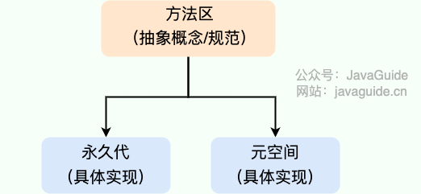
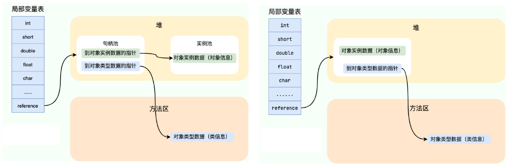
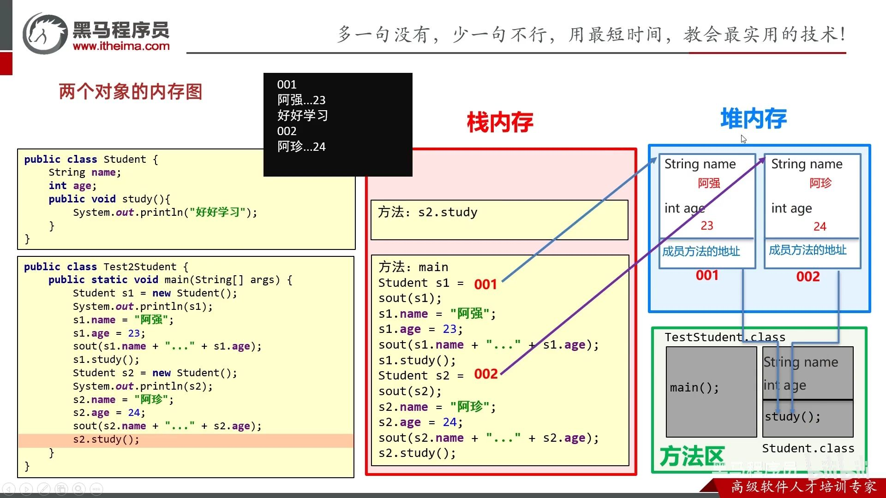

- [1. 内存分配](#1-内存分配)
- [2. 程序计数器PC](#2-程序计数器pc)
- [3. 本地方法栈和虚拟机栈](#3-本地方法栈和虚拟机栈)
- [4. 堆](#4-堆)
  - [4.1. JDK版本](#41-jdk版本)
    - [4.1.1. 为什么要将永久代 替换为元空间 呢?](#411-为什么要将永久代-替换为元空间-呢)
    - [4.1.2. 为什么字符串常量池被移出永久代](#412-为什么字符串常量池被移出永久代)
  - [4.2. 方法区和永久代以及元空间是什么关系呢？](#42-方法区和永久代以及元空间是什么关系呢)
  - [4.3. OutOfMemoryError：](#43-outofmemoryerror)
- [5. 方法区](#5-方法区)
  - [5.1. 字符串常量池](#51-字符串常量池)
  - [5.2. 运行时常量池](#52-运行时常量池)
- [6. 直接内存](#6-直接内存)
- [7. 实战串起来](#7-实战串起来)
  - [7.1. Java 对象的创建过程](#71-java-对象的创建过程)
    - [7.1.1. 内存分配的两种方式](#711-内存分配的两种方式)
    - [7.1.2. 内存分配并发问题](#712-内存分配并发问题)
    - [7.1.3. 对象的内存布局](#713-对象的内存布局)
  - [7.2. 对象访问](#72-对象访问)
  - [7.3. 其他](#73-其他)

---
## 1. 内存分配

线程私有：生命周期随着线程的创建而创建，随着线程的结束而死亡
- 虚拟机栈
- 本地方法栈
- 程序计数器PC

线程共享：
- 堆
- 方法区/元空间
- 直接内存

运行时数据区域不包括本地内存：
- 直接内存
- 1.8 存在本地内存中的元空间（1.7的方法区是在堆中的永久代，属于运行时数据区域）
## 2. 程序计数器PC

线程私有的
1. 当前线程执行
    用作当前线程所执行的字节码的行号指示器。

    字节码解释器工作时，通过改变程序计数器的值来依次读取下一条需要执行的指令，从而实现代码的流程控制，顺序执行、分支、循环、跳转、异常处理等。

2. 多线程切换
   
    在多线程的情况下，程序计数器用于记录当前线程执行的位置，从而当线程被切换回来的时候能够恢复到上次的执行位置，故而各线程之间计数器互不影响，独立存储。

3. 程序计数器是唯一一个不会出现 OutOfMemoryError 的内存区域，它的生命周期随着线程的创建而创建，随着线程的结束而死亡。

## 3. 本地方法栈和虚拟机栈

线程私有的

1. 本地方法栈和虚拟机栈都是为了虚拟机执行Java方法而服务，具体分别是Native本地方法和其他方法。HotSpot虚拟机中本地方法栈和虚拟机栈合二为一。

2. 方法调用时创建栈帧。

    栈由一个个栈帧组成，每一次方法调用都会有一个对应的栈帧被压入栈中，每一个方法调用结束后，都会有一个栈帧被弹出。

    每个栈帧中都拥有：方法返回地址、局部变量表、操作数栈、动态链接、。

    - 局部变量表

        存放了编译期可知的各种数据类型（boolean、byte、char、short、int、float、long、double）、对象引用（reference 类型，句柄或直接指针）
    - 操作数栈

        存放方法执行过程中产生的临时变量、中间计算结果。
    - 动态链接

        存储调用其他方法的引用。方法区中**运行时常量池**中存储着方法引用的符号引用。动态链接的作用就是为了将符号引用转换为方法在内存地址的直接引用。

3. 方法返回会出栈。
    
    方法有两种返回方式，一种是 return 语句正常返回，一种是抛出异常。
    
    无论方法正常完成还是异常完成都算作方法结束，都会导致栈帧被弹出。

4. 抛出错误

    - StackOverFlowError： 若栈的内存大小不允许动态扩展，那么当线程请求栈的深度超过当前 Java 虚拟机栈的最大深度的时候，抛出。
    
    - OutOfMemoryError： 如果栈的内存大小可以动态扩展， 如果虚拟机在动态扩展栈时无法申请到足够的内存空间，则抛出。HotSpot中虚拟机栈不可用动态扩展。
  
## 4. 堆

堆是所有线程共享的一块内存区域，在虚拟机启动时创建。

堆的唯一目的就是存放对象实例，几乎所有的对象实例以及数组都在这里分配内存。

堆是垃圾收集器管理的主要区域，因此也被称作 GC 堆。为了更好地回收内存、更快地分配内存，从此角度可以被分为
- 新生代：Eden伊甸园、Survivor幸存者（S0和S1两块）
- 老年代：Old
- 永久代：Permanent

1. 大部分情况，对象都会采用TLAB方式而在 Eden 区域分配内存，并在对象头中记录对象的GC分代年龄。
2. 在一次新生代垃圾回收后，如果对象还存活，则会进入Survivor幸存者中的 S0 或 S1，并且对象的年龄还会加 1(Eden 区->Survivor 区后对象的初始年龄变为 1)3. 当它的年龄增加到一定程度（默认为 15 岁，可以通过参数 -XX:MaxTenuringThreshold 来设置），就会被晋升到老年代中。

### 4.1. JDK版本
- 1.7 字符串常量池和静态变量
    
    JDK1.7 之前，字符串常量池存放在永久代。JDK1.7 字符串常量池和静态变量从永久代移动到了堆中。

- 1.8 元空间
  
  JDK1.8 采用在本地内存中的元空间实现方法区，废弃在堆中的永久代实现，并把JDK1.7中永久代剩下的东西都移动元空间中。

#### 4.1.1. 为什么要将永久代 替换为元空间 呢?
- GC
    
    永久代的 GC 回收效率太低，只有在整堆收集 (Full GC)的时候才会被执行 GC
- 溢出

    整个永久代有一个 JVM 本身设置的固定大小上限，无法进行调整，而元空间使用的是本地内存，受本机可用内存的限制，虽然元空间仍旧可能溢出，但是比原来出现的几率会更小。
- 加载类
    
    元空间里面存放的是类的元数据，由系统的实际可用空间来控制，这样能加载的类就更多了
#### 4.1.2. 为什么字符串常量池被移出永久代

永久代的 GC 回收效率太低，只有在整堆收集 (Full GC)的时候才会被执行 GC。Java 程序中通常会有大量的被创建的字符串等待回收，将字符串常量池放到堆中，能够更高效及时地回收字符串内存。
### 4.2. 方法区和永久代以及元空间是什么关系呢？
方法区是抽象概念。

在 HotSpot中，永久代和元空间都是方法区的具体实现。

JDK 1.8 之前的永久代是堆中的区域。JDK 1.8 及以后，永久代替换为元空间，元空间使用的是本地内存。

### 4.3. OutOfMemoryError：
- 虚拟机栈动态扩展失败
- 堆
  - OutOfMemoryError: GC Overhead Limit Exceeded：
    
    当 JVM 花太多时间执行垃圾回收并且只能回收很少的堆空间时，就会发生此错误。
  - OutOfMemoryError: Java heap space :
    
    假如在创建新的对象时, 堆内存中的空间不足以存放新创建的对象, 就会引发此错误。(和配置的最大堆内存有关，且受制于物理内存大小。最大堆内存可通过-Xmx参数配置，若没有特别配置，将会使用默认值，详见：Default Java 8 max heap sizeopen in new window)
  - OutOfMemoryError: MetaSpace 当元空间溢出时
  - OutOfMemoryError: PermGen 永久代溢出
- 直接内存

## 5. 方法区

各个线程共享。

存储class文件：当虚拟机要使用一个类时，它需要读取、解析 Class 文件、储存信息存入到方法区。

class文件内容：
- 类的版本、字段（成员变量、类变量）、方法（成员方法、类方法）、接口
- 常量池表：存放编译期生成的各种字面量（Literal）和符号引用（Symbolic Reference）。常量池表会在类加载后存放到方法区的运行时常量池中。

    字面量:
    - 源代码中的固定值的表示法，即通过字面我们就能知道其值的含义。
    - 字面量包括整数、浮点数和**字符串字面量**。

    符号引用:
    - 常见的类符号引用 class references、方法符号引用 method references、字段符号引用、接口方法符号。
- 常量、静态变量
- 即时编译器编译后的代码缓存等数据

### 5.1. 字符串常量池

JDK1.7 之前，字符串常量池存放在永久代。JDK1.7 字符串常量池和静态变量从永久代移动了 Java 堆中。

### 5.2. 运行时常量池

JDK1.8 之前，运行时常量池存放在永久代的方法区实现。JDK1.8 从永久代移动到了元空间中。

常量池表会在类加载后存放到方法区的运行时常量池中。

既然运行时常量池是方法区的一部分，自然受到方法区内存的限制，当常量池无法再申请到内存时会抛出 OutOfMemoryError 错误。

## 6. 直接内存

直接内存并不是虚拟机运行时数据区的一部分，也不是虚拟机规范中定义的内存区域，而是通过 JNI 的方式在本地内存上分配的。

这些内存直接受操作系统管理（而不是虚拟机），这样做的结果就是能够在一定程度上减少垃圾回收对应用程序造成的影响

也可能导致 OutOfMemoryError 错误出现。

## 7. 实战串起来

### 7.1. Java 对象的创建过程

1. 类加载检查

    看到`new`要创建对象。

    首先将去检查这个指令的参数是否能在常量池中定位到这个类的符号引用，并且检查这个符号引用代表的类是否已被加载过、解析和初始化过。
    
    如果没有，那必须先执行相应的类加载过程……。

2. 分配内存

    为新对象分配内存。
    
    对象所需的内存大小在类加载完成后便可确定，为对象分配空间的任务等同于把一块确定大小的内存从 Java 堆中划分出来。分配方式有 “指针碰撞” 和 “空闲列表” 两种……
3. 初始化零值

    内存分配完成后，虚拟机需要将分配到的内存空间都初始化为零值（不包括对象头）。
    
    这一步操作保证了对象的实例字段在 Java 代码中可以不赋初始值就直接使用，程序能访问到这些字段的数据类型所对应的零值。
4. 设置对象头

    初始化零值完成之后，虚拟机要对对象进行必要的设置，例如这个对象是哪个类的实例、如何才能找到类的元数据信息、对象的哈希码、对象的 GC 分代年龄等信息。 这些信息存放在对象头中。 另外，根据虚拟机当前运行状态的不同，如是否启用偏向锁等，对象头会有不同的设置方式。
5. 执行init方法

    在上面工作都完成之后，从虚拟机的视角来看，一个新的对象已经产生了。
    
    但从 Java 程序的视角来看，对象创建才刚开始，<init> 方法还没有执行，所有的字段都还为零。所以一般来说，执行 new 指令之后会接着执行 <init> 方法，把对象按照程序员的意愿进行初始化，这样一个真正可用的对象才算完全产生出来。
#### 7.1.1. 内存分配的两种方式

选择哪种分配方式由 Java 堆是否规整决定，而 Java 堆是否规整又取决于 GC 收集器的算法是"标记-清除"，还是"标记-整理"（也称作"标记-压缩"）：
- 空闲列表： 堆内存不规整的情况下。
    
    原理：虚拟机会维护一个列表，该列表中会记录哪些内存块是可用的，在分配的时候，找一块儿足够大的内存块儿来划分给对象实例，最后更新列表记录。
    
    使用该分配方式的 GC 收集器：CMS
- 指针碰撞： 堆内存规整（即没有内存碎片）的情况下。
    
    原理：用过的内存全部整合到一边，没有用过的内存放在另一边，中间有一个分界指针，只需要向着没用过的内存方向将该指针移动对象内存大小位置即可。
    
    使用该分配方式的 GC 收集器：Serial, ParNew

#### 7.1.2. 内存分配并发问题

创建对象是很频繁的事情，作为虚拟机来说，必须要保证线程是安全的。
- TLAB：
    
    为每一个线程预先在 Eden 区分配一块儿内存，JVM 在给线程中的对象分配内存时，首先在 TLAB 分配，当对象大于 TLAB 中的剩余内存或 TLAB 的内存已用尽时，再采用CAS进行内存分配
- CAS+失败重试： 
  
    CAS 是乐观锁的一种实现方式。所谓乐观锁就是，每次不加锁而是假设没有冲突而去完成某项操作，如果因为冲突失败就重试，直到成功为止。
    
    虚拟机采用 CAS 配上失败重试的方式保证更新操作的原子性。

#### 7.1.3. 对象的内存布局
- 对象头。由两部分组成：
    - 用于存储对象自身的运行时数据
        
        哈希码、GC 分代年龄、锁状态标志等
    - 类型指针(堆中)
        
        对象的类型指针，指向方法区中对应的对象类型信息。虚拟机通过类型指针来确定这个对象是哪个类的实例。
- 实例数据(堆中)

    对象真正存储的有效信息，也是在程序中所定义的各种类型的字段内容。
- 对齐填充

    对象头部分正好是 8 字节的倍数，所以只当对象的实例数据部分没有对齐 8 字节的整数倍时，就需要通过对齐填充来补全。

### 7.2. 对象访问

通过栈上的局部变量表中的 reference 数据，就可以访问堆上的具体对象。

- 句柄

    如果使用句柄的话，那么 Java 堆中将会划分出句柄池来存储句柄，实例池来存储对象实例数据。
    
    reference 中存储的就是对象的句柄地址，而句柄中有两个指针，分别指向了堆中实例池的对象实例数据、方法区中的对象类型信息。

- 直接指针

    reference 中存储的直接就是对象的地址，里面是对象的实例数据和指向方法区中对象类型信息的指针。
### 7.3. 其他

当方法出栈后，方法中在栈里的变量也都出栈了。

 方法调用方法。

数组new的部分在堆中。

方法区详细：

- 加载 `.class` 字节码文件，并临时存储class文件内的成员变量、成员方法、类方法等。这些临时存储的东西，到时会被放入栈内存中。

- 元空间负责加载字节码文件

[🚩面向对象-07-三种情况的对象内存图 P87 - 14:04](https://www.bilibili.com/video/BV17F411T7Ao?p=87&t=843)

[🚩面向对象-07-三种情况的对象内存图 P87 - 21:38](https://www.bilibili.com/video/BV17F411T7Ao?p=87&t=1298)

[🚩面向对象-07-三种情况的对象内存图 P87 - 28:28](https://www.bilibili.com/video/BV17F411T7Ao?p=87&t=1708)

