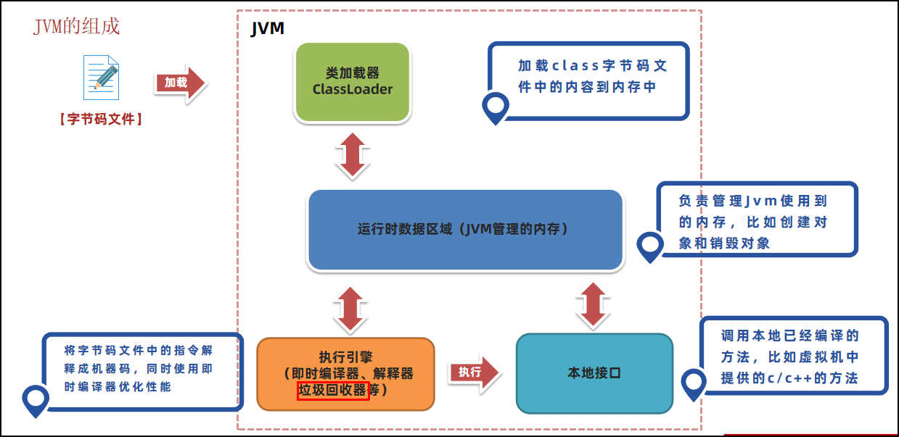

## JVM

JVM（Java Virtual Machine），Java虚拟机，职责是运行Java字节码文件。

Java源代码执行流程如下：
1. 编写Java源代码文件。
2. Java编译器（javac命令）将源代码**编译**成Java字节码文件。
3. JVM实时地**解释**并运行Java字节码文件成机器码。

JVM功能：解释和运行、内存管理、即时编译JIT

## JVM的组成


- 类加载子系统：核心组件类加载器，负责将字节码文件中的内容加载到内存中。
- 运行时数据区：JVM管理的内存，创建出来的对象、类的信息等等内容都会放在这块区域中。
- 执行引擎：包含了即时编译器、解释器、垃圾回收器，执行引擎使用解释器将字节码指令解释成机器码，使用即时编译器优化性能，使用垃圾回收器回收不再使用的对象。
- 本地接口：调用本地使用C/C++编译好的方法，本地方法在Java中声明时，都会带上native关键字，如下图所示。


## 字节码文件的组成：
- 基础信息：魔数（文件头cafebabe）、主副版本号(JDK2后：主版本号 – 44)、访问标识(public final等等)、父类和接口信息
- 常量池： 保存了字符串常量、类或接口名、字段名，主要在字节码指令中使用
- 方法： 当前类或接口声明的方法信息，核心内容为方法的字节码指令
- 字段： 当前类或接口声明的字段信息
- 属性： 类的属性，比如源码的文件名、内部类的列表等

## 局部变量表

存放方法中的局部变量

先是方法的参数、再是方法中定义的局部变量


### i++和++i

`i=i++`：先存栈，再更新，赋值栈中老值覆盖更新新值。
```java
int i = 0;
i = i++;

// iconst_0     
// istore_1
// iload_1      将局部变量表的i存入操作数栈
// iinc 1 by 1  局部变量表的i+1为1
// istore_1     操作数栈的i老值0覆盖局部变量表的i值1
// return
```
自增和存入操作数的临时值顺序变了：先更新，再存栈。
```java
int i = 0;
i = ++i;

// iconst_0     
// istore_1
// iinc 1 by 1  先更新
// iload_1      再存栈
// istore_1     赋值局部变量表就是新值
// return
```

> 自动优化

`i = i+1`, `i++`, `i+=1` 都被优化为 `i++` 的 `iinc 1 by 1`
```java
int i = 0;
i = i+1;    // i++; // i+=1;

// iconst_0     常量0放入操作数栈
// istore_1     操作数栈中的常量0存入局部变量表中的索引1处变量i（0处是main的参数args）
// iinc 1 by 1  直接让局部变量表的i+1，不经过操作数栈
// return
```
## 工具

`jar -xvf xxx.jar` 解压jar包

`javap -v xxx.class` 通过控制台查看字节码文件的内容

jclasslib: exe 和idea插件

arthas: 可以线上实时查看
- dashboard: 内存、cpu
- dump: 保存class到别处 
- jad：反编译class到源码