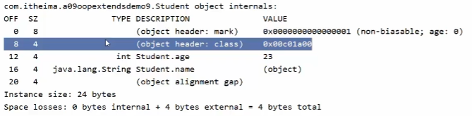

- [1. 解压jar包](#1-解压jar包)
- [2. 字节码](#2-字节码)
  - [2.1. javap](#21-javap)
- [3. 查看对象在内存中的结构](#3-查看对象在内存中的结构)
- [调试JVM](#调试jvm)
  - [jps](#jps)
  - [jstack](#jstack)
  - [jmap](#jmap)
  - [jstat](#jstat)
  - [jconsole](#jconsole)
  - [VisualVM](#visualvm)


---
## 1. 解压jar包

`jar -xvf xxx.jar` 解压jar包

## 2. 字节码

`javap -v xxx.class` 通过控制台查看字节码文件的内容

jclasslib: exe 和idea插件


### 2.1. javap

```bash
# -c 反编译
javap -c xxx.class

# -v -verbose 详细，打印堆栈大小，局部变量的数量和方法的参数。
javap -v xxx.class
```


```java
public class Application {
    public static void main(String[] args) {
        System.out.println("hello world");
    }
}
```

找到类对应的class文件存放目录，执行命令：`javap -v Application.class`   查看字节码结构

```java
D:\code\jvm-demo\target\classes\com\heima\jvm>javap -v Application.class
Classfile /D:/code/jvm-demo/target/classes/com/heima/jvm/Application.class
  Last modified 2023-05-07; size 564 bytes    //最后修改的时间
  MD5 checksum c1b64ed6491b9a16c2baab5061c64f88   //签名
  Compiled from "Application.java"   //从哪个源码编译
public class com.heima.jvm.Application   //包名，类名
  minor version: 0
  major version: 52     //jdk版本
  flags: ACC_PUBLIC, ACC_SUPER  //修饰符
Constant pool:   //常量池
   #1 = Methodref          #6.#20         // java/lang/Object."<init>":()V
   #2 = Fieldref           #21.#22        // java/lang/System.out:Ljava/io/PrintStream;
   #3 = String             #23            // hello world
   #4 = Methodref          #24.#25        // java/io/PrintStream.println:(Ljava/lang/String;)V
   #5 = Class              #26            // com/heima/jvm/Application
   #6 = Class              #27            // java/lang/Object
   #7 = Utf8               <init>
   #8 = Utf8               ()V
   #9 = Utf8               Code
  #10 = Utf8               LineNumberTable
  #11 = Utf8               LocalVariableTable
  #12 = Utf8               this
  #13 = Utf8               Lcom/heima/jvm/Application;
  #14 = Utf8               main
  #15 = Utf8               ([Ljava/lang/String;)V
  #16 = Utf8               args
  #17 = Utf8               [Ljava/lang/String;
  #18 = Utf8               SourceFile
  #19 = Utf8               Application.java
  #20 = NameAndType        #7:#8          // "<init>":()V
  #21 = Class              #28            // java/lang/System
  #22 = NameAndType        #29:#30        // out:Ljava/io/PrintStream;
  #23 = Utf8               hello world
  #24 = Class              #31            // java/io/PrintStream
  #25 = NameAndType        #32:#33        // println:(Ljava/lang/String;)V
  #26 = Utf8               com/heima/jvm/Application
  #27 = Utf8               java/lang/Object
  #28 = Utf8               java/lang/System
  #29 = Utf8               out
  #30 = Utf8               Ljava/io/PrintStream;
  #31 = Utf8               java/io/PrintStream
  #32 = Utf8               println
  #33 = Utf8               (Ljava/lang/String;)V
{
  public com.heima.jvm.Application();  //构造方法
    descriptor: ()V
    flags: ACC_PUBLIC
    Code:
      stack=1, locals=1, args_size=1
         0: aload_0
         1: invokespecial #1                  // Method java/lang/Object."<init>":()V
         4: return
      LineNumberTable:
        line 3: 0
      LocalVariableTable:
        Start  Length  Slot  Name   Signature
            0       5     0  this   Lcom/heima/jvm/Application;

  public static void main(java.lang.String[]);  //main方法
    descriptor: ([Ljava/lang/String;)V
    flags: ACC_PUBLIC, ACC_STATIC
    Code:
      stack=2, locals=1, args_size=1
         0: getstatic     #2                  // Field java/lang/System.out:Ljava/io/PrintStream;
         3: ldc           #3                  // String hello world
         5: invokevirtual #4                  // Method java/io/PrintStream.println:(Ljava/lang/String;)V
         8: return
      LineNumberTable:
        line 7: 0
        line 8: 8
      LocalVariableTable:
        Start  Length  Slot  Name   Signature
            0       9     0  args   [Ljava/lang/String;
}
SourceFile: "Application.java"
```

## 3. 查看对象在内存中的结构

```java
import org.openjdk.jol.info.ClassLayout;

Student student = new Student();
ClassLayout layout = ClassLayout.parseInstance(student);
System.out.println(layout.toPrintable());
```


## 调试JVM

jdk自带工具
- jps 查看运行中的JVM进程
- jstack 查看java进程内的**线程堆栈**信息
- jmap 查看某java进程的堆信息、生成堆转存快照hprof
- jhat 用于分析jmap生成的堆转存快照
- jstat JVM统计监测工具
- jconsole 可视化用于对jvm的内存，线程，类 的监控
- VisualVM 可视化能够监控线程，内存情况

### jps
进程id，进程名


### jstack

线程id、线程状态、第几行在运行


### jmap


`jmap -heap pid`   查看某java进程的堆信息：堆配置、堆各代使用情况。

`jmap -dump:format=b,file=heap.hprof pid`：生成堆转存快照hprof
- `format=b`  表示以hprof二进制格式转储Java堆的内存
- `file=<filename>` 用于指定快照dump文件的文件名。

```java
C:\Users\yuhon>jmap -heap 53280
Attaching to process ID 53280, please wait...
Debugger attached successfully.
Server compiler detected.
JVM version is 25.321-b07

using thread-local object allocation.
Parallel GC with 8 thread(s)   //并行的垃圾回收器

Heap Configuration:  //堆配置
   MinHeapFreeRatio         = 0   //空闲堆空间的最小百分比
   MaxHeapFreeRatio         = 100  //空闲堆空间的最大百分比
   MaxHeapSize              = 8524922880 (8130.0MB) //堆空间允许的最大值
   NewSize                  = 178257920 (170.0MB) //新生代堆空间的默认值
   MaxNewSize               = 2841640960 (2710.0MB) //新生代堆空间允许的最大值
   OldSize                  = 356515840 (340.0MB) //老年代堆空间的默认值
   NewRatio                 = 2 //新生代与老年代的堆空间比值，表示新生代：老年代=1：2
   SurvivorRatio            = 8 //两个Survivor区和Eden区的堆空间比值为8,表示S0:S1:Eden=1:1:8
   MetaspaceSize            = 21807104 (20.796875MB) //元空间的默认值
   CompressedClassSpaceSize = 1073741824 (1024.0MB) //压缩类使用空间大小
   MaxMetaspaceSize         = 17592186044415 MB //元空间允许的最大值
   G1HeapRegionSize         = 0 (0.0MB)//在使用 G1 垃圾回收算法时，JVM 会将 Heap 空间分隔为若干个 Region，该参数用来指定每个 Region 空间的大小。

Heap Usage:
PS Young Generation
Eden Space: //Eden使用情况
   capacity = 134217728 (128.0MB)
   used     = 10737496 (10.240074157714844MB)
   free     = 123480232 (117.75992584228516MB)
   8.000057935714722% used
From Space: //Survivor-From 使用情况
   capacity = 22020096 (21.0MB)
   used     = 0 (0.0MB)
   free     = 22020096 (21.0MB)
   0.0% used
To Space: //Survivor-To 使用情况
   capacity = 22020096 (21.0MB)
   used     = 0 (0.0MB)
   free     = 22020096 (21.0MB)
   0.0% used
PS Old Generation  //老年代 使用情况
   capacity = 356515840 (340.0MB)
   used     = 0 (0.0MB)
   free     = 356515840 (340.0MB)
   0.0% used

3185 interned Strings occupying 261264 bytes.
```

### jstat

①总结垃圾回收统计

```sh
jstat -gcutil pid
```


| 字段 | 含义                   |
| ---- | ---------------------- |
| S0   | 幸存1区当前使用比例    |
| S1   | 幸存2区当前使用比例    |
| E    | 伊甸园区使用比例       |
| O    | 老年代使用比例         |
| M    | 元数据区使用比例       |
| CCS  | 压缩使用比例           |
| YGC  | 年轻代垃圾回收次数     |
| YGCT | 年轻代垃圾回收消耗时间 |
| FGC  | 老年代垃圾回收次数     |
| FGCT | 老年代垃圾回收消耗时间 |
| GCT  | 垃圾回收消耗总时间     |

②垃圾回收统计

```sh
jstat -gc pid
```


### jconsole

对jvm的内存、线程、类的监控


可以内存、线程、类等信息


### VisualVM

能够监控线程，内存情况，查看方法的CPU时间和内存中的对象，已被GC的对象，反向查看分配的堆栈

打开方式：java 安装目录 bin目录下 直接启动 jvisualvm.exe就行


监控程序运行情况


查看运行中的dump


查看堆中的信息


加载离线的dump文件


通过查看堆信息的情况，可以大概定位内存溢出是哪行代码出了问题

