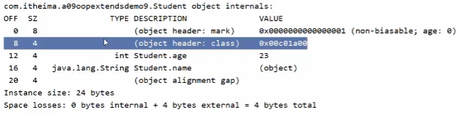

## 查看对象在内存中的结构

```java
import org.openjdk.jol.info.ClassLayout;

Student student = new Student();
ClassLayout layout = ClassLayout.parseInstance(student);
System.out.println(layout.toPrintable());
```

