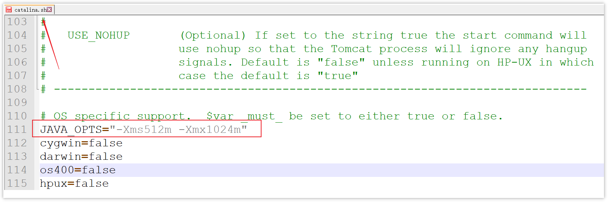
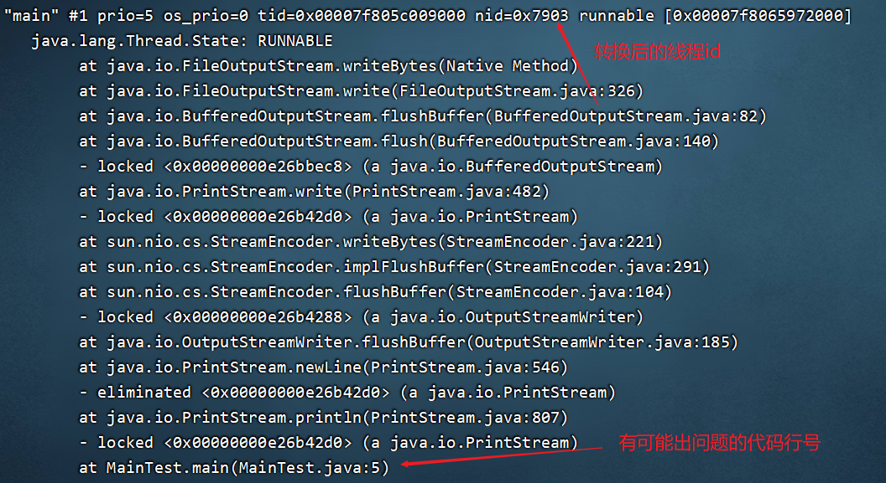

- [OutOfMemoryError](#outofmemoryerror)
- [JVM 调优的参数可以在哪里设置参数值？](#jvm-调优的参数可以在哪里设置参数值)
- [用的 JVM 调优的参数都有哪些？](#用的-jvm-调优的参数都有哪些)
- [调试 JVM都用了哪些工具呢？](#调试-jvm都用了哪些工具呢)
- [项目中java内存泄露，你说一下你的排查思路？](#项目中java内存泄露你说一下你的排查思路)
- [服务器CPU持续飙高，你的排查方案与思路？](#服务器cpu持续飙高你的排查方案与思路)


---
## OutOfMemoryError
- 虚拟机栈动态扩展失败
- 堆
  - OutOfMemoryError: GC Overhead Limit Exceeded：
    
    当 JVM 花太多时间执行垃圾回收并且只能回收很少的堆空间时，就会发生此错误。
  - OutOfMemoryError: Java heap space :
    
    假如在创建新的对象时, 堆内存中的空间不足以存放新创建的对象, 就会引发此错误。(和配置的最大堆内存有关，且受制于物理内存大小。最大堆内存可通过-Xmx参数配置，若没有特别配置，将会使用默认值，详见：Default Java 8 max heap sizeopen in new window)
  - OutOfMemoryError: MetaSpace 当元空间溢出时
  - OutOfMemoryError: PermGen 永久代溢出
- 直接内存

## JVM 调优的参数可以在哪里设置参数值？
- idea中添加VM参数
- war包：tomcat的catalina文件，设置`JAVA_OPTS`参数。
- jar包：java -jar中加入参数就行了

修改`TOMCAT_HOME/bin/catalina.sh`文件(windows是catalina.bat)，如下图

`JAVA_OPTS="-Xms512m -Xmx1024m" `




```sh
nohup java -Xms512m -Xmx1024m -jar xxxx.jar --spring.profiles.active=prod &
```

## 用的 JVM 调优的参数都有哪些？

1. 设置堆的初始大小和最大大小 `-Xms`, `-Xmx`
   
   - 第一，设置为相同，防止堆收缩浪费时间。
   - 第二，堆太小，则频繁gc；堆太大，则full gc的stw时间太长。
   - 第三，尽量大，还要考虑当前计算机其他程序的内存使用。

2. 设置年轻代中两个Survivor区和Eden区的大小比例。`-XXSurvivorRatio`
3. 设置每个线程的虚拟机栈的大小。`-Xss=256k`
    
    减少每个线程的堆栈，可以产生更多的线程。默认是1m，我们设置为256k就够用。
4. 设置垃圾回收器 `-XX:+UseG1GC`

[参数](其他/参数.md)

## 调试 JVM都用了哪些工具呢？
jdk自带工具
- jps 查看运行中的JVM进程
- jstack 查看java进程内的**线程堆栈**信息
- jmap 查看某java进程的堆信息、生成堆转存快照hprof
- jhat 用于分析jmap生成的堆转存快照
- jstat JVM统计监测工具
- jconsole 可视化用于对jvm的内存，线程，类 的监控
- VisualVM 可视化能够监控线程，内存情况

其他；
- arthas

## 项目中java内存泄露，你说一下你的排查思路？


1. 获取内存快照 dump。通过jmap生成、设置vm参数让程序OOM时生成dump文件

    ```bash
    -XX:+HeapDumpOnOutOfMemoryError
    -XX:HeapDumpPath=/home/app/dumps     指定生成后文件的保存目录
    ```

2. VisualVM分析 dump文件

3. 通过查看堆信息的情况，可以大概定位内存溢出是哪行代码出了问题，进行修复即可

## 服务器CPU持续飙高，你的排查方案与思路？

1. 使用top命令查看占用cpu的情况，记录占用cpu较高进程id

2. ps 查看这个进程，定位到具体占用较高的线程id

    ```sh
    $ ps H -eo pid,tid,%cpu | grep 40940

    # 转化为jstatck的线程id十六进制
    $ printf "%x\n" 30979
    ```

3. jstack查看java进程内的**线程堆栈**信息，锁定对应线程id

    