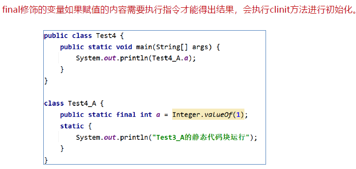

- [1. 类的生命周期5个阶段是什么](#1-类的生命周期5个阶段是什么)
- [2. 类的加载阶段](#2-类的加载阶段)
  - [2.1. 🚀类的加载阶段做什么/类加载器的作用是什么？](#21-类的加载阶段做什么类加载器的作用是什么)
  - [2.2. 两个对象具体是什么名字：](#22-两个对象具体是什么名字)
  - [2.3. 为什么需要分别再方法区和堆上创建对象来保存信息？](#23-为什么需要分别再方法区和堆上创建对象来保存信息)
- [3. 类加载器](#3-类加载器)
  - [3.1. 🚀类加载器有几种](#31-类加载器有几种)
  - [3.2. 启动类加载器 Bootstrap](#32-启动类加载器-bootstrap)
  - [3.3. 扩展类加载器和应用程序类加载器](#33-扩展类加载器和应用程序类加载器)
  - [3.4. 扩展类加载器](#34-扩展类加载器)
  - [3.5. 应用类加载器](#35-应用类加载器)
- [4. 双亲委派机制](#4-双亲委派机制)
  - [4.1. 🚀双亲委派机制的作用](#41-双亲委派机制的作用)
  - [4.2. 🚀双亲委派机制的过程](#42-双亲委派机制的过程)
  - [4.3. 🚀打破双亲委派机制](#43-打破双亲委派机制)
    - [4.3.1. 自定义类加载器](#431-自定义类加载器)
    - [4.3.2. 线程上下文类加载器](#432-线程上下文类加载器)
    - [4.3.3. SPI机制](#433-spi机制)
- [5. 类的连接阶段有哪个具体阶段](#5-类的连接阶段有哪个具体阶段)
  - [5.1. 静态变量赋初值有哪两种情况？](#51-静态变量赋初值有哪两种情况)
- [6. 类的初始化阶段](#6-类的初始化阶段)
  - [6.1. 初始化阶段干什么](#61-初始化阶段干什么)
  - [6.2. 静态变量的结果，静态变量的初始化和静态代码块对静态变量的赋值操作顺序？](#62-静态变量的结果静态变量的初始化和静态代码块对静态变量的赋值操作顺序)
  - [6.3. 🚀什么会导致类的初始化阶段](#63-什么会导致类的初始化阶段)
  - [6.4. 调用类的静态变量的细节](#64-调用类的静态变量的细节)
  - [6.5. 习题](#65-习题)


---
## 1. 类的生命周期5个阶段是什么

加载 loading、连接 linking（验证、准备、解析）、初始化 initialization、使用 using、卸载 unloading

## 2. 类的加载阶段

### 2.1. 🚀类的加载阶段做什么/类加载器的作用是什么？

类加载器（ClassLoader）负责在类加载阶段中，获取类的字节码信息并加载到内存中。

接下来调用虚拟机底层方法，将内存中代表字节码信息的`byte[]` 转换成方法区和堆中的数据，在方法区和堆区各创建一个对象来保存类的信息。

### 2.2. 两个对象具体是什么名字：
- 方法区的对象：InstanceKlass
- 堆区的对象：java.lang.Class

### 2.3. 为什么需要分别再方法区和堆上创建对象来保存信息？
- 安全性，控制访问范围，InstanceKlass中有虚方法表，不应被暴露。
- 可操作。InstanceKlass用C语言写的，java.lang.Class是用java写的。

InstanceKlass中有虚方法表。

java.lang.Class中存：类的字段、方法、**静态变量**。


## 3. 类加载器

### 3.1. 🚀类加载器有几种

```bash
[arthas@2712]$ classloader
 name                                       numberOfInstances  loadedCountTotal
 # 启动类加载器
 BootstrapClassLoader                       1                  2721
 # 自定义类加载器
 com.taobao.arthas.agent.ArthasClassloader  1                  1351
 # 扩展类加载器
 sun.misc.Launcher$ExtClassLoader           1                  66
 # 自定义类加载器
 sun.reflect.DelegatingClassLoader          15                 15
 # 应用程序类加载器
 sun.misc.Launcher$AppClassLoader           1                  7
```
JDK8及其之前：
1. 启动类加载器（Bootstrap ClassLoader）：加载核心类
2. 扩展类加载器（Extension ClassLoader）：加载扩展类
3. 应用程序类加载器（Application ClassLoader）：加载应用classpath 中的类
4. 自定义类加载器：重写loadClas, findClass 方法的类加载器。

JDK9及之后：引入模块概念，启动类加载器和扩展类加载器相应发生变化
- 启动类加载器：
    
    实现，C++→Java；

    Bootstrap ClassLoader→BootClassLoader。BootClassLoader继承自BuiltinClassLoader 实现从模块中找到要加载的字节码资源文件。

    启动类加载器依然无法通过java 代码获取到，返回的仍然是null，保持了统一
- 扩展类加载器：
    
    Extension ClassLoader 变成了平台类加载器（Platform ClassLoader）

    平台类加载器继承BuiltinClassLoader，与老版本的设计方案兼容。


### 3.2. 启动类加载器 Bootstrap
- 由Hotspot虚拟机底层实现、使用C++ 编写的类加载器
- 加载java最核心的类
- 加载目录：
  
    - 默认加载
     
        Java `JAVA_HOME/jre/lib` 下的类文件，比如rt.jar jar，tools.jar jar，resources.jar 等
    - 参数扩展加载jar包
    
        `-Xbootclasspath/a:包位置`: `/a`表示添加。让启动类加载器加载jar包。
- 在java代码中获取启动类加载器，得到的都是null。
    ```java
    Class<?> clazz = String.class;
    ClassLoader classLoader = clazz.getClassLoader();
    System.out.println(classLoader);    // null
    ```
### 3.3. 扩展类加载器和应用程序类加载器

- 都是JDK 中提供的、使用Java 编写的类加载器。


### 3.4. 扩展类加载器
- 加载目录：
  
    - 默认加载
  
        `JAVA_HOME/jre/lib/ext` 下的类文件。
  
    - 参数扩展加载jar包：
  
        `-Djava.ext.dirs=包目录`：需要把原始目录和jar包目录都写上，其中`;`（windows）或`:`(macos linux)来分割。

        比如，`-Djava.ext.dirs="C:\Program Files\Java\jdk1.8.0_181\jre\lib\ext;D:\jvm\jar"`

### 3.5. 应用类加载器

- 加载目录：
    
    加载classpath 下的类文件：项目中的自己类、maven等第三方依赖类
- arthas显示出应用类加载器加载jar包位置：项目应用中的，还有启动类和扩展类的。👉双亲委派机制防止重复加载。

## 4. 双亲委派机制
### 4.1. 🚀双亲委派机制的作用

1. 避免重复加载
    
    双亲委派机制可以避免同一个类被多次加载。
2. 保证类加载的安全性
    
    双亲委派机制实现了类加载器按优先级加载类，避免恶意代码重写JDK中的核心类库，确保核心类库的完整性和安全性

### 4.2. 🚀双亲委派机制的过程


1. 双亲：
   
   “父类”并非继承，而是类加载器中声明的`parent`成员变量。自定义类加载器→应用程序类加载器→扩展类加载器→启动类加载器。
   
   扩展类加载器其实`parent=null`，但逻辑上最终交由启动类加载器。
   
2. 委派过程：
   
   先自底向上查找是否加载过，如果加载过就由该加载器返回该类。
   
   如果都没加载过，就再由顶向下尝试进行加载：如果该类在加载器的加载目录中，那就加载。

### 4.3. 🚀打破双亲委派机制

1. **自定义类加载器**，重写loadClass方法
2. JDBC等框架使用了**SPI 机制+线程上下文类加载器**。
3. **Osgi框架**的类加载器，允许同级类加载器之间互相调用

#### 4.3.1. 自定义类加载器

- tomcat为了加载不同应用下相同名的类，每个应用使用独立的自定义类加载器来加载类，实现了应用间的隔离。（不使用就无法加载第二个同名的类）
- ClassLoader 中包含了4 个核心方法：loadClass、findClass、defineClass、resolveClass
- 自定义类加载器有父类吗？有，默认是由构造器设置getSystemClassLoader()，即设置AppClassLoader。
- 两个自定义类加载器加载相同限定名的类，不会冲突吗？不会冲突，在同一个Java 虚拟机中，只有相**同类加载器+相同的类限定名**才会被认为是同一个类。

#### 4.3.2. 线程上下文类加载器


- `Thread.currentThread().getContextClassLoader()` 默认是应用程序类加载器，可用`Thread.currentThread().setContextClassLoader(classLoader);`设置。

> 打破双亲委派机制的第二种方法：JDBC 案例

JDBC，DriverManager只需导入不同jar包，就可实现加载不同的数据库驱动。

1. 启动类加载器加载DriverManager（位于rt.jar包）。
2. 在初始化DriverManager 时，通过SPI 机制加载jar包中的myql 驱动（位于classpath中），其中 SPI 中利用了线程上下文类加载器（应用程序类加载器）去加载类并创建对象。
3. 从而实现了启动类加载器加载的类，委托应用程序加载器去加载类，打破了双亲委派机制。

> JDBC没有打破双亲委派机制

因为都是使用Java默认的类加载器来加载，位于rt.jar包的DriverManager由启动类加载器加载，具体驱动类位于classpath中由应用程序类加载器去加载。只是因为SPI而触发而已，实际上打破双亲委派机制必须重写`loadClass`方法。
#### 4.3.3. SPI机制

1. SPI机制提供ServiceLoader类加载器来加载类。
2. ServiceLoader会固定扫描jar包中`META-INF/services`文件夹中的文件，这个文件以接口名来命名，内容记录的是具体接口实现的类名。

## 5. 类的连接阶段有哪个具体阶段

- 验证（魔数、主副版本号）
- 准备（静态变量分配内存、静态变量赋初值）、
- 解析（将常量池中的符号引用（编号）替换为直接引用（内存地址））

### 5.1. 静态变量赋初值有哪两种情况？

非final的静态变量，赋值默认值（基本类型的xxx，引用类型的null）

final 修饰的静态变量，会直接赋常量值，且不再经过后续的类初始化阶段。

## 6. 类的初始化阶段

### 6.1. 初始化阶段干什么

执行clinit指令：静态变量的初始化和静态代码块

### 6.2. 静态变量的结果，静态变量的初始化和静态代码块对静态变量的赋值操作顺序？

随Java代码中的编写顺序

### 6.3. 🚀什么会导致类的初始化阶段

1. new一个对象
2. Class.forName(ClassName)：使用当前类的类加载器去加载指定的类
3. 调用类的静态方法（执行main方法的当前类）、静态变量

PS：loadClass() 指定某个类加载器加载，并不会初始化，只停留在连接中的解析阶段
```java
// 使用当前类的类加载器
Class<?> aClass = Class.forName("com.itheima.my.B");

// 获取指定类的类加载器，这里是应用程序类加载器。并使用应用程序类加载器加载 com.itheima.my.A
ClassLoader classLoader = Demo2.class.getClassLoader();
Class<?> clazz = classLoader.loadClass("com.itheima.my.A");
```

### 6.4. 调用类的静态变量的细节
- new一个对象会导致类进行初始化，但数组得到创建不会导致数组中元素的类进行初始化。
- 无静态代码块且无静态变量赋值(只声明，不赋值)，不会初始化。`public static int i;`
- 静态变量的定义使用final 关键字，这类变量会在准备阶段直接进行初始化。`public final static int i = 10;`
- 静态变量的定义调用方法会初始化，如`static int i = Integer.valueOf(1);`
- 父类的静态变量
  - 子类的初始化cinit 调用之前，会先调用父类的cinit 初始化方法
  - 直接访问父类的静态变量，不会触发子类的初始化。


### 6.5. 习题


```java
package init.parent;

public class Demo01 {
    public static void main(String[] args) {
        // 重写了父类的静态变量，父类和子类的clinit都会执行
        System.out.println(B02.a);
    }
}

class A02{
    static int a = 0;
    static {
        a = 1;
        System.out.println("A02");
    }
}

class B02 extends A02{
    static int a = 2;
    static {
        System.out.println("B02");
    }
}
/* A02
B02
2 */
```
数组得到创建不会导致数组中元素的类进行初始化
```java
public class Demo01 {
    public static void main(String[] args) {
        Test[] tests = new Test[10];    // 不会触发静态代码块
        // new Test();   // 会触发静态代码块
    }
}

class Test{
    static{
        System.out.println("Test类的静态代码块");
    }
}
```

