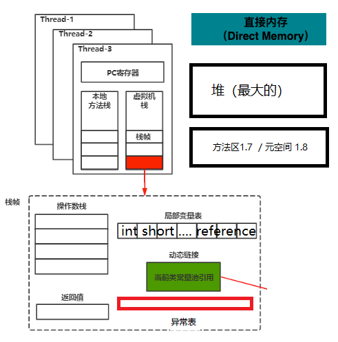
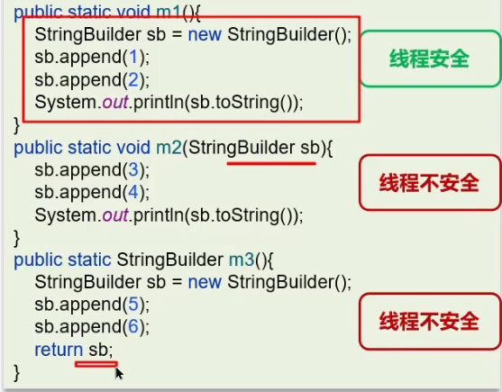

- [1. 🚀Java的内存分为几个部分](#1-java的内存分为几个部分)
- [2. 程序计数器PC](#2-程序计数器pc)
- [3. 什么是虚拟机栈](#3-什么是虚拟机栈)
- [4. 垃圾回收是否涉及栈内存？](#4-垃圾回收是否涉及栈内存)
- [5. 栈内存分配越大越好吗？](#5-栈内存分配越大越好吗)
- [6. 方法内的局部变量是否线程安全？](#6-方法内的局部变量是否线程安全)
- [7. 栈内存溢出情况](#7-栈内存溢出情况)
- [8. 栈帧](#8-栈帧)
- [9. 栈帧中的局部变量表](#9-栈帧中的局部变量表)
- [10. 栈帧中的操作数栈](#10-栈帧中的操作数栈)
- [11. 介绍Java堆](#11-介绍java堆)
- [堆栈的区别是什么？](#堆栈的区别是什么)
- [12. Java堆关于JDK版本的变化](#12-java堆关于jdk版本的变化)
- [13. 为什么要将永久代 替换为元空间 呢?](#13-为什么要将永久代-替换为元空间-呢)
- [14. 为什么字符串常量池被移出永久代](#14-为什么字符串常量池被移出永久代)
- [15. 方法区和永久代以及元空间是什么关系呢？](#15-方法区和永久代以及元空间是什么关系呢)
- [16. 方法区](#16-方法区)
- [17. class文件内容](#17-class文件内容)
- [18. 常量池表](#18-常量池表)
- [19. 字符串常量池](#19-字符串常量池)
- [20. 运行时常量池](#20-运行时常量池)
- [21. 直接内存](#21-直接内存)
- [22. 实战串起来](#22-实战串起来)
  - [22.1. Java 对象的创建过程](#221-java-对象的创建过程)
    - [22.1.1. 内存分配的两种方式](#2211-内存分配的两种方式)
    - [22.1.2. 内存分配并发问题](#2212-内存分配并发问题)
    - [22.1.3. 对象的内存布局](#2213-对象的内存布局)
  - [22.2. 对象访问](#222-对象访问)
  - [22.3. 其他](#223-其他)
- [为什么说是几乎所有对象实例都存在于堆中呢？](#为什么说是几乎所有对象实例都存在于堆中呢)

---

## 1. 🚀Java的内存分为几个部分

线程私有：生命周期随着线程的创建而创建，随着线程的结束而死亡。没有线程安全问题。
- 虚拟机栈
- 本地方法栈
- 程序计数器PC

线程共享：有线程安全问题。
- 堆
- 方法区/元空间
- 直接内存（本地内存）：OS的内存，由OS管理

运行时数据区域不包括本地内存：
- 直接内存
- JDK8 存在本地内存中的元空间（JDK7的方法区是在堆中的永久代，属于运行时数据区域）
## 2. 程序计数器PC

线程私有的
1. 当前线程执行

    在类的加载阶段，虚拟机将字节码文件中的指令读取到内存之后，会将原文件中的偏移量转换成内存地址。每一条字节码指令都会拥有一个内存地址。
    
    在代码执行过程中，程序计数器会记录**下一行要执行的字节码指令的地址**。

    字节码解释器工作时，通过改变程序计数器的值来依次读取下一条需要执行的指令，从而实现代码的流程控制，顺序执行、分支、循环、跳转、异常处理等。

2. 多线程切换
   
    在多线程的情况下，程序计数器用于记录当前线程执行的位置，从而当线程被切换回来的时候能够恢复到上次的执行位置，故而各线程之间计数器互不影响，独立存储。

3. 程序计数器是唯一一个不会出现 OutOfMemoryError 的内存区域，因为每个线程只存储一个固定长度的内存地址。

## 3. 什么是虚拟机栈

- 每个线程执行方法时所需要的内存，放在本地方法栈或虚拟机栈中，先进后出。

    本地方法栈和虚拟机栈都是为了虚拟机执行Java方法而服务，具体分别是Native本地方法和其他方法。HotSpot虚拟机中本地方法栈和虚拟机栈合二为一。

- 每个栈由多个栈帧（frame）组成。方法调用时，压入一个栈帧；方法结束后（return正常结束或抛出异常），弹出一个栈帧。

- 每个线程只能有一个活动栈帧，对应着当前正在执行的那个方法

## 4. 垃圾回收是否涉及栈内存？

垃圾回收主要指就是堆内存，当栈帧弹栈以后，内存就会释放，不需要GC。

## 5. 栈内存分配越大越好吗？

未必，默认的栈内存通常为1M。

栈帧过大会导致线程数变少。

## 6. 方法内的局部变量是否线程安全？

- 如果方法内局部变量没有逃离方法的作用范围，它是线程安全的

- 如果是局部变量引用了对象、或者返回了局部变量，需要考虑线程安全

## 7. 栈内存溢出情况

- 栈帧过多导致栈内存溢出，典型问题：递归调用

- 栈帧过大导致栈内存溢出

## 8. 栈帧

每个栈帧中都拥有（5个）：方法返回地址、局部变量表、操作数栈、动态链接、异常表的引用。
- 方法返回地址（方法出口）

    当前栈帧会被弹出，同时程序计数器应该指向**上一个栈帧中的下一条指令的地址**。所以在当前栈帧中，需要存储此方法出口的地址。
- 局部变量表：存放方法中的局部变量
- 操作数栈：存放方法执行过程中产生的临时变量、中间计算结果。
- 动态链接

    当前类的字节码指令引用了其他类的属性或者方法时，需要将符号引用转换成对应的方法区中**运行时常量池**中的内存地址的直接引用。
    
    动态链接就保存了符号引用到运行时常量池的内存地址的映射关系。

- 异常表的引用：
    
    存放的是代码中异常的处理信息，包含了异常捕获的生效范围以及异常发生后跳转到的字节码指令位置。

## 9. 栈帧中的局部变量表

存放了编译期可知的各种数据类型（boolean、byte、char、short、int、float、long、double）、对象引用（reference 类型，句柄或直接指针）

局部变量表是**一个数组**，数组中每一个位置称之为**槽**（long 和double 类型占用两个槽，其他类型和引用类型占用一个槽）

局部变量表保存的内容：**实例方法的this 对象，方法的参数，方法体中声明的局部变量**

为了节省空间，局部变量表中的槽是**可以复用**的，一旦某个局部变量不再生效，当前槽就可以再次被使用。

this、k、m、i、j ： 1+1+1+1+2= 6

## 10. 栈帧中的操作数栈

在**编译期**就可以确定操作数栈的最大深度，从而在执行时正确的分配内存大小

## 11. 介绍Java堆

堆是所有**线程共享**的一块内存区域，在虚拟机启动时创建。

用来保存对象实例和数组。内存不够时则抛出OutOfMemoryError。

堆是垃圾收集器管理的主要区域，因此也被称作 GC 堆，从此角度分为：
- 年轻代（Eden伊甸园、Survivor幸存者S0和S1两块）：新分配的对象。
- 老年代Old：保存生命周期长的对象
- 方法区/永久代Permanent。保存的类信息、静态变量、常量、编译后的代码

为了避免方法区出现OOM，所以在java8中将堆上的方法区【永久代】给移动到了本地内存上，重新开辟了一块空间，叫做**元空间**。

## 堆栈的区别是什么？

1、栈内存一般会用来存储局部变量和方法调用，但堆内存是用来存储Java对象和数组的的。堆会GC垃圾回收，而栈不会。

2、栈内存是线程私有的，而堆内存是线程共有的。

3,、两者异常错误不同，但如果栈内存或者堆内存不足都会抛出异常。

栈空间不足：java.lang.StackOverFlowError。

堆空间不足：java.lang.OutOfMemoryError。

## 12. Java堆关于JDK版本的变化
- JDK7 **字符串常量池**和**静态变量**
    
    JDK7 之前，字符串常量池存放在永久代。JDK7 字符串常量池和静态变量从永久代移动到了堆中。

- JDK8 元空间
  
  JDK8 采用在本地内存中的元空间实现方法区，废弃在堆中的永久代实现，并把JDK7中永久代剩下的东西都移动元空间中。

## 13. 为什么要将永久代 替换为元空间 呢?
- GC
    
    永久代的 GC 回收效率太低，只有在整堆收集 (Full GC)的时候才会被执行 GC
- 溢出

    整个永久代有一个 JVM 本身设置的固定大小上限，无法进行调整，而元空间使用的是本地内存，默认没有上限（可以设置参数`-XX:MaxMetaspaceSize=8m`），实际最大也就是占满可用内存，虽然元空间仍旧可能溢出，但是比原来出现的几率会更小。
- 加载类
    
    元空间里面存放的是类的元数据，由系统的实际可用空间来控制，这样能加载的类就更多了
## 14. 为什么字符串常量池被移出永久代

永久代的 GC 回收效率太低，只有在整堆收集 (Full GC)的时候才会被执行 GC。Java 程序中通常会有大量的被创建的字符串等待回收，将字符串常量池放到堆中，能够更高效及时地回收字符串内存。
## 15. 方法区和永久代以及元空间是什么关系呢？
方法区是抽象概念。

在 HotSpot中，永久代和元空间都是方法区的具体实现。

JDK8 之前的永久代是堆中的区域。

JDK8 及以后，永久代替换为元空间，元空间使用的是本地内存。

## 16. 方法区

各个线程共享。虚拟机启动的时候创建，关闭虚拟机时释放。

存储内容：
- class文件内容：当虚拟机要使用一个类时，它需要读取、解析 Class 文件、储存信息存入到方法区。
- 运行时常量池。

## 17. class文件内容
- 类的版本、字段（成员变量、类变量）、方法（成员方法、类方法）、接口
- 常量池表
- 常量、静态变量
- 即时编译器编译后的代码缓存等数据

## 18. 常量池表

存放编译期生成的各种**字面量和符号引用**。常量池表会在类加载后存放到方法区的运行时常量池中。

字面量（Literal）:
- 源代码中的固定值的表示法，即通过字面我们就能知道其值的含义。
- 字面量包括整数、浮点数和字符串字面量。

符号引用（Symbolic Reference）:
- 常见的类符号引用 class references、方法符号引用 method references、字段符号引用、接口方法符号。

## 19. 字符串常量池

JDK7 之前，字符串常量池存放在永久代。JDK7 字符串常量池和静态变量从永久代移动了 Java 堆中。

HotSpot中字符串常量池的实现是 `StringTable`。 可以简单理解为一个固定大小的HashTable ，容量为 StringTableSize（可以通过 -XX:StringTableSize 参数来设置），保存的是字符串（key）和 字符串对象的引用（value）的映射关系，字符串对象的引用指向堆中的字符串对象。

当我们使用双引号创建字符串对象时，会检查常量池中是否存在该数据。不存在则创建
存在则复用。

## 20. 运行时常量池

class文件中的**常量池表**，会在类加载后存放到方法区的**运行时常量池**中，并把里面的符号引用变为内存地址的**直接引用**。

既然运行时常量池是方法区的一部分，自然受到方法区内存的限制。

JDK8 之前，运行时常量池存放在永久代的方法区实现。JDK8 从永久代移动到了元空间中。
## 21. 直接内存

直接内存并不是虚拟机运行时数据区的一部分，直接内存是OS的内存，由OS管理（而不是JVM）。

通过 JNI 的方式在本地内存上分配的。

由OS管理的意义，能够在一定程度上减少垃圾回收对应用程序造成的影响。

直接内存常见于 NIO 操作时，用于数据缓冲区。分配回收成本较高，但读写性能高。[零拷贝，不知道为什么叫这个NIO？](../javase/流/IO.md#零拷贝)

## 22. 实战串起来

### 22.1. Java 对象的创建过程

1. 类加载检查

    看到`new`要创建对象。

    首先将去检查这个指令的参数是否能在常量池中定位到这个类的符号引用，并且检查这个符号引用代表的类是否已被加载过、解析和初始化过。
    
    如果没有，那必须先执行相应的类加载过程……。

2. 分配内存

    为新对象分配内存。
    
    对象所需的内存大小在类加载完成后便可确定，为对象分配空间的任务等同于把一块确定大小的内存从 Java 堆中划分出来。分配方式有 “指针碰撞” 和 “空闲列表” 两种……
3. 初始化零值

    内存分配完成后，虚拟机需要将分配到的内存空间都初始化为零值（不包括对象头）。
    
    这一步操作保证了对象的实例字段在 Java 代码中可以不赋初始值就直接使用，程序能访问到这些字段的数据类型所对应的零值。
4. 设置对象头

    初始化零值完成之后，虚拟机要对对象进行必要的设置，例如这个对象是哪个类的实例、如何才能找到类的元数据信息、对象的哈希码、对象的 GC 分代年龄等信息。 这些信息存放在对象头中。 另外，根据虚拟机当前运行状态的不同，如是否启用偏向锁等，对象头会有不同的设置方式。
5. 执行init方法

    在上面工作都完成之后，从虚拟机的视角来看，一个新的对象已经产生了。
    
    但从 Java 程序的视角来看，对象创建才刚开始，<init> 方法还没有执行，所有的字段都还为零。所以一般来说，执行 new 指令之后会接着执行 <init> 方法，把对象按照程序员的意愿进行初始化，这样一个真正可用的对象才算完全产生出来。
#### 22.1.1. 内存分配的两种方式

选择哪种分配方式由 Java 堆是否规整决定，而 Java 堆是否规整又取决于 GC 收集器的算法是"标记-清除"，还是"标记-整理"（也称作"标记-压缩"）：
- 空闲列表： 堆内存不规整的情况下。
    
    原理：虚拟机会维护一个列表，该列表中会记录哪些内存块是可用的，在分配的时候，找一块儿足够大的内存块儿来划分给对象实例，最后更新列表记录。
    
    使用该分配方式的 GC 收集器：CMS
- 指针碰撞： 堆内存规整（即没有内存碎片）的情况下。
    
    原理：用过的内存全部整合到一边，没有用过的内存放在另一边，中间有一个分界指针，只需要向着没用过的内存方向将该指针移动对象内存大小位置即可。
    
    使用该分配方式的 GC 收集器：Serial, ParNew

#### 22.1.2. 内存分配并发问题

创建对象是很频繁的事情，作为虚拟机来说，必须要保证线程是安全的。
- TLAB：
    
    为每一个线程预先在 Eden 区分配一块儿内存，JVM 在给线程中的对象分配内存时，首先在 TLAB 分配，当对象大于 TLAB 中的剩余内存或 TLAB 的内存已用尽时，再采用CAS进行内存分配
- CAS+失败重试： 
  
    CAS 是乐观锁的一种实现方式。所谓乐观锁就是，每次不加锁而是假设没有冲突而去完成某项操作，如果因为冲突失败就重试，直到成功为止。
    
    虚拟机采用 CAS 配上失败重试的方式保证更新操作的原子性。

#### 22.1.3. 对象的内存布局

对象在内存中存储的布局可分为3块区域：对象头（Header）、实例数据（Instance Data）和对齐填充。

- 对象头。由Markword和Klass Word组成：
    - Markword：哈希码、GC 分代年龄、锁状态标志等
    - 类型指针(堆中)：对象的类型指针，指向方法区中对应的对象类型信息。虚拟机通过类型指针来确定这个对象是哪个类的实例。
- 实例数据(堆中)

    对象真正存储的有效信息，也是在程序中所定义的各种类型的字段内容。
- 对齐填充

    对象头部分正好是 8 字节的倍数，所以只当对象的实例数据部分没有对齐 8 字节的整数倍时，就需要通过对齐填充来补全。

`int i = 3;`, 字面量：3, 符号引用：i
### 22.2. 对象访问

通过栈上的局部变量表中的 reference 数据，就可以访问堆上的具体对象。

- 句柄

    如果使用句柄的话，那么 Java 堆中将会划分出句柄池来存储句柄，实例池来存储对象实例数据。
    
    reference 中存储的就是对象的句柄地址，而句柄中有两个指针，分别指向了堆中实例池的对象实例数据、方法区中的对象类型信息。

- 直接指针

    reference 中存储的直接就是对象的地址，里面是对象的实例数据和指向方法区中对象类型信息的指针。
### 22.3. 其他

当方法出栈后，方法中在栈里的变量也都出栈了。

 方法调用方法。

数组new的部分在堆中。

方法区详细：

- 加载 `.class` 字节码文件，并临时存储class文件内的成员变量、成员方法、类方法等。这些临时存储的东西，到时会被放入栈内存中。

- 元空间负责加载字节码文件

[🚩面向对象-07-三种情况的对象内存图 P87 - 14:04](https://www.bilibili.com/video/BV17F411T7Ao?p=87&t=843)

[🚩面向对象-07-三种情况的对象内存图 P87 - 21:38](https://www.bilibili.com/video/BV17F411T7Ao?p=87&t=1298)

[🚩面向对象-07-三种情况的对象内存图 P87 - 28:28](https://www.bilibili.com/video/BV17F411T7Ao?p=87&t=1708)

## 为什么说是几乎所有对象实例都存在于堆中呢？ 

这是因为 HotSpot 虚拟机引入了 JIT 优化之后，会对对象进行逃逸分析。

如果发现某一个对象并没有逃逸到方法外部，那么就可能通过标量替换来实现栈上分配，而避免堆上分配内存。