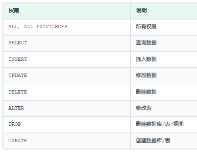

- [DDL](#ddl)
  - [数据库](#数据库)
  - [表](#表)
- [DML](#dml)
- [DCL](#dcl)

---

# DDL 

```sql
-- 查询所有数据库
show databases;

-- 进入数据库
use 数据库名;
-- 查询当前数据库所有表
show tables;
```
## 数据库
```sql
create database [ if not exists ] 数据库名 [ default charset 字符集 ] [ collate 排序
规则 ];

create database itcast;
create database if not extists itcast;
create database itheima default charset utf8mb4;
```
```sql
drop database [ if exists ] 数据库名;
```

## 表
```sql
-- 查看指定表结构
desc 表名;
-- 查询指定表的建表语句
show create table 表名 ;
```
```sql
-- 表名和字段名不需要用引号括起来，加了反而错！！！
create table tb_user
(
    -- 字段名 字段类型
    id      int(10)        not null   comment '编号',
    name    varchar(50)    not null   comment '姓名',
    age     int            not null   comment '年龄',
    gender  char(1)        not null   comment '性别',
    primary key (id)
) comment '用户表';
```
```sql
-- 修改表名 rename to
alter table 表名 rename to 新表名;

-- 添加字段 add
alter table 表名 add 字段名 类型 (长度) [ COMMENT 1 注释 ] [ 约束 ];

-- 修改数据类型 modify
alter table 表名 modify 字段名 新数据类型 (长度);

-- 修改字段名和字段类型 change
alter table 表名 change 旧字段名 新字段名 类型 (长度) [ COMMENT 1 注释 ] [ 约束 ];
alter table emp change nickname username varchar(30) comment '昵称';

-- 删除字段 drop
alter table 表名 drop 字段名;
```
```sql
-- 删除
DROP TABLE [ IF EXISTS ] 表名;

-- 清空数据
TRUNCATE TABLE 表名;
```

# DML

```sql
-- 指定字段添加数据
INSERT INTO 表名 (字段名1, 字段名2, ...) VALUES (值1, 值2, ...);
INSERT INTO 表名 (字段名1, 字段名2, ...) VALUES (值1, 值2, ...), (值1, 值2, ...);

-- 全部字段添加数据
INSERT INTO 表名 VALUES (值1, 值2, ...);
INSERT INTO 表名 VALUES (值1, 值2, ...), (值1, 值2, ...);
```

```sql
UPDATE 表名 SET 字段名1 = 值1 , 字段名2 = 值2 , .... 1 [ WHERE 条件 ] ;
-- 指定行
update employee set name = 'itheima' where id = 1;
-- 所有行
update employee set name = 'itheima';
```

```sql
DELETE FROM 表名 [ WHERE 条件 ] ;
delete from employee 1 where gender = '女';
delete from employee;
```
错，`DELETE * FROM 商品 WHERE 价格>3000`

对，`DELETE FROM 商品 WHERE 价格>3000`

DELETE不需要列名或通配符。DELETE 语句不能删除某一个字段的值(可以使用UPDATE，将该字段值置为NULL即可)，只能删除整行。

# DCL

```sql
-- 查询用户
select * from mysql.user;

-- 创建用户
CREATE USER '用户名'@'主机名' IDENTIFIED BY '密码';

-- 修改用户密码
ALTER USER '用户名'@'主机名' IDENTIFIED WITH mysql_native_password BY '新密码' ;

-- 删除用户
DROP USER '用户名'@'主机名' ;

• 主机名可以使用 % 通配
```

‘

```sql
-- 查询权限
SHOW GRANTS FOR '用户名'@'主机名' ;

-- 授予权限
GRANT 权限列表 ON 数据库名.表名 TO '用户名'@'主机名';
grant all on itcast.* to 'heima'@'%';   -- 授予 'heima'@'%' 用户itcast数据库所有表的所有操作权限

-- 撤销权限
REVOKE 权限列表 ON 数据库名.表名 FROM '用户名'@'主机名';


• 多个权限之间，使用逗号分隔
• 授权时， 数据库名和表名可以使用 * 进行通配，代表所有。
```