- [语法顺序和执行顺序](#语法顺序和执行顺序)
- [select](#select)
  - [条件](#条件)
- [连接 join](#连接-join)
- [where](#where)
- [group by](#group-by)
- [union](#union)
- [order by](#order-by)
- [limit](#limit)
- [子查询](#子查询)
- [聚合函数](#聚合函数)
- [窗口函数](#窗口函数)
- [函数](#函数)
- [别名](#别名)
- [distinct](#distinct)

---

## 语法顺序和执行顺序

SQL语句的语法顺序是：

```
select <字段名> 

from <表名> join <表名> on <连接条件>
where <筛选条件>
group by <字段名> having <筛选条件>

union 
order by <字段名>
limit <限制行数>
```

而执行顺序为：

```
from <表名> join <表名> on <连接条件>
where <筛选条件>
group by <字段名> having <筛选条件>

select <字段名> 

union 
order by <字段名>
limit <限制行数>
```
1. SELECT语句总是写在最前面，但在大部分语句之后才执行。所以在SQL语句中，我们不能在WHERE、GROUP BY、 HAVING语句中使用在 SELECT 中设定的别名

但是MYSQL有个特性，在GROUP BY、 HAVING语句中，可以使用 SELECT 中设定的别名。这不是因为MYSQL中会提前执行SELECT，而是因为在GROUP BY这一步返回了游标，大家了解一下就好

2. FROM才是SQL语句执行的第一步，并非SELECT。数据库在执行SQL语句的第一步是将数据从硬盘加载到数据缓冲区中，以便对这些数据进行操作。

3. 所有的筛选完成后，才 select 选择结果表中的列。

3. 无论是书写顺序，还是执行顺序，UNION 都是排在 ORDER BY 前面的。SQL语句会将所有UNION 段合并后，再进行排序。
## select


### 条件
```sql
-- `=` 
where s.emp_no = d.emp_no;

-- `_` 单个任意字符
select * from emp where name like '__';
-- `%` 任意多个任意字符
select * from emp where idcard like '%X';
```

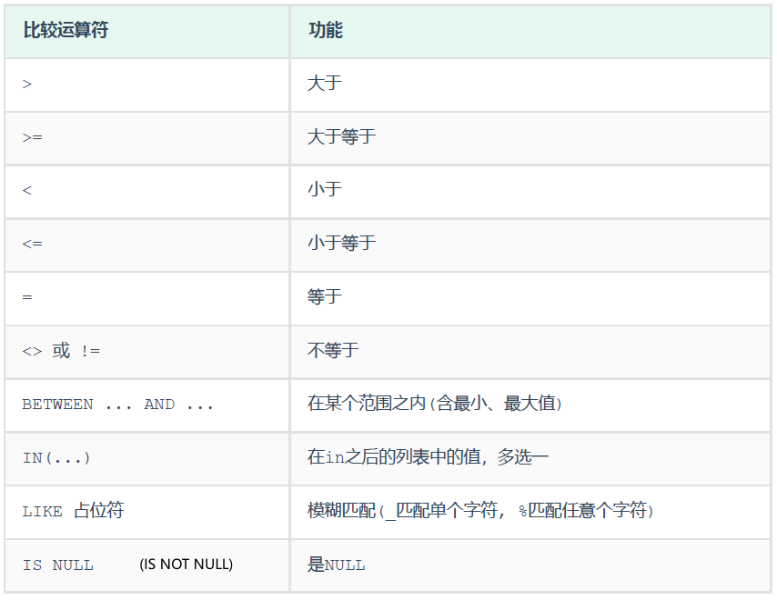

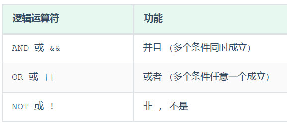

## 连接 join

内连接、左外连接、右外连接、自连接。

- 内连接 [inner] join：各表中都匹配，则返回行
- 左外连接 left [outer] join：即使右表中没有匹配，也从左表返回所有的行
- 右外连接 right [outer] join：即使左表中没有匹配，也从右表返回所有的行
- 【mysql不支持】full join：只要其中一个表中存在匹配，则返回行

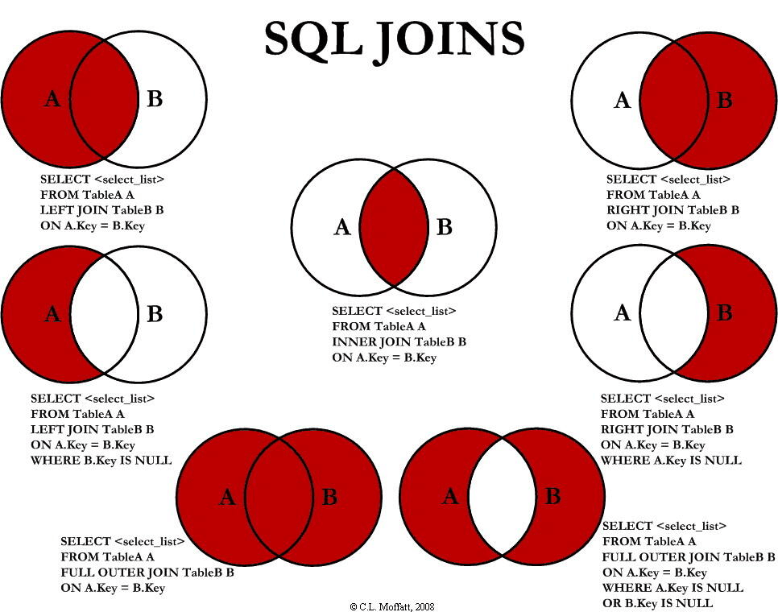

在on中是相等。在where中是null。


> 连接中的null

`on t1.name = t2.name`中，null不参与比较，则都被过滤，null只有is null/is not null.

inner join 不对null 的记录进行连接（都匹配才行）

left / right /full join 都会对null的记录进行连接 （即使没有匹配）

> 多表笛卡尔: 隐式内连接

```sql
-- 显式内连接
select a.name
from a join b on a.name = b.name
where date = '1920';

-- 隐式内连接：把on的条件放在where中的
select a.name
from a, b
where a.name = b.name and date = '1920';
```
```sql
-- sql 218
select t1.*
from 
(
    select de.dept_no, e.emp_no, s.salary
    from employees e, dept_emp de, salaries s
    where e.emp_no = de.emp_no and de.emp_no = s.emp_no 
) t1
join dept_manager t2 on t1.dept_no = t2.dept_no
where t1.emp_no != t2.emp_no

SELECT de.dept_no,  e.emp_no, s.salary 
FROM employees e, dept_emp de, dept_manager dm, salaries s 
WHERE
    e.emp_no = de.emp_no 
    AND de.emp_no = s.emp_no         -- e.emp_no = s.emp_no
    AND de.dept_no = dm.dept_no 
    AND s.emp_no != dm.emp_no;        -- s.emp_no，换成 e,de,s都行
```
sql219就不建议了，说是笛卡尔的结果$n^4$。
```sql
-- sql219
select t1.emp_no, t2.emp_no,t1.salary, t2.salary
from
-- 员工、部门、员工薪资
(
    select de.emp_no, de.dept_no, s.salary
    from dept_emp de join salaries s on de.emp_no = s.emp_no
) t1
join
-- 领导、部门、领导薪资
(
    select dm.emp_no, dm.dept_no, s.salary
    from dept_manager dm join salaries s on dm.emp_no = s.emp_no
) t2
-- 部门为连接，员工-部门-领导-员工薪资-领导薪资
on t1.dept_no = t2.dept_no
-- 非领导、薪资高
where t1.emp_no != t2.emp_no and t1.salary > t2.salary;


select de.emp_no, dm.emp_no, s1.salary, s2.salary
from dept_emp de, dept_manager dm, salaries s1, salaries s2
where de.emp_no = s1.emp_no         -- 员工薪资
    and dm.emp_no = s2.emp_no       -- 领导薪资
    and de.dept_no = dm.dept_no     -- 部分为连接
    and de.emp_no != dm.emp_no      -- 非领导
    and s1.salary > s2.salary;      -- 高薪资
```

> mysql实现不支持的 full join 。

韦恩图：全连接是左圆去掉交集部分（左连结且右表字段是null）+交集部分+右圆去掉交集部分（右连结且左表字段是null）。
- 内连接是两圆的交集，
- 左连接是左圆，
- 右连接是右圆，

“去掉”在代码里表示出来就是`XX IS NULL`。

## where

顺序问题
```sql
-- 返回结果并不是先5后1，而是根据主键排序
select * from user where id in ( 5, 1)
-- 指定顺序 field
select * from user where id in ( 5, 1) order by field(id, 5, 1)
```

## group by


```sql
select emp_no, count(*) as t
from salaries
group by emp_no     -- 每组emp_no 有多行
having t > 15;      -- 去掉不符合结果的组。本来这里是 count(*) > 15，但GROUP BY、 HAVING语句中，可以使用 SELECT 中设定的别名。
```


## union

union all 会将全部的数据直接合并在一起，union 会对合并之后的数据去重。所以常用后者union

```sql
-- 统计的是总记录数
select count(1) from emp;
select count(*) from emp;
-- 统计的是idcard字段不为null的记录数
select count(idcard) from emp; 
```

## order by

asc/desc写在列后面
```sql
-- 默认升序
order by hire_date [asc]         -- 升序可不写

-- 降序
order by hire_date desc 
```
多个字段排序，要分别紧跟写顺序规则
```sql
order by hire_date desc, gender [asc]       -- 升序可不写
```
## limit

个数和offset(跳过几个，即从索引 k 开始)
```sql
-- 第一名：从第一名开始选一个
limit 1;
limit 1 offset 0;
limit 0,1;          -- 把offset融合在前面了


-- 第二名：从第二名开始选一个
limit 1,1;
limit 1 offset 1;       

-- 第二、三、四名：从第2名开始，选3个
limit 1,3;
limit 3 offset 1
```

起始索引从0开始，`起始索引 = （第几页 - 1）* 每页显示记录数`

```sql
-- 查询第2页员工数据, 每页展示10条记录
select * from emp limit 10,10;
```

## 子查询

如果子查询只有一行，那ok
```sql
-- 用 `= (子查询)`
select * from table1 where id = (select id from table2);
```

如果子查询不止一行，那么就会报错 Subquery returns more than 1 row，等于符号不能用了

1）如果是写入重复，去掉重复数据。
```sql
select * from table1 where id = (select distinct id from table2);
```
2）在子查询条件语句加limit 1 ,找到一个符合条件的就可以了
```sql
select * from table1 where id = (select id from table2 limit 1);
```
3）在子查询前加any关键字 🚀
```sql
select * from table1 where id = any(select id from table2);
```

4）=换成in

```sql
select * from table1 where id in (select id from table2);
```

## 聚合函数

count、max、min、avg、sum

NULL值是不参与所有聚合函数运算的。

使用：
- select 后面。
- where不能对聚合函数进行判断，而分组后的having可以。
- 分组之后，查询的字段一般为**分组字段、聚合函数**，查询其他字段无任何意义

```sql
-- select
select min(age) 最小值 from emp;


-- 单个字段
select gender 数量 from emp group by gender;
-- 多个字段
select workaddress, gender 数量 from emp group by gender , workaddress;


-- 聚合函数
select gender, age from emp group by gender;   -- error，因为每个组中的 age 有多个值，不知道选哪个
select gender, max(age) from emp group by gender;   -- 使用聚合函数后的age结果就只有一个，ok
```

> 比较奇特的写法

```sql
-- sql217: 将列值传给表，表用聚合函数作为结果
SELECT s1.emp_no, s1.salary,
(
    SELECT COUNT(DISTINCT s2.salary) 
    FROM salaries s2 
    WHERE s2.salary >= s1.salary
) AS `rank`  -- 去重：计算并列排名
FROM salaries s1 
ORDER BY s1.salary DESC, s1.emp_no;
```

## 窗口函数
窗口函数写在select子句中
```sql
-- 分组，组内排名
<窗口函数> over ( [partition by <用于分组的列名>] [order by <用于排序的列名>])
```
`<窗口函数>`: 

- 专用窗口函数，比如rank, dense_rank, row_number
- 聚合函数，如sum. avg, count, max, min

> 省略分组：当前行及其之上

```sql
select *,
    -- 并列名次的行，会占用下一名次的位置。
    rank() over (order by 成绩 desc) as ranking,
    -- 并列名次的行，不占用下一名次的位置
    dense_rank() over (order by 成绩 desc) as dese_rank,
    -- 不考虑并列名次
    row_number() over (order by 成绩 desc) as row_num
from 班级表
```
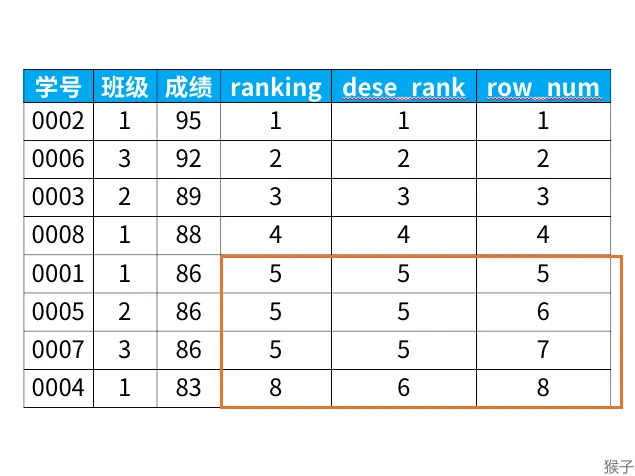


```sql
select *,
    sum(成绩) over (order by 学号) as current_sum,
    avg(成绩) over (order by 学号) as current_avg,
    count(成绩) over (order by 学号) as current_count,
    max(成绩) over (order by 学号) as current_max,
    min(成绩) over (order by 学号) as current_min
from 班级表
```

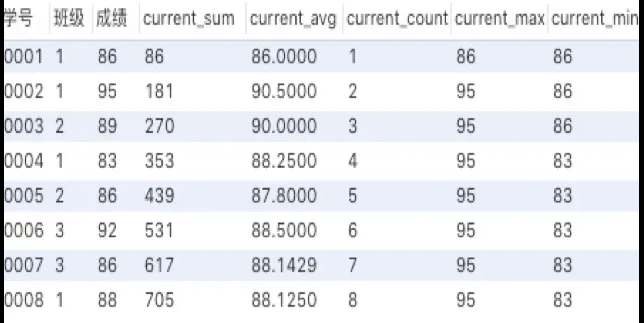

> 例子：sql217

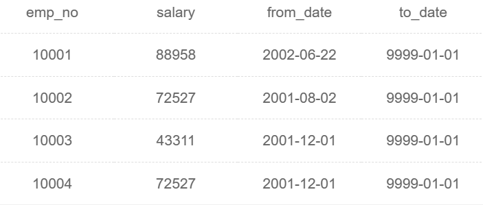

```sql
-- 不分组、不排序：整张表的和
select emp_no, salary, sum(emp_no) over () as t_rank
from salaries
```
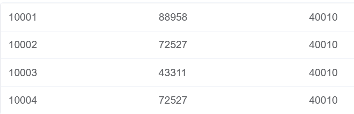
```sql
-- 不分组，72527有3个10001 10002 10004：看的是所有的72527
select emp_no, salary, sum(emp_no) over (order by salary desc) as t_rank
from salaries
```
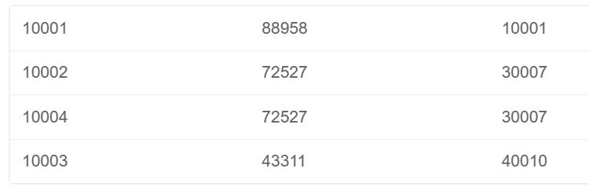

```sql
-- 72527组有两个10002 10004
select emp_no, salary, sum(emp_no) over (partition by salary) as t_rank
from salaries
```
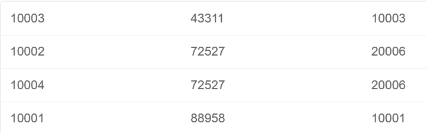

```sql
select emp_no, salary, sum(emp_no) over (partition by salary order by salary desc) as t_rank
from salaries
```
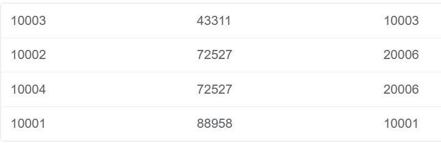

> 可以多列

```sql
-- SQL220
select distinct de.dept_no, d.dept_name, t.title, count(1) over (partition by dept_no, title)
from dept_emp de, titles t, departments d
where de.emp_no = t.emp_no and de.dept_no = d.dept_no
order by dept_no, title
```

> 与group的区别：不会减少原表中的行数

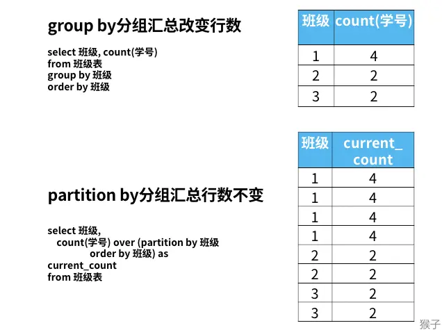

## 函数
字符串函数
```sql
select concat('Hello', ' ', ' MySQL');
select lower('Hello');
select upper('Hello');
select lpad('13', 5, '0');    -- 统一为5位数，目前不足5位数的全部在前面补0
select rpad('13', 5, '-');  
select trim(' Hello MySQL ');
select substring('Hello MySQL',1,3);  -- 从第1个字符开始，截取3个字符。结果是Hel
```
数值函数

```sql
select ceil(1.1);
select floor(1.9);
select mod(7,4);    -- 7%4
select rand();      -- [0.0, 1.0]
select round(2.344,2);  -- 保留2位小数

-- 生成一个六位数的随机验证码。
select lpad(round(rand()*1000000 , 0), 6, '0');
```
日期函数

```sql
select curdate();     -- 2024-05-10
select curtime();     -- 19:18:28
select now();         -- 2024-05-10 19:18:28
select YEAR(now());   -- 2024
select MONTH(now());  -- 5
select DAY(now());    -- 10
select date_add(now(), INTERVAL 70 YEAR );    -- 2094-05-10 19:19:32
select datediff('2021-10-01', '2021-12-01');  -- -61  返回天
数
```

流程函数
```sql
select if(false, 'Ok', 'Error');    -- true Ok, false Error


-- (value1 , value2): 输入值是value1，如果非空则返回自身，空则返回value2)
select ifnull('Ok','it is null');      -- OK
select ifnull('','it is null');        -- 
select ifnull(null,'it is null');      -- it is null


-- 查询emp表的员工姓名和工作地址 (北京/上海 ----> 一线城市 , 其他 ----> 二线城市)
select name,
( case workaddress when '北京' then '一线城市' when '上海' then '一线城市' else
'二线城市' end ) as '工作地址'
from emp;

(case when math >= 85 then '优秀' when math >=60 then '及格' else '不及格' end )
'数学',
```

## 别名

都可以省略as
```sql
SELECT 字段1 [ [AS] 字段别名1 ] , 字段2 [ [AS] 字段别名2 1 ] ... 
FROM 表名 [ [AS] 表别名1 ];
```

> 多表引用名

如果唯一，那么不用指定表名；不唯一，则需要指定表名。

嫌指定表明麻烦，可以使用别名。

> 引号问题

列别名的引号，有没有都行。除非列名和关键字冲突
```sql
SELECT emp_no as rank     -- error, rank是关键字
SELECT emp_no as 'rank'     -- ok
```

表别名不能有引号。`from employees 'e'` 错。

而比较的字符串，必须有引号 `last_name != 'Mary'`

> 在GROUP BY、 HAVING语句中，可以使用 SELECT 中设定的别名。但注意别名模糊问题

```sql
select d.dept_no dept_no, count(dept_no) sum    -- 前面的别名就可以用于聚合函数中了

select t1.emp_no emp_no, count(t1.emp_no) sum   -- error: 但如果别名和两表中列名重复了，那么别名就是模糊的，不能使用
from
(
    select emp_no, salary
    from salaries
    order by salary desc, emp_no asc
) t1 
join
(
    select emp_no, salary
    from salaries
    order by salary desc, emp_no asc
) t2
on t1.salary <= t2.salary 
group by emp_no;        -- 应该是t1.emp_no
```
Select后执行的语句（union order by）是根据select选择的列名，不存在模糊问题。
```sql
select distinct de.dept_no, d.dept_name, t.title, de.emp_no, count(1) over (partition by dept_no, title)
from dept_emp de, titles t, departments d
where de.emp_no = t.emp_no and de.dept_no = d.dept_no
order by dept_no, title, emp_no     -- 这里的dept_no，emp_no


-- error：除非 de.dept_no, d.dept_no 又引起模糊了
select distinct de.dept_no, d.dept_no, d.dept_name, t.title, count(1) over (partition by dept_no, title)
from dept_emp de, titles t, departments d
where de.emp_no = t.emp_no and de.dept_no = d.dept_no
order by dept_no, title
```

> 一定要给子表起别名

```sql
-- 错误
select emp_no, count(emp_no)
from
(
    select emp_no, salary
    from salaries
    order by salary desc, emp_no asc
) 
group by emp_no;

-- 正确
select t1.emp_no, count(t1.emp_no)
from
(
    select emp_no, salary
    from salaries
    order by salary desc, emp_no asc
) t1     -- 起别名
group by t1.emp_no;
```


## distinct

- select中
- 聚合函数中
    
1、distinct语句中select显示的字段只能是distinct指定的字段，其他字段是不可能出现的。
```sql
-- 单个去重
select distinct name from A;            -- 结果是name
-- 根据name和id两个字段来去重的
select distinct name,age from A;        -- 结果是name和age
```
distinct必须放在开头。例如，假如表A有“id”列，如果想获取distinc name，以及对应的“id”字段，想直接通过distinct是不可能实现的。`select id, distinct name from A;`


2、聚合函数

```sql
select s1.salary
from salaries s1 join salaries s2 on s1.salary <= s2.salary        -- 自连接查询
group by s1.salary                     -- 当s1<=s2链接并以s1.salary分组时一个s1会对应多个s2
having count(distinct s2.salary) = 2;   -- (去重之后的数量就是对应的名次)
```