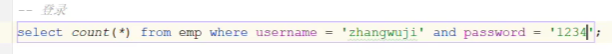
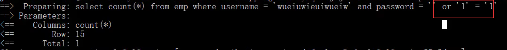
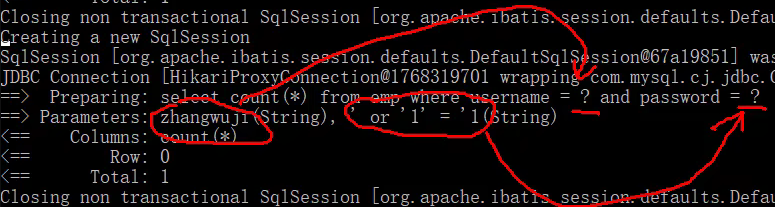

## sql注入

### 登陆校验


登陆，校验用户名和密码，只需统计count结果是0还是大于0.

`' or '1'='1`



预编译sql，将整个字符串作为一个参数传入，避免了sql注入问题。



### 模糊匹配

```java
// 因为 #{}不能出现在 '' 中：name like '%#{name}%'

name like '%${name}%'

name like concat('%', #{name}, '%')
```

