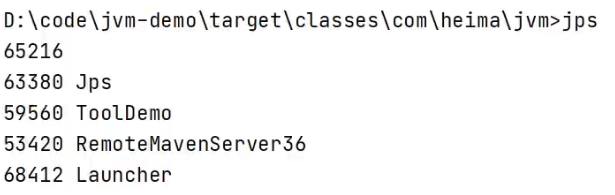

B+Tree结构：

- 每一个节点，存储n个key + n个指针
- 节点分为：叶子节点、非叶子节点
  - 非叶子节点，用于索引数据，存储的的是：key+指针
  - 叶子节点，所有的数据都存储在叶子节点上。
- 为了提高范围查询效率，叶子节点形成了一个双向链表，并且底层已经实现了按照索引进行排序，还可以支持范围查询

> **拓展：**
>
> 非叶子节点都是由key+指针域组成的，一个key占8字节，一个指针占6字节，而一个节点总共容量是16KB，那么可以计算出一个节点可以存储的元素个数：16*1024字节 / (8+6)=1170个元素。
>
> - 查看mysql索引节点大小：show global status like 'innodb_page_size';    -- 节点大小：16384
>
> 当根节点中可以存储1170个元素，那么根据每个元素的地址值又会找到下面的子节点，每个子节点也会存储1170个元素，那么第二层即第二次IO的时候就会找到数据大概是：1170*1170=135W。也就是说B+Tree数据结构中只需要经历两次磁盘IO就可以找到135W条数据。
>
> 对于第二层每个元素有指针，那么会找到第三层，第三层由key+数据组成，假设key+数据总大小是1KB，而每个节点一共能存储16KB，所以一个第三层一个节点大概可以存储16个元素(即16条记录)。那么结合第二层每个元素通过指针域找到第三层的节点，第二层一共是135W个元素，那么第三层总元素大小就是：135W*16结果就是2000W+的元素个数。
>
> 结合上述分析B+Tree有如下优点：
>
> - 千万条数据，B+Tree可以控制在小于等于3的高度
