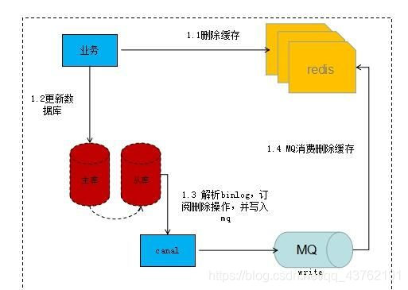
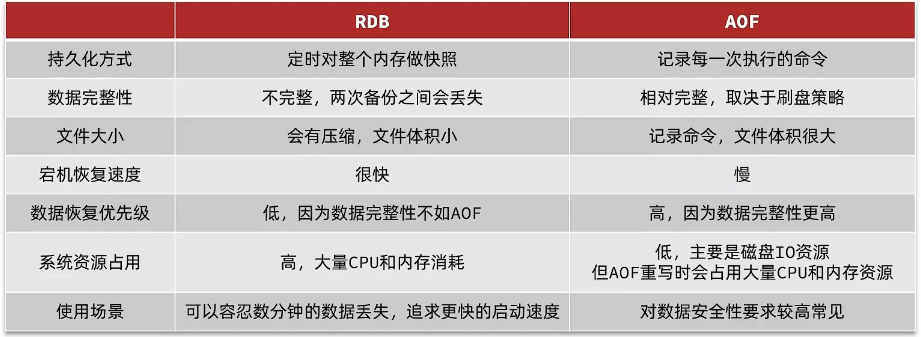

扩容：老表、新表、渐进

过期删除策略：定时、惰性（后来线程，LRU+随机删）、get时

一致性hash环

热更新：ack错误+重新请求到新节点

热key：多级缓存

大key：


---

## 缓存更新
内存淘汰、主动更新、超时剔除

- 低一致需求：内存淘汰
- 高一致需求：主动更新，并超时剔除作为兜底


主动更新：
- Cache Aside 
- Read/Write Through
- Write Behind Caching

Cache Aside：
- 删除缓存还是更新缓存：删除缓存
- 为了保证事务，单体系统还是分布式系统：
- 先操作缓存还是先数据库：先写后删好


读：命中就返，未中则查库，写入缓存+设置超时
写：先写后删

## 缓存穿透、缓存雪崩、缓存击穿

缓存穿透：缓存和数据库都不存在的无效数据，在打到数据库后返回不存在，还会再次被打。
- 缓存空对象(TTL)：
	
	实现简单。

	多余key消耗内存、短期不一致
- 布隆过滤：

	内存占用少。

	误判。不存在则真不存在，存在是可能存在。
- 业务：增强id复杂度，避免恶意攻击；数据基础格式校验；加强用户权限校验；热点参数限流。


缓存雪崩：大量key同时过期或Redis节点宕机，导致直接打到数据库。
- 大量key同时过期：随机TTL
- Redis节点宕机：集群
- 业务：降级限流、多级缓存


缓存击穿：热点key（高并发、缓存业务复杂(才写缓存慢，让很多线程有时间去查)）失效，大量请求数据库去查询缓存数据。
- 互斥锁
- 逻辑过期
## 全局唯一ID

订单表id自增的问题：
- 订单号容易被猜出来，不安全
- 千万级就要分表，分表后表各自自增，不统一。


全局唯一ID生成策略：
- UUID
- Redis自增策略：符号位0、时间戳31bit、计数器32bit；每天一个key，值就是计数器，方便统计订单量；
- 雪花算法
- 数据库自增表获取自增id。

## 库存超卖

扣库存update时加锁
- 悲观锁：添加同步锁，让线程串行执行
- 乐观锁：不加锁，只在更新时判断是否有其他线程在修改。
    - 版本号法、cas法（融合版本号，判断是否是原值）
    - 解决成功率低：where stock > 0

一人一单：去db查单，但查耗时，会同时判定通过。
- synchronized锁。但在集群下失效，不同JVM内部的常量池让锁失效了。
- 分布式锁。

分布式锁：
- mysql
- zookeeper：节点唯一性和有序性
- redis：基于setnx实现；Redisson。


1）不可重入的Redis分布式锁：set nx ex，存线程UUID，lua脚本判断线程标示并删除
→setnx加锁+del释放。
→expire锁超时释放（解决del前宕机而死锁）
→set lock value ex 10 nx（原子操作，解决expire前宕机）
→锁存线程UUID，del锁判断是否是自己（业务阻塞而锁过期，业务恢复而删除了B业务的锁，让C业务申请到了而和B业务同时执行）
→判断锁标识和释放成为原子性，LUA脚本（判断后阻塞，超时释放，释放锁又释放别人的锁了）

缺陷：不可重入、无法重试、业务耗时久而导致锁超时失效。


2）可重入的Redisson分布式锁：
- 可重入：利用hash结构记录线程id和重入次数。
- 可重试：利用信号量和发布订阅功能实现等待唤醒，获取锁失败的重试机制。
- 超时续约：利用watchdog，每隔一段时间重置超时时间。

缺陷：主从模式下redis主节点宕机引起锁失效。

3）multiLock
- 多个独立的Redis结点
- 去每个节点都获取锁。只有所有节点都获取重入锁，才算取锁成功。

缺陷：运维成本高、实现复杂。




## 秒杀业务的优化：基于阻塞队列的异步秒杀

将抢单业务和下单业务分离。

1. redis负责判断库存、一人一单，将订单放入阻塞队列。
2. 独立线程异步下单，从阻塞队列中取出，完成数据库操作。

缺陷：
- 内存限制：阻塞队列是基于JDK的BlockQueue，虽然设置了容量上线，但占用JVM总内存。
- 数据安全：宕机丢失、阻塞队列取出后如果出错就无法恢复订单。


## redis持久化

Redis有两种持久化方案：

- RDB持久化
- AOF持久化

### RDB redis数据快照。

内存数据→磁盘文件。

save主进程执行RDB，bgsave子进程执行RDB。

RDB持久化在四种情况下会执行：

- 执行save命令
- 执行bgsave命令
- 停机前执行一次save
- 触发RDB条件，每隔一段时间bgsave一次，防止宕机丢失


bgsave过程：
- 子进程fork主进程，复制页表，共享内存空间。
- 子进程读取内存数据，写入新的RDB文件。
- 写完用新的替换旧的。

缺点：
- rdb执行间隔长，期间写入数据有丢失风险。
- fork进程、压缩、写出都耗时。
- fork采用copy-on-write，读时共享，写时拷贝副本，内存占用翻倍。


```properties
# redis.conf

# 触发时机：900秒内，如果至少有1个key被修改，则执行bgsave ， 如果是save "" 则表示禁用RDB
# 留一个save就行
save 900 1  
save 300 10  
save 60 10000 
save ""


# 是否压缩 ,建议不开启，压缩也会消耗cpu，磁盘的话不值钱
rdbcompression yes

# RDB文件名称
dbfilename dump.rdb  

# 文件保存的路径目录
dir ./ 
```

### AOF追加文件

记录命令日志。

- 时机：同步刷盘、每秒刷盘（默认）、操作系统决定刷盘。
- aof文件比rdb文件大。引入aof重写（对同一个key的多次写操作，但只有最后一次写操作才有意义），`bgrewriteaof`。
- bgrewriteaof，重写命令+压缩保存。触发：最小阈值、上次百分比。


```properties
# 是否开启AOF功能，AOF默认是关闭的
appendonly yes
# AOF文件的名称
appendfilename "appendonly.aof"


# AOF的命令记录的频率
# 表示每执行一次写命令，立即记录到AOF文件
appendfsync always 
# 写命令执行完先放入AOF缓冲区，然后表示每隔1秒将缓冲区数据写到AOF文件，是默认方案
appendfsync everysec 
# 写命令执行完先放入AOF缓冲区，由操作系统决定何时将缓冲区内容写回磁盘
appendfsync no


# 重写触发阈值
# AOF文件比上次文件 增长超过多少百分比则触发重写
auto-aof-rewrite-percentage 100
# AOF文件体积最小多大以上才触发重写 
auto-aof-rewrite-min-size 64mb 
```




