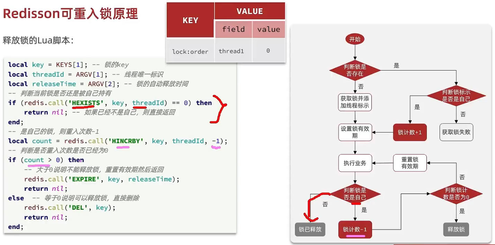
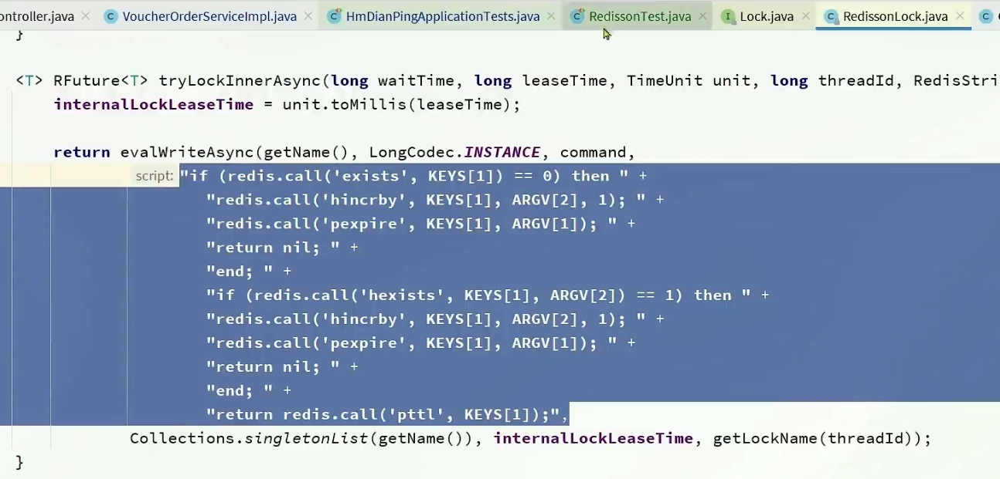
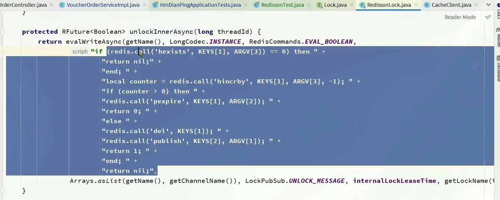
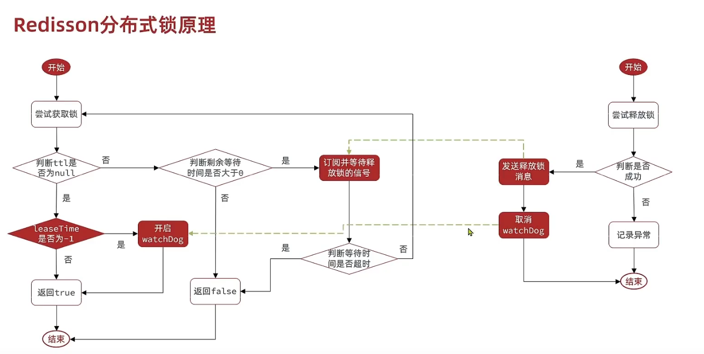
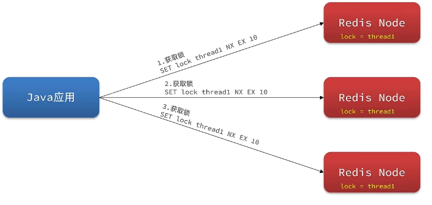
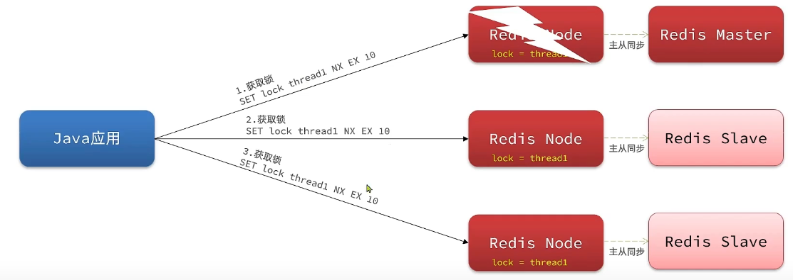

- [redisson 的普通锁 getLock](#redisson-的普通锁-getlock)
- [redisson 可重入机制](#redisson-可重入机制)
- [redisson 可重试机制](#redisson-可重试机制)
- [redisson 超时续约](#redisson-超时续约)
- [redisson 主从一致问题 multiLock](#redisson-主从一致问题-multilock)

---

## redisson 的普通锁 getLock

- 可重入
- 可重试
- 可超时续约

缺陷：redis多节点时，主宕机引起锁失效（让每个redis都设置锁，主给从同步锁信息就是同步key。主获取了锁，要同步给从，让从也设置锁，但是同步时宕机，从被选为主时，发现没有锁就重新申请锁）。

## redisson 可重入机制

利用**hash**结构记录，**获取锁的线程**和**重入次数**。

## redisson 可重试机制

不是循环等待，而是利用**信号量和PubSub机制**实现等待唤醒。

## redisson 超时续约：看门狗

利用**watchDog**机制，每隔一段时间(releaseTime/3)，重置超时时间。

- `TimeOut`定时任务，递归调用自己。
- `EXPIRATION_RENEWAL_MAP` concurrentHashMap

是静态final的。

map中存 `ExpirationEntry`，key 是 entry的名字（线程id + 锁名称），value是entry。

一个锁对应一个entry，每个entry上有线程id

## redisson 主从一致问题 multiLock

> 不要主从关系了，多个独立的Redis结点

去每个节点都获取锁。只有所有节点都获取重入锁，才算取锁成功。比如，当有一个节点挂掉时，新线程只能获取部分节点的锁，才不能获取锁。

> 可以在独立节点上再加主从节点

当从被选为主，新线程从新主上获取了锁，但从其他老主上获取不到，从而不能获取锁。

> 缺陷：运维成本高、实现复杂。