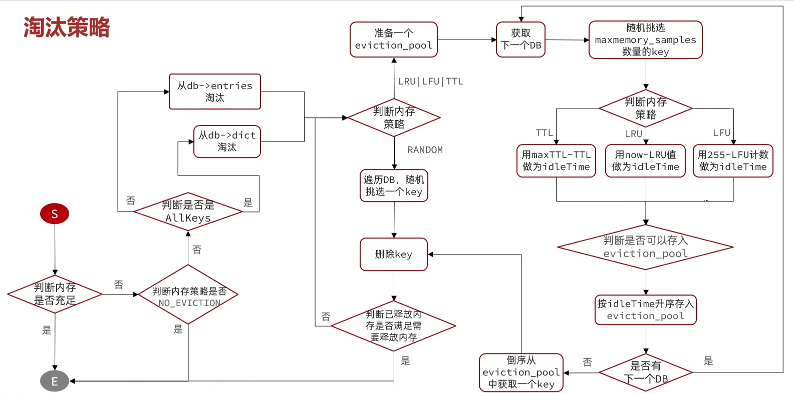

---

## LFU

LFU的访问次数之所以叫做逻辑访问次数，是因为并不是每次key被访问都计数，而是通过运算：

有增有衰：
* 生成0~1之间的随机数R，根据公式(旧次数 * lfu_log_factor + 1)，算出概率P，这个概率是从1递减。如果 R < P ，则计数器 + 1，且最大不超过255。
* 访问次数会随时间衰减，距离上一次访问时间每隔 lfu_decay_time 分钟，计数器 -1