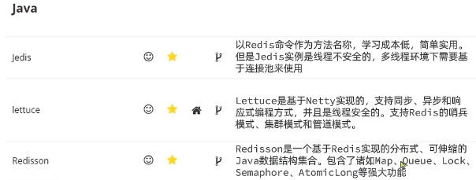

- [NoSQL](#nosql)
- [Redis](#redis)
- [数据结构](#数据结构)

---
## NoSQL

1. 非结构化

    Redis存储Key-Value键值对；MongoDB存储文档Document型；HBase存储列类型；Neo4j图类型Graph。
2. 无关联

    没有主键外键的关系；内容重复。
3. 非SQL

    没有固定语法。Redis、MongoDB、elasticsearch都有各自的语法。
4. 事务BASE

    要么没有事务，要么不全满足事务的ACID。
5. 存储方式：内存。
   - 关系型数据库基于磁盘进行存储，会有大量的磁盘IO，对性能有一定影响
   - 非关系型数据库，他们的操作更多的是依赖于内存来操作，内存的读写速度会非常快，性能自然会好一些
6. 扩展方式：水平。
   * 关系型数据库集群模式一般是**主从**，主从数据一致，起到数据备份的作用，称为**垂直扩展**。关系型数据库因为表之间存在关联关系，如果做水平扩展会给数据查询带来很多麻烦
   * 非关系型数据库可以将数据拆分，存储在不同机器上，可以保存海量数据，解决内存大小有限的问题。称为**水平扩展**。

## Redis

Remote Dictionary Server远程词典服务器，一个基于内存的键值型NoSQL数据库。

特征：
- 键值型。
- 单线程，每个命令具备原子性。
- 低延迟、速度快：**基于内存**（核心原因）、IO多路复用、基于C语言且编码良好
- 支持数据持久化（解决了内存断电丢失的弊端）
- 支持主从集群、分片集群
- 支持多语言客户端。

## 数据结构

key一般是String类型，value的类型多种多样。
- 五种基本类型：String、Hash、List、Set、SortedSet
- 三种特殊类型：Geo、BitMap、HyperLog

