- [1. 底层数据结构](#1-底层数据结构)
  - [1.1. 动态字符串SDS](#11-动态字符串sds)
  - [1.2. intSet](#12-intset)
  - [1.3. Dict/HashTable](#13-dicthashtable)
  - [1.4. ZipList压缩列表](#14-ziplist压缩列表)
  - [1.5. QuickList快速列表](#15-quicklist快速列表)
  - [1.6. SkipList跳表](#16-skiplist跳表)
- [2. RedisObject](#2-redisobject)
  - [2.1. String](#21-string)
  - [2.2. List](#22-list)
  - [2.3. Set](#23-set)
  - [2.4. ZSET](#24-zset)
  - [2.5. Hash](#25-hash)

---
# 1. 底层数据结构
## 1.1. 动态字符串SDS

Redis没有直接使用C语言中的字符串，因为C语言字符串存在很多问题：
- 获取字符串长度，需要遍历O(n)
- 非二进制安全(不能存特殊字符`\0`)
- 不能扩容，造成缓存区溢出

SDS是一个结构体：
- 头：len、alloc（实际空间为alloc+1）、flags（5、8、16、32、64，控制len和alloc数字的大小，单位bit）
- buf：字符数组

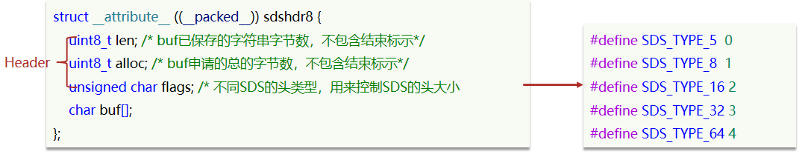

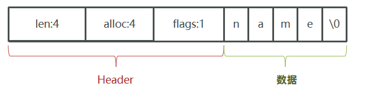

内存预分配：
- 如果新字符串小于1M，则新空间为扩展后字符串长度的两倍+1；
- 如果新字符串大于1M，则新空间为扩展后字符串长度+1M+1。

优点：
- 直接获取字符串长度，O(1)
- 二进制安全
- 支持动态扩容
- 内存预分配，减少内存分配次数

## 1.2. intSet

长度可变、有序

结构体：
- 头：encoding编码方式（）、length元素个数
- contents: 整数数组（存储元素的内容类型实际上是根据encoding字段决定的）。

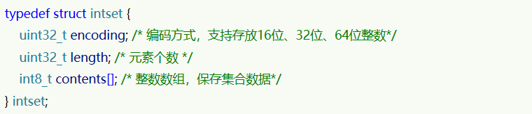

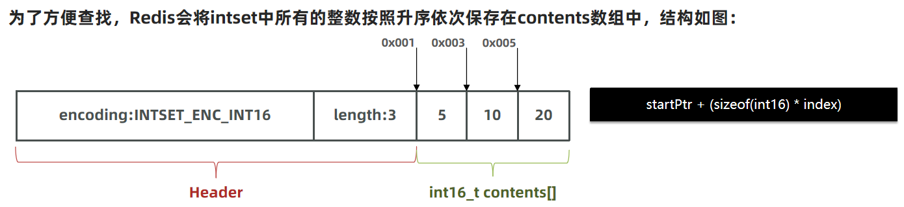

intset中所有的整数按照**升序**依次保存在contents数组中，从而可以使用**二分查找**来查询元素。
  
encoding升级：
* 根据新数字的大小找到合适的编码方式
* 倒序依次将数组中的元素拷贝到扩容后的正确位置
* 如果待添加的元素大，将其放入数组末尾；如果小，则首。
* 最后，将inset的encoding属性改为INTSET_ENC_INT32，修改length属性

## 1.3. Dict/HashTable

Dict的结构：

* 类似java的HashTable，底层是数组加单向链表来解决哈希冲突
* Dict组成，哈希表（DictHashTable）、哈希节点（DictEntry）、
* Dict包含两个哈希表，ht[0]平常用，ht[1]用来rehash

Dict的伸缩：

* 当LoadFactor(userd/size)大于5或者LoadFactor大于1并且没有子进程任务时，Dict扩容
* 当LoadFactor小于0.1时，Dict收缩
* 扩容大小为第一个大于等于used + 1的2^n
* 收缩大小为第一个大于等于used 的2^n
* Dict采用渐进式rehash，每次访问Dict时执行一次rehash
* rehash时ht[0]只减不增，新增操作只在ht[1]执行，查改删操作在两个哈希表

Dict的缺点：
- 内存不连续，内存碎片
- 指针占据空间

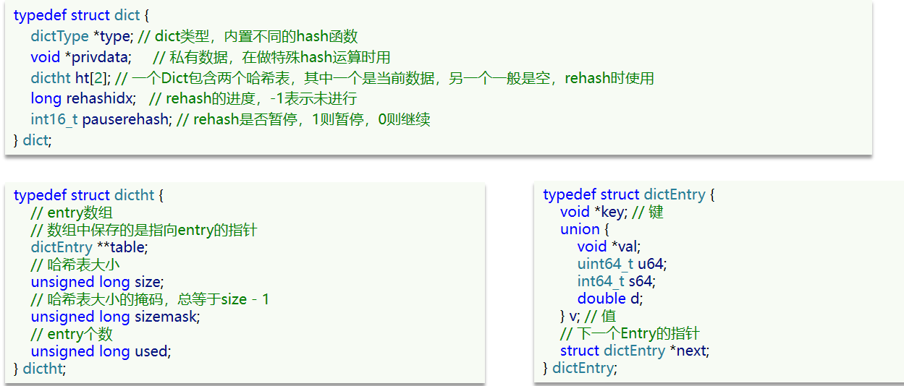

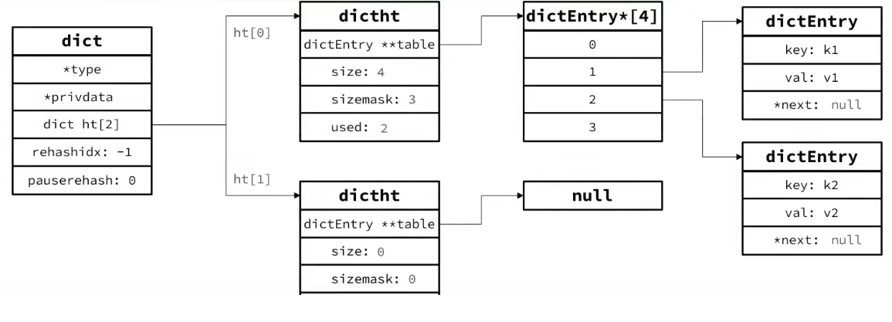

渐进式rehash:

不管是扩容还是收缩，必定会创建新的哈希表，导致哈希表的size和sizemask变化，而key的查询与sizemask有关。因此必须对哈希表中的每一个key重新计算索引，插入新的哈希表，这个过程称为rehash。
* 计算新hash表的realeSize，值取决于当前要做的是扩容还是收缩：
  * 如果是扩容,则新size为第一个大于等于`dict.ht[0].used + 1`的2^n`
  * 如果是收缩，则新size为第一个大于等于`dict.ht[0].used`的2^n （不得小于4）

* 按照新的realeSize申请内存空间，创建dictht，并赋值给`dict.ht[1]`
* 设置`dict.rehashidx = 0`，标示开始rehash
* 将`dict.ht[0]`中的每一个dictEntry都rehash到`dict.ht[1]`
* 将`dict.ht[1]`赋值给`dict.ht[0]`，给`dict.ht[1]`初始化为空哈希表，释放原来的`dict.ht[0]`的内存
* 将rehashidx赋值为-1，代表rehash结束
* 在rehash过程中，新增操作，则直接写入`ht[1]`，查询、修改和删除则会在`dict.ht[0]`和`dict.ht[1]`依次查找并执行。这样可以确保`ht[0]`的数据只减不增，随着rehash最终为空

## 1.4. ZipList压缩列表

* 压缩列表的可以看做一种**连续内存**空间的"双向链表"，可以在任意一端进行压入/弹出操作
* 列表的节点之间不是通过指针连接，而是记录**上一节点长度和本节点长度**来寻址，内存占用较低

缺点：
* 增或删较大数据时有可能发生连锁更新问题
* 列表数据不能过多，一是可能影响查询性能，二是申请内存必须是连续空间，如果内存占用较多，申请内存效率很低。

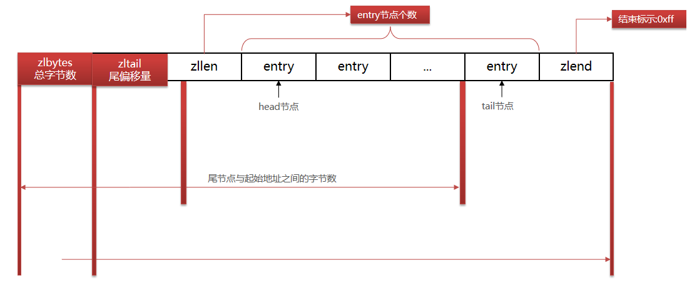

ZipListEntry：encoding编码分为字符串和整数两种。
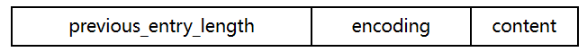

连锁更新问题：
- N个连续的、长度为250~253字节之间的entry。所以实际很难遇到。
- 新增、删除都可能导致连锁更新的发生。

## 1.5. QuickList快速列表

* 是一个节点为ZipList的双端链表
* 控制了ZipList大小，解决连续内存空间申请效率问题
* 中间节点可以压缩，进一步节省了内存

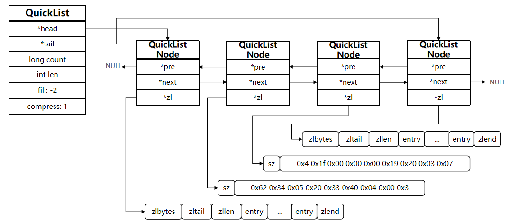

## 1.6. SkipList跳表

* 跳表是一个双向链表，每个节点都包含score（排序）和ele值（实际元素）
* 节点按照score值排序，score值一样则按照ele字典排序
* 每个节点都可以包含多层指针，层数是1到32之间的随机数。不同层指针到下一个节点的跨度不同，层级越高，跨度越大
* 增删改查效率与红黑树基本一致，实现却更简单

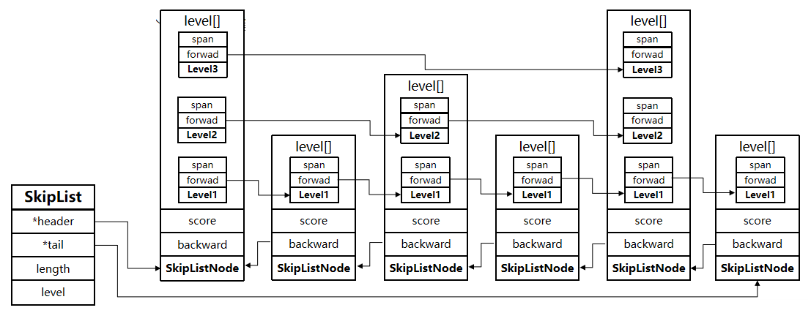

# 2. RedisObject

Redis中的任意数据类型的键和值都会被封装为一个RedisObject，也叫做Redis对象。

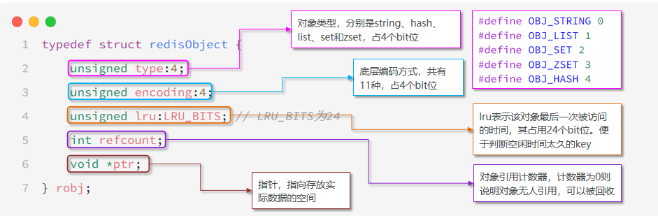

| **数据类型** | **编码方式**                                       |
| ------------ | -------------------------------------------------- |
| OBJ_STRING   | int、embstr、raw                                   |
| OBJ_LIST     | LinkedList和ZipList(3.2以前)、QuickList（3.2以后） |
| OBJ_SET      | intset、HT                                         |
| OBJ_ZSET     | ZipList、HT、SkipList                              |
| OBJ_HASH     | ZipList、HT                                        |

## 2.1. String

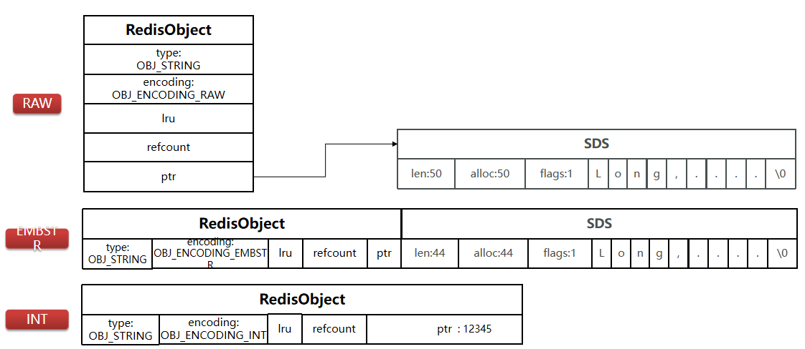

- 如果存储的**SDS长度小于44字节**，则会采用EMBSTR编码，此时RedisObject head与SDS是一段连续空间。申请内存时只需要调用一次内存分配函数，效率更高。
- 如果存储的字符串是整数值，并且大小在**LONG_MAX**范围内，则会采用INT编码，直接将数据保存在RedisObject的ptr指针位置（刚好8字节），不再需要SDS了
- 其他就是基本编码方式RAW，ptr指向SDS。

## 2.2. List

LinkedList和ZipList(3.2以前)、**QuickList**（3.2以后）

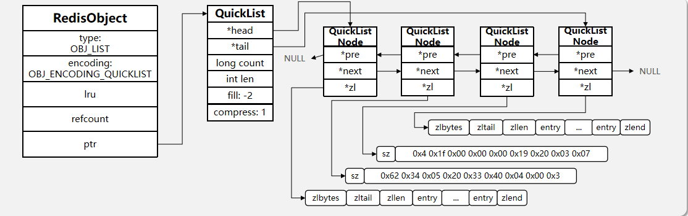

## 2.3. Set

- 整数+元素数量不超过set-max-intset-entries时，Set会采用**IntSet**编码，以节省内存
- 否则，就是或转化为Dict。**Dict**中的key用来存储元素，value统一为null。

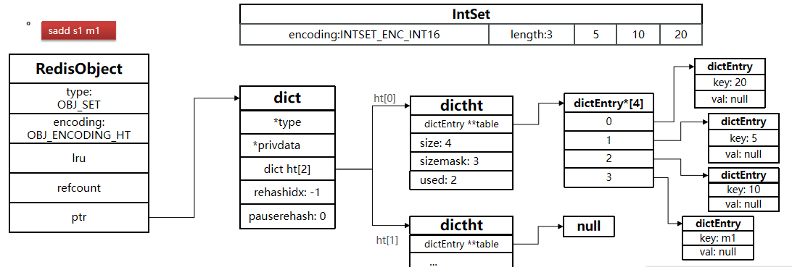

## 2.4. ZSET

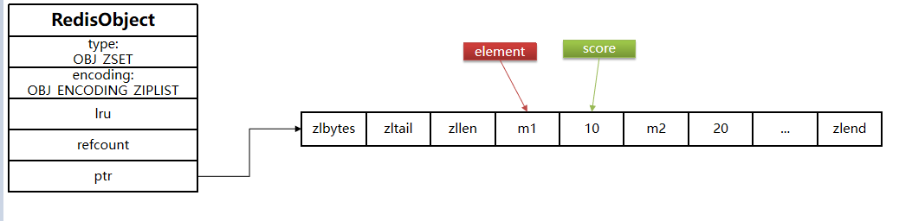

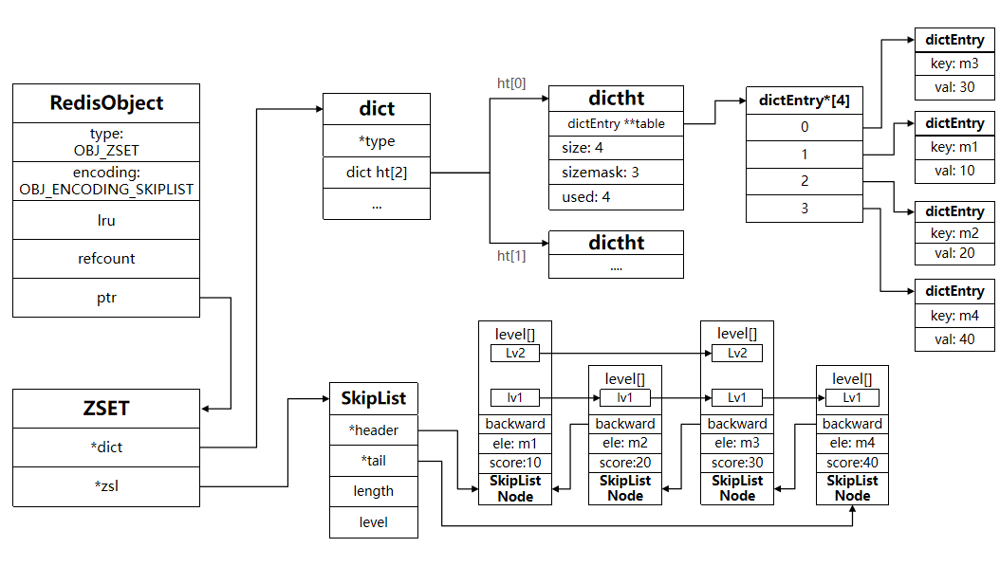

- 当元素数量少、每个元素都小时，用可排序的**ziplist**存储。一对elemen和score的entry紧挨在一起；score越小越接近队首，score越大越接近队尾，按照score值升序排列。
- ziplist的元素数量多、元素过大时，就转化为**跳表+字典**。

## 2.5. Hash

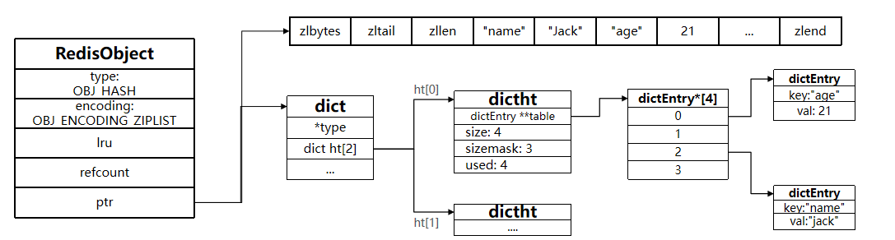

- 当元素数量少、每个元素都小时，用ziplist存储。一对field和value的entry紧挨在一起，不排序。
- ziplist的元素数量多、元素过大时，就转化为字典。