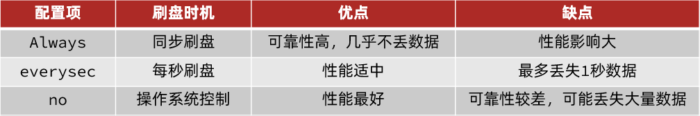
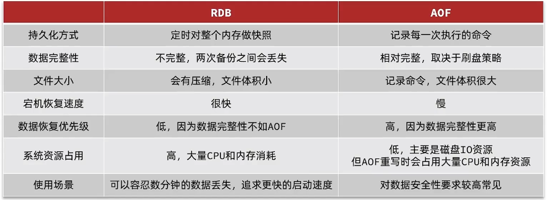

- [1. redis持久化](#1-redis持久化)
  - [1.1. RDB redis数据快照。](#11-rdb-redis数据快照)
  - [1.2. AOF追加文件](#12-aof追加文件)

---
## 1. redis持久化

Redis有两种持久化方案：

- RDB持久化
- AOF持久化

### 1.1. RDB redis数据快照。

内存数据→磁盘文件。

save主进程执行RDB，bgsave子进程执行RDB。

RDB持久化在四种情况下会执行：

- 执行save命令
- 执行bgsave命令
- 停机前执行一次save
- 触发RDB条件，每隔一段时间bgsave一次，防止宕机丢失


bgsave过程：
- 子进程fork主进程，复制页表，共享内存空间。
- 子进程读取内存数据，写入新的RDB文件。
- 写完用新的替换旧的。

缺点：
- rdb执行间隔长，期间写入数据有丢失风险。
- fork进程、压缩、写出都耗时。
- fork采用copy-on-write，读时共享，写时拷贝副本，内存占用翻倍。


```properties
# redis.conf

# 触发时机：900秒内，如果至少有1个key被修改，则执行bgsave ， 如果是save "" 则表示禁用RDB
# 留一个save就行
save 900 1  
save 300 10  
save 60 10000 
save ""


# 是否压缩 ,建议不开启，压缩也会消耗cpu，磁盘的话不值钱
rdbcompression yes

# RDB文件名称
dbfilename dump.rdb  

# 文件保存的路径目录
dir ./ 

# 无磁盘复制
repl-diskless-sync yes
```

### 1.2. AOF追加文件

记录命令日志。

- 时机：同步刷盘、每秒刷盘（默认）、操作系统决定刷盘。
- aof文件比rdb文件大。引入aof重写（对同一个key的多次写操作，但只有最后一次写操作才有意义），`bgrewriteaof`。
- bgrewriteaof，重写命令+压缩保存。触发：最小阈值、上次百分比。


```properties
# 是否开启AOF功能，AOF默认是关闭的
appendonly yes
# AOF文件的名称
appendfilename "appendonly.aof"


# AOF的命令记录的频率
# 表示每执行一次写命令，立即记录到AOF文件
appendfsync always 
# 写命令执行完先放入AOF缓冲区，然后表示每隔1秒将缓冲区数据写到AOF文件，是默认方案
appendfsync everysec 
# 写命令执行完先放入AOF缓冲区，由操作系统决定何时将缓冲区内容写回磁盘
appendfsync no


# 重写触发阈值
# AOF文件比上次文件 增长超过多少百分比则触发重写
auto-aof-rewrite-percentage 100
# AOF文件体积最小多大以上才触发重写 
auto-aof-rewrite-min-size 64mb 
```



