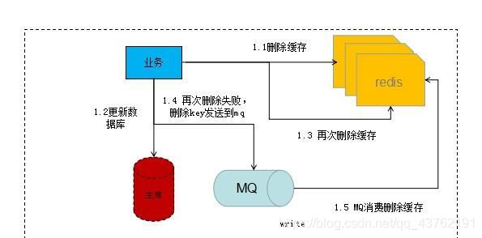

- [1. 缓存](#1-缓存)
  - [1.1. 缓存更新](#11-缓存更新)
    - [1.1.1. 延迟双删](#111-延迟双删)
  - [1.2. 缓存穿透、缓存雪崩、缓存击穿](#12-缓存穿透缓存雪崩缓存击穿)
    - [1.2.1. 缓存穿透](#121-缓存穿透)
    - [1.2.2. 缓存雪崩](#122-缓存雪崩)
    - [1.2.3. 缓存击穿（热点 key 问题）](#123-缓存击穿热点-key-问题)

---
# 1. 缓存

**缓存机制**解决的问题是：代替查询数据库 **Select**

**缓存更新**解决的问题是：数据库和缓存不一致的问题————删除旧缓存，让查时写入新缓存。

## 1.1. 缓存更新

缓存更新策略：内存淘汰、超时剔除、主动更新

- 低一致需求：内存淘汰
- 高一致需求：主动更新，并超时剔除作为兜底
  - 读（select）：命中就返；未中则查库，写入缓存 + 设置超时（超时剔除），返回结果。
  - 写（Update）：先写后删（主动更新）

主动更新：
- Cache Aside（双写方案）：由缓存的调用者负责，同时更新数据库和缓存
- Read/Write Through：将缓存和数据库整合为一个服务，由服务来维护一致性。调用者只需要调用服务，无需关心一致性问题。
- Write Behind Caching：调用者操作缓存，由其他线程异步将缓存持久化到数据库，保证最终一致。比如，定期异步线程，自己监控redis缓存，那么10次缓存更新后，刚好异步线程工作，持久到db，节省了无效持久化。这就最终一致。缓存宕机风险

Cache Aside 总结：

- 删除缓存还是更新缓存：删除缓存
- 保证事务，操作缓存和数据库同时成功或失败。
- 先删除缓存还是先数据库：先写后删好
- 延迟双删：先删除缓存、更新数据库、延迟删除缓存。

Cache Aside 具体：

- 删除缓存还是更新缓存？删除缓存
  - 更新缓存的问题：①每次更新数据库都更新缓存，命令最后一次有效，无效写操作较多；②先更新缓存，再更新数据库失败，那么写入的缓存是错误的。
  - 删除缓存：等要查询时才触发查缓存，去db得到的是最新的。

- 先删除缓存还是先操作数据库，

  - 先删后写：很有可能发生。因为更新数据库慢，而查询数据库和写入缓存块。
    
  - 先写后删：发生概率极低。发生条件：第一，缓存意外失效，才去查数据库和写缓存；第二，查数据库快，期间还发生了耗时更久的更新数据库和删除缓存。
    
- 如何保证缓存与数据库的操作的原子性（同时成功或失败）？
  
  答案是事务：
  - 单体系统，将缓存与数据库操作放在一个事务
  - 分布式系统，利用 TCC 等分布式事务方案

### 1.1.1. 延迟双删

先删后写的升级版：先删除缓存、更新数据库、延迟删除缓存
- 延迟删除：删除更新前其他线程的查询数据库而写入的旧缓存。
- 延迟：为了redis和mysql的主从同步。
- 延迟时间要么手动设定，比如100ms；要么用异步消息队列负责。
- 用消息队列负责删除，还可以加入删除重试机制：mq重试、canal重试

业务再次删除缓存失败，就让消息队列去处理失败情况，再去重删。

canal监听binlog，写入消息队列，让消息队列去删除。

## 1.2. 缓存穿透、缓存雪崩、缓存击穿

### 1.2.1. 缓存穿透

缓存和数据库都不存在的无效数据，在打到数据库后返回不存在，还会再次被打。

1. 缓存空对象 +TTL（以防短期恶意攻击而存储大量无效的空对象）：

   - 实现简单。
   - 多余 key 消耗内存、短期不一致（插入真实数据后，等到空对象过期才有效。可以插入时主动删除空对象）
     
2. 布隆过滤：

   - 内存占用少。
   - 误判。不存在则真不存在，存在是可能存在。
3. 业务：

   - 增强 id 复杂度，避免恶意攻击；
   - 数据基础格式校验；
   - 加强用户权限校验；
   - 热点参数限流。

### 1.2.2. 缓存雪崩

大量 key 同时过期或 Redis 节点宕机，导致直接打到数据库。

1. 大量 key 同时过期：随机 TTL
2. Redis 节点宕机：集群
3. 业务：缓存业务降级限流、多级缓存

### 1.2.3. 缓存击穿（热点 key 问题）

热点 key 失效，大量请求数据库去查询缓存数据。（高并发、缓存业务复杂才写缓存慢，让很多线程有时间去查）

1. 互斥锁：保证只有一个请求会落到数据库上

   - CP：保证一致性，牺牲可用性
   - 实现简单，但多个线程等待，甚至可能死锁（两个业务涉及多个缓存，一个业务发现缓存锁被另一个业务占用，两个业务互相等待。）
     
     

2. 逻辑过期：热点 key 永不过期，而是设置逻辑过期时间。查询到数据时判断逻辑过期时间，没过期则返回，过期则重建缓存。重建缓存，需要抢到互斥锁，开启一个独立线程去更新，其他线程不等待，返回旧数据。

   - AP：保证可用性，牺牲一致性。
   - 实现简单，线程无需等待性能好。
   - 保存逻辑过期属性则有额外的内存消耗，返回过期数据则可能造成数据不一致，
     
     
3. 业务：
   - 热点数据提前预热；
   - 热点数据永不过期或在业务活动结束前不过期。
   - 限流。
   - 还可以设置多级缓存，就不用去redis了。（要求一致性不高）