- [Spring 的 bean 是单例的吗？](#spring-的-bean-是单例的吗)
- [Spring 的 bean 是线程安全的吗？](#spring-的-bean-是线程安全的吗)
- [AOP](#aop)
- [spring 事务是如何实现的](#spring-事务是如何实现的)
- [spring 事务失效](#spring-事务失效)
- [Spring 的 bean 的生命周期](#spring-的-bean-的生命周期)
- [Spring 的 bean 循环依赖](#spring-的-bean-循环依赖)
- [Springboot 的自动配置原理](#springboot-的自动配置原理)
- [Spring 框架常用注解](#spring-框架常用注解)
- [Springmvc 流程](#springmvc-流程)
- [mybatis 执行流程](#mybatis-执行流程)
- [mybatis 延迟加载](#mybatis-延迟加载)
- [mybatis 延迟加载原理](#mybatis-延迟加载原理)
- [mybatis 缓存](#mybatis-缓存)

---

## Spring 的 bean 是单例的吗？

默认是单例的 `@Scope("singleton")`。除非 `@Scope("prototype")` 让一个 bean 可以有多个实例。

## Spring 的 bean 是线程安全的吗？

不是。

但

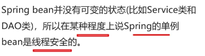

成员变量有线程安全问题，局部变量没有。

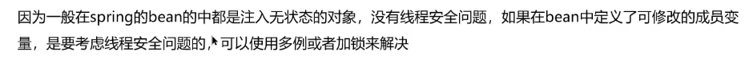

## AOP

自定义注解

获取请求方法的类、方法、注解、request(请求方式、url、ip)

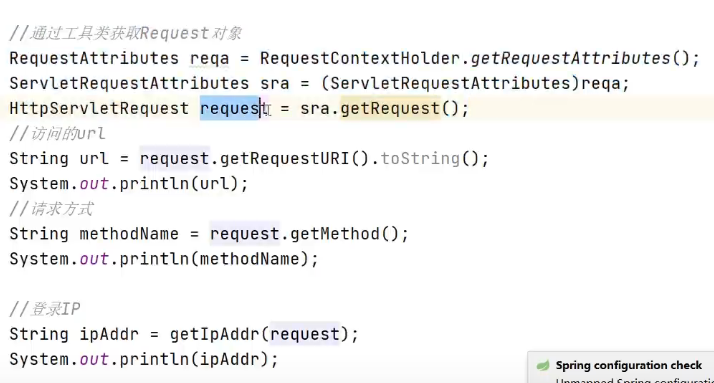

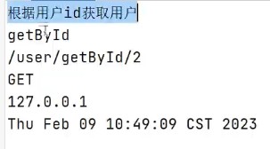

## spring 事务是如何实现的

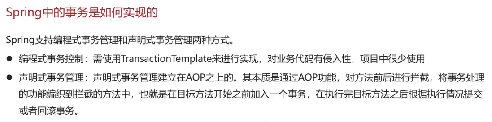

## spring 事务失效

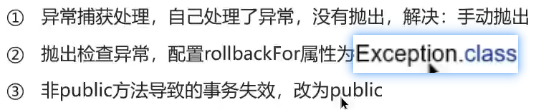

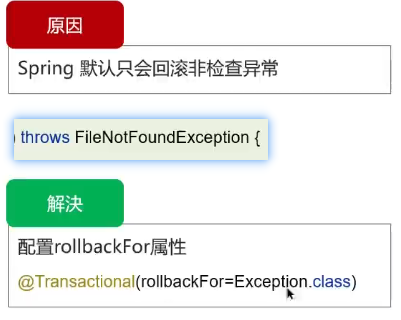

## Spring 的 bean 的生命周期

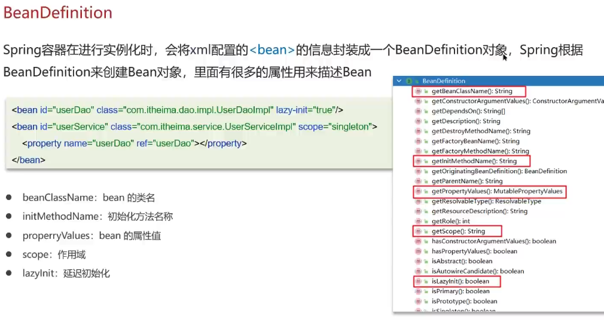

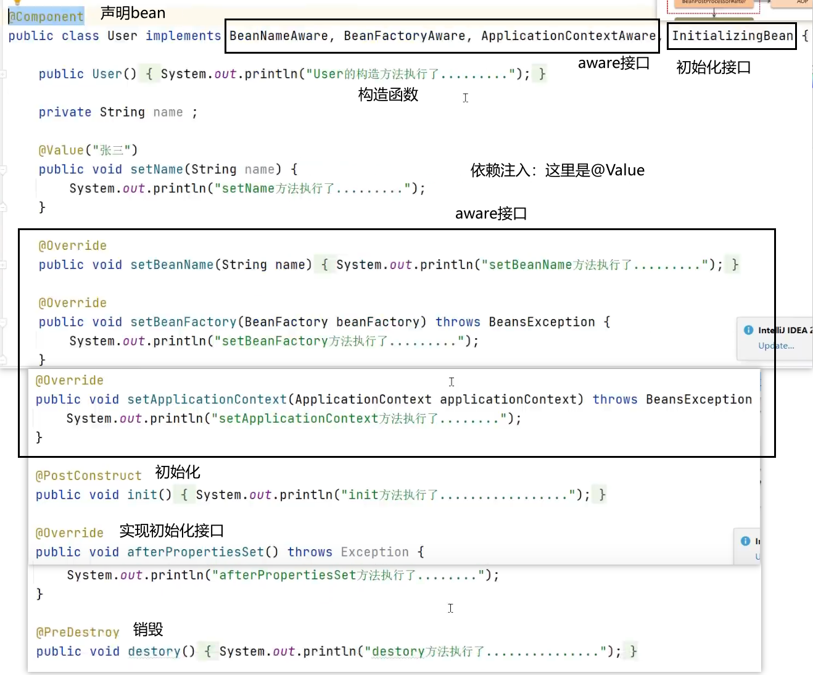

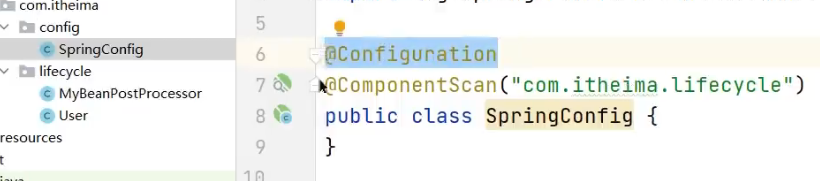

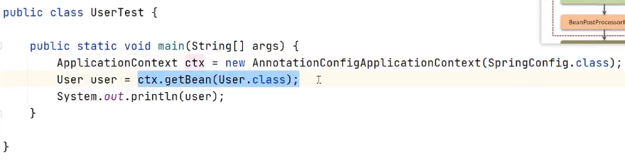

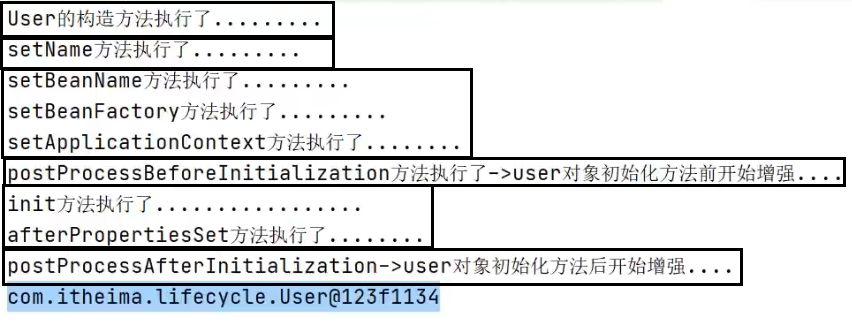

[https://blog.csdn.net/skh2015java/article/details/117751380](https://blog.csdn.net/skh2015java/article/details/117751380) @PostConstruct

## Spring 的 bean 循环依赖

一级缓存不行。

二级缓存：可以解决一般对象，不能解决代理对象。

三级缓存：可以解决一般对象和代理对象。

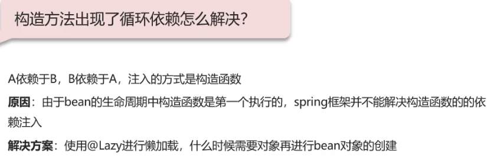

## Springboot 的自动配置原理

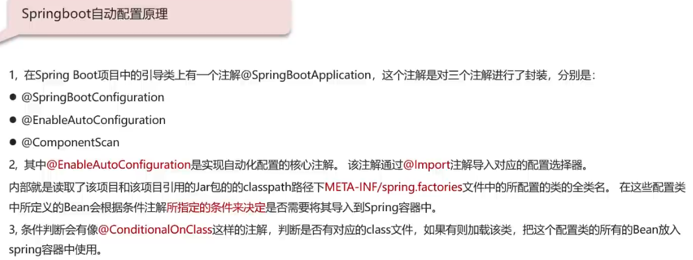

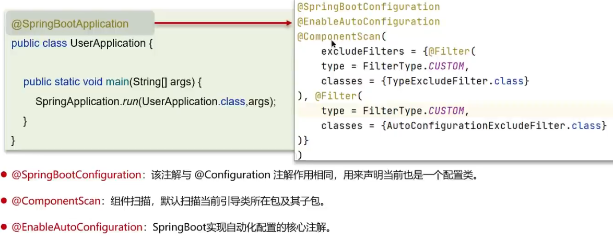

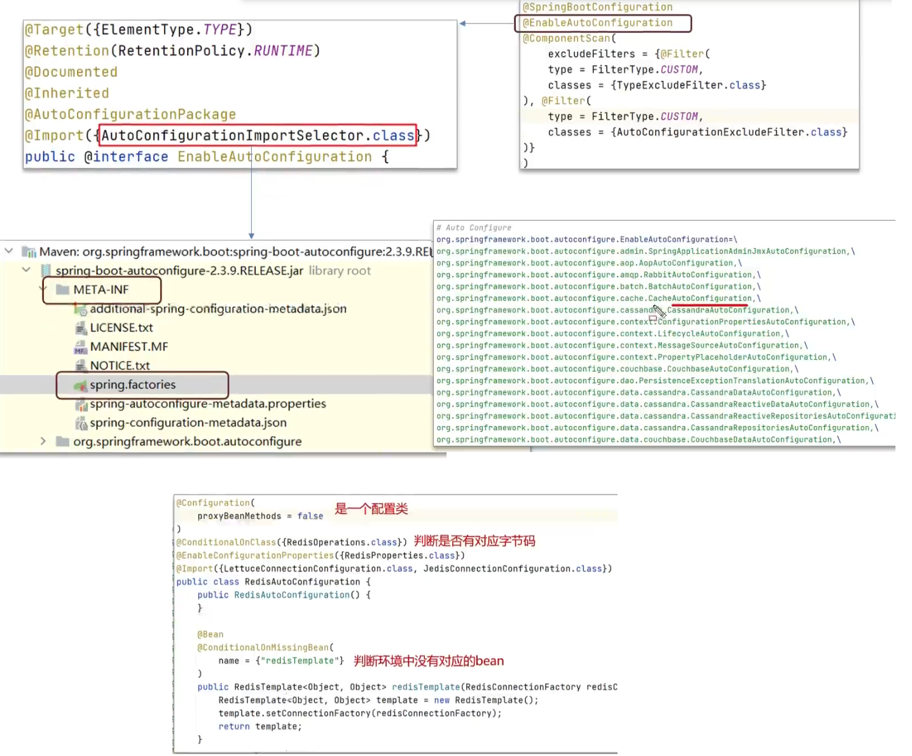

## Spring 框架常用注解

spring：描述 bean 的、配置、AOP

springmvc：描述请求

springboot：`@SpringBootApplication`

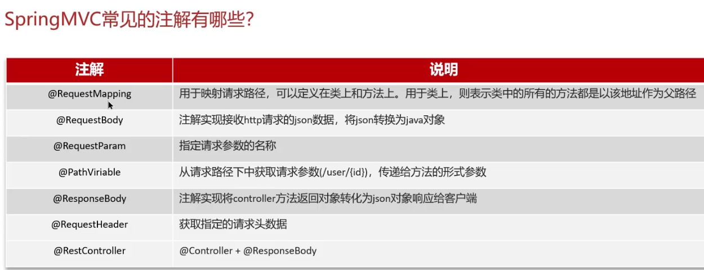

## Springmvc 流程

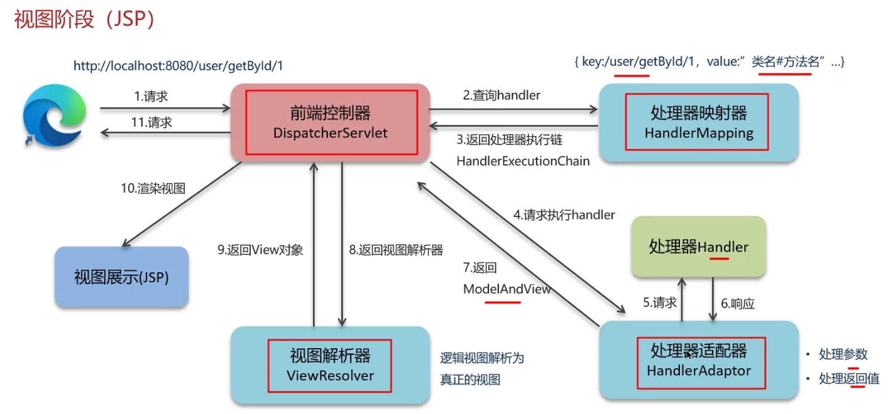

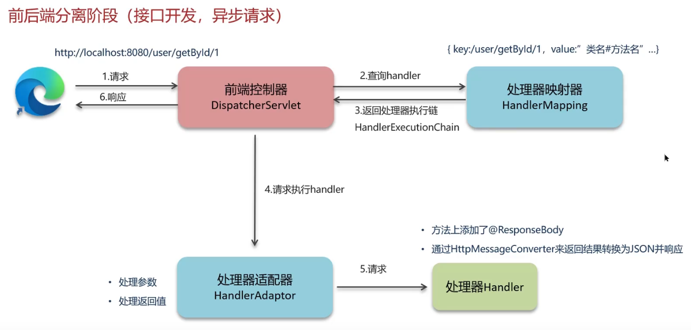

## mybatis 执行流程

mybatis-config.xml

## mybatis 延迟加载

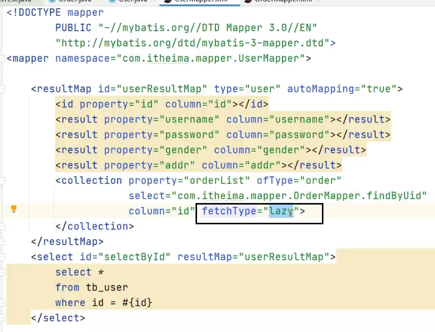

## mybatis 延迟加载原理

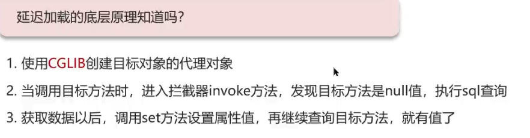

## mybatis 缓存

- 一级缓存默认是打开的，二级缓存需要手动开启。
- 一级缓存和二级缓存都是基于本地缓存 PerpetualCache，本质是一个 HashMap
- 一级缓存的作用域是 session，当 session 的 flush 或 close 时，该 session 中的缓存就会被清空；二级缓存的作用域是 namespace 和 mapper，不依赖于 session

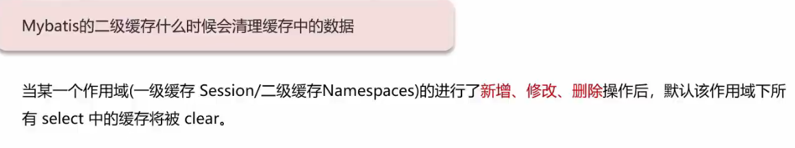

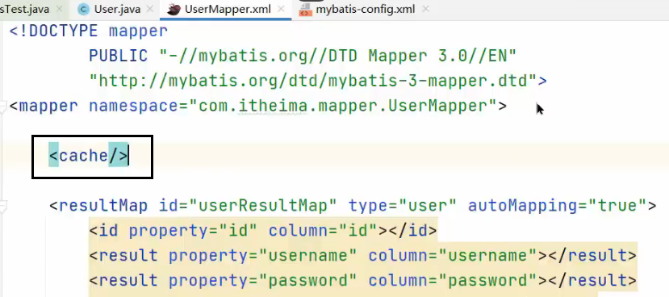

