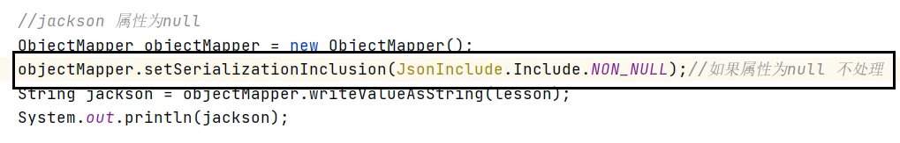

- [hutool](#hutool)
- [fastjson](#fastjson)
- [jackson](#jackson)
  - [枚举用jackson: @JsonValue](#枚举用jackson-jsonvalue)
  - [如何让Jackson序列化时，忽视空值字段？](#如何让jackson序列化时忽视空值字段)


---
## hutool
```xml
<!--hutool-->
<dependency>
    <groupId>cn.hutool</groupId>
    <artifactId>hutool-all</artifactId>
    <version>5.7.17</version>
</dependency>
```

```java
// 一个对象
String jsonstr = JSONUtil.toJsonStr(user);
User user = JSONUtil.toBean(jsonstr, User.class);

// List
String shopTypeJson = JSONUtil.toJsonStr(shopTypes);
List<ShopType> shopTypes = JSONUtil.toList(shopTypeJson, ShopType.class);
```

## fastjson
```xml
<dependency>
    <groupId>com.alibaba</groupId>
    <artifactId>fastjson</artifactId>
    <version>1.2.76</version>
</dependency>
```
```java
// 手动序列化
User user = new User("Tom", 18);
// 默认null不处理
String json = JSONObject.toJSONString(user);
```

## jackson
```xml
<!--Jackson依赖: ObjectMapper要用-->
<dependency>
    <groupId>com.fasterxml.jackson.core</groupId>
    <artifactId>jackson-databind</artifactId>
</dependency>
```
- writeValueAsString
- readValue
```java
// JSON序列化工具
ObjectMapper objectMapper = new ObjectMapper();

User user = new User("Tom", 18);
// 手动序列化
String json = objectMapper.writeValueAsString(user);
System.out.println(json);   // {"name":"Tom","age":18}

// 手动反序列化
User getUser = objectMapper.readValue(json, User.class);
```

### 枚举用jackson: @JsonValue

[enumtest](../../codes/javaweb/enumtest/枚举.md#方案3枚举魔法值mp注解json前端得到的可枚举可魔法值)

### 如何让Jackson序列化时，忽视空值字段？



## 忽略？？？

```
import com.alibaba.fastjson.annotation.JSONField;
@JSONField(serialize = false)


import com.fasterxml.jackson.annotation.JsonIgnore;
@JsonIgnore
```