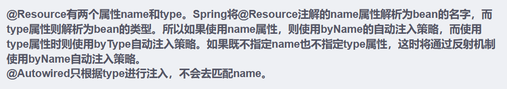

`@Service`:在接口的实现类上加，而不是接口。

- **控制反转：** Inversion Of Control，简称IOC。对象的创建控制权由程序自身转移到外部（容器），这种思想称为控制反转。

  > 对象的创建权由程序员主动创建转移到容器(由容器创建、管理对象)。这个容器称为：IOC容器或Spring容器

- **依赖注入：** Dependency Injection，简称DI。容器为应用程序提供运行时，所依赖的资源，称之为依赖注入。

  > 程序运行时需要某个资源，此时容器就为其提供这个资源。
  >
  > 例：EmpController程序运行时需要EmpService对象，Spring容器就为其提供并注入EmpService对象

IOC容器中创建、管理的对象，称之为：bean对象

`@Autowired`：运行时,从IOC容器中获取该类型对象,赋值给该变量

使用四大注解声明的bean

`@Component`：将当前对象交给IOC容器管理,成为IOC容器的bean

@Component的衍生注解：

- `@Controller` （标注在控制层类上）
- `@Service` （标注在业务层类上）
- `@Repository` （标注在数据访问层类上）（由于与mybatis整合，用的少）

> 注意事项: 
>
> - 声明bean的时候，可以通过value属性指定bean的名字，如果没有指定，默认为类名首字母小写。
> - 在springboot集成web开发中，声明控制器bean只能用@Controller。

## 使用前面学习的四个注解声明的bean，一定会生效吗？

使用四大注解声明的bean，要想生效，还需要被组件扫描注解@ComponentScan扫描

引导类声明注解`@SpringBootApplication` 中包含`@ComponentScan`，**默认扫描的范围是SpringBoot启动类所在包及其子包**。

- 解决方案：手动添加@ComponentScan注解，指定要扫描的包

## 如果在IOC容器中，存在多个相同类型的bean对象，会出现什么情况呢

程序运行会报错

解决方案：

- `@Primary`: 确定默认的实现，配合@Component

- `@Qualifier`: 指定注入的bean的名称，配合 `@Autowired` 使用

- `@Resource`：按照bean的名称进行注入，替代 `@Autowired`

## @Autowird 与 @Resource的区别

- @Autowired 是spring框架提供的注解，而@Resource是JDK提供的注解
- @Autowired 默认是按照类型注入，而@Resource是按照名称注入

