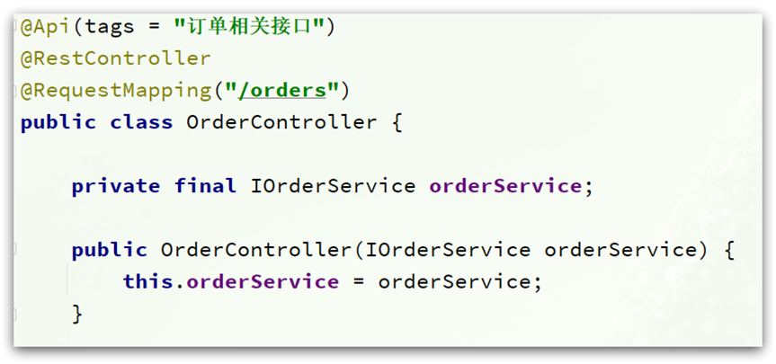
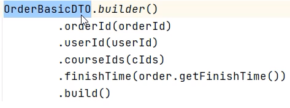

- [介绍](#介绍)
- [@EqualsAndHashCode](#equalsandhashcode)
- [@AllArgsConstructor](#allargsconstructor)
- [@RequiredArgsConstructor](#requiredargsconstructor)
- [@Accessors](#accessors)
- [@Builder](#builder)
- [@Slf4j](#slf4j)


---
## 介绍

Lombok会在**编译**时，会自动生成对应的java代码

| **注解**            | **作用**                                                     |
| ------------------- | ------------------------------------------------------------ |
| `@Getter/@Setter`     | 为所有的属性提供get/set方法                                  |
| `@ToString`           | 会给类自动生成易阅读的  toString 方法                        |
| `@EqualsAndHashCode`  | 根据类所拥有的非静态字段自动重写 equals 方法和  hashCode 方法 |
| `@Data`               | 提供了更综合的生成代码功能（@Getter  + @Setter + @ToString + @EqualsAndHashCode） |
| `@NoArgsConstructor`  | 为实体类生成无参的构造器方法                                 |
| `@AllArgsConstructor` | 为实体类生成除了static修饰的字段之外带有各参数的构造器方法。 |
|`@RequiredArgsConstructor`| 注入方式|
|`@Builder`|基于变种的建造者模式的注解|
|`@Log4j` |注解在类上；为类提供一个 属性名为log 的 log4j 日志对像|
|`@Slf4j`| 同上|

```xml
<dependency>
    <groupId>org.projectlombok</groupId>
    <artifactId>lombok</artifactId>
</dependency>
```

~~~java
import lombok.Data;

@Data
@NoArgsConstructor //无参构造
@AllArgsConstructor//全参构造
public class User {
    private String name;
    private Short age;
}
~~~

## @EqualsAndHashCode
`@EqualsAndHashCode` 默认选项 `(callSuper=false)`：

比较两个对象时：
1.  只是想在当前类比较字段，使用`@EqualsAndHashCode(callSuper=false)`。
2.  需要考虑**父类**和本类中的成员，使用`@EqualsAndHashCode(callSuper=true)`
3.  如果全部要比较 或 全部不需要比较 父类成员，使用全局配置 lombok.config


## @AllArgsConstructor
```java
@AllArgsConstructor(staticName = "of")      // // return new User(...)

User user = User.of("Tom", 123);    
```
## @RequiredArgsConstructor

自动注入的原理是基于Spring构造函数注入，像这样：


 
但是，如果需要注入的属性较多，构造函数就会非常臃肿，代码写起来也比较麻烦。

```java
@RequiredArgsConstructor
// 将类的每一个final字段或者non-null字段生成一个构造方法
public class UserController {
    // 需要变成final字段
    private final IUserService userService;
}
```

简化了对多个注入的@Autowired书写。我们在写Controller层或者Service层的时候，总是需要注入很多mapper接口或者service接口，如果每个接口都写上@Autowired，这样看起来就会很繁琐，@RequiredArgsConstructor注解可以代替@Autowired注解

## @Accessors

用来控制getter/setter访问行为的，Accessors有三个属性：默认`Accessors(fluent = false, chain = false, prefix = {})`
- `fluent`: 去除 get/set。为true，直接`user.name()`
- `chain`: 链式编程 set。为true，`new User().setName("Tom").setAge(12);`
- `prefix`：过滤字段前缀。`xxName`, `prefix = {"xx"}` → `getName(), setName()`

一般就常用 `@Accessors(chain = true)`

https://blog.csdn.net/sunnyzyq/article/details/119992746

## @Builder



## @Slf4j

```java
// 在类上加注释
@Slf4j
@SpringBootTest
public class RedissonTest {
    @Test
    void method1() throws InterruptedException {
        log.error("获取锁成功 .... ");
        log.error("获取锁失败 .... {}", 1);
    }
// 2024-04-22 15:57:43.305  INFO 18768 --- [           main] com.sword.redisson01.RedissonTest        : 获取锁成功 .... 
// 2024-04-22 15:57:43.307  INFO 18768 --- [           main] com.sword.redisson01.RedissonTest        : 获取锁失败 .... 1
```
`log.error/warn/debug/info()`