- [Mybatis导入](#mybatis导入)
  - [起步依赖](#起步依赖)
  - [yaml配置](#yaml配置)
  - [mapper,service](#mapperservice)
- [MybatisPlus插件](#mybatisplus插件)
- [PO](#po)
- [BaseMapper和IService](#basemapper和iservice)
- [Wrapper 条件构造器](#wrapper-条件构造器)
  - [总结4种方式](#总结4种方式)
  - [order by field](#order-by-field)
- [常量、枚举](#常量枚举)
- [自动更新时间](#自动更新时间)
- [逻辑删除](#逻辑删除)
- [page](#page)
  - [mp](#mp)
  - [pagehelper依赖](#pagehelper依赖)
- [动态sql查询](#动态sql查询)
- [循环依赖](#循环依赖)
- [例子](#例子)


---
https://jx3ir08ot5k.feishu.cn/docx/JpLMd3rM3o6Gvqxt0L6clCgznzg?from=from_copylink
## Mybatis导入

- 引入起步依赖
- 在application.yml中根据需要添加配置
- 在实体类上添加注解声明 表信息
- 自定义Mapper，继承基础BaseMapper
- 自定义Service接口，继承IService接口；自定义Service实现类，继承ServiceImpl类并实现自定义接口。
### 起步依赖

```xml
<!-- mybatis起步依赖 -->
<!-- <dependency>
    <groupId>org.mybatis.spring.boot</groupId>
    <artifactId>mybatis-spring-boot-starter</artifactId>
    <version>2.3.0</version>
</dependency> -->

<!-- mybatis-plus包含对mybatis的自动装配，因此完全可以替换掉Mybatis -->
<dependency>
    <groupId>com.baomidou</groupId>
    <!--下面坐标根据自己使用的SpringBoot版本二选一-->
    <!--SpringBoot2使用此版本-->
    <artifactId>mybatis-plus-boot-starter</artifactId>
    <!-- 3.5.4开始,支持SpringBoot3使用此版本 -->
    <!-- <artifactId>mybatis-plus-spring-boot3-starter</artifactId> -->
    <version>3.5.3.1</version>
</dependency>

<!-- mysql驱动包依赖 -->
<dependency>
    <groupId>com.mysql</groupId>
    <artifactId>mysql-connector-j</artifactId>
    <scope>runtime</scope>
</dependency>
```

### yaml配置

常用
```yml
spring:
  datasource:
    # 驱动类名称
    driver-class-name: com.mysql.cj.jdbc.Driver
    # 数据库连接的url
    url: jdbc:mysql://localhost:3306/tlias
    # 连接数据库的用户名
    username: root
    # 连接数据库的密码
    password: 1234

# 其实可以啥都不写
mybatis-plus:
  type-aliases-package: com.itheima.mp.domain.po  # 用于mapper.xml中resultType直接写类名，也可以不配，毕竟namespace要写全包名，resultType也不差这几个字
  global-config:
    db-config:
      id-type: auto # 全局id类型为自增长，如果局部每个都写了，它就可以不写，比如，MybatisPlus插件生成的就已经在每个字段上写了。
```
大多数的配置都有默认值
```yml
mybatis-plus:
  mapper-locations: classpath*:/mapper/**/*.xml # 默认值，放在resouces/mappers/xxx.xml位置
  configuration:
    map-underscore-to-camel-case: true  #  MyBatis 中原默认值为 false，  MyBatis-Plus 中原默认值为 true
  global-config:
    db-config:
      id-type: assign_id  # 全局默认主键类型：雪花算法生成id
      update-strategy: not_null # update传入po实体，只更新其非null的字段
```

### mapper,service

```java
public interface UserMapper extends BaseMapper<User> {}
```
```java
public interface IUserService extends IService<User>{}
```
```java
@Service
public class UserServiceImpl extends ServiceImpl<UserMapper, User> implements IUserService {}
```
在启动上加`@MapperScan("com.sword.crud.mapper")`。所以在mapper接口上就不用标注`@Mapper`


## MybatisPlus插件

直接从数据库生成po类、mapper、service、controller

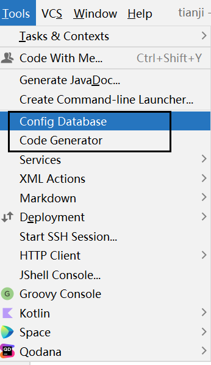

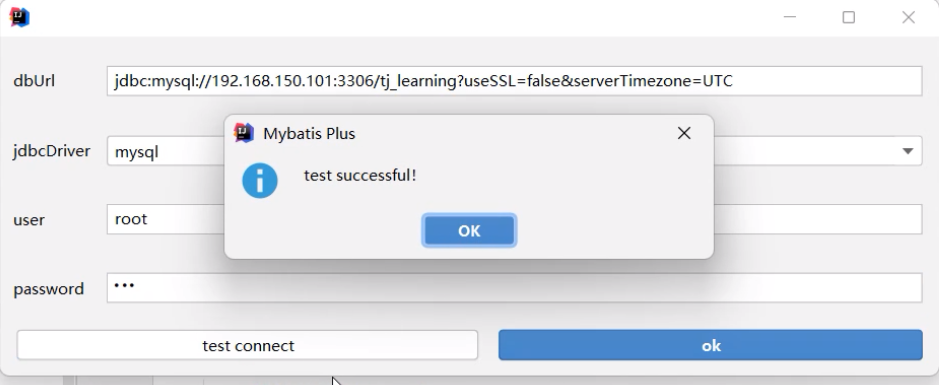

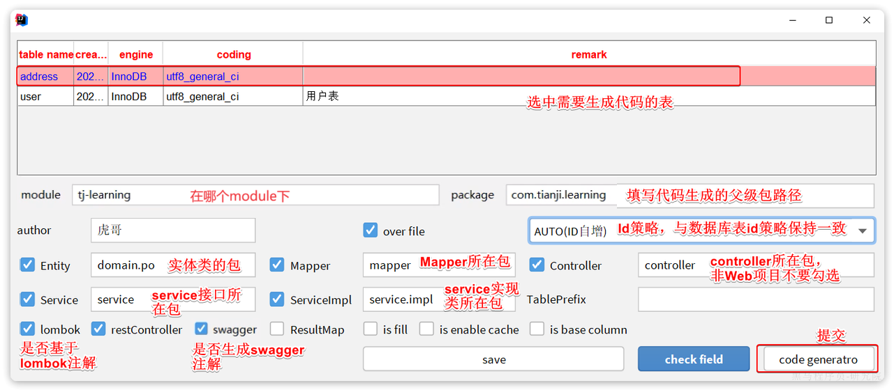

> 生成完后的修改

controller 类上的 RequestMapping 它默认是库名，而具体是什么，还得改成你业务需要的。

用枚举类型替换Integer类型。

## PO

- MybatisPlus会把PO实体的类名驼峰转下划线作为**表名**
- MybatisPlus会把PO实体的所有变量名驼峰转下划线作为表的**字段名**，并根据变量类型推断字段类型
- MybatisPlus会把名为id的字段作为**主键**(变量名和数据库字段都得是`id`)

```java
@TableName("tb_user")
public class User {
    @TableId(value = "id", type = IdType.AUTO)
    private Long id;
    private String name;
    private Integer age;

    @TableField("isMarried")
    private Boolean isMarried;
    
    @TableField("concat")
    private String concat;

    @TableField(exist = false)
    private Double distance;
}
```
- 表名不一致 `@TableName`
- 主键名不一致:`@TableId`
  - 可以set指定id，不set则自己生成。生成方案，如果是数据库设置 `auto_increment` 必须写 `IdType.AUTO`，否则默认是雪花算法 `IdType.ASSIGN_ID`。
- 字段名：`@TableField`
  - 不一致；is被过滤；关键字冲突要转义``` `xxx` ```；
  - 非数据库字段`@TableField(exist = false)`，我们手动维护。


## BaseMapper和IService

> BaseMapper 和 IService 对比

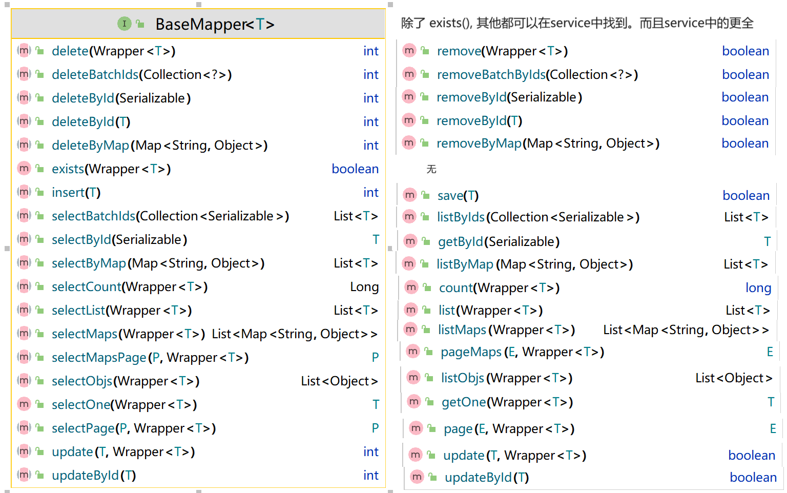


> IService

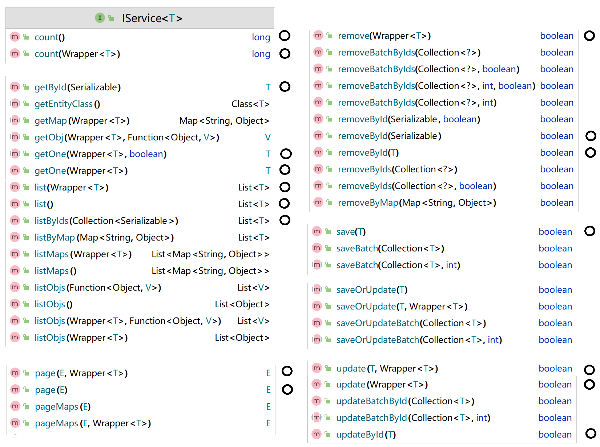

> 总结

单个：
- `getById(id)`: [queryUserById()](../../codes/javaweb/crud/src/main/java/com/sword/crud/controller/UserController.java)
- `removeById(id)`: [deleteUserById()](../../codes/javaweb/crud/src/main/java/com/sword/crud/controller/UserController.java)
- `updateById(T)`: [updateUser()](../../codes/javaweb/crud/src/main/java/com/sword/crud/controller/UserController.java)
    
    只更新传递的字段(非null)
    
    id为null不会报错：底层是`where id = ?`，所以id没有传递，默认值是null则无行更新；id传递了，才更新某行。

    ```java
    // 虽然id为null时，updateById也不会报错；但给前端造成好像已经更新成功的假象，比如前端忘记传参数了。
    @Override
    @Transactional
    public Result updateShop(Shop shop) {
        Long id = shop.getId();
        if (id == null) {
            return Result.fail("店铺id不能为空");
        }
        updateById(shop);
        return Result.ok();
    }
    ```
- `save(T)`：可id指定；也可无id而mp自动生成。[saveUser()](../../codes/javaweb/crud/src/main/java/com/sword/crud/controller/UserController.java)

## Wrapper 条件构造器

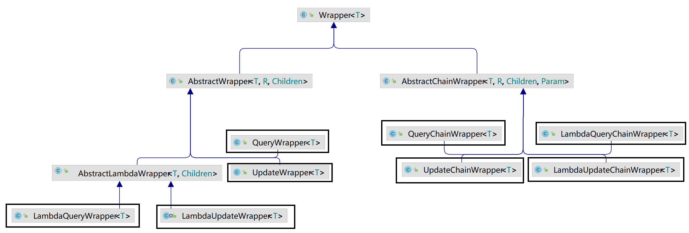

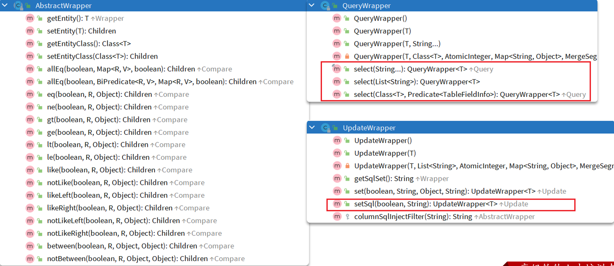

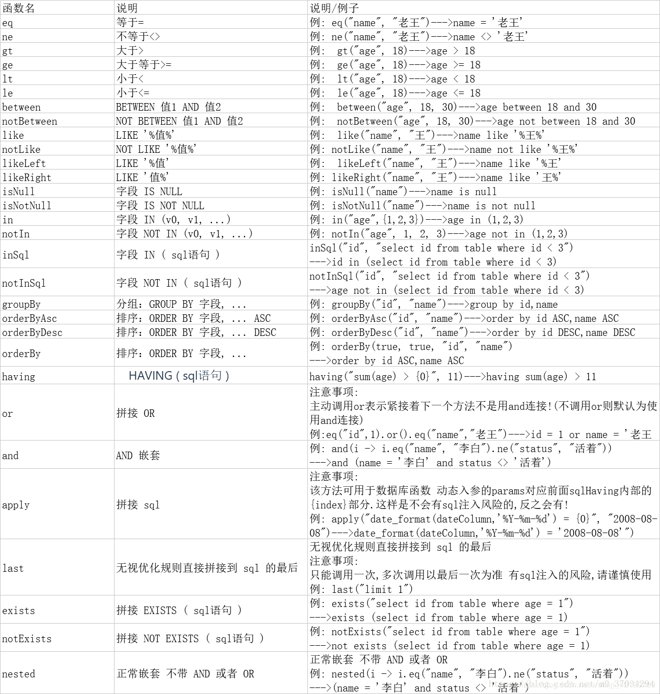

1. Wrapper的子类 `AbstractWrapper` 和 `AbstractChainWrapper` 提供了where中包含的所有条件构造方法。

```java
@Test
void testUpdateByQueryWrapper() {
    // 1.构建查询条件 where name = "Jack"
    QueryWrapper<User> wrapper = new QueryWrapper<User>().eq("username", "Jack");
    // 2.更新数据，user中非null字段都会作为set语句
    User user = new User();
    user.setBalance(2000);
    userMapper.update(user, wrapper);
}
```

2. `QueryWrapper` 在 `AbstractWrapper` 的基础上拓展了一个select方法（允许指定SQL中的select的字段）


```java
@Test
void testQueryWrapper() {
    // 1.构建查询条件 where name like "%o%" AND balance >= 1000
    QueryWrapper<User> wrapper = new QueryWrapper<User>()
            .select("id", "username", "info", "balance")
            .like("username", "o")
            .ge("balance", 1000);
    // 2.查询数据
    List<User> users = userMapper.selectList(wrapper);
    users.forEach(System.out::println);
}
```
3. `UpdateWrapper` 在 `AbstractWrapper` 的基础上拓展了一个set方法（允许指定SQL中的SET部分）

```java
// `updateById(T)` 还需要先查询获取，而这种则不需要，直接更新。
@Test
void testUpdateWrapper() {
    UpdateWrapper<User> wrapper = new UpdateWrapper<User>()
            .set("status", "1")    // 一般属性更新
            .setSql("balance = balance - 200") // 自定义sql，SET balance = balance - 200
            .eq("id", 1L);
    // 注意第一个参数可以给null，也就是不填更新字段和数据，而是基于UpdateWrapper中的setSQL来更新
    userMapper.update(null, wrapper);
}
```

4. `LambdaQueryWrapper` 解决 `QueryWrapper` 写死字段名称的问题，使用基于变量的gettter方法结合反射技术。

```java
LambdaQueryWrapper<User> wrapper = new QueryWrapper<User>().lambda()
        .like(username != null, User::getUsername, username)
        .eq(status != null, User::getStatus, status)
        .ge(minBalance != null, User::getBalance, minBalance)
        .le(maxBalance != null, User::getBalance, maxBalance);

```

5. `AbstractChainWrapper` 提供了将 list() 操作直接放入链式编程的。

```java
// 定义wrapper，再userService.list(wrapper)
LambdaQueryWrapper<User> wrapper = new LambdaQueryWrapper<User>();
        .like(username != null, User::getUsername, username)
        .eq(status != null, User::getStatus, status)
        .ge(minBalance != null, User::getBalance, minBalance)
        .le(maxBalance != null, User::getBalance, maxBalance);
List<User> users = userService.list(wrapper);

// 直接将 .list() 放入 链式编程中
List<User> users = userService.lambdaQuery()
        .like(username != null, User::getUsername, username)
        .eq(status != null, User::getStatus, status)
        .ge(minBalance != null, User::getBalance, minBalance)
        .le(maxBalance != null, User::getBalance, maxBalance)
        .list();
```

one/list/page/count/exists


### 总结4种方式

`AbstractWrapper`  路子：
- 方式1：QueryWrapper

    分为，普通Wrapper和LambdaWrapper。

    分为，指定泛型类型的可直接链式编程，和不指定泛型类型的不可直接链式编程

- 方式2：new QueryWrapper<User>().lambda() 来获取 LambdaQueryWrapper 

    必须指定泛型类型

`AbstractChainWrapper` 路子：
- 方式3：显示构造 QueryChainWrapper

    泛型类型指定不指定都一样，因为传入构造参数。构造参数分为，User.class 和 userMapper。

- 方式4：query() 来获得 QueryChainWrapper对象

    - `.query()` → `QueryChainWrapper`
    - `.update()` → `UpdateChainWrapper`
    - `.lambdaQuery()` → `LambdaQueryChainWrapper`
    - `.lambdaUpdate()` → `LambdaUpdateChainWrapper`

[queryUsersByCondition()](../../codes/javaweb/crud/src/main/java/com/sword/crud/controller/UserController.java)

### order by field

```java
// 3.根据用户id查询用户 WHERE id IN ( 5 , 1 ) ORDER BY FIELD(id, 5, 1)
String idStr = StrUtil.join(",", ids);    // List<Long> ids
List<UserDTO> userDTOS = userService.query()
        .in("id", ids).last("ORDER BY FIELD(id," + idStr + ")").list()
```

## 常量、枚举

[enumtest](../../codes/javaweb/enumtest/枚举.md)

## 自动更新时间

不是在mybatisplus上搞（fill什么的），而是在数据库DDL上动手。

```sql
create_time datetime default CURRENT_TIMESTAMP not null comment '创建时间',
update_time datetime default CURRENT_TIMESTAMP not null on update CURRENT_TIMESTAMP comment '更新时间'
```
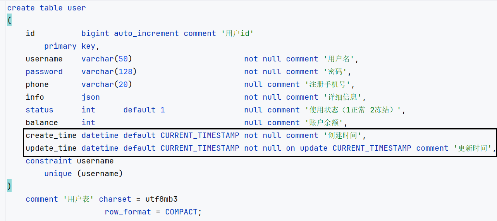

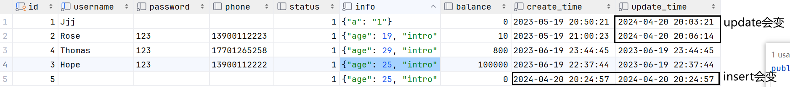

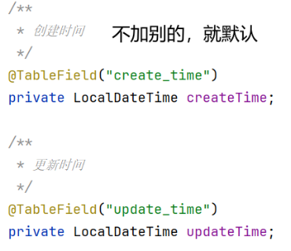

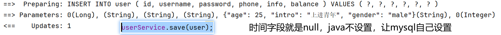

## 逻辑删除 

> 原理

在表中添加一个字段标记数据是否被删除，从而不删记录
- 当删除数据时把标记置为true 
- 查询时过滤掉标记为true的数据 

```sql
alter table address add deleted bit default b'0' null comment '逻辑删除';
update address set deleted = 1 where id = ? and deleted = 0
select * from address where deleted = 0
```

缺点：不如把数据迁移到其它表的办法
- 会导致数据库表垃圾数据越来越多，从而影响查询效率
- SQL中全都需要对逻辑删除字段做判断，影响查询效率

> mybatis-plus提供简化操作：

1. 给Address实体添加deleted字段 `private Boolean deleted;` 对应数据库字段`deleted`
2. 开启配置
    ```yml
    mybatis-plus:
      global-config:
        db-config:
          logic-delete-field: deleted # 全局逻辑删除的实体字段名
          # logic-delete-value: 1 # 逻辑已删除值(默认为 1)
          # logic-not-delete-value: 0 # 逻辑未删除值(默认为 0)
    ```
3. 正常操作crud，就像没有一样，由mp自动处理底层sql逻辑。`addressService.removeById(59L);`

[Address PO类种 deleted字段](../../codes/javaweb/crud/src/main/java/com/sword/crud/domain/po/Address.java)

[AddressController 中就如往常一样增删改查，mp会自己帮我们做](../../codes/javaweb/crud/src/main/java/com/sword/crud/controller/AddressController.java)


## page

[queryUsersPage, queryUsersPageByCondition, queryUsersByPH](../../codes/javaweb/crud/src/main/java/com/sword/crud/controller/UserController.java)
### mp

定义 [config类](../../codes/javaweb/crud/src/main/java/com/sword/crud/config/MybatisPlusConfig.java) 去导入mp分页插件。

1. 前端的请求参数：[分页参数的父类](../../codes/javaweb/crud/src/main/java/com/sword/crud/domain/query/PageQuery.java)和[继承它的业务参数](../../codes/javaweb/crud/src/main/java/com/sword/crud/domain/query/UserConditionQuery.java)。
    
    分页参数用一个类定义，业务参数类继承分页参数，实现参数复用。
2. mp核心: 
   - Page对象，传入第几页和页大小，添加结果排序规则。
   - 查询结果是原地修改的，还在Page对象里，不用返回值。当然也可以用返回值。
3. 将查询结果返回给前端：
   - 将page对象里的`PO`类集合结果转化为[`VO`](../../codes/javaweb/crud/src/main/java/com/sword/crud/domain/vo/UserVO.java)
   - 再扔给[`PageDTO<VO>`](../../codes/javaweb/crud/src/main/java/com/sword/crud/domain/dto/PageDTO.java)统一格式，并由page对象的total属性设置总条数、pages属性设置当前页码。

page创建方式
```java
// 从第一页开始
Page<User> page = new Page<>(1, 10);
Page<User> page = Page.of(1, 10);

// 排序（可选）
page.addOrder(new OrderItem("balance", false));
```

最简单的写法（不排序）
```java
// 如果无筛选条件，调用IService的`page(page)`方法。方法内部就是selectPage
Page<Blog> page = blogService.page(new Page<>(current, PAGE_SIZE));

// 如果有筛选条件，设置wrapper对象，调用IService的`page(page, wrapper)`方法。或者4钟wrapper方式。
Page<Blog> page = blogService.query()
        .eq("user_id", user.getId())
        .page(new Page<>(current, PAGE_SIZE));

long total = page.getTotal();  // 总条数
long pages = page.getPages();  // 总条数可以划分为几页
List<Blog> blogs = page.getRecords();  // 查询结果
```

两种排序方式

```java
// 在page这里排序
Page<User> page = new Page<>(1, 10);
page.addOrder(new OrderItem("balance", false));


// 在wrapper排序
Page<Blog> page = blogService.query()
    .orderBy(query.getSortBy() == null, false, "balance")   // 默认排序
    .orderBy(query.getSortBy() != null, false, query.getSortBy()) // 自定义排序
    .page(new Page<>(1, 10));
```

### pagehelper依赖

在Mapper中我们只需要进行正常的列表查询即可。

在Service层中，调用Mapper的方法之前设置分页参数，在调用Mapper方法执行查询之后，解析分页结果，并将结果封装到对象中返回。

1. 在pom.xml引入依赖

    ```xml
    <dependency>
        <groupId>com.github.pagehelper</groupId>
        <artifactId>pagehelper-spring-boot-starter</artifactId>
        <version>1.4.2</version>
    </dependency>
    ```
   
    ```yml
    pagehelper:
      helper-dialect: mysql
      reasonable: true  # 在启用合理化时，如果 pageNum<1，则会查询第一页；如果 pageNum>pages，则会查询最后一页。
      support-methods-arguments: true # 支持通过Mapper接口参数来传递分页参数
    ```
   
    不管mybatis-config.xml之类的东西，直接能用

2. 遗留问题：随便翻翻，没看到有排序的的，以后再说。

## 动态sql查询

`${ew.customSqlSegment}` 是MyBatis Plus提供的动态SQL语句拼接功能。

可以通过Wrapper对象来构建查询条件。Wrapper对象可以通过链式调用的方式动态添加查询条件，包括等于、大于、小于等各种条件。

方式一：注解
```java
// Service中
@Override
public List<UserVO> querySelfDefined() {
    QueryWrapper<User> wrapper = new QueryWrapper<>();
    wrapper.eq("a.city", "北京")
            .in("u.id", List.of(1L, 2L, 4L));
    // 传递 wrapper
    List<User> users = userMapper.querySelfDefined(wrapper);
    return BeanUtil.copyToList(users, UserVO.class);
}

// mapper中
@Select("SELECT u.* FROM user u INNER JOIN address a ON u.id = a.user_id ${ew.customSqlSegment}")
List<User> querySelfDefined(@Param("ew") QueryWrapper<User> wrapper); // @Param(Constants.WRAPPER)
```
方式二：xml
```java
// Service中
@Override
public List<UserVO> querySelfDefined() {
    QueryWrapper<User> wrapper = new QueryWrapper<>();
    wrapper.eq("a.city", "北京")
            .in("u.id", List.of(1L, 2L, 4L));
    // 传递 wrapper
    List<User> users = userMapper.querySelfDefined2(wrapper);
    return BeanUtil.copyToList(users, UserVO.class);
}

// mapper中
List<User> querySelfDefined2(@Param("ew") QueryWrapper<User> wrapper); // @Param(Constants.WRAPPER)

// xml中
<select id="querySelfDefined2" resultType="com.sword.crud.domain.po.User">
    SELECT u.* FROM user u INNER JOIN address a ON u.id = a.user_id  ${ew.customSqlSegment}
</select>
```

## 循环依赖

service之间互相调用。

解决方式：

（1）service不调用另一个service，而是调用另一个service对应的mapper

（2）Db静态。

## 例子

[UserController](../../codes/javaweb/crud/src/main/java/com/sword/crud/controller/UserController.java)

- 增 `saveUser`
- 删 `deleteUserById`
- 查 `queryUserById`
- 查所有 `queryUserByIds`
- 改 `updateUser`
- 带条件查询 `queryUsersByCondition`
- 带条件更新 `deductBalance`
- 批量操作 `addUsers` 
- 自定义sql + 多表关联 `querySelfDefined`
- 循环依赖 `queryUserWithAddressById`
- page: `queryUsersPage`, `queryUsersPageByCondition`, `queryUsersByPH`