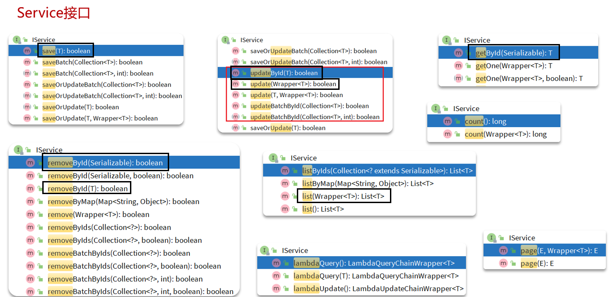

- [1. Mybatis导入](#1-mybatis导入)
- [2. PO](#2-po)
- [3. 配置](#3-配置)
- [4. BaseMapper和IService](#4-basemapper和iservice)
- [5. Wrapper 条件构造器](#5-wrapper-条件构造器)
  - [链式编程方式的问题](#链式编程方式的问题)
- [6. IService的lambdaQuery、lambdaUpdate](#6-iservice的lambdaquerylambdaupdate)


---
https://jx3ir08ot5k.feishu.cn/docx/JpLMd3rM3o6Gvqxt0L6clCgznzg?from=from_copylink
## 1. Mybatis导入

- 引入起步依赖
- 在application.yml中根据需要添加配置
- 在实体类上添加注解声明 表信息
- 自定义Mapper，继承基础BaseMapper
- 自定义Service接口，继承IService接口；自定义Service实现类，继承ServiceImpl类并实现自定义接口。


```xml
<!-- mybatis起步依赖 -->
<!-- <dependency>
    <groupId>org.mybatis.spring.boot</groupId>
    <artifactId>mybatis-spring-boot-starter</artifactId>
    <version>2.3.0</version>
</dependency> -->

<!-- mybatis-plus包含对mybatis的自动装配，因此完全可以替换掉Mybatis -->
<dependency>
    <groupId>com.baomidou</groupId>
    <!--下面坐标根据自己使用的SpringBoot版本二选一-->
    <!--SpringBoot2使用此版本-->
    <artifactId>mybatis-plus-boot-starter</artifactId>
    <!--3.5.4开始,支持SpringBoot3使用此版本-->
    <artifactId>mybatis-plus-spring-boot3-starter</artifactId>
    <version>3.5.3.1</version>
</dependency>

<!-- mysql驱动包依赖 -->
<dependency>
    <groupId>com.mysql</groupId>
    <artifactId>mysql-connector-j</artifactId>
    <scope>runtime</scope>
</dependency>
```

```java
public interface UserMapper extends BaseMapper<User> {}
```
```java
public interface IUserService extends IService<User>{}
```
```java
@Service
public class UserServiceImpl extends ServiceImpl<UserMapper, User> implements IUserService {}
```
在启动上加`@MapperScan("com.sword.crud.mapper")`。所以在mapper接口上就不用标注`@Mapper`

## 2. PO

- MybatisPlus会把PO实体的类名驼峰转下划线作为**表名**
- MybatisPlus会把PO实体的所有变量名驼峰转下划线作为表的**字段名**，并根据变量类型推断字段类型
- MybatisPlus会把名为id的字段作为**主键**(变量名和数据库字段都得是`id`)

```java
public class User {
    private Long id;  // 数据库不自增时
    private String name;
    private Integer age;
    @TableField("isMarried")
    private Boolean isMarried;
    @TableField("concat")
    private String concat;
}
```
- 表名不一致 `@TableName`
- 主键名不一致:`@TableId`
  - 可以set指定id，不set则自己生成。生成方案，如果是数据库设置auto必须写，否则默认是雪花算法。
- 字段名：@TableField
  - 不一致；is被过滤；关键字冲突要转义``` `xxx` ```；
  - 非数据库字段；自动填充


## 3. 配置

常用
```yml
spring:
  datasource:
    # 驱动类名称
    driver-class-name: com.mysql.cj.jdbc.Driver
    # 数据库连接的url
    url: jdbc:mysql://localhost:3306/tlias
    # 连接数据库的用户名
    username: root
    # 连接数据库的密码
    password: 1234

# 其实可以啥都不写
mybatis-plus:
  type-aliases-package: com.itheima.mp.domain.po  # 用于mapper.xml中resultType直接写类名，也可以不配，毕竟namespace要写全包名，resultType也不差这几个字
  global-config:
    db-config:
      id-type: auto # 全局id类型为自增长，如果局部每个都写了，它就可以不写，比如，MybatisPlus插件生成的就已经在每个字段上写了。
```
大多数的配置都有默认值
```yml
mybatis-plus:
  mapper-locations: classpath*:/mapper/**/*.xml # 默认值，放在resouces/mappers/xxx.xml位置
  configuration:
    map-underscore-to-camel-case: true  #  MyBatis 中原默认值为 false，  MyBatis-Plus 中原默认值为 true
  global-config:
    db-config:
      id-type: assign_id  # 全局默认主键类型：雪花算法生成id
      update-strategy: not_null # update传入po实体，只更新其非null的字段
```

## 4. BaseMapper和IService

> BaseMapper


> IService


## 5. Wrapper 条件构造器


两个抽象类`Wrapper`和`AbstractWrapper`，实际用的就是`QueryWrapper`和`UpdateWrapper`。

Wrapper的子类AbstractWrapper提供了where中包含的所有条件构造方法。

```java
@Test
void testUpdateByQueryWrapper() {
    // 1.构建查询条件 where name = "Jack"
    QueryWrapper<User> wrapper = new QueryWrapper<User>().eq("username", "Jack");
    // 2.更新数据，user中非null字段都会作为set语句
    User user = new User();
    user.setBalance(2000);
    userMapper.update(user, wrapper);
}
```

QueryWrapper在AbstractWrapper的基础上拓展了一个select方法（允许指定SQL中的select的字段）


```java
@Test
void testQueryWrapper() {
    // 1.构建查询条件 where name like "%o%" AND balance >= 1000
    QueryWrapper<User> wrapper = new QueryWrapper<User>()
            .select("id", "username", "info", "balance")
            .like("username", "o")
            .ge("balance", 1000);
    // 2.查询数据
    List<User> users = userMapper.selectList(wrapper);
    users.forEach(System.out::println);
}
```
UpdateWrapper在AbstractWrapper的基础上拓展了一个set方法（允许指定SQL中的SET部分）

```java
@Test
void testUpdateWrapper() {
    List<Long> ids = List.of(1L, 2L, 4L);
    // 1.生成SQL
    UpdateWrapper<User> wrapper = new UpdateWrapper<User>()
            .setSql("balance = balance - 200") // SET balance = balance - 200
            .in("id", ids); // WHERE id in (1, 2, 4)
        // 2.更新，注意第一个参数可以给null，也就是不填更新字段和数据，
    // 而是基于UpdateWrapper中的setSQL来更新
    userMapper.update(null, wrapper);
}
```

LambdaQueryWrapper解决QueryWrapper写死字段名称的问题，使用基于变量的gettter方法结合反射技术。

```java
LambdaQueryWrapper<User> wrapper = new QueryWrapper<User>().lambda()
        .like(username != null, User::getUsername, username)
        .eq(status != null, User::getStatus, status)
        .ge(minBalance != null, User::getBalance, minBalance)
        .le(maxBalance != null, User::getBalance, maxBalance);

```


### 链式编程方式的问题

new的时候泛型传递类型与否、lambda属性还是直接lambda类型。
- `new QueryWrapper<User>().lambda()`
- `new LambdaQueryWrapper<>()`
```java
// 方式1：可以直接链式编程
LambdaQueryWrapper<User> wrapper = new QueryWrapper<User>().lambda()
        .like(username != null, User::getUsername, username)
        .eq(status != null, User::getStatus, status)
        .ge(minBalance != null, User::getBalance, minBalance)
        .le(maxBalance != null, User::getBalance, maxBalance);

// 方式2：不可用链式编程
LambdaQueryWrapper<User> queryWrapper = new LambdaQueryWrapper<>();
queryWrapper.eq(User::getName,"liangd1");
```
```java
// 方式1：定义wrapper，service的方法传入
QueryWrapper<User> wrapper = new QueryWrapper<User>().eq("username", "Jack");
List<User> users = userService.list(wrapper);

QueryWrapper<User> wrapper = new QueryWrapper<>();
wrapper.eq("username", "北京");
List<User> users = userService.list(wrapper);


LambdaQueryWrapper<User> wrapper = new QueryWrapper<User>().lambda()
        .like(username != null, User::getUsername, username)
        .eq(status != null, User::getStatus, status)
        .ge(minBalance != null, User::getBalance, minBalance)
        .le(maxBalance != null, User::getBalance, maxBalance);
List<User> users = userService.list(wrapper);
```

```java
// 方式1：定义wrapper，service的方法传入
LambdaQueryWrapper<User> wrapper = new QueryWrapper<User>().lambda()
        .like(username != null, User::getUsername, username)
        .eq(status != null, User::getStatus, status)
        .ge(minBalance != null, User::getBalance, minBalance)
        .le(maxBalance != null, User::getBalance, maxBalance);
List<User> users = userService.list(wrapper);

// 方式2：service的lambdaQuery、lambdaUpdate
List<User> users = userService.lambdaQuery()
        .like(username != null, User::getUsername, username)
        .eq(status != null, User::getStatus, status)
        .ge(minBalance != null, User::getBalance, minBalance)
        .le(maxBalance != null, User::getBalance, maxBalance)
        .list();
```
## 6. IService的lambdaQuery、lambdaUpdate
IService的
- `.query()` 查，`.update()` 更新
- `.lambdaQuery()` 查，`.lambdaUpdate()` 更新


```java
// 方式1：定义wrapper，service的方法传入
LambdaQueryWrapper<User> wrapper = new QueryWrapper<User>().lambda()
        .like(username != null, User::getUsername, username)
        .eq(status != null, User::getStatus, status)
        .ge(minBalance != null, User::getBalance, minBalance)
        .le(maxBalance != null, User::getBalance, maxBalance);
List<User> users = userService.list(wrapper);

// 方式2：service的lambdaQuery、lambdaUpdate
List<User> users = userService.lambdaQuery()
        .like(username != null, User::getUsername, username)
        .eq(status != null, User::getStatus, status)
        .ge(minBalance != null, User::getBalance, minBalance)
        .le(maxBalance != null, User::getBalance, maxBalance)
        .list();
```

condition可选条件。

one/list/page/count/exists