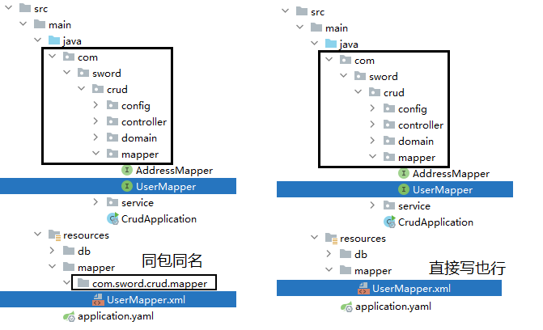

- [1. Mybatis导入](#1-mybatis导入)
- [2. 注解](#2-注解)
  - [2.1. 参数占位符](#21-参数占位符)
  - [2.2. 主键返回](#22-主键返回)
  - [2.3. 数据封装](#23-数据封装)
- [3. XML](#3-xml)

---
## 1. Mybatis导入

```xml
<!-- mybatis起步依赖 -->
<dependency>
    <groupId>org.mybatis.spring.boot</groupId>
    <artifactId>mybatis-spring-boot-starter</artifactId>
    <version>2.3.0</version>
</dependency>

<!-- mysql驱动包依赖 -->
<dependency>
    <groupId>com.mysql</groupId>
    <artifactId>mysql-connector-j</artifactId>
    <scope>runtime</scope>
</dependency>
```

1. application.properties

    ```yml
    spring:
      datasource:
        # 驱动类名称
        driver-class-name: com.mysql.cj.jdbc.Driver
        # 数据库连接的url
        url: jdbc:mysql://localhost:3306/tlias
        # 连接数据库的用户名
        username: root
        # 连接数据库的密码
        password: 1234
    
    mybatis:
      configuration:
        # 指定mybatis输出日志的位置, 输出控制台
        log-impl: org.apache.ibatis.logging.stdout.StdOutImpl
        # 开启数据库表字段 到 实体类属性的驼峰映射
        map-underscore-to-camel-case: true
    ```

2. Mapper接口（编写SQL语句）

    ~~~java
    @Mapper
    public interface UserMapper {
        
    }
    ~~~

@Mapper注解：表示是mybatis中的Mapper接口。程序运行时：框架会自动生成接口的实现类对象(代理对象)，并给交Spring的IOC容器管理


## 2. 注解
@Select、@Delete、@Insert、@Update

```java
@Mapper
public interface UserMapper {
    @Select("select id, name, age, gender, phone from user")
    public List<User> list();

    @Delete("delete from emp where id = #{id}")//使用#{key}方式获取方法中的参数值
    public void delete(Integer id);

    //会自动将生成的主键值，赋值给emp对象的id属性
    @Options(useGeneratedKeys = true, keyProperty = "id")
    @Insert("insert into emp(username, name, gender, image, job, entrydate, dept_id, create_time, update_time) values (#{username}, #{name}, #{gender}, #{image}, #{job}, #{entrydate}, #{deptId}, #{createTime}, #{updateTime})")
    public void insert(Emp emp);

    @Update("update emp set username=#{username}, name=#{name}, gender=#{gender}, image=#{image}, job=#{job}, entrydate=#{entrydate}, dept_id=#{deptId}, update_time=#{updateTime} where id=#{id}")
    public void update(Emp emp);
}
```

### 2.1. 参数占位符

在Mybatis中提供的参数占位符有两种：`${...}` 、`#{...}`。里面的属性名可以随便写，但是建议保持表字段名字一致。

- `${...}` 直接拼接
  - 拼接SQL。直接将参数拼接在SQL语句中，存在SQL注入问题
  - 使用时机：如果对表名、列表进行动态设置时使用

- `#{...}` 预编译SQL
  - 执行SQL时，会将`#{…}`替换为`?`，生成预编译SQL，会自动设置参数值
  - 使用时机：参数传递，都使用#{…}

比如：`like '%${name}%'`👉`like concat('%',#{name},'%')`

预编译SQL有两个优势：

1. 性能更高: 只编译一次，编译后的SQL语句缓存起来，后面再次执行这条语句时，不会再次编译。（只是输入的参数不同）
2. 更安全(防止SQL注入)：不采用字符串拼接，而是将敏感字进行转义

### 2.2. 主键返回

默认情况下，执行插入操作时，是不会主键值返回的。

如果我们想要拿到主键值，需要在Mapper接口中的方法上添加一个Options注解，并在注解中指定属性`useGeneratedKeys=true`和`keyProperty="实体类属性名"`
### 2.3. 数据封装
- 实体类属性名和数据库表查询返回的字段名一致，mybatis会自动封装。
- 如果实体类属性名和数据库表查询返回的字段名不一致，不能自动封装。

解决方案：
1. sql语句起别名
2. 结果映射
3. 开启驼峰命名：只限于表中字段名 abc_xyz  => 类中属性名 abcXyz


**起别名**：在SQL语句中，对不一样的列名起别名，**别名和实体类属性名一样**

```java
@Select("select id, username, password, name, gender, image, job, entrydate, " +
        "dept_id AS deptId, create_time AS createTime, update_time AS updateTime " +
        "from emp " +
        "where id=#{id}")
public Emp getById(Integer id);
```


**手动结果映射**：通过 @Results及@Result（column指定表中字段名，property指定类中属性名）进行手动结果映射。

```java
@Results({@Result(column = "dept_id", property = "deptId"),
          @Result(column = "create_time", property = "createTime"),
          @Result(column = "update_time", property = "updateTime")})
@Select("select id, username, password, name, gender, image, job, entrydate, dept_id, create_time, update_time from emp where id=#{id}")
public Emp getById(Integer id);
```
**开启驼峰命名**
```properties
mybatis:
  configuration:
    map-underscore-to-camel-case: true
```
## 3. XML

> 作用

注解是写死的sql语句，而XML解决了动态sql的问题。比如，带条件查询。
```sql
-- 如果姓名输入了"张
select *  from emp where name like '%张%' order by update_time desc;

-- 如果姓名输入了"张",，性别选择了"男"
select *  from emp where name like '%张%' and gender = 1 order by update_time desc;
```

> 写法




```xml
<?xml version="1.0" encoding="UTF-8" ?>
<!DOCTYPE mapper
  PUBLIC "-//mybatis.org//DTD Mapper 3.0//EN"
  "https://mybatis.org/dtd/mybatis-3-mapper.dtd">
<mapper namespace="">
 
</mapper>
```


`<select>`、`<insert>`、`<update>`、`<delete>`:
- `id`:同方法名
- `parameterType`: 方法参数类型
- `resultType`/`resultMap`: 方法返回值类型

| 标签名 | 说明 | 属性 |
| --- | --- | --- |
| **where** | 删除开头额外的AND或OR |  |
| **set** | 删掉额外的逗号 |  |
| **if** | 条件 | test |
| **foreach** | 循环 | collection, item, separator, open, close |
| sql | sql | id |
| include | 引入 | refid |
| bind | 绑定 | name, value |
| choose | 选择 | `<when test="">` + `<otherwise>`|
| trim | 去除 | prefix, prefixOverrides |

```xml
<select id="list" resultType="com.itheima.pojo.Emp">
    select * from emp       
    <where>
        <if test="name != null">
            and name like concat('%',#{name},'%')
        </if>
        <if test="gender != null">
            and gender = #{gender}
        </if>
    </where>
    order by update_time desc
</select>

<update id="update">
    update emp
    <set>
        <if test="username != null">
            username=#{username},
        </if>
        <if test="gender != null">
            gender=#{gender}
    </set>
    where id=#{id}
</update>

<!-- delete from emp where id in (1,2,3); -->
<delete id="deleteByIds">
    delete from emp where id in
    <foreach collection="ids" item="id" separator="," open="(" close=")">
        #{id}
    </foreach>
</delete>


<sql id="commonSelect">
 	select id, username, password, name, gender, image, job, entrydate, dept_id, create_time, update_time from emp
</sql>
<select id="list" resultType="com.itheima.pojo.Emp">
    <include refid="commonSelect"/>
    <where>
        <if test="name != null">
            name like concat('%',#{name},'%')
        </if>
        <if test="gender != null">
            and gender = #{gender}
        </if>
        <if test="begin != null and end != null">
            and entrydate between #{begin} and #{end}
        </if>
    </where>
    order by update_time desc
</select>
```

MybatisX插件

