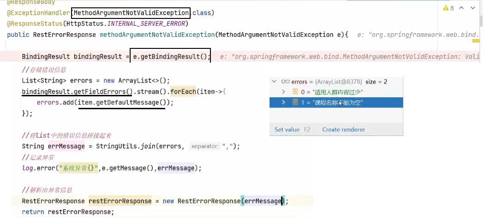
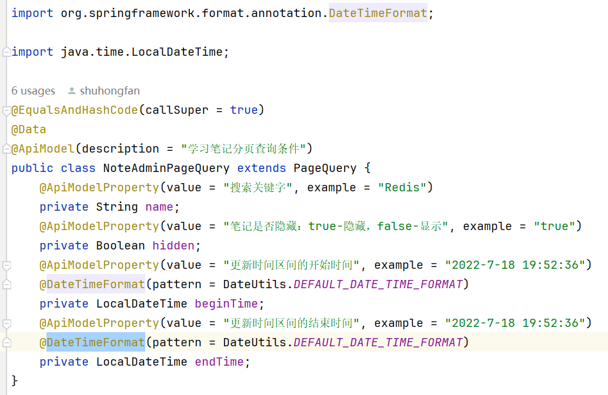

- [全局异常处理器](#全局异常处理器)
- [JSR303 validation](#jsr303-validation)
  - [分组校验](#分组校验)
  - [配合全局异常处理器](#配合全局异常处理器)
  - [校验规则不满足?](#校验规则不满足)
- [DateTimeFormat](#datetimeformat)


---
## 全局异常处理器

两个注解：`@ControllerAdvice`  表示当前类为全局异常处理器，`@ExceptionHandler`  指定可以捕获哪种类型的异常进行处理。


~~~java
// 表示当前类为全局异常处理器
ControllerAdvice
public class GlobalExceptionHandler {
    // 指定能够处理的异常类型
    @ExceptionHandler(Exception.class) 
    @ResponseBody
    public Result ex(Exception e){
        e.printStackTrace();//打印堆栈中的异常信息
        return Result.error("对不起,操作失败,请联系管理员");
    }
}
~~~


`@RestControllerAdvice` = @ControllerAdvice + @ResponseBody。处理异常的方法返回值会转换为json后再响应给前端

~~~java
// 表示当前类为全局异常处理器
@RestControllerAdvice
public class GlobalExceptionHandler {
    // 指定能够处理的异常类型
    @ExceptionHandler(Exception.class) 
    public Result ex(Exception e){
        e.printStackTrace();//打印堆栈中的异常信息
        return Result.error("对不起,操作失败,请联系管理员");
    }
}
~~~

`@ResponseStatus` 返回给前端的状态码

```java
@RestControllerAdvice
public class GlobalExceptionHandler {
    @ExceptionHandler(Exception.class) 
    @ResponseStatus(HttpStatus.INTERNAL_SERVER_ERROR)
    public Result ex(Exception e){
        e.printStackTrace();//打印堆栈中的异常信息
        return Result.error("对不起,操作失败,请联系管理员");
    }
}
```


## JSR303 validation

```xml
<dependency>
    <groupId>org.springframework.boot</groupId>
    <artifactId>spring-boot-starter-validation</artifactId>
</dependency>
```


接受参数类型的dto类，定义校验项。
```java
public class AddCourseDto{
    @NotEmpty(message = "课程名称不能为空")
    private String name;

    @Size(message = "内存太少", min = 10)
    private String description;

    @Min(message = "页码不能小于1", value = 1)
    private Integer pageNo;
}
```
controller中 `@Validated` 来开启校验。

```java
@RestController
public class CourseBaseInfoController{
    public CourseBaseInfoDto createCourseBase(@RequestBody @Validated AddCourseDto addCourseDto){

    }
}
```

### 分组校验

新增课程和修改课程，对同一个字段要求不一样。

```java
public class ValidationGroups{
    public interface Insert{};
    public interface Update{};
    public interface Delete{};
}
```
dto中添加组属性 `groups`
```java
public class AddCourseDto{
    @NotEmpty(message = "新增课程名称不能为空", groups = {ValidationGroups.Insert.class})
    @NotEmpty(message = "修改课程名称不能为空", groups = {ValidationGroups.Update.class})
    private String name;
}
```
controller中指定使用某个组 `@Validated(组)`
```java
@RestController
public class CourseBaseInfoController{
    public CourseBaseInfoDto createCourseBase(@RequestBody @Validated(ValidationGroups.Insert.class) AddCourseDto addCourseDto){

    }

    public CourseBaseInfoDto updateCourseBase(@RequestBody @Validated(ValidationGroups.Update.class) AddCourseDto addCourseDto){

    }
}
```
### 配合全局异常处理器



### 校验规则不满足?  

1. 手写校验代码。
2. 自定义校验注解。

## DateTimeFormat




