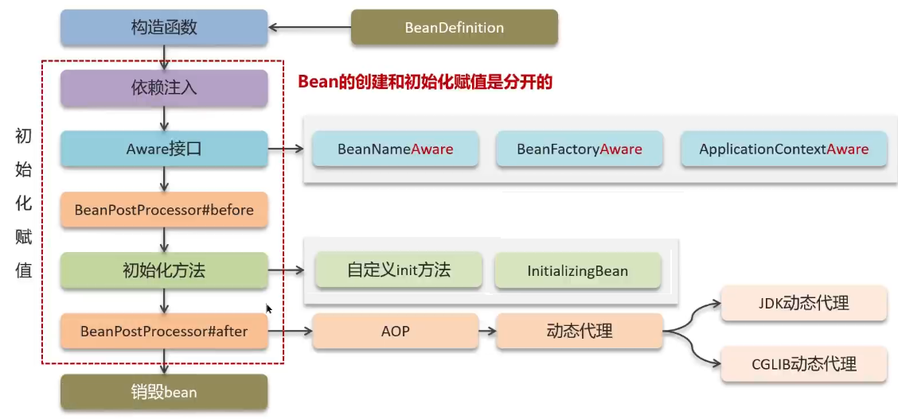

- [Spring 的 bean 的生命周期](#spring-的-bean-的生命周期)
- [Spring 的 bean 循环依赖](#spring-的-bean-循环依赖)
- [Spring 的 bean 是单例的吗？](#spring-的-bean-是单例的吗)
- [Spring 的 bean 是线程安全的吗？](#spring-的-bean-是线程安全的吗)
- [spring注解](#spring注解)
- [spring的aop是如何实现的](#spring的aop是如何实现的)
- [AOP 优点](#aop-优点)
- [Spring AOP概念](#spring-aop概念)
- [Spring 动态代理失效的场景有哪些？](#spring-动态代理失效的场景有哪些)
- [怎么证明Spring Boot 动态代理默认实现是 JDK 动态代理还是 CGLIB？](#怎么证明spring-boot-动态代理默认实现是-jdk-动态代理还是-cglib)
- [AOP](#aop)
- [spring 事务是如何实现的](#spring-事务是如何实现的)
- [spring 事务失效](#spring-事务失效)
- [Springboot 的自动配置原理](#springboot-的自动配置原理)
- [Spring 框架常用注解](#spring-框架常用注解)
- [Springmvc 流程](#springmvc-流程)
- [【mybatis和mybatisplus】](#mybatis和mybatisplus)
- [mybatis 执行流程](#mybatis-执行流程)
- [mybatis 延迟加载](#mybatis-延迟加载)
- [mybatis 延迟加载原理](#mybatis-延迟加载原理)
- [mybatis 缓存](#mybatis-缓存)
- [mybatis的ResultType和ResultMap的区别？](#mybatis的resulttype和resultmap的区别)
- [mybatis 参数占位符](#mybatis-参数占位符)
- [mybatisplus 分页插件的原理?](#mybatisplus-分页插件的原理)
- [如何处理异常?](#如何处理异常)
- [如何校验参数合法性？](#如何校验参数合法性)

---

## Spring 的 bean 的生命周期

创建：

①通过BeanDefinition获取bean的定义信息

②调用构造函数实例化bean

初始化：

③bean的依赖注入

④处理Aware接口 (BeanNameAware、 BeanFactoryAware、 ApplicationContextAware)

⑤Bean的后置处理器BeanPostProcessor接口-before方法

⑥初始化方法 (自定义init方法`@PostConstruct`, InitializingBean接口)

⑦Bean的后置处理器BeanPostProcessor接口-after方法

销毁：

⑧销毁bean

[https://blog.csdn.net/skh2015java/article/details/117751380](https://blog.csdn.net/skh2015java/article/details/117751380) @PostConstruct

## Spring 的 bean 循环依赖

一级缓存不行。

二级缓存：可以解决一般对象，不能解决代理对象。

三级缓存：可以解决一般对象和代理对象。

## Spring 的 bean 是单例的吗？

默认是单例的 `@Scope("singleton")`。

除非 `@Scope("prototype")` 让一个 bean 可以有多个实例。

## Spring 的 bean 是线程安全的吗？

不是。

但

成员变量有线程安全问题，局部变量没有。

## spring注解

## spring的aop是如何实现的

Spring AOP的实现方式有两种：**动态代理和字节码操作**。
- 动态代理: **JDK动态代理和CGLIB动态代理**

    如果被代理的目标对象实现了 `InvocationHandler` 接口，Spring AOP将使用JDK动态代理来创建代理对象；如果没有实现接口，将使用CGLIB动态代理来创建代理对象。

   - JDK 动态代理：通过反射来接收被代理的类，使用 JDK 的 java.lang.reflect.Proxy 类来创建代理对象。
   - CGLIB 动态代理：CGLIB 则是一个代码生成的类库，CGLIB 是基于继承的代理，通过CGLIB库生成目标对象的子类来实现代理

- 字节码操作：AspectJ AOP
    
    AspectJ 是一个独立的AOP框架，Spring可以集成AspectJ。
    
    通过使用AspectJ注解或XML配置来修改字节码。

## AOP 优点

1. 模块化

    通过将公共行为（如日志记录、事务管理）提取为独立的切面，可以使代码更加模块化，避免在多个地方重复编写相同的代码，提高代码的可重用性、可维护性和可读性。

2. 解耦

    将业务逻辑与横切关注点分离，使得非功能性需求（如日志记录、事务管理、安全检查等）可以集中管理和维护，而不是分散在各个业务模块中。从而降低业务逻辑的耦合性，提高程序的可扩展性。

## Spring AOP概念

在Spring中，AOP通过将切面织入到目标对象的方法中，从而实现横切关注点的模块化。

当目标对象的方法被调用时，AOP代理会在方法执行前、执行后或抛出异常时执行切面的相关逻辑，实现横切关注点的功能，如日志记录、事务管理等。
-   **关键概念**：
    -   **切面（Aspect）**：切面是一个包含了横切关注点声明的模块化单元，它可以有多个切入点和通知组成。
    -   **切入点（Pointcut）**：切入点定义了匹配通知应该被织入的方法或方法执行点的规则表达式。
    -   **通知（Advice）**：通知是在特定切入点处执行的代码片段，分为多种类型，如前置通知（Before advice）、后置通知（After returning advice）、异常后通知（After throwing advice）、最终通知（After (finally) advice）以及环绕通知（Around advice）。
-   **织入（Weaving）**：织入是指将切面应用到目标对象来创建一个新的代理对象的过程。在 Spring AOP 中使用动态代理，织入发生在运行时。
-   **代理工厂**：Spring 内部通过 ProxyFactory、Advisor、AdvisorChainFactory 等来创建和管理代理对象。
-   **执行流程**：当客户端通过代理对象调用目标方法时，代理对象会拦截这个调用，根据切面配置找到对应的通知，根据通知类型执行不同的增强逻辑。
  
## Spring 动态代理失效的场景有哪些？

## 怎么证明Spring Boot 动态代理默认实现是 JDK 动态代理还是 CGLIB？

## AOP

自定义注解

获取请求方法的类、方法、注解、request(请求方式、url、ip)

## spring 事务是如何实现的

## spring 事务失效

## Springboot 的自动配置原理

## Spring 框架常用注解

spring：描述 bean 的、配置、AOP

springmvc：描述请求

springboot：`@SpringBootApplication`

## Springmvc 流程

## 【mybatis和mybatisplus】

## mybatis 执行流程

mybatis-config.xml

## mybatis 延迟加载

## mybatis 延迟加载原理

## mybatis 缓存

- 一级缓存默认是打开的，二级缓存需要手动开启。
- 一级缓存和二级缓存都是基于本地缓存 PerpetualCache，本质是一个 HashMap
- 一级缓存的作用域是 session，当 session 的 flush 或 close 时，该 session 中的缓存就会被清空；二级缓存的作用域是 namespace 和 mapper，不依赖于 session

## mybatis的ResultType和ResultMap的区别？

ResultType: 指定映射类型。

ResultMap: 自定义映射规则。可以实现一对多、一对一映射。

当查询的字段名和映射POJO类的属性一一对应时，用ResultType；当不匹配时，用ResultMap自定义映射规则。

## mybatis 参数占位符

- `${...}` 直接拼接
  - 直接将参数拼接在SQL语句中，存在SQL注入问题

- `#{...}` 预编译SQL
  - 执行SQL时，会将`#{…}`替换为`?`，生成预编译SQL，会自动设置参数值

预编译SQL有两个优势：

1. 性能更高: 只编译一次，编译后的SQL语句缓存起来，后面再次执行这条语句时，不会再次编译。（只是输入的参数不同）
2. 更安全(防止SQL注入)：不采用字符串拼接，而是将敏感字进行转义

## mybatisplus 分页插件的原理?

首先分页参数放到ThreadLocal中。

拦截执行的sql, 根据数据库类型添加对应的分页语句重写sql,  转换为 count 和 limit语句。 例如: `select * from table where a` → `select count(*) from table where a` 和 `select * from table where a limit xxx`语句。

计算出了总条数、总页数、当前第几页、每页大小和当前页的数据，是否为首页，是否为尾页，等。

## 如何处理异常?

首先，自定义异常类型。抛出异常时指定详细的异常信息。

其次，定义全局异常处理器(`@ControllerAdvice`和`@ExceptionHandler`)去捕获并处理异常，打印信息记录异常日志并响应给用户异常信息。

## 如何校验参数合法性？

首先，使用JSR303 validation。

在接受参数类型的dto类，定义校验项。controller中 `@Validated` 来开启校验。

新增、修改共用时，指定分组groups。

齐次，在service中对某些参数进行业务逻辑的校验。