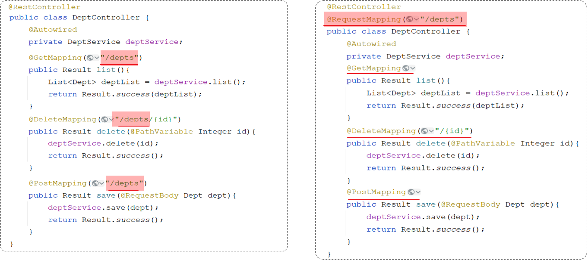
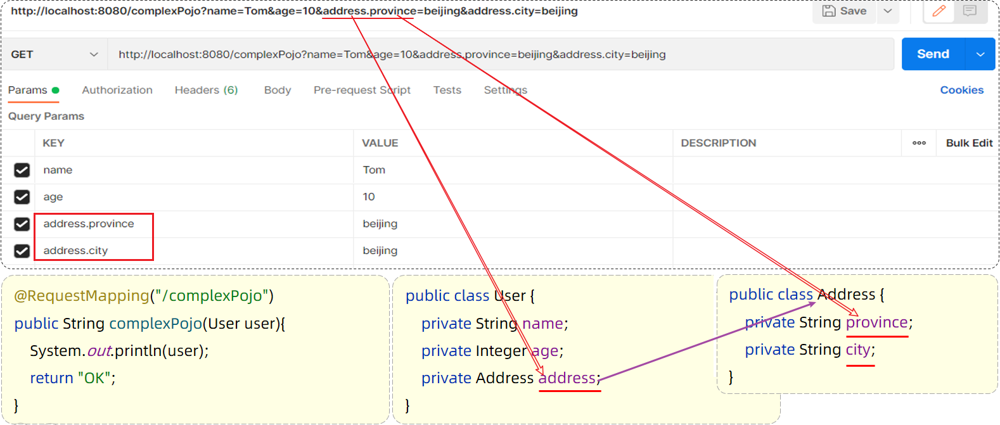

- [注解](#注解)
- [参数](#参数)
- [静态资源默认可以存放的目录](#静态资源默认可以存放的目录)
- [application配置文件的格式](#application配置文件的格式)
- [application配置文件的注入](#application配置文件的注入)


---


- 控制层：controller
- 业务层：service
- 持久层/数据访问层：dao

## 注解


@ResponseBody: 如果返回值类型是实体对象/集合，将会转换为JSON格式后在响应给浏览器

@RestController = @Controller + @ResponseBody

@RequestMapping(value = "/depts" , method = RequestMethod.GET)

@GetMapping("/depts")

@DeleteMapping

@PostMapping

@Transactional





## 参数

1. 参数名不一致：`@RequestParam(value = "name")`, value可省略。
2. 请求参数可选。用 `@RequestParam(required = false)`
3. 参数默认值 `@RequestParam(defaultValue = "1")`
4. 路径参数 `@RequestMapping("/path/{id}") + (@PathVariable Integer id)`
5. JSON参数 `@RequestBody User user`
6. 实体类：POJO类接受参数，名字必须一致，不一致则不赋值。

```java
@RestController
public class RequestController {
    // 实体参数：xxxxxxxxxx?name=Tom&age=10
    @RequestMapping("/simplePojo")
    public String simplePojo(User user){
        System.out.println(user);
        return "OK";
    }
}
```
复杂实体对象


- 复选框：可以用数组、集合来接受 `String[] hobby`, `@RequestParam List<String> hobby`（数组可以直接封装，集合需要`@RequestParam`）
```java
// xxxxxxxxxx?hobby=game&hobby=java
// xxxxxxxxxxxxx?hobby=game,java
@RestController
public class RequestController {
    //数组集合参数
    @RequestMapping("/arrayParam")
    public String arrayParam(String[] hobby){
        System.out.println(Arrays.toString(hobby));
        return "OK";
    }
}
@RestController
public class RequestController {
    //数组集合参数
    @RequestMapping("/listParam")
    public String listParam(@RequestParam List<String> hobby){
        System.out.println(hobby);
        return "OK";
    }
}
```

- 日期参数 `@DateTimeFormat(pattern = "yyyy-MM-dd HH:mm:ss") LocalDateTime updateTime`
 
```java
@RestController
public class RequestController {
    //日期时间参数
   @RequestMapping("/dateParam")
    public String dateParam(@DateTimeFormat(pattern = "yyyy-MM-dd HH:mm:ss") LocalDateTime updateTime){
        System.out.println(updateTime);
        return "OK";
    }
}
```
- 媒体文件 `MultipartFile image`

    ```yml
    # 默认媒体文件最大1MB
    spring:
      servlet:
        multipart:
        max-file-size: 10MB
        max-request-size: 100MB
    ```

    > MultipartFile 常见方法： 
    >
    > - String  getOriginalFilename();  //获取原始文件名
    > - void  transferTo(File dest);     //将接收的文件转存到磁盘文件中
    > - long  getSize();     //获取文件的大小，单位：字节
    > - byte[]  getBytes();    //获取文件内容的字节数组
    > - InputStream  getInputStream();    //获取接收到的文件内容的输入流

- 请求

    ```java
    public Result logout(HttpServletRequest httpServletRequest){

    String token = httpServletRequest.getHeader("authorization");
    ```
- HttpSession

    [Session（服务端会话跟踪技术）](登录认证.md)

## 静态资源默认可以存放的目录

- classpath:/static/
- classpath:/public/
- classpath:/resources/
- classpath:/META-INF/resources/

> classpath：

代表的是类路径

在maven的项目中，其实指的就是 src/main/resources 或者 src/main/java，

但是java目录是存放java代码的，所以相关的配置文件及静态资源文档，就放在 src/main/resources下。

## application配置文件的格式

- application.properties

  ```properties
  server.port=8080
  server.address=127.0.0.1
  ```

- application.yml/yaml 

  ```yml
  server:
    port: 8080
    address: 127.0.0.1
  ```

## application配置文件的注入

- @Value: 单独注入
- @ConfigurationProperties: prefix 整体注入到bean对象的属性中。

```yml
aliyun:
  oss:
    endpoint: https://oss-cn-hangzhou.aliyuncs.com
    accessKeyId: LTAI4GCH1vX6DKqJWxd6nEuW
    accessKeySecret: yBshYweHOpqDuhCArrVHwIiBKpyqSL
    bucketName: web-397
```
@Value方式：
```java
public class AliOSSUtils{
    @Value("${aliyun.oss.endpoint}")
    private String endpoint;
    @Value("${aliyun.oss.accessKeyId}")
    private String accessKeyId;
    @Value("${aliyun.oss.accessKeySecret}")
    private String accessKeySecret ;
    @Value("${aliyun.oss.bucketName}")
    private String bucketName;
}
```
@ConfigurationProperties方式：
```java
// 1. 需要创建一个实现类，且实体类中的属性名和配置文件当中key的名字必须要一致
// 2. @Data: 实体类当中的属性还需要提供 getter / setter方法
// 3. @ConfigurationProperties: 并通过perfect属性来指定配置参数项的前缀
// 4. @Component: 成为bean，供其他类使用
@Data
@Component
@ConfigurationProperties(prefix = "aliyun.oss")
public class AliOSSProperties {
    private String endpoint;
    private String accessKeyId;
    private String accessKeySecret ;
    private String bucketName;
}
```
```java
public class AliOSSUtils {
    // 注入配置参数实体类对象
    @Autowired
    private AliOSSProperties aliOSSProperties;
}
```
```xml
<dependency>
    <groupId>org.springframework.boot</groupId>
    <artifactId>spring-boot-configuration-processor</artifactId>
</dependency>
```