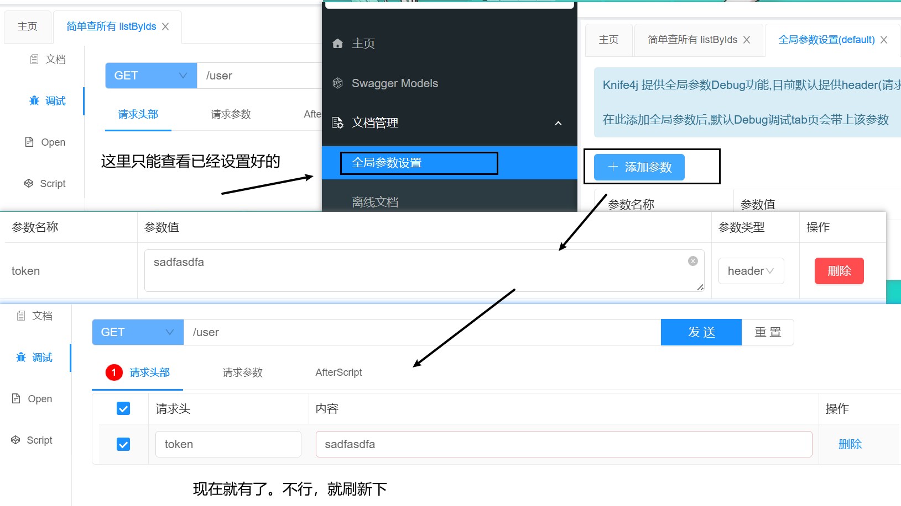

- [knife4j](#knife4j)
  - [header参数](#header参数)
- [Springdoc方式使用Swagger功能](#springdoc方式使用swagger功能)


---
## knife4j

```
http://localhost:8080/doc.html
```

```yml
knife4j:
  enable: true
  openapi:
    title: 用户管理接口文档
    description: "用户管理接口文档"
    email: zhanghuyi@itcast.cn
    concat: 虎哥
    url: https://www.itcast.cn
    version: v1.0.0
    group:
      default:
        group-name: default
        api-rule: package
        api-rule-resources:
          - com.sword.crud.controller     # 去看哪的controller
```
```xml
<!--knife4j-->
<dependency>
    <groupId>com.github.xiaoymin</groupId>
    <artifactId>knife4j-openapi2-spring-boot-starter</artifactId>
    <version>4.1.0</version>
</dependency>
```

- 方法 `@ApiOperation("简单增 save")`
- 方法参数 `@ApiParam("用户id")`
- POJO 类 `@ApiModel(description = "用户VO实体")`
- POJO 类字段 `@ApiModelProperty("用户id")`
```java
@ApiOperation("简单删除 removeById")
@DeleteMapping("{id}")
public void deleteUserById(@ApiParam("用户id") @PathVariable("id") Long id){
    userService.removeById(id);
}
```
```java
package com.sword.crud.domain.vo;

import io.swagger.annotations.ApiModel;
import io.swagger.annotations.ApiModelProperty;
import lombok.Data;

@Data
@ApiModel(description = "用户VO实体")
public class UserVO {
    
    @ApiModelProperty("用户id")   // 第一个参数就是value
    private Long id;
    
    @ApiModelProperty(value = "用户名", example = "Jack")
    private String username;
    
    @ApiModelProperty("详细信息")
    private String info;

    @ApiModelProperty("使用状态（1正常 2冻结）")
    private Integer status;
    
    @ApiModelProperty("账户余额")
    private Integer balance;
}
```

### header参数

比如，绕过登录认证。



## Springdoc方式使用Swagger功能

```xml
<dependency>
	<groupId>org.springdoc</groupId>
	<artifactId>springdoc-openapi-ui</artifactId>
	<version>1.2.30</version> 
</dependency
```