- [会话跟踪技术](#会话跟踪技术)
- [Cookie（客户端会话跟踪技术）](#cookie客户端会话跟踪技术)
- [Session（服务端会话跟踪技术）](#session服务端会话跟踪技术)
  - [黑马点评的例子](#黑马点评的例子)
  - [发送验证码](#发送验证码)
  - [登录](#登录)
  - [登录拦截器（校验登录状态）](#登录拦截器校验登录状态)
- [令牌技术](#令牌技术)
- [JWT是什么](#jwt是什么)
- [JWT怎么实现登录校验](#jwt怎么实现登录校验)
- [为什么设置401状态码？](#为什么设置401状态码)
- [统一拦截技术](#统一拦截技术)
- [过滤器和拦截器都有时，谁先执行](#过滤器和拦截器都有时谁先执行)
- [过滤器 Filter](#过滤器-filter)
- [过滤器链的执行顺序](#过滤器链的执行顺序)
- [拦截器 HandlerInterceptor](#拦截器-handlerinterceptor)
- [多个拦截器的执行顺序](#多个拦截器的执行顺序)
- [拦截器和controller的执行顺序](#拦截器和controller的执行顺序)


---

1. 会话技术
2. 统一拦截技术

## 会话跟踪技术

1. Cookie（客户端会话跟踪技术）
   - 数据存储在客户端浏览器当中
2. Session（服务端会话跟踪技术）
   - 数据存储在储在服务端
3. 令牌技术


## Cookie（客户端会话跟踪技术）
- 浏览器第一次请求了登录接口，**服务器将 cookie 响应给浏览器**，可以在 cookie 当中来存储当前登录用户的用户名。
- 浏览器接收到响应回来的数据之后，会将 **cookie 存储在浏览器本地**。
- 在后续的请求当中，**浏览器会将 cookie 携带到服务器端**。
- 接下来**在服务端我们就可以获取到 cookie 的值**。我们可以去判断一下这个 cookie 的值是否存在，如果不存在这个cookie，就说明客户端之前是没有访问登录接口的；如果存在 cookie 的值，就说明客户端之前已经登录完成了。


## Session（服务端会话跟踪技术）

过程：
- **浏览器第一次请求**了登录接口，服务器会创建一个会话对象Session，**自动**将 Session 的 ID 通过 Cookie 响应给浏览器。浏览器接收到响应回来的数据之后，会将 cookie 存储在浏览器本地。
- **后续前端请求**cookie中带着jssessionid，后端拿到jsessionid去tomcat服务器查。

疑问：
- session是存放在哪里？
    
    在tomcat中。
- Session的数据结构？
    
    tomcat用ConcurrentHashMap来保存不同的Session，key是sessionid，value是session。每个Session的结构也是用ConcurrentHashMap来保存键值对。

    所以下面session都是存"code"为key（而不是手机号），不同用户不会乱的原因就是一个用户对应一个sessionid、对应一个session。


    https://zhuanlan.zhihu.com/p/138791035?utm_id=0

- session 有过期时间吗？
    
    默认30 分钟


### 黑马点评的例子
> 前端

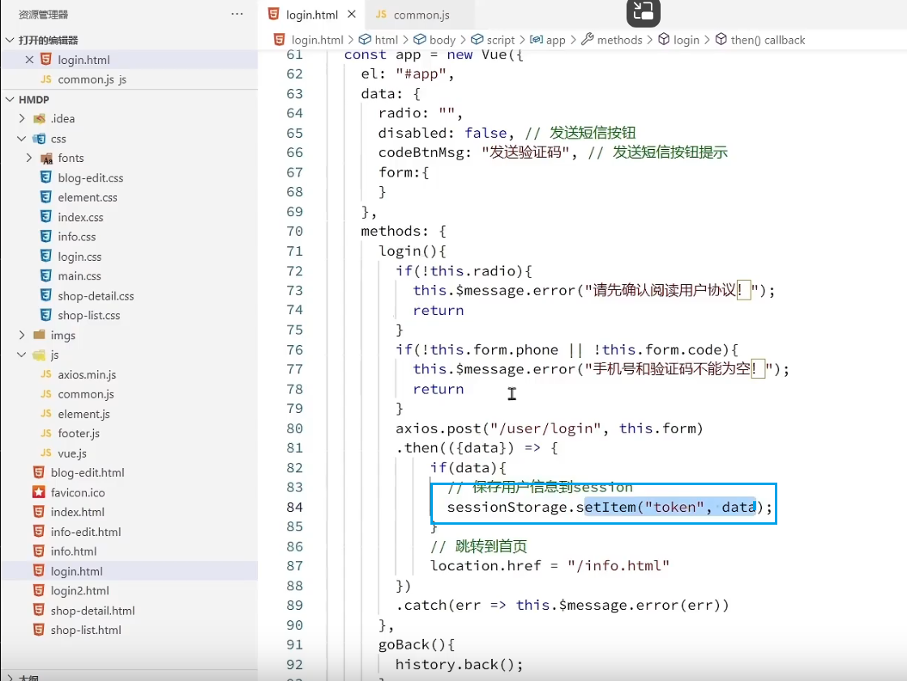

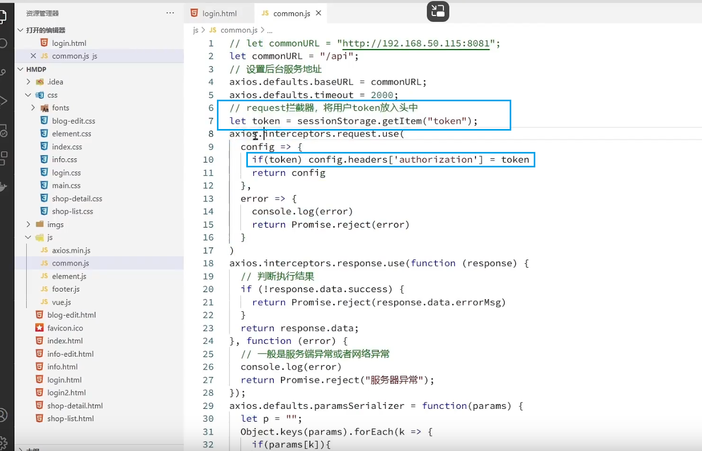

> 后端


```java
HttpSession session;
session.setAttribute("code", code);
Object code = session.getAttribute("code");

// resquest.getSession()：得到请求游览器(客户端)对应的session。如果没有，那么就创建应该新的session。如果有那么就返回对应的session
// setAttribute(String s, Object o)：在session存放属性
// getAttribute(String s)：从session中得到s所对应的属性
// removeAttribute(String s)：从session中删除s对应的属性
// getId()：得到session所对应的id
// invalidate()：使session立即无效
// setMaxInactiveInterval(int i)：设置session最大的有效时间。注意，这个有效时间是两次访问服务器所间隔的最大时间，如果超过最大的有效时间，那么这个session就失效了
```

### 发送验证码

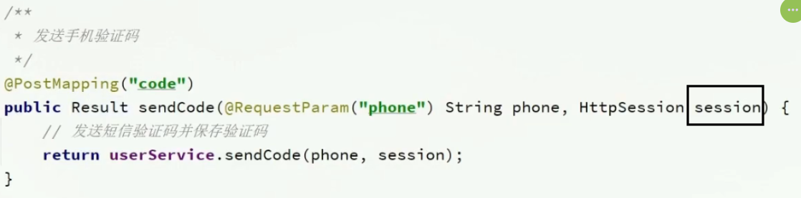

验证码保存在 session 中，session 在服务端 tomcat 中。

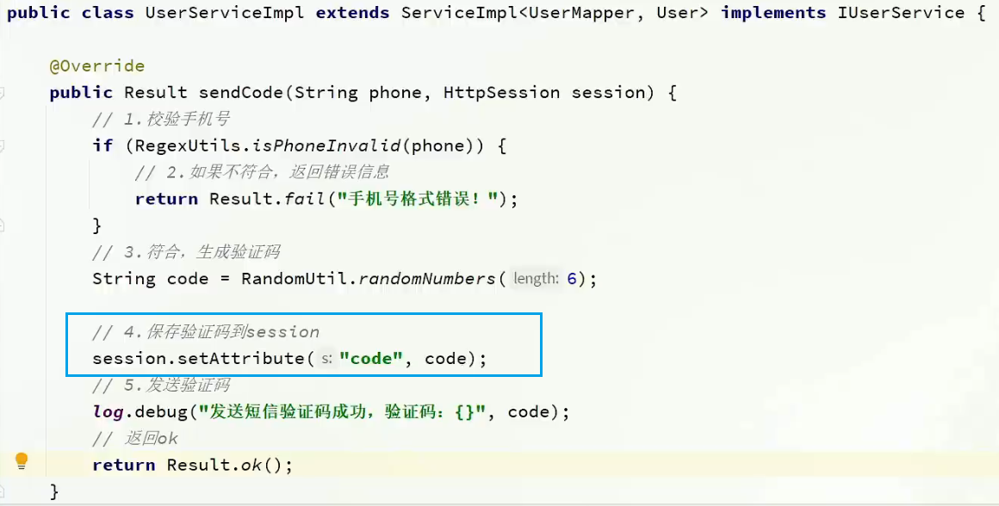

后续省略了，服务器调用手机短信服务的功能，所以我们假设客户端知道验证码。比较客户填写的验证码（前端参数）和后端session中的验证码。

### 登录

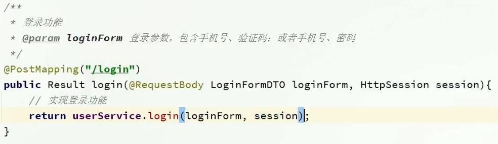


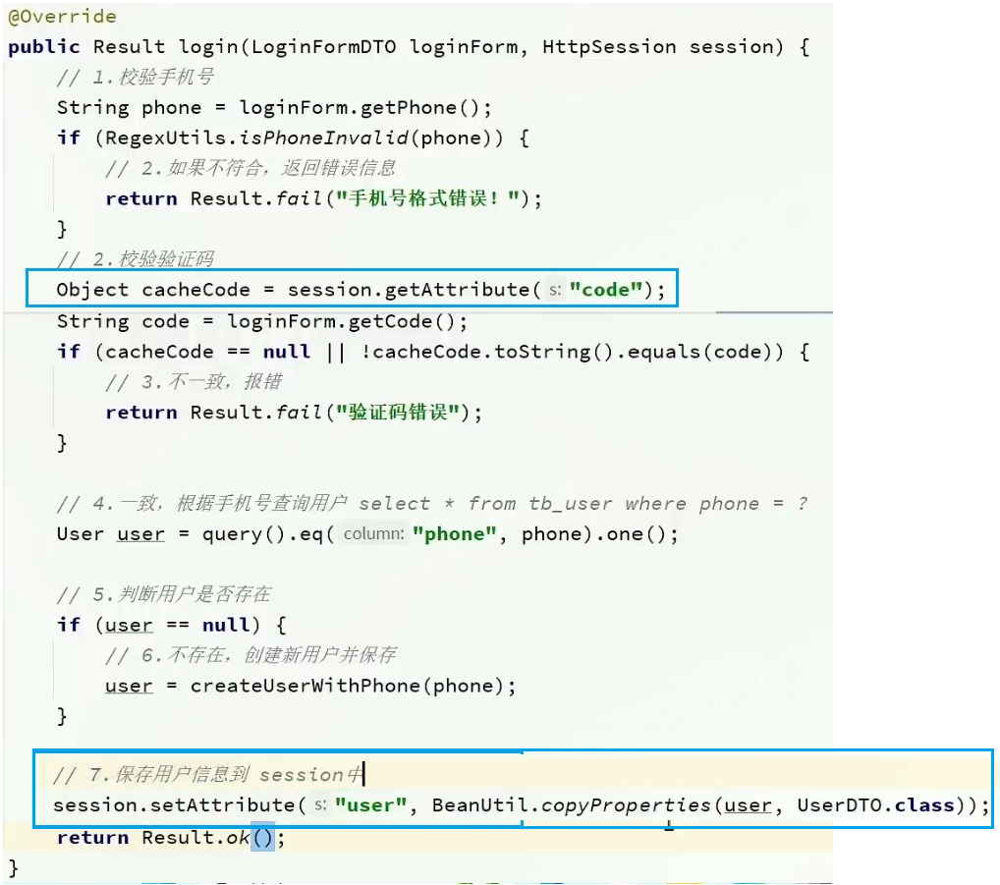

login 登录：

1. 前端传来的数据里有用户填写的手机号和验证码，session 里真验证码。比较填写验证码和真验证码是否一致。
2. 手机号去查 db 查用户。有，则将用户保存在 session 中。无，则创建用户并保存。
3. session 会话结束，以后前端发送的请求 cookie 中记录 session id。
   

### 登录拦截器（校验登录状态）

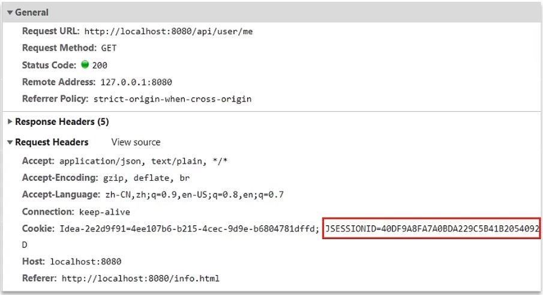

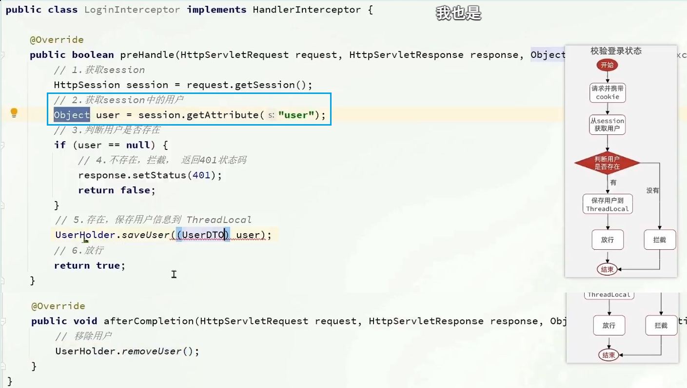

1. 使用拦截器拦截用户请求，根据用户是否存在而拦截或放行。
2. 请求中有 cookie，cookie 中有 session id，服务端根据 session 找到 session，取出其中的用户。
3. 有则放行请求。将用户 UerDTO 保存在 ThreadLocal 线程局部变量（UserHolder 里）。
4. 无则拦截请求。


PS：

- session 中保存用户，使用 UserDTO 而不是 User：隐藏 User 的敏感信息如密码，只存用户 id 和昵称。
- 为什么要存储在 ThreadLocal 中，不能每次都去 session 中找吗？
  第一，现在就是每次都去 session 中找用户。
  第二，你理解的每次都去 session 中是指像发送验证码和 login 一样去传入的 session 变量，那样确实可以，但现在处理的是普通方法，可以共同抽取这段获取用户再判断是否 null 的代码，这就是拦截器的意义。
  第三，校验登录状态是在拦截器中，拦截器可以获取 session，放入 ThreadLocal 传递给其他方法。

## 令牌技术
- 本质就是一个字符串。在同一次会话的多次请求之间，我们就可以将共享的数据存储在令牌当中就可以了。
- 令牌，可以存储在 cookie 当中，也可以存储在其他的存储空间(比如：localStorage)当中。
- 优点：
  - 支持PC端、移动端
  - 解决集群环境下的认证问题
  - 减轻服务器的存储压力（无需在服务器端存储）
- 缺点：需要自己实现（包括令牌的生成、令牌的传递、令牌的校验）

## JWT是什么

JWT令牌（JSON Web Token）：一个json形式的令牌。
- jwt就是将原始的json数据格式进行了安全的封装，这样就可以直接基于jwt在通信双方安全的进行信息传输了。
- 封装三部分：**头、荷载、签名**。
  - 头：记录**签名算法**、**令牌类型**
  - 荷载：自定义信息
  - 签名：**保证安全性，防止Token被篡改**。将header、payload，并加入指定秘钥，通过指定签名算法计算而来。一旦jwt令牌当中任何一个部分、任何一个字符被篡改了，整个令牌在校验的时候都会失败
- JWT是如何将原始的JSON格式数据，转变为字符串的呢？在生成JWT令牌时，会对JSON格式的数据进行一次编码进行base64编码

## JWT怎么实现登录校验

这部分分为两个模块，登录和校验。

登录发放jwt令牌：
1. 控制器login接收账号密码，然后调用service、mapper，去数据库查询此账号。没有的话要抛出异常，
2. 比对密码是否一致，如果密码是加密过还要解密（前端加密、数据库非明文）。
3. 如果密码对的上，就生成token，返回给前端
   - jwt令牌创建时可以使用建造者模式 `Jwts.builder()`
   - addClaims 方法加入自定义信息，比如说员工ID
   - signWith 方法，指定签名算法HS256 和 指定密钥
   - setExpiration 方法指定有效期
   - compact 方法，装配jwt令牌
4. 前端拿到jwt令牌之后，会将jwt令牌存储起来。在后续的每一次请求中都会将jwt令牌携带到服务端。

校验jwt令牌：判断有无令牌、令牌正确与否
1. 拦截器重写prehandle方法。
2. 首先判断当前被调用的handle是不是控制器，如果不是就直接放行请求。
3. 是则从请求头中获取令牌，用 `Jwts.parser()`校验令牌
4. 如果令牌不对，会抛出异常，所以要捕获异常，然后设置401状态码。
5. 如果令牌对了就放行，并通过ThreadLocal记录当前登录的ID，以便AOP的切面类使用。


JWT令牌最典型的应用场景就是登录认证：

1. 在浏览器发起请求来执行登录操作，此时会访问登录的接口，如果登录成功之后，我们需要生成一个jwt令牌，将生成的 jwt令牌返回给前端。
2. 前端拿到jwt令牌之后，会将jwt令牌存储起来。在后续的每一次请求中都会将jwt令牌携带到服务端。
3. 服务端统一拦截请求之后，先来判断一下这次请求有没有把令牌带过来，如果没有带过来，直接拒绝访问，如果带过来了，还要校验一下令牌是否是有效。如果有效，就直接放行进行请求的处理。

~~~xml
<!-- JWT依赖-->
<dependency>
    <groupId>io.jsonwebtoken</groupId>
    <artifactId>jjwt</artifactId>
    <version>0.9.1</version>
</dependency>
~~~
~~~java
public class JwtUtils {

    private static String signKey = "itheima";//签名密钥
    private static Long expire = 43200000L; //有效时间

    /**
     * 生成JWT令牌
     * @param claims JWT第二部分负载 payload 中存储的内容
     * @return
     */
    public static String generateJwt(Map<String, Object> claims){
        String jwt = Jwts.builder()
                .addClaims(claims)//自定义信息（有效载荷）
                .signWith(SignatureAlgorithm.HS256, signKey)//签名算法（头部）
                .setExpiration(new Date(System.currentTimeMillis() + expire))//过期时间
                .compact();
        return jwt;
    }

    /**
     * 解析JWT令牌
     * @param jwt JWT令牌
     * @return JWT第二部分负载 payload 中存储的内容
     */
    public static Claims parseJWT(String jwt){
        Claims claims = Jwts.parser()
                .setSigningKey(signKey)//指定签名密钥
                .parseClaimsJws(jwt)//指定令牌Token
                .getBody();
        return claims;
    }
}
~~~

## 为什么设置401状态码？

前端接受到401状态码后，就知道是没有登录的问题，设置跳转到登录页面。
```js
// commons.js
axios.interceptors.response.use(function (response) {
  // 判断执行结果
  if (!response.data.success) {
    return Promise.reject(response.data.errorMsg)
  }
  return response.data;
}, function (error) {
  // 一般是服务端异常或者网络异常
  console.log(error)
  if(error.response.status == 401){     // <<<<<<<<<<<<<
    // 未登录，跳转
    setTimeout(() => {
      location.href = "/login.html"
    }, 200);
    return Promise.reject("请先登录");
  }
  return Promise.reject("服务器异常");
});
```

## 统一拦截技术
区别：
- 接口规范不同：过滤器需要实现`Filter`接口，而拦截器需要实现`HandlerInterceptor`接口。
- 拦截范围不同：过滤器会拦截所有的资源，而拦截器只会拦截Spring环境中的资源。
- 提供不同：过滤器是Servlet规范中的，拦截器由Spring提供。


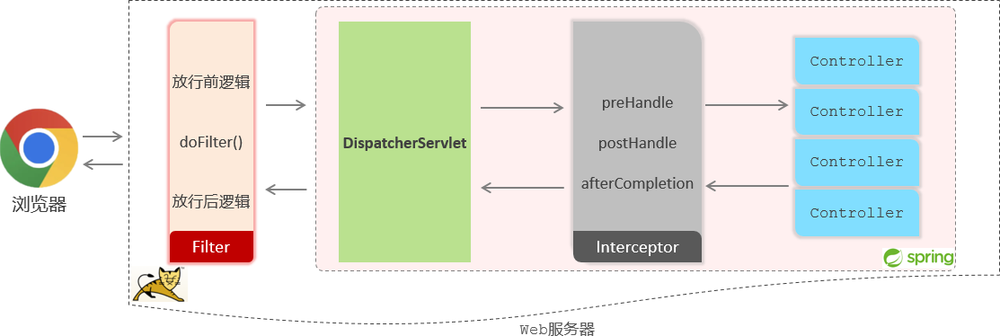

- 当我们打开浏览器来访问部署在web服务器当中的web应用时，此时我们所定义的过滤器会拦截到这次请求。拦截到这次请求之后，它会先执行放行前的逻辑，然后再执行放行操作。而由于我们当前是基于springboot开发的，所以放行之后是进入到了spring的环境当中，也就是要来访问我们所定义的controller当中的接口方法。

- Tomcat并不识别所编写的Controller程序，但是它识别Servlet程序，所以在Spring的Web环境中提供了一个非常核心的Servlet：DispatcherServlet（前端控制器），所有请求都会先进行到DispatcherServlet，再将请求转给Controller。

- 当我们定义了拦截器后，会在执行Controller的方法之前，请求被拦截器拦截住。执行`preHandle()`方法，这个方法执行完成后需要返回一个布尔类型的值，如果返回true，就表示放行本次操作，才会继续访问controller中的方法；如果返回false，则不会放行（controller中的方法也不会执行）。

- 在controller当中的方法执行完毕之后，再回过来执行`postHandle()`这个方法以及`afterCompletion()` 方法，然后再返回给DispatcherServlet，最终再来执行过滤器当中放行后的这一部分逻辑的逻辑。执行完毕之后，最终给浏览器响应数据。

## 过滤器和拦截器都有时，谁先执行

先过滤器，再拦截器。


## 过滤器 Filter
| 拦截路径     | urlPatterns值 | 含义                               |
| ------------ | ------------- | ---------------------------------- |
| 拦截具体路径 | /login        | 只有访问 /login 路径时，才会被拦截 |
| 目录拦截     | /emps/*       | 访问/emps下的所有资源，都会被拦截  |
| 拦截所有     | /*            | 访问所有资源，都会被拦截           |

1. Filter类实现 `Filter` 接口（重写doFilter），加上 @WebFilter配置拦截资源的路径
2. 引导类上加 `@ServletComponentScan` 开启Servlet组件支持

```xml
<!-- Filter,ServletRequest等在javax中 -->
<dependency>
    <groupId>org.apache.tomcat.embed</groupId>
    <artifactId>tomcat-embed-core</artifactId>
    <version>9.0.68</version>
</dependency>
```
必须重写doFilter，init和destroy可以不写
~~~java
@WebFilter(urlPatterns = "/*") 
public class DemoFilter implements Filter {

    @Override
    public void doFilter(ServletRequest servletRequest, ServletResponse servletResponse, FilterChain filterChain) throws IOException, ServletException {
        System.out.println("DemoFilter   放行前逻辑.....");

        // 放行请求
        filterChain.doFilter(servletRequest, servletResponse);

        System.out.println("DemoFilter   放行后逻辑.....");
        
    }

    @Override //初始化方法, 只调用一次
    public void init(FilterConfig filterConfig) throws ServletException {
        System.out.println("init 初始化方法执行了");
    }

    @Override //销毁方法, 只调用一次
    public void destroy() {
        System.out.println("destroy 销毁方法执行了");
    }
}
~~~
~~~java
@ServletComponentScan
@SpringBootApplication
public class TliasWebManagementApplication {

    public static void main(String[] args) {
        SpringApplication.run(TliasWebManagementApplication.class, args);
    }
}
~~~

## 过滤器链的执行顺序

是按过滤器类名的自动排序

假如我们想让DemoFilter先执行，怎么办呢？答案就是修改类名。

## 拦截器 HandlerInterceptor

1. 拦截器类实现 `HandlerInterceptor` 接口(重写preHandle，true放行，false不放行)，@Component注册为bean。
2. 配置类实现 `WebMvcConfigurer` 接口注册配置拦截器，配置拦截路径

| 拦截路径  | 含义                 | 举例                                                |
| --------- | -------------------- | --------------------------------------------------- |
| /*        | 一级路径             | 能匹配/depts，/emps，/login，不能匹配 /depts/1      |
| /**       | 任意级路径           | 能匹配/depts，/depts/1，/depts/1/2                  |
| /depts/*  | /depts下的一级路径   | 能匹配/depts/1，不能匹配/depts/1/2，/depts          |
| /depts/** | /depts下的任意级路径 | 能匹配/depts，/depts/1，/depts/1/2，不能匹配/emps/1 |

```xml
<!-- ServletRequest等在javax中 -->
<dependency>
    <groupId>org.apache.tomcat.embed</groupId>
    <artifactId>tomcat-embed-core</artifactId>
    <version>9.0.68</version>
</dependency>
<!-- HandlerInterceptor在mvc中 -->
<dependency>
    <groupId>org.springframework</groupId>
    <artifactId>spring-webmvc</artifactId>
    <version>5.3.23</version>
</dependency>
```
都可以不写，但要重写preHandle

~~~java
//自定义拦截器
@Component
public class LoginCheckInterceptor implements HandlerInterceptor {
    //目标资源方法执行前执行。 返回true：放行    返回false：不放行
    @Override
    public boolean preHandle(HttpServletRequest request, HttpServletResponse response, Object handler) throws Exception {
        System.out.println("preHandle .... ");
        
        return true; // true表示放行
    }

    //目标资源方法执行后执行
    @Override
    public void postHandle(HttpServletRequest request, HttpServletResponse response, Object handler, ModelAndView modelAndView) throws Exception {
        System.out.println("postHandle ... ");
    }

    //视图渲染完毕后执行，最后执行
    @Override
    public void afterCompletion(HttpServletRequest request, HttpServletResponse response, Object handler, Exception ex) throws Exception {
        System.out.println("afterCompletion .... ");
    }
}
~~~
~~~java
@Configuration  
public class WebConfig implements WebMvcConfigurer {
    // 拦截器对象
    @Autowired
    private LoginCheckInterceptor loginCheckInterceptor;

    @Override
    public void addInterceptors(InterceptorRegistry registry) {
        //注册自定义拦截器对象
        registry.addInterceptor(loginCheckInterceptor)
                .addPathPatterns("/**")//设置拦截器拦截的请求路径（ /** 表示拦截所有请求）
                .excludePathPatterns("/login");//设置不拦截的请求路径
    }
}
~~~


## 多个拦截器的执行顺序

是否设置了`.order()`：
- 默认按注册顺序。
- 指定则按order升序。

```java
registry.addInterceptor(new CInterceptor())
        .addPathPatterns("/**")
        .order(0);  // 设置的值越小，执行顺序越前
```

具体，则是 preHandle按上述顺序，postHandle按逆序，afterCompletion按逆序。


## 拦截器和controller的执行顺序

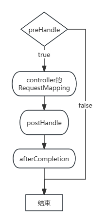 

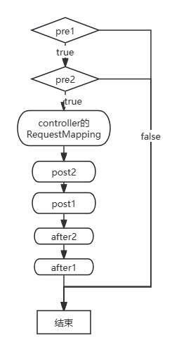

https://zhuanlan.zhihu.com/p/371022150、https://blog.csdn.net/qq_24598601/article/details/107721881