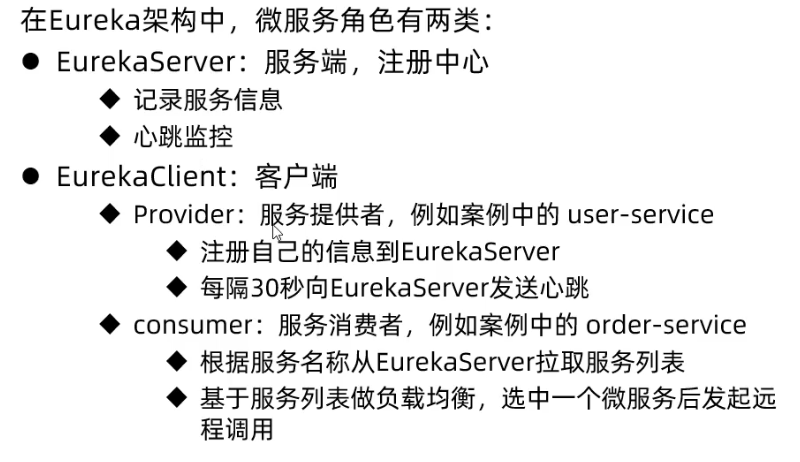

- [远程调用 RestTemplate](#远程调用-resttemplate)
- [eureka 机制](#eureka-机制)
- [使用](#使用)
  - [新建 eureka-server 模块](#新建-eureka-server-模块)
  - [其他模块（服务注册）](#其他模块服务注册)
- [Ribbon 机制](#ribbon-机制)
- [Ribbon 负载均衡策略](#ribbon-负载均衡策略)
- [Ribbon 修改负载均衡策略](#ribbon-修改负载均衡策略)
- [Ribbon 饥饿加载](#ribbon-饥饿加载)

---
## 远程调用 RestTemplate


## eureka 机制





## 使用

eureka-server 模块是 eurake的服务端。

其他模块是 eurake的客户端。

### 新建 eureka-server 模块

1. server依赖
```xml
<!-- 不用配置版本，已由spring-cloud-dependencies的版本确定 -->
<dependency>
    <groupId>org.springframework.cloud</groupId>
    <artifactId>spring-cloud-starter-netflix-eureka-server</artifactId>
</dependency>
```

2. application.yml文件

```yaml
server:
  port: 10086       # eureka 的端口
spring:
  application:
    name: eureka-server

# 注册该服务到eureka，自己也要注册
eureka:
  client:
    service-url: 
      defaultZone: http://127.0.0.1:10086/eureka   
```
3. 启动类 `@EnableEurekaServer` 注解，开启eureka的注册中心功能：

```java
package cn.itcast.eureka;

import org.springframework.boot.SpringApplication;
import org.springframework.boot.autoconfigure.SpringBootApplication;
import org.springframework.cloud.netflix.eureka.server.EnableEurekaServer;

@SpringBootApplication
@EnableEurekaServer
public class EurekaApplication {
    public static void main(String[] args) {
        SpringApplication.run(EurekaApplication.class, args);
    }
}
```

### 其他模块（服务注册）
1. client 依赖
```xml
<dependency>
    <groupId>org.springframework.cloud</groupId>
    <artifactId>spring-cloud-starter-netflix-eureka-client</artifactId>
</dependency>
```
2. application.yml文件

```yaml
spring:
  application:
    name: userservice

eureka:
  client:
    service-url:
      defaultZone: http://127.0.0.1:10086/eureka
```

3. 修改远程调用：`@LoadBalanced` Ribbon的负载均衡, url修改为**服务名称**。


启动微服务，然后在浏览器访问：http://127.0.0.1:10086


## Ribbon 机制

SpringCloudRibbon的底层采用了一个拦截器，拦截了RestTemplate发出的请求，对地址做了修改。


基本流程如下：

- 拦截我们的RestTemplate请求http://userservice/user/1
- RibbonLoadBalancerClient会从请求url中获取服务名称，也就是user-service
- DynamicServerListLoadBalancer根据user-service到eureka拉取服务列表
- eureka返回列表，localhost:8081、localhost:8082
- IRule利用内置负载均衡规则，从列表中选择一个，例如localhost:8081
- RibbonLoadBalancerClient修改请求地址，用localhost:8081替代userservice，得到http://localhost:8081/user/1，发起真实请求


## Ribbon 负载均衡策略

负载均衡的规则都定义在IRule接口中，而IRule有很多不同的实现类：


| **内置负载均衡规则类**    | **规则描述**                                                 |
| ------------------------- | ------------------------------------------------------------ |
| RoundRobinRule            | 简单轮询服务列表来选择服务器。 |
| AvailabilityFilteringRule | 对以下两种服务器进行忽略：   </br>（1）在默认情况下，这台服务器如果3次连接失败，这台服务器就会被设置为“短路”状态。短路状态将持续30秒，如果再次连接失败，短路的持续时间就会几何级地增加。  </br>（2）并发数过高的服务器。如果一个服务器的并发连接数过高，配置了AvailabilityFilteringRule规则的客户端也会将其忽略。并发连接数的上限，可以由客户端的`<clientName>.<clientConfigNameSpace>.ActiveConnectionsLimit`属性进行配置。 |
| WeightedResponseTimeRule  | 为每一个服务器赋予一个权重值。服务器响应时间越长，这个服务器的权重就越小。这个规则会随机选择服务器，这个权重值会影响服务器的选择。 |
| **ZoneAvoidanceRule**     | 以区域可用的服务器为基础进行服务器的选择。使用Zone对服务器进行分类，这个Zone可以理解为一个机房、一个机架等。而后再对Zone内的多个服务做轮询。 |
| BestAvailableRule         | 忽略那些短路的服务器，并选择并发数较低的服务器。             |
| RandomRule                | 随机选择一个可用的服务器。                                   |
| RetryRule                 | 重试机制的选择逻辑                                           |


> **注意**，一般用默认的负载均衡规则，不做修改。默认的实现就是ZoneAvoidanceRule，是一种轮询方案

## Ribbon 修改负载均衡策略

方式1：在某个微服务的启动类中定义一个新的IRule。效果是OrderService访问其他微服务都是这个策略。

```java
@SpringBootApplication
public class OrderApplication {
    public static void main(String[] args) {
        SpringApplication.run(OrderApplication.class, args);
    }

    @Bean
    @LoadBalanced
    public RestTemplate restTemplate() {
        return new RestTemplate();
    }

    // 应该是按类型注入，名字随便起？
    @Bean
    public IRule randomRule(){
        return new RandomRule();
    }
}
```
方式2：在某个微服务的application.yml文件中。效果是OrderService访问不同的微服务用不同的策略。

```yaml
userservice: # OrderService访问userservice服务
  ribbon:
    NFLoadBalancerRuleClassName: com.netflix.loadbalancer.RandomRule # 负载均衡规则 
```


## Ribbon 饥饿加载

Ribbon默认是采用懒加载，即第一次访问时才会去创建 RibbonLoadBalancerClient, 拉去服务，请求时间会很长。

而饥饿加载则会在项目启动时创建，降低第一次访问的耗时，通过下面配置开启饥饿加载：

```yaml
ribbon:
  eager-load:
    enabled: true
    clients:    # 让OrderService直接拉取userservice服务
      - userservice    
```
