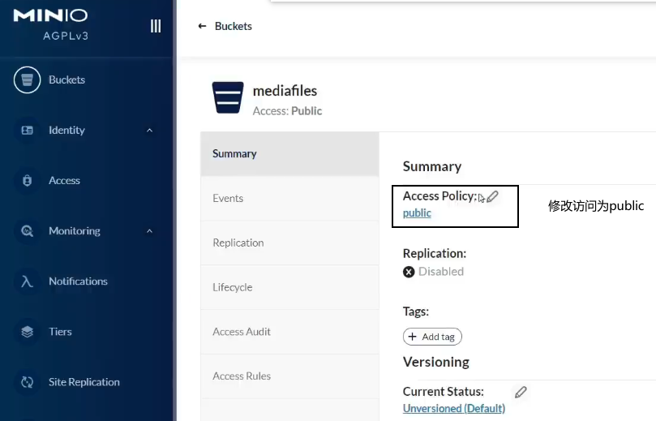

- [md5](#md5)
- [创建MinioClient对象](#创建minioclient对象)
- [minio上传文件](#minio上传文件)
- [minio删除文件](#minio删除文件)
- [minio检测文件是否存在](#minio检测文件是否存在)
- [minio获取文件](#minio获取文件)
- [minio合并分块](#minio合并分块)


---


```xml
<dependency>
    <groupId>io.minio</groupId>
    <artifactId>minio</artifactId>
    <version>8.4.3</version>
</dependency>
<!-- 根据文件后缀名获取 contentType -->
<dependency>
    <groupId>com.j256.simplemagic</groupId>
    <artifactId>simplemagic</artifactId>
    <version>1.17</version>
</dependency>
```

## md5
```java
//  spring-core中，无须特别依赖
String fileMD5 = DigestUtils.md5DigestAsHex(bytes);     // byte[], InputStream
```
```java
<dependency>
    <groupId>commons-codec</groupId>
    <artifactId>commons-codec</artifactId>
    <version>1.11</version>
</dependency>

String fileMD5 = DigestUtils.md5Hex(bytes);     // byte[], String, InputStream
```
## 创建MinioClient对象
```java
MinioClient minioClient = MinioClient.builder()
        .endpoint("http://127.0.0.1:9000")
        .credentials("minioadmin", "minioadmin")
        .build();
```
## minio上传文件
```java
/**
 * 根据objectName获取对应的MimeType
 *
 * @param objectName 对象名称
 * @return
 */
private static String getContentType(String objectName) {
    String contentType = MediaType.APPLICATION_OCTET_STREAM_VALUE; // 默认content-type为未知二进制流
    if (objectName.contains(".")) { // 判断对象名是否包含 .
        // 有 .  则划分出扩展名
        String extension = objectName.substring(objectName.lastIndexOf("."));
        // 根据扩展名得到content-type，如果为未知扩展名，例如 .abc之类的东西，则会返回null
        ContentInfo extensionMatch = ContentInfoUtil.findExtensionMatch(extension);
        // 如果得到了正常的content-type，则重新赋值，覆盖默认类型
        if (extensionMatch != null) {
            contentType = extensionMatch.getMimeType();
        }
    }
    return contentType;
}
```

```java
public void addMediaFilesToMinIO(String filePath, String bucket, String objectName) {
    String contentType = getContentType(objectName);
    try {
        UploadObjectArgs uploadObjectArgs = UploadObjectArgs
                .builder()
                .bucket(bucket)
                .object(objectName)
                .filename(filePath)
                .contentType(contentType)
                .build();
        minioClient.uploadObject(uploadObjectArgs);
    } catch (Exception e) {
        XueChengPlusException.cast("上传到文件系统出错:" + e.getMessage());
    }
}

public void addMediaFilesToMinIO(byte[] bytes, String bucket, String objectName) {
    String contentType = getContentType(objectName);
    ByteArrayInputStream byteArrayInputStream = new ByteArrayInputStream(bytes);
    try(byteArrayInputStream) {
        PutObjectArgs putObjectArgs = PutObjectArgs.builder()
                    .bucket(bucket)
                    .object(objectName)
                    .stream(byteArrayInputStream, byteArrayInputStream.available(), -1)
                    .contentType(contentType)
                    .build();
        minioClient.putObject(putObjectArgs);
    } catch (Exception e) {
        log.debug("上传到文件系统出错:{}", e.getMessage());
        throw new XueChengPlusException("上传到文件系统出错");
    }
}
```
## minio删除文件
```java
public void deleteObject() {
    try {
        RemoveObjectArgs removeObjectArgs = RemoveObjectArgs
                .builder()
                .bucket("testbucket")
                .object("pic01.png")
                .build();
        minioClient.removeObject(removeObjectArgs);
        System.out.println("删除成功");
    } catch (Exception e) {
        System.out.println("删除失败");
    }
}

public void deleteObjects(String chunkFileFolderPath, int chunkTotal) throws IOException {
    // 各分块
    try {
        List<DeleteObject> objects = Stream.iterate(0, i -> i + 1).limit(10)
                .map(i-> new DeleteObject(chunkFileFolderPath.concat(Integer.toString(i))))
                .collect(Collectors.toList());
        RemoveObjectsArgs removeObjectsArgs = RemoveObjectsArgs
                .builder()
                .bucket("testbucket")
                .objects(objects)
                .build();
        // 遍历返回结果 get()后才真正删除
        Iterable<Result<DeleteError>> results = minioClient.removeObjects(removeObjectsArgs);
        results.forEach(
            f -> {
                try {
                    DeleteError deleteError = f.get();
                } catch (Exception e) {
                    throw new RuntimeException(e);
                }
            }
        );
    } catch (Exception e) {
        throw new RuntimeException(e);
    }
}
```
## minio检测文件是否存在

```java
public boolean checkFileExistsTest() {
    try {
        GetObjectArgs getObjectArgs = GetObjectArgs.builder()
                .bucket("testbucket")
                .object("pic01.png")
                .build();
        FilterInputStream inputStream = minioClient.getObject(getObjectArgs);
        if(inputStream == null){
            return false;
        }
    } catch (Exception e) {
        return false;
    }
    return true;
}
```
## minio获取文件
```java
@Test
public void getFileTest() {
    try {
        GetObjectArgs getObjectArgs = GetObjectArgs.builder()
                .bucket("testbucket")
                .object("pic01.png")
                .build();
        FilterInputStream inputStream = minioClient.getObject(getObjectArgs);
        FileOutputStream fileOutputStream = new FileOutputStream("C:\\Users\\15863\\Desktop\\tmp.png");
        IOUtils.copy(inputStream, fileOutputStream);
        System.out.println("下载成功");
    } catch (Exception e) {
        System.out.println("下载失败");
    }
}
```

## minio合并分块

要求分块大小必须大于等于5M。

> 方式一：让minio合并

```java
@Test
public void testMinioMerge() throws IOException {
    // 各分块
    List<ComposeSource> sources = Stream.iterate(0, i -> i + 1).limit(10)
            .map(i->ComposeSource.builder().bucket("testbucket").object("chunk/" + i).build())
            .collect(Collectors.toList());
    ComposeObjectArgs composeObjectArgs = ComposeObjectArgs.builder()
            .bucket("testbucket")
            .object("merger.mp4")   // 合并分块后的结果
            .sources(sources)               // 各分块
            .build();
    // 合并
    try {
        minioClient.composeObject(composeObjectArgs);
    } catch (Exception e) {
        throw new RuntimeException(e);
    }
}
```

> 方式二：下载到本地合并再上传

```java
public RestResponse mergeChunks(String fileMd5, int chunkTotal, UploadFileParamsDto uploadFileParamsDto) {
    // 下载分块文件
    File[] chunkFiles = checkChunkStatus(fileMd5, chunkTotal);
    // 获取源文件名
    String fileName = uploadFileParamsDto.getFilename();
    // 获取源文件扩展名
    String extension = fileName.substring(fileName.lastIndexOf("."));
    // 创建出临时文件，准备合并
    File mergeFile = null;
    try {
        mergeFile = File.createTempFile(fileName, extension);
    } catch (IOException e) {
        XueChengPlusException.cast("创建合并临时文件出错");
    }
    try {
        // 缓冲区
        byte[] buffer = new byte[1024];
        // 写入流，向临时文件写入
        try (RandomAccessFile raf_write = new RandomAccessFile(mergeFile, "rw")) {
            // 遍历分块文件数组
            for (File chunkFile : chunkFiles) {
                // 读取流，读分块文件
                try (RandomAccessFile raf_read = new RandomAccessFile(chunkFile, "r")) {
                    int len;
                    while ((len = raf_read.read(buffer)) != -1) {
                        raf_write.write(buffer, 0, len);
                    }
                }
            }
        } catch (Exception e) {
            XueChengPlusException.cast("合并文件过程中出错");
        }
        uploadFileParamsDto.setFileSize(mergeFile.length());
        // 对文件进行校验，通过MD5值比较
        try (FileInputStream mergeInputStream = new FileInputStream(mergeFile)) {
            String mergeMd5 = DigestUtils.md5Hex(mergeInputStream);
            if (!fileMd5.equals(mergeMd5)) {
                XueChengPlusException.cast("合并文件校验失败");
            }
            log.debug("合并文件校验通过：{}", mergeFile.getAbsolutePath());
        } catch (Exception e) {
            XueChengPlusException.cast("合并文件校验异常");
        }
        String mergeFilePath = getFilePathByMd5(fileMd5, extension);
        // 将本地合并好的文件，上传到minio中，这里重载了一个方法
        addMediaFilesToMinIO(mergeFile.getAbsolutePath(), video_files, mergeFilePath);
        log.debug("合并文件上传至MinIO完成{}", mergeFile.getAbsolutePath());
        return RestResponse.success();
    } finally {
        for (File chunkFile : chunkFiles) {
            try {
                chunkFile.delete();
            } catch (Exception e) {
                log.debug("临时分块文件删除错误：{}", e.getMessage());
            }
        }
        try {
            mergeFile.delete();
        } catch (Exception e) {
            log.debug("临时合并文件删除错误：{}", e.getMessage());
        }
    }
}
```