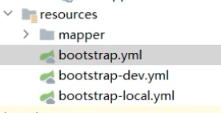
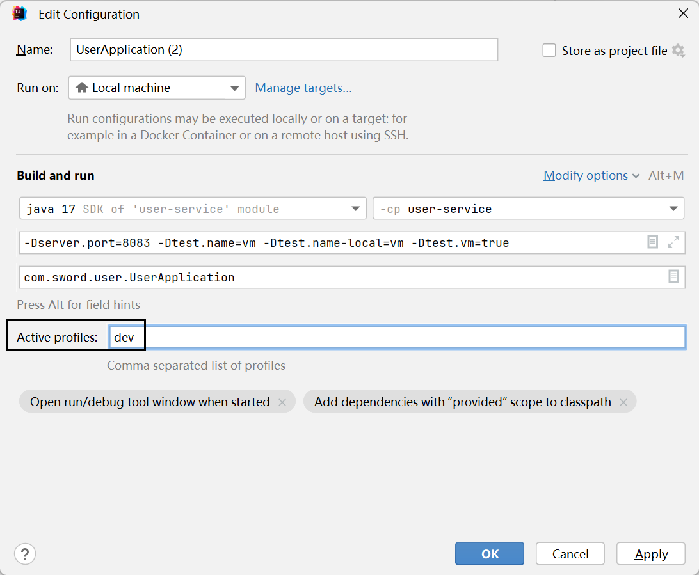
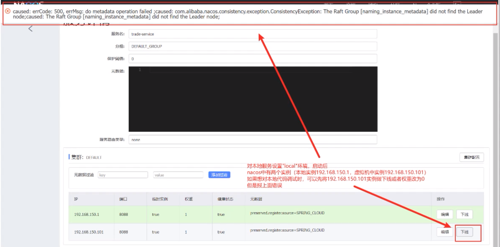
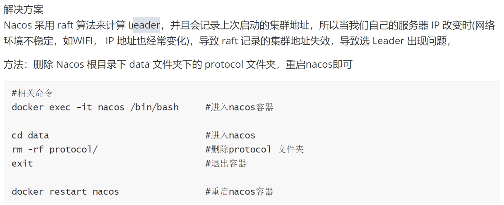

# 

1. Nacos的依赖：父工程添加 alibaba 依赖管理，子工程是服务发现和配置中心
  ```xml
  <dependency>
      <groupId>com.alibaba.cloud</groupId>
      <artifactId>spring-cloud-alibaba-dependencies</artifactId>
      <!-- <version>2.2.5.RELEASE</version> -->
      <version>${spring-cloud-alibaba.version}</version>
      <type>pom</type>
      <scope>import</scope>
  </dependency>
  ```
  ```xml
  <!-- 服务发现 -->
  <dependency>
      <groupId>com.alibaba.cloud</groupId>
      <artifactId>spring-cloud-starter-alibaba-nacos-discovery</artifactId>
  </dependency>

  <!-- 配置中心 -->
  <dependency>
      <groupId>com.alibaba.cloud</groupId>
      <artifactId>spring-cloud-starter-alibaba-nacos-config</artifactId>
  </dependency>
  ```

2. 模块的application.yml

  ```yml
  # 让服务到nacos服务器去注册服务
  spring:
    cloud:
      nacos:
        server-addr: localhost:8848   # nacos服务器地址
  ```

nacos：服务注册中心、配置中心


## 配置文件规范：bootstrap.yml





dev和local的yml文件，nacos的命名空间都一样。local只是让本机起一个服务，所以和在虚拟机中的dev的区别，只有ip不同。


方式1：修改 bootstrap.yml中 dev或者local

方式2：修改idea的配置




## bootstrap.yml 和 application.yml 有什么区别？

因为nacos。必须要叫bootstrap，不然不会去nacos读取配置。

## 远程配置的默认值

格式： `${LOCAL_NAME:DEFAULT}`

本地的 bootstrap.yml
```yml
tj:
  mq:
    host: 192.168.150.102
```

shared-mq.yaml
```yml
spring:
  rabbitmq:
    host: ${tj.mq.host:192.168.150.101} # mq的IP
```

如果本地写了 `tj.mq.host`，那么远程配置就采用；本地没写，远程就使用默认值 `192.168.150.101`

## 服务下线的两种方式

方式1：点击下线按钮



方式2：点击编辑按钮，服务权重调整为0


## nacos下线报错





## raft算法