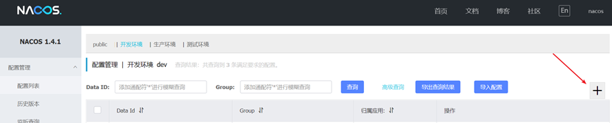
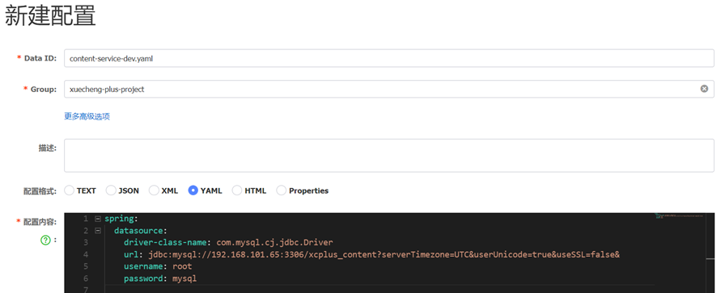
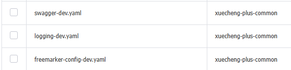

- [服务发现](#服务发现)
- [配置中心](#配置中心)
  - [扩展配置](#扩展配置)
  - [公共配置](#公共配置)
  - [配置优先级](#配置优先级)

----

## 服务发现

配置nacos的地址：在系统管理的接口工程的配置文件中。四个信息:应用名、nacos的服务器地址、在nacos中所属的命名空间和组。
```YAML
spring:
  application:
    name: content-api
  cloud:
    nacos:
      server-addr: 192.168.101.65:8848
      discovery:
        namespace: dev
        group: xuecheng-plus-project
```

## 配置中心

PS: 有些把api和service分开配置，api中只注册服务发现，service填写数据库的配置。感觉没有必要分开。


通过Nacos去管理项目的所有配置：
1. 每个项目特有的配置

    是指该配置只在有些项目中需要配置，或者该配置在每个项目中配置的值不同。
比如：spring.application.name每个项目都需要配置但值不一样，以及有些项目需要连接数据库而有些项目不需要，有些项目需要配置消息队列而有些项目不需要。
2. 项目所公用的配置
    
    是指在若干项目中配置内容相同的配置。比如：redis的配置，很多项目用的同一套redis服务所以配置也一样。


nacos如何去定位一个具体的配置文件，即：namespace、group、dataid. 
1. 通过namespace、group找到具体的环境和具体的项目。
2. 通过dataid找到具体的配置文件，dataid有三部分组成 `spring.application.name`-`spring.profiles.active`-`spring.cloud.nacos.config.file-extension`


下边以开发环境为例对content-service工程的配置文件进行配置，进入nacos，进入开发环境 **namespace**。
 
点击加号，添加一个配置


输入**data id**、**group**以及配置文件内容。


```yml
spring:
  application:
    name: content-api   # dataid的一部分
  cloud:
    nacos:
      server-addr: 192.168.101.65:8848
      config:   # 配置中心
        namespace: dev  # 定位1
        group: xuecheng-plus-project    # 定位2
        file-extension: yaml    # dataid的一部分
        refresh-enabled: true
  profiles: # dataid的一部分
    active: dev
```


> 例子：
原本
```yml
server:
  servlet:
    context-path: /content
  port: 63040
# 微服务配置
spring:
  application:
    name: content-api
  cloud:
    nacos:
      server-addr: 192.168.101.65:8848
      discovery:
        namespace: dev
        group: xuecheng-plus-project
  datasource:
    driver-class-name: com.mysql.cj.jdbc.Driver
    url: jdbc:mysql://192.168.101.65:3306/xcplus_content?serverTimezone=UTC&userUnicode=true&useSSL=false&
    username: root
    password: mysql
# 日志文件配置路径
logging:
  config: classpath:log4j2-dev.xml
swagger:
  title: "启明内容管理系统"
  description: "内容系统管理系统对课程相关信息进行管理"
  base-package: com.qiming.content
  enabled: true
  version: 1.0.0
```
nacos
```yml
server:
  servlet:
    context-path: /content
  port: 63040

spring:
  datasource:
    driver-class-name: com.mysql.cj.jdbc.Driver
    url: jdbc:mysql://192.168.101.65:3306/xcplus_content?serverTimezone=UTC&userUnicode=true&useSSL=false&
    username: root
    password: mysql

# 日志文件配置路径
logging:
  config: classpath:log4j2-dev.xml

swagger:
  title: "启明内容管理系统"
  description: "内容系统管理系统对课程相关信息进行管理"
  base-package: com.qiming.content
  enabled: true
  version: 1.0.0
```
本地
```yaml
#微服务配置
spring:
  application:
    name: content-api
  cloud:
    nacos:
      server-addr: 192.168.101.65:8848
      discovery:
        namespace: dev
        group: xuecheng-plus-project
      config:
        namespace: dev
        group: xuecheng-plus-project
        file-extension: yaml
        refresh-enabled: true
  profiles:
    active: dev
```

### 扩展配置

如api和service因为数据库而分开，api引用servcie的配置。

和公共配置的不同是，属于极个别配置。

```yml
# 省略了注册和配置的东西
spring:
  cloud:
    nacos:
      config:
        extension-configs: 
          - data-id: content-service-${spring.profiles.active}.yaml
            group: xuecheng-plus-project
            refresh: true
```

### 公共配置

很多项目都要用到的配置



```yml
# swagger 文档配置
swagger:
  title: "学成在线内容管理系统"
  description: "内容系统管理系统对课程相关信息进行业务管理数据"
  base-package: com.qiming      # 这里从 com.qiming.content 换成了大包
  enabled: true
  version: 1.0.0
```

```yml
# 省略了注册和配置的东西
spring:
  cloud:
    nacos:
      config:
        shared-configs: # 公共配置
          - data-id: swagger-${spring.profiles.active}.yaml
            group: xuecheng-plus-common
            refresh: true
          - data-id: logging-${spring.profiles.active}.yaml
            group: xuecheng-plus-common
            refresh: true
```

### 配置优先级

1. 高到低：nacos上的本应用配置 > 扩展配置 > 公共配置 > 本地配置
2. 本地配置，分为bootstrap.yml中和idea configuration的VM参数，后者常用。

    `-Dserver.port=64031 spring.profiles.active=test`切换端口、不同开发级别。

3. 强制本地优先级最高：需要在**nacos上的本应用配置**（而不是本地配置上）写：

    ```yml
    spring:
      cloud:
       config:
         override-none: true
    ```