- [如何将服务注册到nacos](#如何将服务注册到nacos)
- [nacos服务分级存储模型](#nacos服务分级存储模型)
- [Nacos 修改loadbalancer负载均衡策略为 集群](#nacos-修改loadbalancer负载均衡策略为-集群)
- [nacos实现热更新负载均衡的权重](#nacos实现热更新负载均衡的权重)
- [nacos服务下线的两种方式](#nacos服务下线的两种方式)
- [nacos下线报错](#nacos下线报错)
- [nacos环境隔离](#nacos环境隔离)
- [nacos创建namespace](#nacos创建namespace)
- [nacos非临时实例](#nacos非临时实例)
- [nacos的ip是虚拟网卡](#nacos的ip是虚拟网卡)

---

## 如何将服务注册到nacos

1. Nacos的依赖：父工程除了springcloud还要添加 alibaba 依赖管理，子工程是服务发现和配置中心。

    父工程
    ```xml
    <dependencyManagement>
      <dependencies>
          <dependency>
              <groupId>com.alibaba.cloud</groupId>
              <artifactId>spring-cloud-alibaba-dependencies</artifactId>
              <version>${spring-cloud-alibaba.version}</version>
              <type>pom</type>
              <scope>import</scope>
          </dependency>
      </dependencies>
    </dependencyManagement>
    ```
    子模块 userservice
    ```xml
    <!-- 服务发现 -->
    <dependency>
        <groupId>com.alibaba.cloud</groupId>
        <artifactId>spring-cloud-starter-alibaba-nacos-discovery</artifactId>
    </dependency>
    ```
    子模块 orderservice: 远程调用userservice，RestTemplate/feign都需要Loadbalancer
    ```xml
    <!-- 服务发现 -->
    <dependency>
        <groupId>com.alibaba.cloud</groupId>
        <artifactId>spring-cloud-starter-alibaba-nacos-discovery</artifactId>
    </dependency>
    <!-- eureka依赖会默认带spring-cloud-starter-loadbalancer, nacos-discovery默认没有这个 -->
    <dependency>
        <groupId>org.springframework.cloud</groupId>
        <artifactId>spring-cloud-starter-loadbalancer</artifactId>
    </dependency>
    ```

2. 模块的application.yml

    ```yml
    # 让服务到nacos服务器去注册服务
    spring:
      cloud:
        nacos:
          server-addr: localhost:8848   # nacos服务器地址
          # 会注册的，即使discovery什么都不用写。
    ```
    此时loadbalancer使用的是默认轮询。

## nacos服务分级存储模型

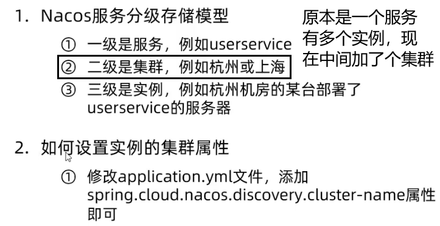

```yml
# 让服务到nacos服务器去注册服务
spring:
    cloud:
    nacos:
        server-addr: localhost:8848   # nacos服务器地址
        discovery:
        cluster-name: HZ    # 默认是DEFAULT
```

## Nacos 修改loadbalancer负载均衡策略为 集群

spring-cloud-starter-loadbalancer的默认负载均衡策略为简单轮询。

我们想要微服务互相访问时，应该尽可能访问同集群实例，本集群内随机。当本集群内不可用时，才访问其它集群。

1. 修改order-service的application.yml文件，修改负载均衡规则；集群名字为 HZ
```yaml
# 这是老版本用ribbon，现在都是下面的spring-cloud-starter-loadbalancer，不用写这个了。
# userservice:
#   ribbon:
#     NFLoadBalancerRuleClassName: com.alibaba.cloud.nacos.ribbon.NacosRule # 负载均衡规则 

spring:
  cloud:
    nacos:
      server-addr: localhost:8848
      discovery:
        cluster-name: HZ # 集群名称，默认是DEFAULT
    # 由于我们用的版本新而使用spring-cloud-starter-loadbalancer，需要让其开启使用nacos（默认false）。否则，是不分集群位置的轮询
    loadbalancer:
      nacos:
        enabled: true
```
2. 修改3个 user-service为HZ、HZ、不设置（默认DEFAULT）

```yml
spring:
  cloud:
    nacos:
      server-addr: localhost:8848
      discovery:
        cluster-name: HZ # 集群名称，默认是DEFAULT
```
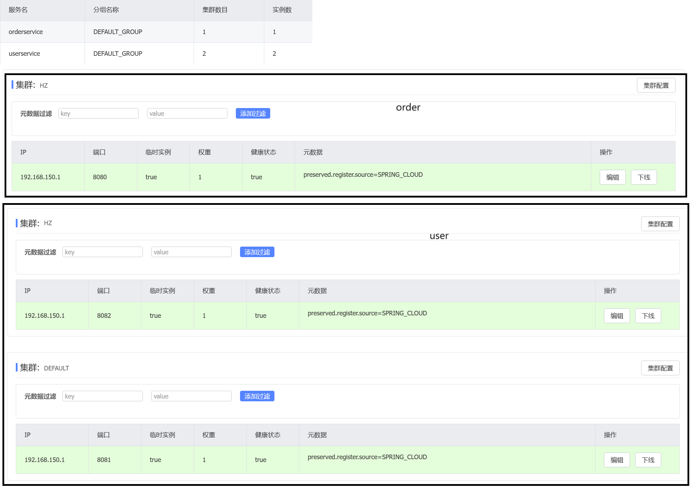

效果就是，HZ上线时，只在HZ内轮询；当HZ下线了，才启用DAFAULT。

## nacos实现热更新负载均衡的权重

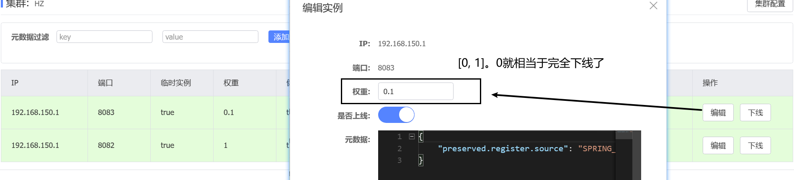

nacos实现热更新，控制服务访问。


## nacos服务下线的两种方式

方式1：点击下线按钮

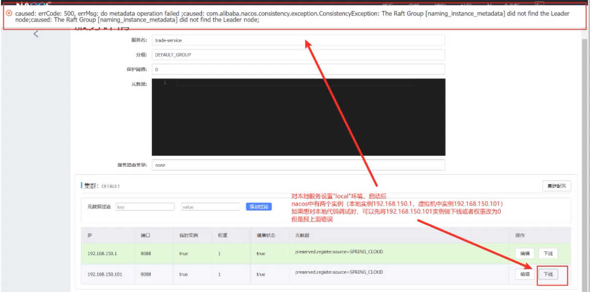

方式2：点击编辑按钮，服务权重调整为0

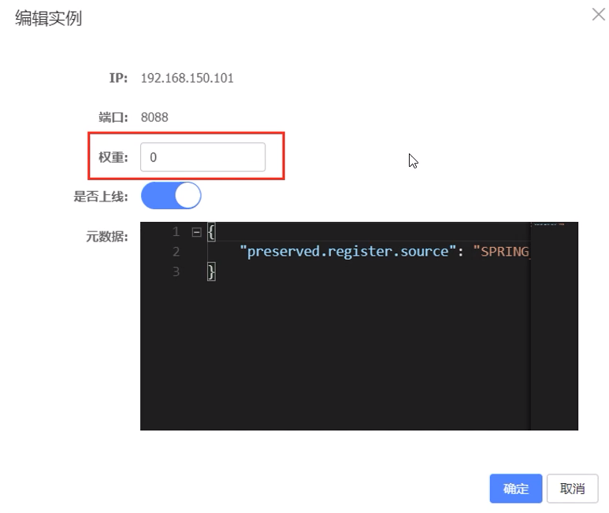

## nacos下线报错

我们nacos-server:v2.1.0-slim版本的没有遇到。


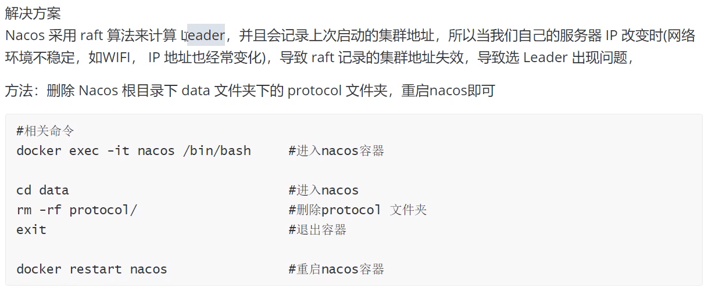

## nacos环境隔离

Nacos环境隔离：（服务发现和配置中心都有）
- namespace。开发环境、测试环境、生产环境。
- group。区分项目。

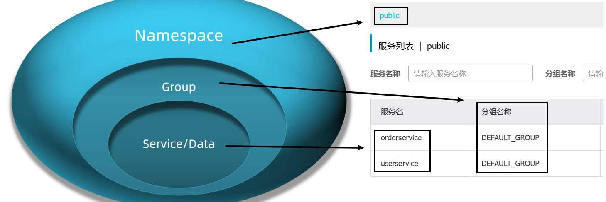

使用命名空间需要先在nacos控制平台中创建，而group不用，直接在yml中配置就行。
```yml
# 服务注册
spring:
  cloud:
    nacos:
      server-addr: localhost:8848
      discovery:
        namespace: 5b26fc32-dd16-4e40-a3d3-ae8513526e9e # 命名空间。默认值是不写，表示使用public。填public，也表示使用public。除此外，都填填ID。
        group: test   # group，默认值是DEFAULT_GROUP
```

结果：

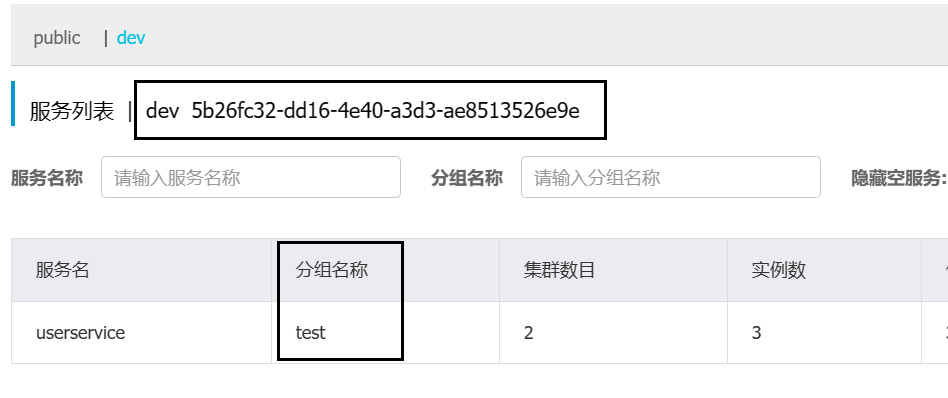

```yaml
# 配置中心
spring:
  application:
    name: userservice           # dataid的部分1
  # profiles: 
  #   active: dev                 # dataid的部分2。默认没有。
  cloud:
    nacos:
      server-addr: 192.168.150.3:8848 
      config:
        # namespace: dev                  # 定位1。默认public
        # group: xuecheng-plus-project    # 定位2。默认DEFAULT_GROUP
        file-extension: yml    # dataid的部分3。必须改，因为默认是properties
```

## nacos创建namespace

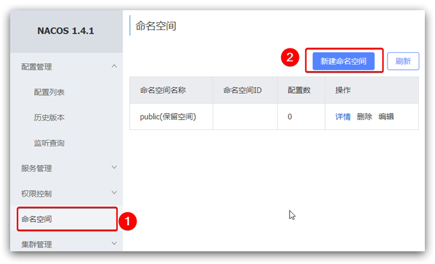

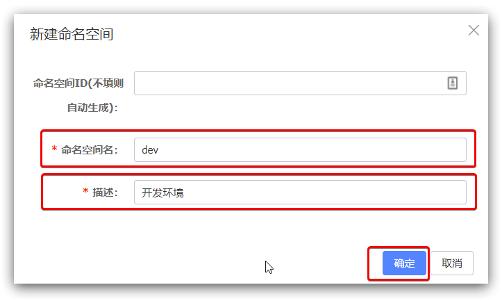

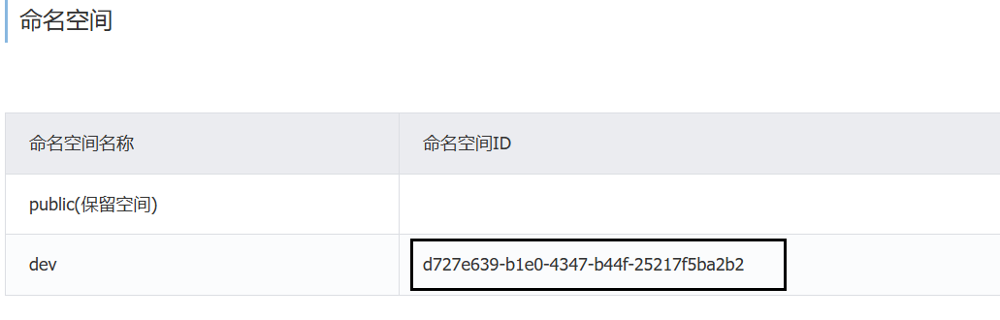

PS：不写`namespace` 和 `namespace: public`都表示使用public命名空间。

`namespace: dev`，使用命名空间的名称是没用的，必须是命名空间id。而之所以有用，是因为命名空间id就是`dev`。

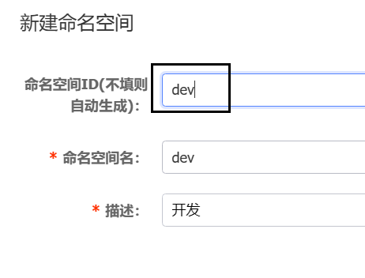

## nacos非临时实例

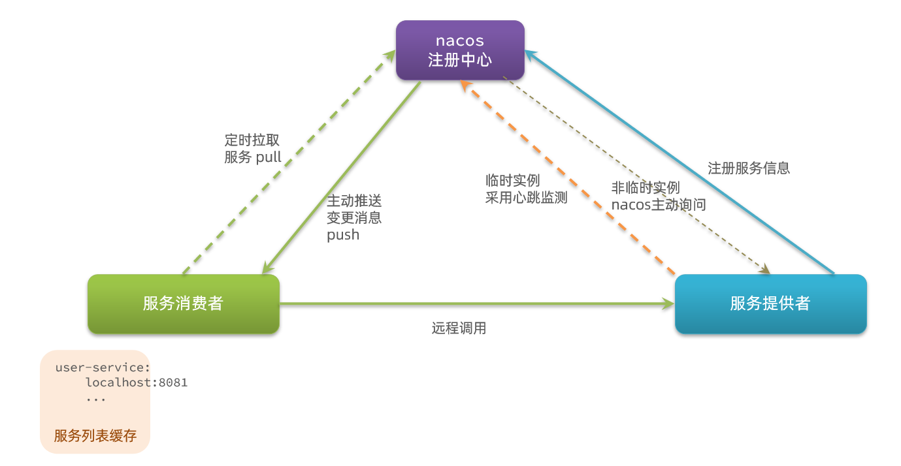

Nacos的服务实例分为两种类型：临时实例（默认）和非临时实例：
- 临时实例是心跳检测模式，服务提供者向nacos发ping；非临时实例，是nacos来主动询问服务提供者。
- 临时实例，服务消费者定时拉取服务时才知道其挂了；非临时实例，nacos会主动推送服务状态变更消息，服务列表更新更及时。
- 如果临时实例宕机超过一定时间，会从服务列表剔除。如果非临时实例实例宕机，不会从服务列表剔除。
- Nacos**集群**默认采用AP方式，当集群中存在非临时实例时，采用CP模式。

配置一个服务实例为永久实例：

```yaml
spring:
  cloud:
    nacos:
      server-addr: localhost:8848
      discovery:
        ephemeral: false # 设置为非临时实例
```

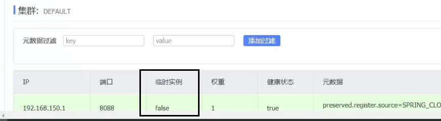

## nacos的ip是虚拟网卡

nacos是在虚拟机中起的 `192.168.150.3:8848`。

服务显示的地址是`192.168.150.1`，是vmnet8的虚拟网卡地址。

如果想要修改的话，是
```yml
spring:
  cloud:
    nacos:
      server-addr: 192.168.150.3:8848 # nacos注册中心
      discovery:
        ip: 192.168.150.1   # 一般不写，nacos会自动检测。
```