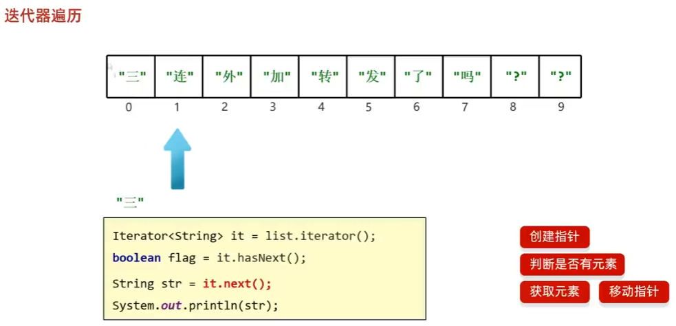
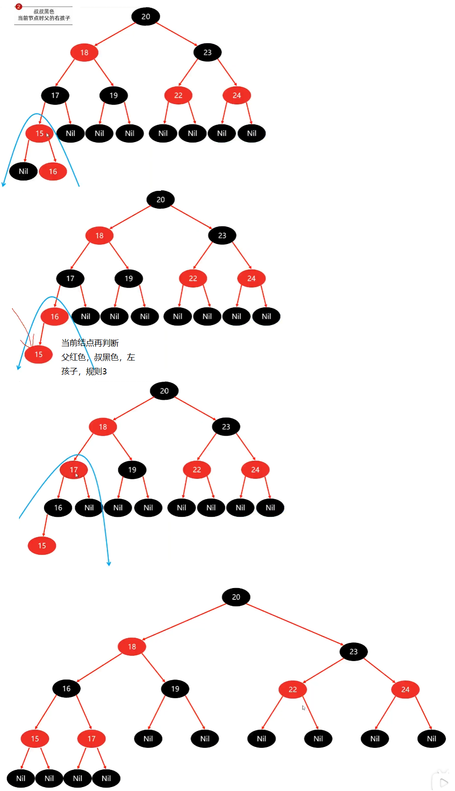

## mq

1. 常量类：交换机名、队列名、routingkey
2. config类定义bean：交换机、队列、绑定
3. A业务的controller: 注入rebbitTemplate来发送消息。
4. B业务的listener类

## 拼音自动补全
拼音搜索
- `settings`自定义分词器：`ik_max_word`，先分词，再词转拼音
- `mappings`定义字段：分拼音搜索和中文搜素，`search_analyzer`

自动补全
- `settings`自定义分词器：
- `mappings`定义字段：字段类型 `completion`，值是数组
- 跳过重复、前size条

## 数据同步

方案：同步调用、异步通知、监听binlog

同步调用：
- 过程：A业务中，写入mysql和调用B业务更新es；B业务结束返回，A业务才结束。
- 优点：实现简单。
- 缺点：业务耦合，耗时

异步通知（🚀）：
- 过程：A写入mysql并发布消息给mq，就结束；B监听mq来更新es。
- 优点：耦合度低
- 缺点：mq的可靠性

监听binlog：
- 过程：A写入mysql就结束；canal监听binlog，通知B来更新es。
- 优点：业务耦合最低。
- 缺点：mysql压力增大，实现复杂。

## es集群

es集群解决的问题：
- 海量数据存储：分片到多个节点
- 单点故障：节点备份 + 错位存备份

es集群节点的角色：
- master eligible：主节点管理（集权、分片、增删索引库）、宕机候选主节点
- data：数据的crud
- ingest：数据的预处理，不怎么用
- coordinating：路由、负载均衡、合并

- `explain`命令：显示数据在哪个片`_shard`
- 分片算法：hash（文档id） + 取余（分片数量）、分片数量不能变。

新增文档流程

查询流程：
- 分散阶段：协调节点分发请求到各分片
- 聚集阶段：协调节点汇总分片的结果，返回给用户

故障转移：
1. 候选节点选主
2. 数据迁移：新主节点迁移宕机节点数据到其他节点。
3. 宕机恢复：迁回数据。

## sentinel

雪崩问题：
- 过程：积累阶段：A调用坏的D的线程无限阻塞，别的服务还能访问，但随访问D增加，tomcat资源被阻塞线程占满。级联阶段：向上传递，访问A的线程阻塞。
- 解决：服务故障而引起（超时处理；舱壁模式；熔断降级）、高并发流量而引起（流量控制）
  - 超时处理：不会无休止等待。涌入速度过快，还是会雪崩
  - 舱壁模式：线程池隔离（各业务有自己的线程池）、信号量隔离（公用线程池，信号量限定各业务的线程数量）。但还是浪费，业务坏了还尝试访问。
  - 熔断降级：断路器。统计访问D的异常比例，超阈则熔断业务（快速失败释放资源+拦截请求）
  - 流量控制：限制QPS的流量激增。

sentinel实现了后三种。

流控模式：直接、关联、链路。
- A->C,B->C
- 直接：C，那么A、B都可能失败。
- 关联：限流当前。
  - 关联A到B上：当A增业务超阈，限流B查询。
  - 关联C到B上：当C由A和B一起而超阈，那么B被限流，A无影响。
- 链路：关联C到B上的限流改进版。只统计C中B->C的，超阈则限流B，A无影响。

流控效果：
- 快速失败：QPS超阈直接拒绝。
- warm up预热：QPS超阈直接拒绝；应对系统冷启动，QPS阈值↑。
- 排队等待：流量整形，进入队列。预期等待时长大于超时时长，直接拒绝。
- 热点参数限流：分别统计参数值相同的请求。可以针对高访问的参数设立独立的阈值。需要`@SentinelResource`。只支持基本类型和String的参数。

舱壁模式和熔断降级：feign整合sentinel

舱壁模式：
- 线程池隔离 vs 信号量隔离

  线程池隔离是独立线程，则支持主动超时、异步调用。信号量隔离不支持。
  
  线程池隔离的代价：线程的额外开销。信号量则没有。

  场景：线程池隔离适合低扇出（不需要频繁创建线程）。信号量隔离适合高扇出、高频调用，比如网关。

熔断降级：

- 慢调用比例：慢调用，业务的响应时间RT长。
- 异常比例
- 异常数

授权规则：只授权来自网关的请求
1. order服务中一个Component类实现`RequestOriginParser`接口
2. gateway服务中，yml文件配置`AddRequestHeader`参数

自定义异常：根据不同异常返回不同结果
- 实现`BlockExceptionHander`。

规则持久化：
- 原始模式：保存在内存。重启则丢失。
- pull模式：保存在本地文件或数据库，定时读取。时效性问题（规则读取不及时，而导致服务数据不一致）
- push模式：保存在nacos远程配置中心，sentinel客户端监听变更，实时更新。

## 分布式事务 Seata

一个业务涉及多个分支服务，所有的分支服务要整体当成一个分布式事务（全局事务）。

CAP定理：一致性、可用性、分区容错性。
- 分区问题不可避免（节点之间用于同步数据的网络链接波动），一致性和可用性就无法同时满足。
- es是CP。es出现分区，剔除宕机节点，迁移数据到其他节点。

BASE理论：
- Bascially Available基本可用：部分可用
- Soft State软状态：临时不一致
- Eventually Consistent最终一致性：软状态结束后，最终让数据一致。

BASE理论用于解决CAP
- AP模式/最终一致思想：子事务分别提交，临时不一致，事后弥补恢复数据。
- CP模式/强一致思想：子事务执行后互相等待（弱可用），都成功则同时提交，有失败则同时回滚

Seata的三个角色：TC事务协调者、TM事务管理器、TM资源管理器
1. TM代理入口方法（调用其他分支事务），确定全局事务的范围（涉及到的子事务），向TC注册、开启全局事务。
2. RM代理分支事务，向TC注册分支事务、执行sql、报告执行状态。
3. 所有事务执行完毕，TM告知TC检查分支事务的状态，TC通知RM提交子事务或回滚。

Seata的四种方案：
- XA：
  
  强一致、分阶段，无业务侵入。

  常用数据库已支持XA，实现简单。数据库不支持则不行。占用数据库锁（执行sql上锁、TC通知后释放），性能低。
- TCC

  最终一致、分阶段，有业务侵入。
- AT（默认）

  最终一致、分阶段，无业务侵入。

  一阶段，RM记录数据快照undo log，执行sql就直接提交。二阶段，成功则删除快照，失败则根据快照恢复。

  阶段一二之间无锁，事务并发的脏写问题👉全局锁，但非seata管理的全局事务可修改👉保存两个快照，更新前后after-iamge，before-image

- SAGA

  长业务，有业务侵入。

XA vs AT
- XA模式强一致; AT模式最终一致
- 锁：XA模式一阶段不提交事务，锁定资源; AT模式一阶段直接提交，不锁定资源。
- 回滚模式：XA模式 依赖数据库机制实现回滚; AT模式利用数据快照实现数据回滚。

TC服务器搭建 tc-server
- registry服务注册中心（其他分支事务），config服务配置中心（seata的config，有多个seata）

## 业务

> 业务：拼音自动

自动补全`suggestion`字段，值复用（值在构造函数赋值其他字段）、复用切割（`A/B`）。

> es同步

admin模块修改mysql，同步demo模块的es，demo展示给前段。
- 修改mysql只需两个方法：增改一样、删
    
    为什么增改一样？ es的增改操作一样 + 拿着id去mysql找新的数据。

> 业务隔离

feign远程调用、client？
----

