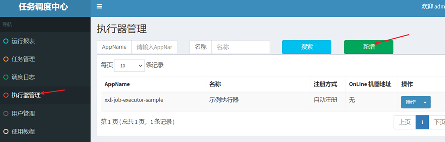
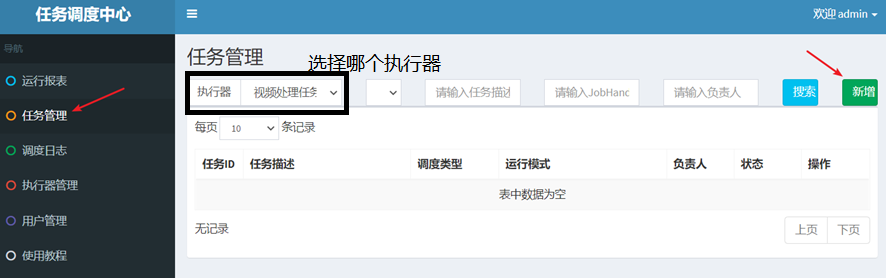
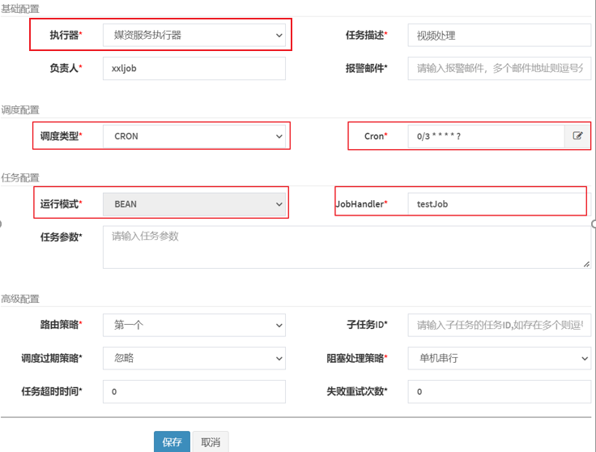
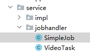
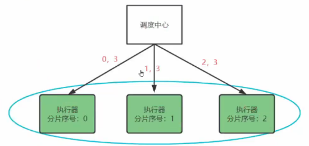
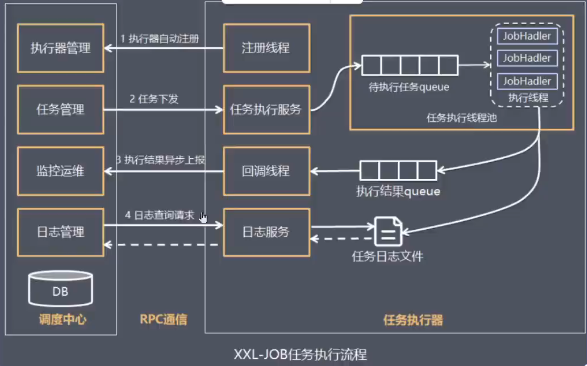
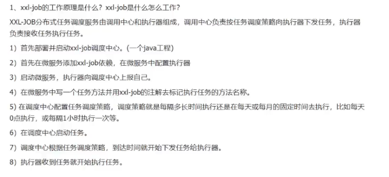

- [添加执行器](#添加执行器)
- [添加任务](#添加任务)
  - [调度配置](#调度配置)
  - [高级配置](#高级配置)
- [分片广播](#分片广播)
- [🚀如何并行执行任务不重复](#如何并行执行任务不重复)
- [🚀xxl-job的工作原理](#xxl-job的工作原理)
- [xxl-job怎么工作（建议与上面进行融合）](#xxl-job怎么工作建议与上面进行融合)

---

## 添加执行器

（1）执行器管理




appname是前边在nacos中配置xxl信息时指定的执行器的应用名

（2）配置

```xml
<properties>
    <xxl-job-core.version>2.3.1</xxl-job-core.version>
</properties>

<dependency>
    <groupId>com.xuxueli</groupId>
    <artifactId>xxl-job-core</artifactId>
    <version>${xxl-job-core.version}</version>
</dependency>
```

```yml
xxl:
  job:
    admin: 
      addresses: http://192.168.101.65:8088/xxl-job-admin
    executor:
      # appname这是执行器的应用名
      appname: media-process-service
      address: 
      ip: 
      # port是执行器启动的端口
      port: 9999
      logpath: /data/applogs/xxl-job/jobhandler
      logretentiondays: 30
    accessToken: default_token
```

（3）配置config类生成bean

```java
@Configuration
public class XxlJobConfig {
    private Logger logger = LoggerFactory.getLogger(XxlJobConfig.class);

    @Value("${xxl.job.admin.addresses}")
    private String adminAddresses;

    @Value("${xxl.job.accessToken}")
    private String accessToken;

    @Value("${xxl.job.executor.appname}")
    private String appname;

    @Value("${xxl.job.executor.address}")
    private String address;

    @Value("${xxl.job.executor.ip}")
    private String ip;

    @Value("${xxl.job.executor.port}")
    private int port;

    @Value("${xxl.job.executor.logpath}")
    private String logPath;

    @Value("${xxl.job.executor.logretentiondays}")
    private int logRetentionDays;


    @Bean
    public XxlJobSpringExecutor xxlJobExecutor() {
        logger.info(">>>>>>>>>>> xxl-job config init.");
        XxlJobSpringExecutor xxlJobSpringExecutor = new XxlJobSpringExecutor();
        xxlJobSpringExecutor.setAdminAddresses(adminAddresses);
        xxlJobSpringExecutor.setAppname(appname);
        xxlJobSpringExecutor.setAddress(address);
        xxlJobSpringExecutor.setIp(ip);
        xxlJobSpringExecutor.setPort(port);
        xxlJobSpringExecutor.setAccessToken(accessToken);
        xxlJobSpringExecutor.setLogPath(logPath);
        xxlJobSpringExecutor.setLogRetentionDays(logRetentionDays);

        return xxlJobSpringExecutor;
    }
}
```

Java服务也启动后。


## 添加任务

（1）任务管理：让哪个执行器去执行任务






（2）java



`@XxlJob(JobHandler中的内容)`注解
```java
@Slf4j
@Component
public class SimpleJob {
    @XxlJob("testJob")
    public void testJob() {
        log.debug("开始执行.......");
    }
}
```

PS：怎么启动多个执行器执行相同的任务？

启动多个Java的微服务，就启动了多个执行器。

### 调度配置

调度类型：固定速度（按固定的间隔定时调度）和Cron（通过Cron表达式实现更丰富的定时调度策略）

Cron表达式是一个字符串，通过它可以定义调度策略，格式如下：`{秒数} {分钟} {小时} {日期} {月份} {星期} {年份(可为空)}`
- `30 10 1 * * ?`  每天1点10分30秒触发
- `0/30 * * * * ?` 每30秒触发一次
- `* 0/10 * * * ?` 每10分钟触发一次

xxl-job提供图形界面去配置.

### 高级配置


当执行器集群部署时，提供丰富的路由策略，包括；
- FIRST（第一个）：固定选择第一个机器
- LAST（最后一个）：固定选择最后一个机器
- ROUND（轮询）
- RANDOM（随机）
- CONSISTENT_HASH（一致性HASH）：每个任务按照Hash算法固定选择某一台机器，且所有任务均匀散列在不同机器上。
- LEAST_FREQUENTLY_USED（最不经常使用）：使用频率最低的机器优先被选举；
- LEAST_RECENTLY_USED（最近最久未使用）：最久未使用的机器优先被选举；
- FAILOVER（故障转移）：按照顺序依次进行心跳检测，第一个心跳检测成功的机器选定为目标执行器并发起调度；
- BUSYOVER（忙碌转移）：按照顺序依次进行空闲检测，第一个空闲检测成功的机器选定为目标执行器并发起调度；
- SHARDING_BROADCAST(分片广播)：广播触发对应集群中所有机器执行一次任务，同时系统自动传递分片参数；可根据分片参数开发分片任务；


子任务：每个任务都拥有一个唯一的任务ID(任务ID可以从任务列表获取)，当本任务执行结束并且执行成功时，将会触发子任务ID所对应的任务的一次主动调度，通过子任务可以实现一个任务执行完成去执行另一个任务。
  
调度过期策略：
- 忽略：调度过期后，忽略过期的任务，从当前时间开始重新计算下次触发时间；
- 立即执行一次：调度过期后，立即执行一次，并从当前时间开始重新计算下次触发时间；

阻塞处理策略：调度过于密集执行器来不及处理时的处理策略；
- 单机串行（默认）：调度请求进入单机执行器后，调度请求进入FIFO队列并以串行方式运行；
- 丢弃后续调度：调度请求进入单机执行器后，发现执行器存在运行的调度任务，本次请求将会被丢弃并标记为失败；
- 覆盖之前调度：调度请求进入单机执行器后，发现执行器存在运行的调度任务，将会终止运行中的调度任务并清空队列，然后运行本地调度任务；

任务超时时间：支持自定义任务超时时间，任务运行超时将会主动中断任务；

失败重试次数：支持自定义任务失败重试次数，当任务失败时将会按照预设的失败重试次数主动进行重试；


## 分片广播

分片，是指是调度中心以**执行器为维度**进行分片，将集群中的执行器标上序号 0, 1, 2, ....

广播，是指每次调度会向集群中的**所有执行器**发送任务调度，请求中携带分片参数（执行器序号和执行器总数）。




● 分片任务场景: 10个执行器的集群来处理10w条数据 每台机器只需要处理1w条数据
● 广播任务场景: 广播执行器同时运行shell脚本、广播集群节点进行缓存更新等。

```java
@Slf4j
@Component
public class SimpleJob {
    @XxlJob("shardingJobHandler")
    public void shardingJob() {
        // 执行器序号
        int shardIndex = XxlJobHelper.getShardIndex();
        // 执行器总数
        int shardTotal = XxlJobHelper.getShardTotal();
        log.debug("shardIndex:{}, shardTotal:{}", shardIndex, shardTotal);
    }
}
```
启动两个执行器。而且再起一个执行器，会动态扩容，原来那两个会输出 `shardTotal: 3`


## 🚀如何并行执行任务不重复

（1）查询到不重复的任务（作业分片）

分片广播 + 根据分片参数（执行器序号和执行器总数）来取余

（2）如果一个执行器在处理一个视频还没有完成，此时调度中心又一次请求调度，为了不重复处理同一个视频该怎么办

xxl-job上。调度过期策略是**忽略**，阻塞处理策略是**丢弃后续调度**。

（3）任务本身要保证幂等性

当在执行器**弹性扩容时**无法绝对避免任务不重复执行，比如：原来有四个执行器正在执行任务，由于网络问题原有的0、1号执行器无法与调度中心通信，调度中心就会对执行器重新编号，原来的3、4执行器可能就会执行和0、1号执行器相同的任务。

分布式锁（这里使用数据库）

## 🚀xxl-job的工作原理

xxl-job 由调度中心、执行器组成。

调度中心向执行器下发任务，执行器执行任务。



## xxl-job怎么工作（建议与上面进行融合）

