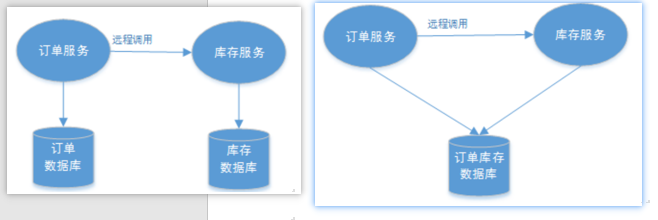

## 分布式事务

在分布式场景下，多个微服务共同完成一个事务。

跨服务，涉及到**远程调用**让其他微服务来操作数据库。
```sql
begin transaction； 
//1.本地数据库操作：张三减少金额 
//2.本地数据库操作：李四增加金额 
commit transation; 
```
但是在分布式环境下，会变成下边这样：
```sql
begin transaction； 
//1.本地数据库操作：张三减少金额 
//2.远程调用：让李四增加金额 

commit transation;
```

