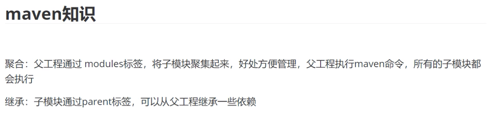
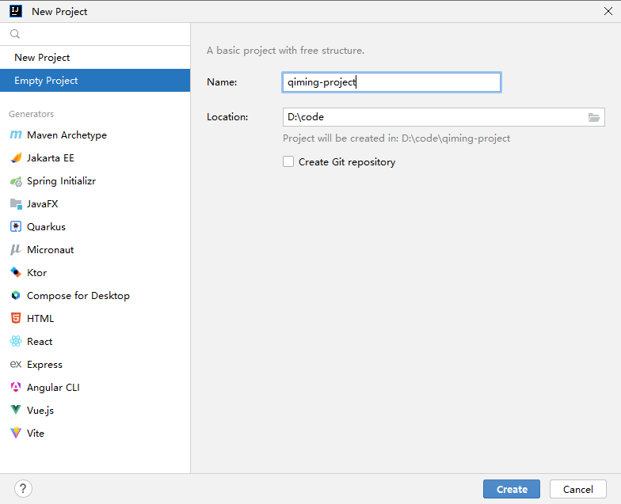
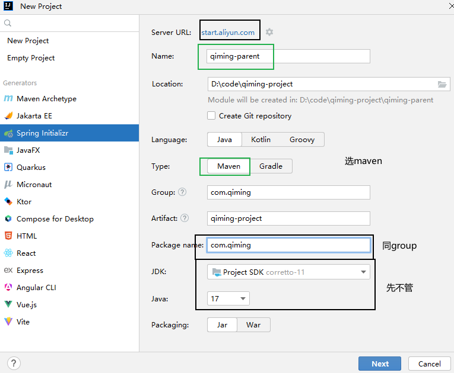
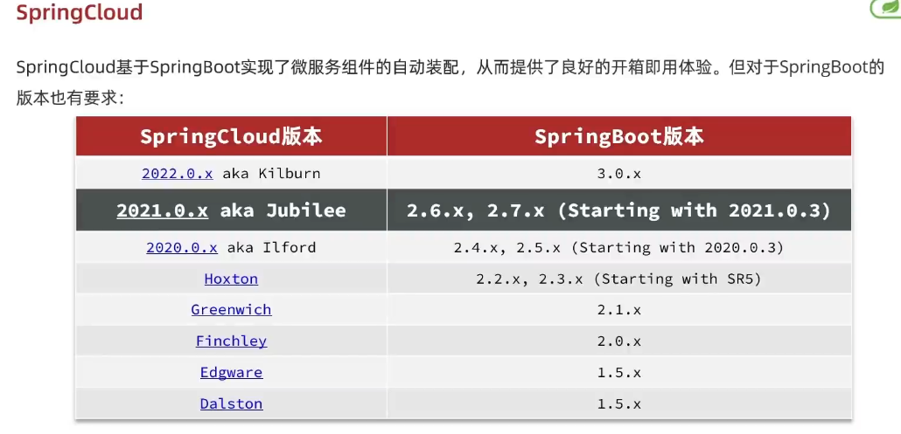
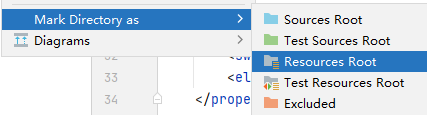
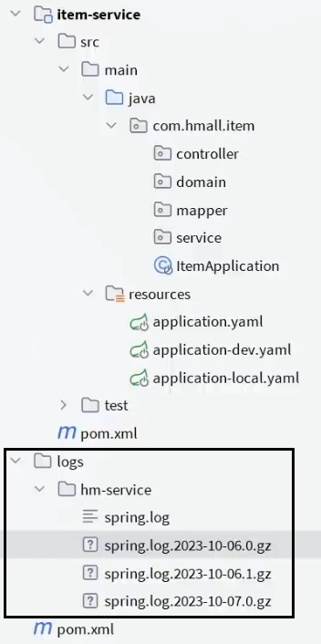

- [父项目](#父项目)
- [添加module-父](#添加module-父)
- [添加module-基础](#添加module-基础)
- [application.yaml](#applicationyaml)


---



父工程的打包方式是pom，表明是聚合。

## 父项目

空项目，修改SDK，设置gitignore




```bash
HELP.md
target/
!.mvn/wrapper/maven-wrapper.jar
!**/src/main/**
!**/src/test/**

#### STS ###
.apt_generated
.classpath
.factorypath
.project
.settings
.springBeans
.sts4-cache
#### IntelliJ IDEA ###
.idea
*.iws
*.iml
*.ipr
#### NetBeans ###
/nbproject/private/
/nbbuild/
/dist/
/nbdist/
/.nb-gradle/
build/
logs/
#### VS Code ###
.vscode/
```

## 添加module-父

- package name 同group



删除到只留pom文件



```xml
<?xml version="1.0" encoding="UTF-8"?>
<project xmlns="http://maven.apache.org/POM/4.0.0" xmlns:xsi="http://www.w3.org/2001/XMLSchema-instance"
         xsi:schemaLocation="http://maven.apache.org/POM/4.0.0 https://maven.apache.org/xsd/maven-4.0.0.xsd">
    <modelVersion>4.0.0</modelVersion>
    <!-- 1. 必要三个`groupId`, `artifactId`, `version` -->
    <groupId>com.qiming</groupId>
    <artifactId>qiming-parent</artifactId>
    <version>0.0.1-SNAPSHOT</version>
    
    <!-- 2. 父工程 packaging 是一个POM工程 -->
    <packaging>pom</packaging>

    <!-- 3. 继承 Spring Boot 父工程 -->
    <parent>
        <groupId>org.springframework.boot</groupId>
        <artifactId>spring-boot-starter-parent</artifactId>
        <version>2.7.2</version>
    </parent>

    <!-- 4. 聚合的子模块 -->
    <modules>
        <module>tj-common</module>
        <module>tj-auth</module>
        <module>tj-api</module>
    </modules>

    <!-- 5. `properties` 定义依赖的版本号 -->
    <properties>
        <maven.compiler.source>11</maven.compiler.source>
        <maven.compiler.target>11</maven.compiler.target>
        <project.build.sourceEncoding>UTF-8</project.build.sourceEncoding>
        <project.reporting.outputEncoding>UTF-8</project.reporting.outputEncoding>
        <!-- spring-cloud -->
        <spring-cloud.version>2021.0.3</spring-cloud.version>
        <spring-cloud-alibaba.version>2021.0.1.0</spring-cloud-alibaba.version>
        <!-- 自定义组件 -->
        <org.projectlombok.version>1.18.20</org.projectlombok.version>
        <redisson.version>3.13.6</redisson.version>
    </properties>

    <!-- 6. `dependencyManagement` 是管理依赖版本的版本号，子工程还要自己导入。 -->
    <dependencyManagement>
        <dependencies>
            <!-- （1）springcloud,springcloudalibaba都是pom，import -->
            <!--sprintcloud-->
            <dependency>
                <groupId>org.springframework.cloud</groupId>
                <artifactId>spring-cloud-dependencies</artifactId>
                <version>${spring-cloud.version}</version>
                <type>pom</type>
                <scope>import</scope>
            </dependency>
            <dependency>
                <groupId>com.alibaba.cloud</groupId>
                <artifactId>spring-cloud-alibaba-dependencies</artifactId>
                <version>${spring-cloud-alibaba.version}</version>
                <type>pom</type>
                <scope>import</scope>
            </dependency>

            <!--redisson-->
            <dependency>
                <groupId>org.redisson</groupId>
                <artifactId>redisson</artifactId>
                <version>${redisson.version}</version>
            </dependency>
            <!-- ....... -->
        </dependencies>
    </dependencyManagement>

    <!-- 7. dependencies 导入一些公共的依赖，子工程就省的都写了 -->
    <dependencies>
        <!-- lombok，简化类的构建-->
        <dependency>
            <groupId>org.projectlombok</groupId>
            <artifactId>lombok</artifactId>
            <version>${org.projectlombok.version}</version>
        </dependency>
    </dependencies>

    <build>
        <finalName>${project.name}</finalName>
        <!--编译打包过虑配置-->
        <resources>
            <resource>
                <directory>src/main/resources</directory>
                <filtering>true</filtering>
                <includes>
                    <include>**/*</include>
                </includes>
            </resource>
            <resource>
                <directory>src/main/java</directory>
                <includes>
                    <include>**/*.xml</include>
                </includes>
            </resource>
        </resources>
        <plugins>
            <!--打包插件-->
            <plugin>
                <groupId>org.springframework.boot</groupId>
                <artifactId>spring-boot-maven-plugin</artifactId>
                <version>${spring-boot.version}</version>
            </plugin>
            <plugin>
                <groupId>org.apache.maven.plugins</groupId>
                <artifactId>maven-compiler-plugin</artifactId>
                <version>3.8.1</version>
                <configuration>
                    <!--指定项目源码jdk的版本-->
                    <source>1.8</source>
                    <!--指定项目编译后的jdk的版本-->
                    <target>1.8</target>
                    <!--配置注解预编译-->
                    <annotationProcessorPaths>
                        <path>
                            <groupId>org.projectlombok</groupId>
                            <artifactId>lombok</artifactId>
                            <version>${org.projectlombok.version}</version>
                        </path>
                    </annotationProcessorPaths>
                </configuration>
            </plugin>

            <!--责处理项目资源文件并拷贝到输出目录，如果有额外的资源文件目录则需要配置-->
            <plugin>
                <groupId>org.apache.maven.plugins</groupId>
                <artifactId>maven-resources-plugin</artifactId>
                <version>3.3.0</version>
                <configuration>
                    <encoding>utf-8</encoding>
                    <!--使用默认分隔符，resource中可以使用分割符定义过虑的路径-->
                    <useDefaultDelimiters>true</useDefaultDelimiters>
                </configuration>
            </plugin>
        </plugins>
    </build>

</project>
```

## 添加module-基础

1. 删到只剩src和pom
2. src中删除启动类
3. src下的main下的resouces空文件夹

    

4. pom

    ```xml
    <?xml version="1.0" encoding="UTF-8"?>
    <project xmlns="http://maven.apache.org/POM/4.0.0" xmlns:xsi="http://www.w3.org/2001/XMLSchema-instance"
            xsi:schemaLocation="http://maven.apache.org/POM/4.0.0 https://maven.apache.org/xsd/maven-4.0.0.xsd">
        <modelVersion>4.0.0</modelVersion>

        <!-- 1. 指定父工程：坐标和相对位置 -->
        <parent>
            <!-- 从父工程的pom中拷贝坐标 -->
            <groupId>com.qiming</groupId>
            <artifactId>qiming-parent</artifactId>
            <version>0.0.1-SNAPSHOT</version>
            <!-- 指定父工程位置 -->
            <relativePath>../qiming-parent</relativePath>
        </parent>

        <!-- 2. 自己的只需指定 artifactId -->
        <artifactId>qiming-base</artifactId>

        <!-- 3. 依赖：父工程中定义了版本号，这里就不用写版本号了 -->
        <dependencies>
            <dependency>
                <groupId>org.redisson</groupId>
                <artifactId>redisson</artifactId>
                <scope>provided</scope>
            </dependency>
        </dependencies>
    </project>
    ```
## application.yaml

必选
```yml
server:
  port: 10086 # 服务端口
spring:
  application:
    name: eurekaserver # 服务名称
```

log

```yml
logging:
  level:
    cn.itcast: debug    # 级别都是debug。
  pattern:
    dateformat: MM-dd HH:mm:ss:SSS
  file:     # 保存到哪里
    path: "logs/${spring.application.name}"
```


```yml
# 日志文件配置路径
logging:
  config: classpath:log4j2-dev.xml
```
