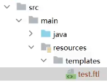

---

## 模板引擎

1、浏览器请求web服务器

2、服务器渲染页面，渲染的过程就是向jsp页面(模板)内填充数据(模型)。

3、服务器将渲染生成的页面返回给浏览器。

## Freemarker

```xml
<dependency>
    <groupId>org.springframework.boot</groupId>
    <artifactId>spring-boot-starter-freemarker</artifactId>
</dependency>
```

```yml
spring:
  freemarker:
    enabled: true
    cache: false   # 关闭模板缓存，方便测试
    settings:
      template_update_delay: 0
    suffix: .ftl   # 页面模板后缀名
    charset: UTF-8
    template-loader-path: classpath:/templates/   # 页面模板位置，默认为 classpath:/templates/
    resources:
      add-mappings: false   # 关闭项目中的静态资源映射(static、resources文件夹下的资源)
```

添加模板，在resources下创建templates目录，添加test.ftl模板文件


```ftl
HTML
<!DOCTYPE html>
<html>
<head>
    <meta charset="utf-8">
    <title>Hello World!</title>
</head>
<body>
Hello ${name}!
</body>
</html>
```
编写controller方法，准备模型数据
```java
@Controller
public class FreemarkerController {
    @GetMapping("/testfreemarker")
    public ModelAndView test(){
        ModelAndView modelAndView = new ModelAndView();
        // 设置模型数据
        modelAndView.addObject("name", "小明");
        // 设置模板名称, 对应 test.ftl 模板文件
        modelAndView.setViewName("test");
        return modelAndView;
    }
}
```
启动内容管理接口工程，访问http://localhost:63040/content/testfreemarker
屏幕输出：Hello 小明！


> 对应规则

```java
modelAndView.addObject("name", "小明");

${name}
```

```java
Student student = new Student();
student.setName = "23";
modelAndView.addObject("student", student);

${student.name}
```
if
```html
<#if> ${name}
<#else> ${name}
</#if>
```

## ngix

```bash
# 文件服务
upstream fileserver{
  server 192.168.101.65:9000 weight=10;
} 
 server {
      listen       80;
      server_name  file.51xuecheng.cn;
      #charset koi8-r;
      ssi on;       # >>>>>>>>> 开启页头页尾
      ssi_silent_errors on;     # >>>>>>>>>
      #access_log  logs/host.access.log  main;
      location /video {
          proxy_pass   http://fileserver;
      }
      location /mediafiles {
          proxy_pass   http://fileserver;
      }
 }
```